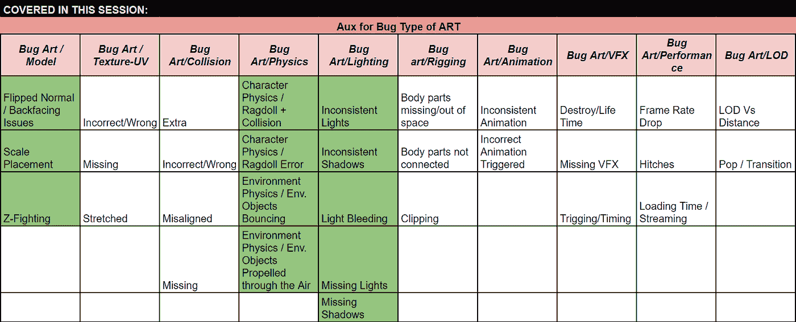

# 将基于会话的探索性测试应用到游戏中来吧！

> 原文：<https://medium.com/globant/applying-session-based-exploratory-testing-to-gaming-bring-them-on-a78995252ca9?source=collection_archive---------1----------------------->

**简介**

*“人人都会做饭”*这是皮克斯动画电影《料理鼠王》中的切夫·古斯特常说的一句话。事实上，这也可以应用于测试。*“任何人都可以测试”*是在许多公司听到的，来自不同的演员和球员。这是真的。测试是一种不需要特定背景或知识就能开始工作并在工作中获得良好表现的学科。然而，如果你想成为一名专业人士并获得最佳结果，你需要两件基本的事情:做好准备，训练并获得特定能力的专业知识，这将有助于你出色地完成任务。到了游戏测试，这些能力就更难获得了。很容易偏离真正的 QA 目标，说*“Ok 你只需要玩游戏”*。这是一个普遍的误解。游戏测试既艰难又刺激。在今天的游戏中，测试人员需要涵盖多个方面，从肉眼难以察觉的视觉障碍到声音和图形，而不把可玩性放在一边。在玩激动人心的游戏的过程中，很容易失去多种优势。

在本文中，我探索了一种新的方法，基于基于会话的探索性测试，以增强团队在这种具有挑战性的环境中发现 bug 的能力。

**做游戏测试员需要特别吗？**

之前说过，*“谁都可以考”*，确实如此。但是说到游戏，除了拥有一个测试者的心态之外，你还需要对游戏充满热情。测试人员的心态包括关注细节、不断发现那些难以发现的错误的坚定精神、质疑和人际交往技巧等等。但是如果你拥有所有这些技能，为了成为一名成功的游戏测试者，你还需要有独特的吸引力来反复玩同一款血腥的游戏，而不失去对游戏本身所有重要方面的关注，以及一款游戏中可能发现的所有多种类型的 bug。我们谈论的是数十种不同类型的 bug，除了对玩游戏有独特的吸引力之外，如果你没有测试人员的心态，这些 bug 很容易被忽略。

> *“测试是一种技能。虽然这可能会让一些人感到惊讶，但这是一个简单的事实。”*

*Fewster，Graham:“软件测试自动化”*

一个特殊的挑战:有限的人类注意力。

人类关注多重刺激的能力有限。而这是处理游戏时的一个关键事实。在这篇文章中，我们探讨了一个特殊的第一人称射击(FPS)游戏。在这些类型的游戏中，测试者在玩游戏时需要注意多种刺激，这些刺激是游戏的重要部分。仅提及几个:环境的变化(当在地图上漫游时，用户需要注意地图的不同特征，以便检查可能的路径，或者敌人可能出现或隐藏的地图部分)，声音(玩家必须保持警惕，以便根据感知的声音来检测可能的敌人)，可从环境中获取的物品(例如武器，健康包等)。)、地图上可能通向隐藏的宝藏或路径的隐藏部分)、穿过玩家路线的敌人和非主要人物(NPC)，等等。这些刺激可能吸引玩家的注意力，并且由于没有充分注意环境的不同特征、音乐、特殊效果、动作和可能包含 bug 的其他类型的特征，阻止他/她发现有价值的 bug。此外，由于人类的注意力局限于特定数量的刺激，所以了解人类的注意力如何工作是很重要的，以便在定义游戏测试策略时采取良好的方法。

*图片 1 —注意力(沃特森，2015)*

所以让我们从定义什么是注意力开始:

> *“每个人都知道什么是关注。它是头脑以清晰而生动的形式，从看似几个同时可能的对象或思路中占有一个。”威廉·詹姆斯*

注意是一个适应性过程，其目标是过滤信息，因为人类的加工能力有限。纵观历史，关于注意力有两种不同的概念:

*   **作为感知的一种品质**
    我们不可能关注所有的刺激，而关注就是只选择那些相关的过程。
*   **作为控制机制** 所有的认知过程都需要监督，以适应一个目标。

*图 2——索伯格&马特的注意力水平(斯科特&麦考尔，2020)*

从下到上，我们从*集中*注意力开始，我们可以将注意力窗口导向一个独特的信息来源。随着等级的上升，注意力更加多样化，也更加不集中。当我们处于*划分的*注意力水平时，我们可以同时应对多项任务或需求。这是一个有限的能力。随着信息来源数量的增加，或者对任务的要求越来越高，**的执行变得越来越差。多任务同时执行的质量取决于这些任务的自动化程度(Universidad inter continental-Facultad de psicología，2020)。**

所以，如果我们考虑游戏练习，它将真正取决于我们正在玩的游戏的类型。如果我们回到 80 年代，我们可能会发现不同的游戏对玩家有固定数量的刺激，如绿色贝雷帽(见图 3)，破坏者(见图 4)或幽灵 n' Goblins(见图 5)。

*图片 3 —绿色贝雷帽(未来 PLC，2020)*

*图片 4——破坏者(Indie RetroNews，2020)*

*图片 5——幽灵和妖精(呼叫者，2020)*

在这样的游戏中，玩家曾经有有限数量的敌人，有固定的地图，只有一个方向可以走(一般是从左到右)，有相同数量的敌人要对抗，他们通常在同一时刻到来，并遵循**相同的模式**。今天的游戏和原来的完全不同。以第一人称射击游戏为例，玩家面对多个复杂的地图，有千米大小的结构可以漫游。例如，最新的 Doom 版本(2016 年，见图 6)给了用户几个地图，可以深入其中，有许多不同类型的敌人，这些敌人由人工智能驱动(Ortiz，2020 年)。

*图 6——末日 FPS 游戏*

这些类型的游戏使注意力更加难以集中，因为玩家同时受到多种刺激。现在，地图变得更加复杂，用户可以 360 度自由地潜入，许多不同类型的敌人可以自由地在地图上游荡，玩家可以有许多选择。例如，多种弹药选择，多条路径隐藏或运行，跨越的对象和建筑物攀爬，等等。所有这些与来自环境的多种声音效果相结合，为玩家创造了独特的体验。这些视觉和声音组合使玩家的注意力分散，很难集中在要看的东西上。

**当今游戏行业的 Bug 游戏分类法**

在今天的游戏行业中，我们可能有各种各样的错误，这些错误可能是由不同的因素引起的。如果我们想到 FPS，我们可以有 30 多个不同的 bug 类别，从艺术相关的 bug，UI，声音，稳定性，AI 等等(见图 7)。这将很容易达到 100+不同类型的错误，总结所有类别。

*图 7 —游戏漏洞分类*

因此，如果我们考虑到游戏测试人员必须时刻牢记游戏有多容易上瘾，它有多可玩，因此玩家需要用他/她的所有感官进入游戏，以应对游戏的肾上腺素。此外，作为测试人员，玩家需要关注所有 100 多种可能的错误组合，如前所述。考虑到人类有限的注意力水平，正如之前所分析的，这确实是一项非常困难的任务。在测试方面，这可能很容易导致未被发现的 bug。想象一下，你正在与 5 到 6 个向你走来的外星人战斗，你需要用合适的枪瞄准他们，注意你的健康指标，并在你前进的道路上不要跨过你面前的地雷或熔岩。你可能很容易注意不到一个项目的特定纹理是不正确的(艺术/不正确/错误的纹理 UV)，或者一个特定的盒子或任何其他离屏幕中心视图几英寸远的项目实际上是浮动的，而不是躺在地上(模型/比例放置)，我们可以继续处理其余的 100 多种类型的错误。因此，在这种情况下，我们面临着一个 bug 检测问题，这个问题与测试人员本身无关，而是与我们测试的应用程序的类型以及人的注意力有关。

**那么，我们该怎么办？**

首先让我们对我们面临的问题做一个简单的总结:当谈到游戏测试时，我们主要看到两个项目:在任何其他测试规程中，我们的目标是*找到 bug*。我们发现的错误越多，最终用户遇到的错误就越少，所以我们的应用程序就越健壮。另一方面，我们测试的一个非常重要的部分将集中在我们游戏的可玩性和上瘾程度上，因为这也是谈论游戏测试的一个关键因素。在本文中，我们主要关注第一项:如何最大限度地利用测试时间来发现更多的 bug。如前所述，我们的主要限制是人类的注意力，因为我们看到了各种各样的 bug(记住，我们有 100 多种不同的 bug 可以从图 7 中提取出来)。

因此，为了应对这种情况，我们决定尝试基于会话的探索性测试(SEBT)的概念验证(POC)。SEBT 基本上是一种测试方法，它在有限的时间内最大化测试人员使用的测试时间(称为*会话*)，其中测试人员只将*聚焦于问题的特定部分(称为*宪章*)，并专门使用会话时间来测试该宪章(不记录 bug，也不测试应用程序的其他部分)。你可以通过阅读 [*“为什么你应该使用基于会话的探索性测试？”来彻底了解 SEBT*](/globant/why-should-you-use-session-based-exploratory-testing-1019478aaa2c) 。*

**我们如何对游戏实施基于会话的探索性测试？**

实施 SBET 最重要的事情之一是对章程有一个清晰的定义。这是建造 SBET 的基石。由于我们关于游戏测试的主要问题是我们在测试时可能会遇到大量不同类型的 bug，因此正确定义每个会话的焦点，也就是说*章程*是非常重要的。

正如在任何其他测试活动中一样，计划每一个环节是成功的关键，我们将回到几个世纪前，使用一种非常古老的方法:*分而治之*。假设你在一个游戏中有 20 个关卡需要测试。你有 100 多种类型的错误，它们可能在任何时刻、任何地图的任何部分出现。除非你有一个如图 8 所示的测试团队，否则这将是一个非常困难的任务。

*图片 8——多眼测试仪(艺术，2020)*

为了将 SBET 应用到游戏中，我们需要定义*宪章*。我们的重点将是发现 bug，因为我们有很多 bug 要考虑，我们需要*分而治之*。因此，为了定义我们的*章程*，我们将只关注特定会话的**特定数量的 bug。我们可以很容易地实现一个电子表格，允许我们定义一个单一的宪章，如图 9 所示。**

*图 9 —章程定义示例*

我们在这个*宪章*中定义的只是一个 bug 类型，或者一组特定区域(在提供的例子中，Art)和子区域(在这个例子中是物理)的 bug 类型，它们只适用于特定的地图(在这个例子中是模式/难度)。所以，在这个环节中，测试人员将*只*关注关于角色物理/布娃娃错误的 bug。测试人员将**而不是**寻找任何其他类型的错误。由于这里是 SBET，测试人员将**只追踪属于宪章**的 bug。如果测试人员发现了任何其他类型的错误(见图 7)，他/她将为下一次会议添加一个注释(即“此屏幕中有一个*闪电/缺失灯光*错误”，并将添加一个截图)，并将继续寻找属于章程的错误。

通过这样做，我们将确保我们有一个 100%纯粹致力于*章程*的会议。

**作为经理，我们如何管理这些会议？**

这真的取决于负责游戏测试的团队。一个已经成功实施的有用的方法是划分团队，并分配一个特定的*宪章*按照相似类型的 bug 分组，以覆盖尽可能多的 bug 类型。图 10 显示了一个样本。

*图 10 —包机管理样本*

在这个例子中，我们决定让一些测试人员只关注一种类型的 bug(比如测试人员 1、2、4、5、6 和 10)，而团队的其他人将同时关注几种类型的 bug，因为这些类型的 bug 很容易聚集在一起(比如文本 bug、屏幕元素或者某些可以一起检查的物理 bug(比如测试人员 8 和 9))。

此外，在图 11 中，我们可以看到所有 80 多种类型的 bug，以及在单个会话中涵盖了哪些类型的 bug(在此示例中，我们不包括类型稳定性和声音方面的 bug，因为它们没有包含在所选的*章程*中)。那些被覆盖的用绿色标出。

*图 11 —会议报道*

那么，你准备好了吗？

在游戏中实现良好而有效的 bug 搜索体验并不是一项简单的任务，这主要是由于游戏的种类繁多。此外，许多设备使这成为一项非常具有挑战性的任务(控制台、PC、移动设备等)。因此，拥有一个以发现 bug 为中心的可靠的测试管理策略是至关重要的。当然，游戏还有许多其他方面需要被适当地攻击，如可玩性、上瘾因素、吸引人的 UI 等等。但是，如果游戏有太多的 bug，导致应用程序无法管理，或者应用程序不同关键区域的 bug 非常明显，导致玩家放弃并在商店中找到另一个类似的游戏，那么所有这些肯定都会失败。

我已经列出了许多玩家可能会发现错误的游戏部分，并且有一百多个类别需要检查。所以计划一个合适的 bug 搜索策略是非常重要的。我真的相信这种方法在任何游戏开发者的金库中不仅是必要的，而且是不可磨灭的。

你不认为值得一试吗？

所以快跑吧，在游戏结束之前！

# 文献学

360 Logica。(2020 年 7 月 25 日)。游戏测试。*玩游戏并不能定义游戏测试！*印度诺伊达诺伊达:360 Logica。obtenido de[https://www . 360 logica . com/blog/playing-games-does-not-define-game-testing/](https://www.360logica.com/blog/playing-games-does-not-define-game-testing/)

艺术，C. (2020)。长着许多眼睛的外星人。*长着许多眼睛的外星人。纽约酷艺术。http://www.mascotdesigngallery.com/many-eyes-alien-mascot/的 obtenido*

(2020 年 9 月 16 日)。*卡普空计划将经典的幽灵 N 妖精、食尸鬼 N 幽灵、突击队、1942 街机游戏带到安卓*。obtenido de Android Police:[https://www . Android Police . com/2017/03/02/capcom-plans-to-bring-classic-ghosts-n-goblins-ghouls-n-ghosts-command-and-1942-arcade-games-to-Android/](https://www.androidpolice.com/2017/03/02/capcom-plans-to-bring-classic-ghosts-n-goblins-ghouls-n-ghosts-commando-and-1942-arcade-games-to-android/)

未来 PLC。(2020 年 9 月 16 日)。*复古游戏玩家*。obtenido de Retro Gamer:[https://www.retrogamer.net/retro_games80/green-beret-2/](https://www.retrogamer.net/retro_games80/green-beret-2/)

独立复古新闻。(2020 年 9 月 20 日)。*破坏者！—一款出色的 ZX 频谱游戏获得了 florinthedwarf 评论*。Obtenido de Indie 复古新闻:[http://www . indieretroniws . com/2017/03/saboteur-brilliant-zx-spectrum-game . html](http://www.indieretronews.com/2017/03/saboteur-brilliant-zx-spectrum-game.html)

里弗罗，S. (2020 年 7 月 10 日)。Bug 分类。(d .马林，采访者)

斯科特，加拿大和麦考尔(2020 年 9 月 16 日)。认知康复:我们都能帮上忙！ Obtenido de Rainbow 康复中心:[https://www . Rainbow rehab . com/cognitive-recovery-we-all-can-help/](https://www.rainbowrehab.com/cognitive-rehabilitation-we-all-can-help/)

洲际大学 - 心理学系。(2020,09 16)。*执行功能发展的功能干预。*Retrieved from Neurocience 认知: [https://neurocienciacognicion.files.wordpress.com/2013/06/atencic3b3n.pdf](https://neurocienciacognicion.files.wordpress.com/2013/06/atencic3b3n.pdf)

沃特森,B。(2015 年 1 月 29 日)。*Calvin and Hobbes by Bill Watterson for January 29, 2015.* 取得 GoComics: [https://www.gocomics.com/calvinandhobbes/2015/01/29/](https://www.gocomics.com/calvinandhobbes/2015/01/29/)