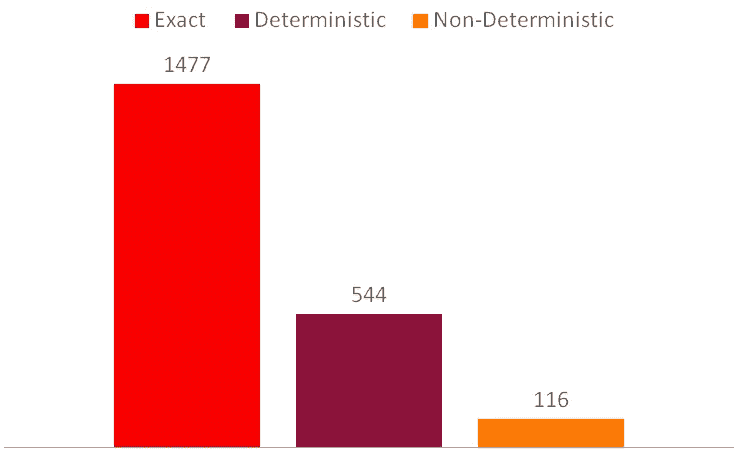

# 近似查询增强:开发人员会喜欢的关于 Oracle Database 12c 第 2 版第 6 部分的 12 件事

> 原文：<https://medium.com/oracledevs/approximate-query-enhancements-12-things-developers-will-love-about-oracle-database-12c-release-2-c4c94bb2615b?source=collection_archive---------6----------------------->

如果您进行数据分析，您经常需要回答以下问题:

*   昨天有多少客户访问了我们的网站？
*   上个月我们卖了多少不同的产品？
*   上周数据库执行了多少条唯一的 SQL 语句？

好吧，也许最后一个只是我；)

无论如何，这些问题通常只是进一步分析的起点。所以你只是想快速估算一下。


回答这些问题通常需要按照以下思路进行计数:

```
select count ( distinct customer_id ) from website_hits;
```

但是这些查询可能需要很长时间才能运行！

等待答案是令人沮丧的。但如果你是在为别人获取数据，那就更糟了。比如你的老板。他们需要开会的数据。一分钟后开始。您的查询至少需要十分钟。

你的老板等不了那么久。他们现在需要一个答案！

在这种情况下，你只需要快速估计。毕竟，你的老板会把你的数字四舍五入到一两位有效数字。

因此，在 12.1.0.2，我们推出了 [approx_count_distinct](http://docs.oracle.com/database/121/SQLRF/functions013.htm#SQLRF56900) 。这将返回目标列中有多少不同值的估计值。这通常有超过 99%的准确性，并且可能比精确结果快得多。

这太酷了。但是要利用它，您需要更改您的代码！这可能是一项耗时的任务。尤其是因为大多数时候，您希望能够在精确结果和近似结果之间切换。所以简单的查找+替换是不可能的。相反，您必须传入一个标志来切换模式。

如果你是不同计数的大用户，这可能会有很多工作…

所以在 12.2 中我们引入了一个新参数，approximate _ for _ count _ distinct。将此设置为 true，如下所示:

```
alter session set approx_for_count_distinct = true;
```

Oracle 隐式地将所有计数差异转换为近似版本。

玩这个游戏时，您可能会注意到其他几个新参数:

*   聚合的近似值
*   大约百分位数

那么这些都是关于什么的呢？

在 12.2 中，我们创建了一个新的函数，approximate _ percentile。这是 percentile_disc 和 percentile_cont 函数的近似版本。它和 approx_count_distinct 的概念是一样的，只是应用于这些函数。

它的语法是:

```
approx_percentile ( 
  <expression> [ deterministic ], 
  [ ('ERROR_RATE' | 'CONFIDENCE') ] 
) within group ( order by <expression> )
```

如您所见，在 approx_count_distinct 上有几个额外的子句。

# 确定性的

这定义了每次在相同的数据集上运行它时是否得到相同的结果。非确定性是默认值。也就是说你每次都会得到不同的答案。

现在你可能想知道，“但是我为什么想要非确定性的结果呢？!"。嗯，有几个原因:

*   非确定性结果更快。
*   您只能获得数值的确定性结果。

因此，如果你想在一个日期范围内得到 10%的百分比，你必须采用非确定性。

但是为非确定性结果节省的时间值得吗？

为了找到答案，我使用 [Exadata Express 云服务](https://cloud.oracle.com/en_US/database/exadata-express/pricing)创建了一个 1600 万行的表。然后比较以下精确、确定性和非确定性百分位数的运行时间:

```
select percentile_disc(0.1) 
         within group (order by y) 
from   super_massive; select approx_percentile(0.1 deterministic) 
         within group (order by y) 
from   super_massive; select approx_percentile(0.1) 
         within group (order by y) 
from   super_massive;
```

平均三次运行的时间，得出以下结果:



非确定性结果比确定性结果快大约 5 倍。比精确结果快了将近 15 倍！

因此，如果你只需要一个估计值，你可以使用 approx_percentile 节省很多时间。

# 错误率和置信度

如果你得到的是估计数字，那就有问题了，结果的*有多准确？如果是 99.9999%，那几乎可以肯定“足够好”。但是如果他们只有 98%的准确率呢？还是 95%？在某些时候，误差太大，你不能依赖估计，你会想切换回精确的计算。*

但是要做到这一点，你需要知道错误是什么！

为此，请将 ERROR_RATE 或 CONFIDENCE 作为第二个参数进行传递。那么你会得到精度数字，而不是函数结果。自信是我们有多确定答案是正确的。错误率给出了不准确的程度。

完美的发现近似有多好。

还有更多。

你们当中的统计爱好者会知道中位数是百分位数的一个特例。所以还有一个 approx_median 函数可用。这与 approx_percentile 的工作方式相同。

那么这些函数与参数 approx_for_percentile 有什么关系呢？

Oracle 中有两个百分点函数，percentile_disc 和 percentile_cont。因此，您可以选择转换其中之一或两者都转换。以及是否以确定的方式这样做。这需要的值是:

*   所有确定性
*   百分位数 _ 光盘确定性
*   百分比 _cont 确定性
*   全部
*   百分位 _ 光盘
*   百分位 _ 续
*   没有人

【blogs.oracle.com】全文原载于 2016 年 11 月 10 日[](https://blogs.oracle.com/sql/12-things-developers-will-love-about-oracle-database-12c-release-2)**。**