# Apriori 算法——知道如何发现频繁项目集

> 原文：<https://medium.com/edureka/apriori-algorithm-d7cc648d4f1e?source=collection_archive---------0----------------------->


Apriori Algorithm — Edureka

有没有发生过这样的情况，你出去买东西，结果却买了很多超出你计划的东西？这是一种被称为**冲动购买**的现象，大型零售商利用机器学习和**先验算法**，确保我们倾向于购买更多。那么让我们按照以下顺序来理解 Apriori 算法是如何工作的:

*   市场篮子分析
*   关联规则挖掘
*   Apriori 算法
*   Apriori 算法在 Python 中的实现

# 市场篮子分析

在当今世界，任何组织的目标都是增加收入。能否通过一次只向客户推销一种产品来做到这一点？答案是明确的**不**。因此，组织开始挖掘与经常购买的商品相关的数据。


**购物篮分析**是大型零售商用来发现商品之间关联的关键技术之一。他们试图找出可以一起销售的不同物品和产品之间的关联，这有助于正确的产品放置。通常，它会计算出一起购买的产品，组织可以以类似的方式放置产品。让我们通过一个例子来更好地理解这一点:

买面包的人通常也会买黄油。零售店的营销团队应该瞄准购买面包和黄油的顾客，并向他们提供优惠，让他们购买第三样东西，如鸡蛋。


因此，如果顾客购买面包和黄油，看到鸡蛋打折或打折，他们就会被鼓励花更多的钱去买鸡蛋。这就是市场篮子分析的全部内容。

这只是一个小例子。因此，如果你把你的超级市场的 10000 条数据带给一个数据科学家，想象一下你能得到多少洞见。这就是为什么关联规则挖掘如此重要。

# 关联规则挖掘

关联规则可以被认为是一种 IF-THEN 关系。假设商品 **A** 正在被顾客购买，那么商品 **B** 在相同的**交易 ID** 下也被顾客挑选的几率被发现。


这些规则有两个要素:

**Antecedent** (IF):这是通常在项目集或数据集中找到的项目/项目组。

**结果** (THEN):这是一个带有先行词/一组先行词的项目。

但是这里有一个限制。假设你为一个项目制定了一个规则，你仍然有大约 9999 个项目需要考虑制定规则。这就是 Apriori 算法发挥作用的地方。所以在我们理解 Apriori 算法之前，让我们先来理解它背后的数学。有 3 种方法来衡量关联性:

*   支持
*   信心
*   电梯

**Support:** 它给出包含项目 A 和 b 的交易的分数。基本上，Support 告诉我们经常购买的项目或经常购买的项目组合。

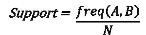

这样，我们就可以**过滤掉**具有**低频**的项目。

置信度:根据 A 出现的次数，它告诉我们项目 A 和 B 出现的频率。

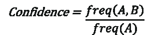

通常，在使用 Apriori 算法时，需要相应地定义这些术语。**但是你怎么决定价值呢？老实说，没有办法来定义这些术语。假设您已经将支持值指定为 2。这意味着，直到并且除非项目的频率不是 2%,否则你不会考虑 Apriori 算法的项目。这是有道理的，因为考虑不经常购买的商品是浪费时间。**

现在假设，过滤后你还有大约 5000 个项目。为他们创建关联规则对任何人来说都是一项几乎不可能完成的任务。这就是升力概念发挥作用的地方。

**Lift:** Lift 表示一个规则对随机出现的 A 和 b 的强度，它基本上告诉我们任何规则的强度。

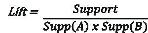

重点看分母，是 A 和 B 的个体支持值和不在一起的概率。Lift 解释了规则的力量。**越提越有力气。**假设对于 A - > B，升力值为 4。这意味着如果你买 A，买 B 的机会是 4 倍。现在让我们从 Apriori 算法开始，看看它是如何工作的。

# Apriori 算法

Apriori 算法使用频繁项集来生成关联规则。它基于一个概念，即一个频繁项集的子集也必须是一个频繁项集。频繁项集是支持度值大于阈值(support)的项集。


假设我们有一家商店的以下数据。

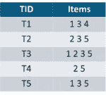

**迭代 1:** 假设支持度值为 2，创建大小为 1 的项目集，计算它们的支持度值。

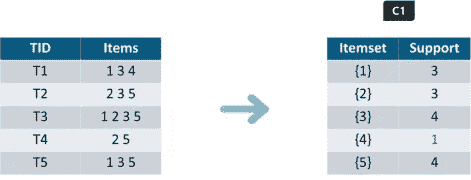

如您所见，第 4 项的支持值为 1，小于最小支持值。所以我们将在接下来的迭代中**丢弃{4}** 。我们有最终的 F1 表。

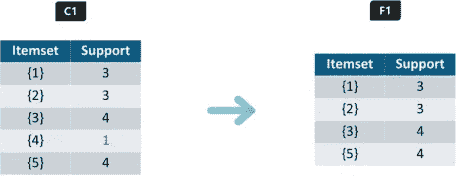

**迭代 2:** 接下来我们将创建大小为 2 的项目集，并计算它们的支持值。F1 中设置的所有项目组合都在此迭代中使用。

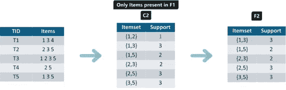

支持度小于 2 的项集再次被删除。在这种情况下 **{1，2}。现在，让我们了解什么是剪枝，以及它如何使 Apriori 成为查找频繁项集的最佳算法之一。**

**剪枝:**我们将把 C3 中的项目集划分成子集，并剔除支持度小于 2 的子集。

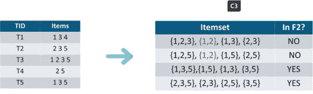

**迭代 3:** 我们将丢弃 **{1，2，3}** 和 **{1，2，5}** ，因为它们都包含 **{1，2}。**这是 Apriori 算法的主要亮点。

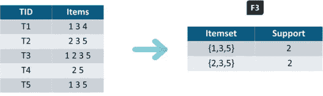

**迭代 4:** 使用 F3 的集合，我们将创建 C4。

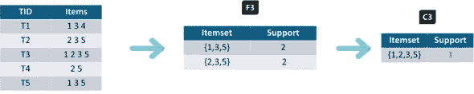

由于这个项目集的支持度小于 2，我们将在这里停止，我们将得到的最终项目集是 F3。
**注:**到目前为止我们还没有计算置信度值。

使用 F3，我们得到以下项目集:

**对于 I = {1，3，5}** ，子集有{1，3}、{1，5}、{3，5}、{1}、{3}、{5}
**对于 I = {2，3，5}、{2，5}、{3}、{5}**

**应用规则:**我们将创建规则，并将它们应用到项集 F3 上。现在让我们假设一个最小置信度值是 60%。

对于 I 的每个子集 S，你输出规则

*   S-->(I-S)(表示 S 推荐 I-S)
*   if**support(I)/support(S)>= min _ conf value**

**{1，3，5}**

**规则 1:** {1，3} - > ({1，3，5} — {1，3})表示 1 & 3 - > 5

信心=支持度(1，3，5)/支持度(1，3)= 2/3 =**66.66%****>60%**

因此规则 1 被**选中**

**规则二:** {1，5} - > ({1，3，5} — {1，5})表示 1 & 5 - > 3

信心=支持度(1，3，5)/支持度(1，5)= 2/2 =**100%****>60%**

规则二是**选中**

**规则 3:** {3，5} - > ({1，3，5} — {3，5})表示 3 个& 5 - > 1

信心=支持度(1，3，5)/支持度(3，5)= 2/3 =**66.66%****>60%**

规则 3 是**选中**

**规则四:** {1} - > ({1，3，5} — {1})表示 1 - > 3 & 5

信心=支持度(1，3，5)/支持度(1) = 2/3 = **66.66% > 60%**

规则 4 是**选中**

**规则 5:** {3} - > ({1，3，5} — {3})表示 3 - > 1 & 5

信心=支持度(1，3，5)/支持度(3) = 2/4 = **50% < 60%**

规则 5 被**拒绝**

**规则六:** {5} - > ({1，3，5} — {5})表示 5 - > 1 & 3

信心=支持度(1，3，5)/支持度(5) = 2/4 = 50% < 60%

Rule 6 is **被拒绝**

这就是如何在 Apriori 算法中创建规则，同样的步骤也可以在项目集 **{2，3，5}中实现。**自己试试，看看哪些规则被接受，哪些被拒绝。接下来，我们将看到如何用 python 实现 Apriori 算法。

# Apriori 算法在 Python 中的实现

我们将使用以下零售商店的在线交易数据来生成关联规则。

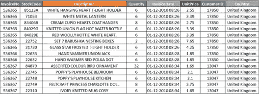

**步骤 1:** 首先，您需要导入 pandas 和 MLxtend 库并读取数据:

```
import pandas as pd
from mlxtend.frequent_patterns import apriori
from mlxtend.frequent_patterns import association_rules
df = pd.read_excel('Online_Retail.xlsx')
df.head()
```

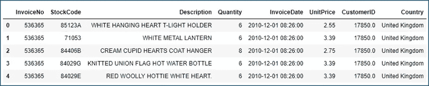

**第 2 步:**在这一步中，我们将:

*   数据清理，包括删除一些描述中的空格
*   删除没有发票编号的行，并删除贷方交易记录

```
df['Description'] = df['Description'].str.strip()
df.dropna(axis=0, subset=['InvoiceNo'], inplace=True)
df['InvoiceNo'] = df['InvoiceNo'].astype('str')
df = df[~df['InvoiceNo'].str.contains('C')]
df
```

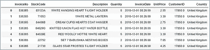

**步骤 3:** 清理之后，我们需要将每个产品的项目合并为每行 1 笔交易
为了保持数据集较小，我们只查看法国的销售情况。

```
basket = (df[df['Country'] =="France"]
          .groupby(['InvoiceNo', 'Description'])['Quantity']
          .sum().unstack().reset_index().fillna(0)
          .set_index('InvoiceNo'))
basket
```

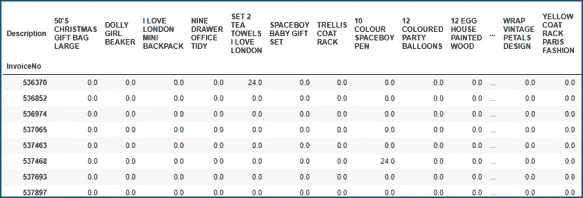

**步骤 4:** 数据中有很多零，但我们还需要确保任何正值都被转换为 1，任何小于 0 的值都被设置为 0

```
def encode_units(x):
    if x <= 0:
        return 0
    if x >= 1:
        return 1
basket_sets = basket.applymap(encode_units)
basket_sets.drop('POSTAGE', inplace=True, axis=1)
basket_sets
```

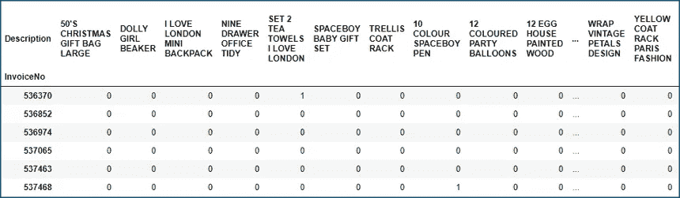

**第 5 步:**在这一步中，我们将:

*   生成支持值至少为 7%的频繁项集(选择这个数字是为了让您能够足够接近)
*   生成规则及其相应的支持、信心和提升。

```
frequent_itemsets = apriori(basket_sets, min_support=0.07, use_colnames=True)
rules = association_rules(frequent_itemsets, metric="lift", min_threshold=1)
rules.head()
```

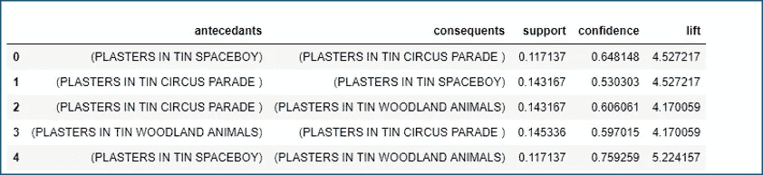

**观察:**

*   一些具有高提升值的规则，这意味着在给定交易和产品组合数量的情况下，其发生的频率比预期的要高
*   大多数地方的信心也很高。

**步骤 6:** 使用标准 pandas 代码过滤数据帧，以获得大提升(6)和高置信度(. 8)

```
rules[ (rules['lift'] >= 6) &
      (rules['confidence'] >= 0.8) ]
```

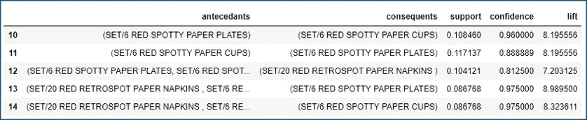

至此，我们来结束这篇关于 Apriori 算法的文章。我希望你首先明白这个算法是怎么来的，算法背后的数学原理是什么。如有疑问，欢迎在本文评论区提出。

如果你想查看更多关于人工智能、DevOps、道德黑客等市场最热门技术的文章，那么你可以参考 [Edureka 的官方网站。](https://www.edureka.co/blog/?utm_source=medium&utm_medium=content-link&utm_campaign=apriori-algorithm)

请留意本系列中的其他文章，它们将解释深度学习的各个其他方面。

> 1.[张量流教程](/edureka/tensorflow-tutorial-ba142ae96bca)
> 
> 2. [PyTorch 教程](/edureka/pytorch-tutorial-9971d66f6893)
> 
> 3.[感知器学习算法](/edureka/perceptron-learning-algorithm-d30e8b99b156)
> 
> 4.[神经网络教程](/edureka/neural-network-tutorial-2a46b22394c9)
> 
> 5.[什么是反向传播？](/edureka/backpropagation-bd2cf8fdde81)
> 
> 6.[卷积神经网络](/edureka/convolutional-neural-network-3f2c5b9c4778)
> 
> 7.[胶囊神经网络](/edureka/capsule-networks-d7acd437c9e)
> 
> 8.[递归神经网络](/edureka/recurrent-neural-networks-df945afd7441)
> 
> 9.[自动编码器教程](/edureka/autoencoders-tutorial-cfdcebdefe37)
> 
> 10.[受限玻尔兹曼机教程](/edureka/restricted-boltzmann-machine-tutorial-991ae688c154)
> 
> 11. [PyTorch vs TensorFlow](/edureka/pytorch-vs-tensorflow-252fc6675dd7)
> 
> 12.[用 Python 进行深度学习](/edureka/deep-learning-with-python-2adbf6e9437d)
> 
> 13.[人工智能教程](/edureka/artificial-intelligence-tutorial-4257c66f5bb1)
> 
> 14.[张量流图像分类](/edureka/tensorflow-image-classification-19b63b7bfd95)
> 
> 15.[人工智能应用](/edureka/artificial-intelligence-applications-7b93b91150e3)
> 
> 16.[如何成为一名人工智能工程师？](/edureka/become-artificial-intelligence-engineer-5ac2ede99907)
> 
> 17.[问学](/edureka/q-learning-592524c3ecfc)
> 
> 18.[tensor flow 中的对象检测](/edureka/tensorflow-object-detection-tutorial-8d6942e73adc)
> 
> 19.[马尔可夫链与 Python](/edureka/introduction-to-markov-chains-c6cb4bcd5723)
> 
> 20.[人工智能算法](/edureka/artificial-intelligence-algorithms-fad283a0d8e2)
> 
> 21.[机器学习的最佳笔记本电脑](/edureka/best-laptop-for-machine-learning-a4a5f8ba5b)
> 
> 22.[12 大人工智能工具](/edureka/top-artificial-intelligence-tools-36418e47bf2a)
> 
> 23.[人工智能(AI)面试问题](/edureka/artificial-intelligence-interview-questions-872d85387b19)
> 
> 24. [Theano vs TensorFlow](/edureka/theano-vs-tensorflow-15f30216b3bc)
> 
> 25.[什么是神经网络？](/edureka/what-is-a-neural-network-56ae7338b92d)
> 
> 26.[模式识别](/edureka/pattern-recognition-5e2d30ab68b9)
> 
> 27.[人工智能中的阿尔法贝塔剪枝](/edureka/alpha-beta-pruning-in-ai-b47ee5500f9a)

*原载于 2019 年 6 月 20 日*[*【https://www.edureka.co*](https://www.edureka.co/blog/apriori-algorithm/)*。*