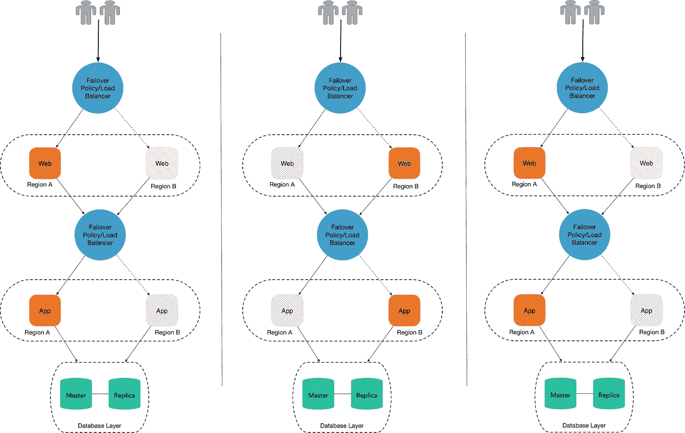
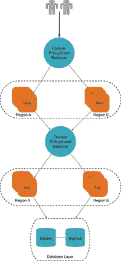

# 弹性架构

> 原文：<https://medium.com/capital-one-tech/architecting-for-resiliency-9ec663db5c94?source=collection_archive---------5----------------------->

## 我们需要它吗？我们需要多少？

如果你在过去五年中从事过软件工作，你肯定听说过或使用过一个或多个云服务，如亚马逊网络服务(AWS)、谷歌云平台(GCP)、微软 Azure、IBM Bluemix 或阿里云。对于许多项目来说，迁移到云给了团队一个机会来修补他们的架构和简化他们的代码库(这次也许可以避免导入七个不同的日期时间库！).然而，在迁移到云时要考虑的事项可能会多得令人不知所措，有些比其他的更重要。

在你的团队的讨论主题列表中，最重要的应该是弹性。首先想到的问题不应该是“我们需要它吗？”，而是“我们需要多少？”

无论你的应用程序是向 50 个人报告数据，还是向[1 . 25 亿订户](/@NetflixTechBlog/tips-for-high-availability-be0472f2599c)传输数据，可用性的考虑对于任何规模的项目都是至关重要的。

# 高层次考虑

构建一个随时可用的应用程序不像做炒鸡蛋那么简单；更像是乳蛋饼。你需要的不仅仅是基础知识，但是你付出的额外努力会得到回报。高弹性架构可以是:

*   复杂的
*   昂贵的
*   耗费时间的
*   *命令式*

每个项目都有独特的用例和需求，因此不同的项目将有它们自己必要的可用性级别。我们将在这里简要讨论的三个主要级别是:

*   活跃的
*   主动-被动
*   主动-主动

# 活跃的

了解我的人都知道我爱烹饪，也爱美食。韩国烤肉、提拉米苏、火腿肉、肉酱面和大蒜面包！我在家做饭的时候，经常是两个人一起做。在我拥挤的 100 平方英尺的房间里，我可能有两个炉子在燃烧，我的烤箱在转动。脚厨房。它很小，如果有东西掉下去了(或者被脏盘子盖住了)，我必须停下来处理这个问题，但我不会有任何其他方式。

主动可用性，比如我公寓的厨房，是部署堆栈的最低要求。有了堆栈中每个部分的一个运行实例，您就可以拥有基本的功能。但是，如果您的堆栈中的任何服务器由于连接问题、区域故障等原因而发生故障。，其余的筹码跟在后面。

Figure 1\. Simple Active Level Architecture Diagram

这种部署应用程序的基本方法非常适合对重要业务运营影响最小的项目。服务中断不需要立即补救，托管应用程序的成本保持在最低水平。由于简单的实现模式，构建应用程序的复杂性也降低了，从而减少了工程师构建应用程序的时间。

# 主动-被动

我奶奶一直有两个冰柜。当我问她为什么时，她告诉我，当家人聚在一起过感恩节和圣诞节时，她需要储存更多的食物。除此之外，第二个冰箱经常是空着的，一年中的其他时间都没有电源。

这就是主动-被动可用性的本质；当您需要时，让已经配置好的服务器实例为您所用。对于主动-被动模式，运行状况检查可确保被动服务器和主动服务器都处于活动和工作状态。当主服务器关闭时，流量被路由到被动服务器(它变成“主动”服务器)。在这种设计模式中，只有活动服务器实例接受流量。这种类型的故障转移在数据库中的读取副本中很常见。

Figure 2\. Active-Passive Example Architecture.

在第一种状态下，区域 A 中的所有服务都启动并运行。但是，当区域 A 发生故障时，我们进入第二种状态，我们的服务现在在区域 b 中运行。一旦区域 A 的状态恢复正常，我们就进入状态 3。

在这个例子中，我们在复杂性方案中引入了负载平衡器和故障转移策略。当在区域 A 中运行的实例出现故障时，流量会自动路由到区域 b。在不同地理区域中运行备份实例增加了一层保护，防止区域范围内的故障，即[与天气相关的中断](https://aws.amazon.com/blogs/aws/aws-ready-to-weather-the-storm/)。

让额外的实例处于备用状态很容易增加维护服务器的成本和总体工作量。使用故障转移，当服务失败且流量需要重新路由时，可能会丢失数据。根据被动实例的配置方式，还存在操作停机的风险。

借助主动-被动弹性，只要负载平衡器意识到您有一个不健康的实例并重新路由流量，业务关键型应用程序就可以继续运行。通过让被动实例运行您的应用程序，您的 [RTO 和 RPO](https://www.druva.com/blog/understanding-rpo-and-rto/) 可以大幅减少，而不会在您的服务中引入太多复杂的设计决策。

# 主动-主动

在我们家过感恩节总是一件乐事。每年感恩节早上，五六个人为 20-30 个饥饿的家庭成员做饭；煮鸡蛋，烤火鸡，还有我最喜欢的土豆泥。每个人通常会带一堆食物来参加这一天的大餐，而我奶奶实际上是协调每个人食物的大师。

有时候，那些面不是最开胃的，有时候，一些面做了很多次，而另一些时候，狗把一个配菜从桌子上撞了下来；但是奶奶总是保证每一面至少做一次。

Figure 3\. Sample Active-Active Architecture

基于我们的主动-被动示例，在主动-主动架构中，我们现在有多台服务器同时处理流量和分担负载。通过负载平衡器检查每个实例的健康状况，您可以确保高可用性，因为您不再有单点故障。现在，我们可以在一个区域和多个活动区域中运行多个实例！通过使用顶级域，我们可以配置我们的负载平衡器来适当地路由流量，以处理高负载。我们不再需要担心故障转移，因为我们已经有多个服务器实例在运行。

在某些模式中，将数据发送到多个服务器是很常见的—在这些情况下，当从数据库中读取数据或向数据库中写入数据时，需要重复数据删除机制。

主动-主动弹性架构需要仔细选择工具和资源，这在某些情况下可能是一个非常有限的因素。例如，如果您正在使用队列服务，了解交付模型是很重要的，例如，至少一次，恰好一次，等等。在某些用例中，像 Kafka 这样的发布订阅模式可能更合适。引入分布式模式，例如利用 Kafka，会产生异步和最终一致性的复杂性。

让*总是在*服务器上的概念在理论上是理想的，但是应该首先考虑实现的权衡。在这种情况下，我们不得不应对维护服务器的高得多的成本。将所有这些额外的机制包含到您的下一个项目中是一项重要的工作，应该在构建高弹性架构之前加以考虑。

# 判决

根据您的业务案例，并不总是需要构建高弹性。高弹性需要更大的运营开销，以及在设计、构建和实现解决方案时不可忽略的额外工作量。

在规划过程的早期，理解这些权衡并在设计可用性时权衡业务价值是非常重要的。把它想象成你的 [*米色恩地方*](https://en.wikipedia.org/wiki/Mise_en_place) *。早点做，先做这件事，以免以后头疼。*

*披露声明:这些观点是作者的观点。除非本帖中另有说明，否则 Capital One 不属于所提及的任何公司，也不被其认可。使用或展示的所有商标和其他知识产权都是其各自所有者的所有权。本文为 Capital One 2018。*