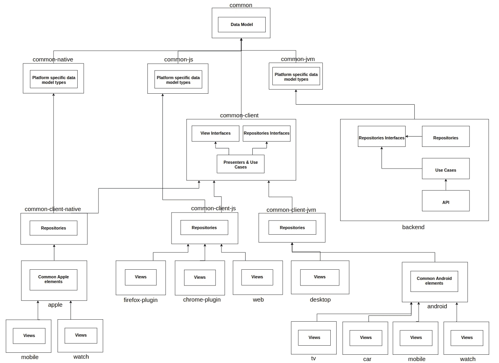
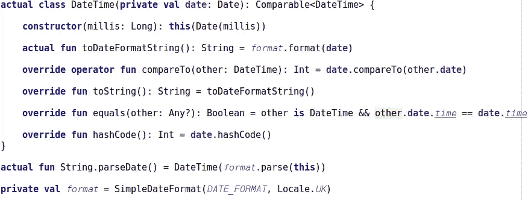
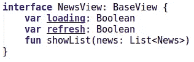

# Kotlin 中多平台本机开发的有效架构

> 原文：<https://blog.kotlin-academy.com/architecture-for-multiplatform-development-in-kotlin-cc770f4abdfd?source=collection_archive---------0----------------------->

我的导师经常说“如果你在一个项目中使用 Ctrl-C Ctrl-V，你就做错了”。这句话深深地打动了我，开始了我寻找越来越好的代码重用性的故事。今天我真的很自豪。在过去的几周里，我一直致力于一个伟大的想法，这个想法在本地开发中引入了一个新层次的可重用性。现在我已经准备好展示结果、想法和背后的架构。享受:)

# 演示

让我们从[示例应用程序](https://github.com/MarcinMoskala/KotlinAcademyApp)的演示开始。

这是卡帕头。学院原生安卓应用:( [Google Play](https://play.google.com/store/apps/details?id=org.kotlinacademy.mobile) )

这是卡帕头。用 React 写的学院网站:([链接](https://kotlin-academy.herokuapp.com/#/))

这是 [Edvin Syse](https://twitter.com/edvinsyse) 在[torrofax](https://github.com/edvin/tornadofx)中写的桌面应用:

这是 Android 手表应用程序:

很快还会有**火狐插件**、 **Chrome 插件**和 **iOS** 客户端(如果你不信，那就去看看[这篇文章](/multiplatform-native-development-in-kotlin-now-with-ios-a8546f436eec?gi=11c0e748f8dc)或者[这个资源库](https://github.com/jetbrains/kotlinconf-app))。

尽管这些应用程序是在不同的框架中为不同的平台编写的，但它们都具有相同的行为。这种行为的单独实现对于创建、维护和单元测试来说是巨大的时间浪费。幸运的是，**在它们之间共享的单个模块中实现一次。**

# 科特林

完全公开:整个项目是用 Kotlin 写的。它是由 JetBrains 开发的开源语言。Kotlin 是一种具有相同语法和 stdlib 的单一语言，目前可用于 4 种不同的变体:

*   Kotlin/JVM 编译成 JVM 字节码(或者 [DVM 字节码](https://forensics.spreitzenbarth.de/2012/08/27/comparison-of-dalvik-and-java-bytecode/))。它与 Java 完全互操作:我们实际上可以将 Java 项目中的单个文件从 Java 更改为 Kotlin，一切都会运行良好。这就是 Kotlin 在 Android 开发中迅速流行的原因。它甚至被 Google 视为 Android 的第一类语言。
*   Kotlin/JS 编译成 JavaScript。它还与 JavaScript 高度互操作。在 Kotlin 中实现 React 项目变得越来越流行。
*   Kotlin/Native 编译成原生字节码。它可以用来实现 iOS 应用程序。Kotlin/Native 仍处于早期测试阶段，但 JetBrains 已经展示了用它编写的不同项目(查看 Kotlin/Native 中的[示例](https://github.com/JetBrains/kotlin-native)、 [iOS 应用](https://github.com/jetbrains/kotlinconf-app)或 [iOS 和 Android 应用](https://github.com/jetbrains/kotlinconf-spinner))。
*   普通科特林模是一种特殊的模。它不依赖于任何平台，但由于特殊的机制，它可以使用平台特定的类型和功能(这些类型需要在*平台模块*中为每个平台定义，以用于那个*公共模块*)。这种类型称为*预期声明*，它们的平台相关声明称为*实际声明*。[在这里](https://kotlinlang.org/docs/reference/multiplatform.html)你可以找到更多关于*通用*和*平台模块*的信息。

使用这些组件，我们可以创建一个真正的多平台项目。我们可以在 Kotlin 中实现所有客户端:Android mobile、Android Watch、Kotlin/JVM 中的桌面；Kotlin/JS 中的 web、Firefox 插件、Chrome 插件；Kotlin/Native 的 iOS 和 Apple Watch。在一个项目和一种语言中包含所有内容是很好的。此外，使用普通和简单的 Kotlin 模块，我们还可以引入将改进这个项目并使其更容易实现的架构。

# 想法

假设我们需要在 web、Android 和桌面上创建具有后端和客户端多平台项目(当 iOS 的多平台支持更加成熟时，我们将添加 iOS)。

为了保持代码的组织性、可重用性和可测试性，这个项目的每个部分都需要有自己的架构。对于 Android 来说，最流行的架构是 [MVP](https://medium.com/@marcinmoskala/mvc-vs-mvp-vs-mvvm-vs-mvi-ce72907d330) 。以一种简化的方式，它将以下层分开:

*   *演示者* —实现业务逻辑的实例(应用程序如何运行)。
*   *视图*—*视图*是一个被动界面，它显示数据并将用户交互发送给演示者。它包括实现表示逻辑(应用程序看起来是什么样子)的难以单元测试的元素。
*   *模型—* 它通常被定义为一个界面，该界面定义了要在用户界面中显示或以其他方式操作的数据。

虽然 MVP 定义中的*模型*远未得到很好的定义，但在 Android 中，有一种通用的方法来定义以下两种类型的元素:

*   数据模型——代表我们在应用程序中使用的数据结构的对象。
*   存储库——演示者和用例用来与数据库、网络等进行通信的对象。

我们还将提取一些具体的业务逻辑规则到具有单一职责的更小的类中，我们将称之为*用例*。尽管在我们的结构中，它们将与*主持人*一起出现，因为它们扮演类似的角色，并且它们总是被主持人使用(除了`backend`以外的任何地方)。

*业务逻辑(演示者*和*用例*)是我们应用程序最重要的部分，它**必须经过单元测试**！虽然*演示者*需要与*视图*和*存储库*进行交互，但它应该在接口后面与它们进行交互。考虑到这一点，我们可以在下图中展示该体系结构的所有元素:

需要注意的重要一点是，所有客户端都可以具有相同的结构:

`backend`也有它的层次。我们使用以下架构:

请注意，上面介绍的所有架构都有一个共同的元素— *数据模型*。所有这些都是相似或相同的模型，重新实现是对时间和精力的巨大浪费！这就是为什么它应该被提取到单个模块中:

除了*数据模型*，`common`还可以包括所有其他模块需要的其他元素。我们是否需要`sha1`函数计算 hash 来提高 API 安全性？我们可以将其放置在*公共模块* `common`中，并在`backend`和所有客户端中使用相同的功能。

事实上，我们经常希望在数据模型中使用特定于平台的类型。在[示例项目](https://github.com/MarcinMoskala/KotlinAcademyApp)中，我定义了代表时间点的`DateTime`类。在幕后，它使用 Java `Calendar`和 Java Script `Date`。为了允许它，我们需要为`DateTime`定义预期的声明。然后我们需要用实际声明定义*平台模块*:

客户机之间共享的、等待提取的更大的代码片段是客户机的表示逻辑。所有的客户都扮演相同的角色，所以他们应该共享*演示者*和*用例*！我们可以将它们全部提取到`common-client`模块。我们应该和他们一起移动*存储库接口*和*视图接口*:

那么*库*呢？它们目前在客户端模块中定义，我们必须通过构造函数将它们传递给*呈现者*。相反，我们可以将它们移动到*平台模块*，然后我们将能够:

*   在`common-client`模块中实现依赖注入
*   为所有平台重用存储库

这个*平台模块*将总是包括其他元素，比如需要依赖于平台的客户端类型。这是我们的架构在这次改变后的样子:

这是这个项目的结构外观。

# Android 通用模块

假设我们需要在应用程序中添加 Android Watch 客户端。这就产生了一种情况，即提取包含共享元素的 Android 公共模块是合理的，如:

*   资源(图像、文本、颜色)
*   Android 助手功能，如视图绑定助手，回收视图类等。

该模块是对我们多平台架构的合理补充:

# 大型多平台项目

上述结构呈现了[的当前状态，示例](https://github.com/MarcinMoskala/KotlinAcademyApp)实现了 4 个不同的客户端。尽管示例项目的目标是成为一个大型的多平台项目，但是这个任务还远远没有完成。我们希望包括尽可能多的客户！目前的计划包括 iOS 应用、Firefox 插件、Chrome 插件、Android TV、Android Car 和 Apple Watch。如果你有更多的想法，或者如果你想通过结识这样的客户来尝试自己，那就感到受欢迎([投稿](https://github.com/MarcinMoskala/KotlinAcademyApp)或[联系我](mailto:marcinmoskala@gmail.com))。我们享受每一份贡献。这个大型多平台项目的架构看起来更像这样:

# 体系结构

由于这种架构，我们不仅获得了巨大的代码可重用性，而且每样东西都有自己的位置。它包含以下模块:

*   `common` —包含所有其他模块共享的元素。一般是*数据模型*和辅助函数。这个模块也可能包含其他元素，如果它们在客户端和后端都使用的话。
*   `common-js`和`common-jvm` —包含`common`模块的所有平台特定类型。
*   `common-client` —包含所有客户端的业务逻辑。一般放在*演示者*和*用例*中。
*   `common-client-js`和`common-client-jvm` —包含`common-client`的平台特定部分。在这个实现中，我决定将客户端存储库放在那里，因为我们希望将它们注入到*演示者*中，并且它们是特定于平台的(相同的 Java 网络库可以在 Android 和桌面上使用)。
*   `web`、`desktop`和其他客户端模块—包含每个客户端的视图。该视图实现了来自`common-client`的视图接口，并将事件传递给*演示者*。
*   `backend` —包含后端实现。
*   `android`和其他为单一平台构建的客户端通用模块—包含共享元素，如资源或助手功能。

有了这个架构，我们可以达到代码重用的顶峰。由于这一点，我们不必为每个客户分别实现*业务逻辑*。同样，业务逻辑中的*变化也可以在单个地方应用。当我们检查某个业务逻辑在一个客户机中工作时，我们可以确定它在所有其他客户机中也工作。这样，不仅简化了手动测试，而且对于`common-client`模块，单元测试现在只需执行一次。*

理论足够了，让我们看看一些代码，并在实践中讨论这个不同模块的关键元素。因为这篇文章已经够长了，所以不会进行深入的分析。我们将在下一篇文章中对不同方面进行更深入的分析。它们将在下周一陆续在 Kt 播出。学院。但是，这篇文章应该给出足够的解释，以开始你自己的项目或对[示例项目](https://github.com/MarcinMoskala/KotlinAcademyApp)(感觉受欢迎；)).

# 公共模块

`common`模块包括以下 Kotlin 文件:

common module source set

*子包`data`中的数据模型*包括以下类:

*   表示项目中使用的数据
*   表示 API DTO(通过 API 传递的对象模型)

例如，这是一个`News`类:

News class in common module

你注意到注释了吗？就是 [kotlinx.serialization](https://github.com/Kotlin/kotlinx.serialization) 注解。我们需要它来反序列化 Kotlin/JS 中的对象。`News`的列表通过封装在`NewsData`类中的 API 传递:

NewsData class in common module

背后的原因可以在这里找到[。](https://youtrack.jetbrains.com/issue/KT-21341)

另一件需要注意的事情是，`News`包含了类型为`DateTime`的参数。这是一个表示时间点的类。使用*预期声明*在`common`模块中定义:

DateTime expected declaration in common module

它的声明是极简的，因为我们目前不需要更多。我们用它来订购客户的新闻。这也是它实现`Comparable<DateTime>`接口的原因。序列化需要使用方法`toDateFormatString`和扩展函数`parseDate`。`DATE_FORMAT`规定 API 的格式。其*实际声明*定义为`common-js`和`common-jvm`:

DateTimeJs in `common-js`

DateTimeJVM in common-jvm

`DateTime`是自定义类型，因此我们需要为它指定序列化，以便能够通过 API 传递`News`。所有的 Kotlin/JVM 项目都在使用 [Gson](https://github.com/google/gson) 来序列化和反序列化对象，所以我们可以在`common-jvm`中定义`Gson`实例。我们需要为那里的`DateTime`类添加转换器:

[Gson](https://github.com/google/gson) instance defines in common-jvm

注意`backend`和`common-client-jvm`都依赖于`common-jvm`，所以我们可以在两者中都使用`gson`。

类似地，在`common-js`中，我们定义了用于序列化和反序列化 JSON 的[kotlinx . serialization](https://github.com/Kotlin/kotlinx.serialization)JSON 实例，我们用`DateTime`序列化器来定义它:

[kotlinx.serialization](https://github.com/Kotlin/kotlinx.serialization) JSON instance defined in common-js

现在我们可以通过 API 传递`News`,它可以在客户端被正确地反序列化。

我们可以在`common`模块中找到的另一件事是带有端点部分名称的属性:

当它们是在一个地方定义的，那么在需要改变的情况下，我们就不必去寻找所有引用它们的地方。我们可以只改变单个属性的值。

# 公共客户端模块

`common-client`模块包括*演示者*和*带有客户业务逻辑的用例*。让我们简单描述一下其中一个*演示者*来了解它是如何工作的。我们将描述控制显示新闻的视图的`NewsPresenter`。其业务逻辑规则如下:

*   创建视图后，它加载并显示新闻列表。在新闻加载过程中，会显示加载器。
*   当用户请求刷新时，加载新闻。在刷新期间，显示刷新指示器。
*   新闻每 60 秒悄悄刷新一次。
*   新闻按发生的降序显示。
*   当任何新闻加载返回错误时，它被显示。

这就是我们如何表示由这个*演示者*控制的*视图*:

NewsView in common-client

`BaseView`还指定了显示和记录错误的方法:

BaseView in common-client

下面是*演示者*的实现:

NewsPresenter in common-client

## 演示者生命周期

`NewsPresenter`扩展了 `BasePresenter`类，该类负责在 *presenter* 销毁期间取消所有已启动的作业(以防止数据泄露)。

BasePresenter in common-client

它还实现了指定基本*演示者*生命周期方法的`Presenter`接口:

Presenter in common-client

*视图*在视图创建和销毁过程中需要调用这个方法。我们将在后面看到如何确保它适用于 Android。

## 演示者中的 Kotlin 协同程序

*演示者*正在使用 Kotlin 协同程序进行并发。在*公共模块*中还不支持协程，所以我们必须用我们需要的方法指定预期的声明:

这就是*实际声明*在`common-client-jvm`中的实现方式:

Expected declarations from common-client-jvm for actual declarations in common-client coroutines functions

## 依赖注入的轻量级替代方案

`NewsPresenter`使用`NewsRepository`和`PeriodicCaller`。它们都是使用依赖注入的轻量级替代方案提供的。它使用以下类别:

Provider class used as a lightweight alternative to dependency injection. Defined in common module because used both in backend and in common-client.

当我们有一个我们想要注入的类时，我们需要使它的*伴随对象*扩展`Provider`，并且我们覆盖`create`方法:

PeriodicCaller class defined in common-client module

在这之后，我们可以使用以下方法轻松获得实例:

出于单元测试的目的，我们也可以很容易地覆盖这个实例(查看[单元测试](https://github.com/MarcinMoskala/KotlinAcademyApp/tree/master/android/mobile/src/test/java/org/kotlinacademy))。

`NewsRepository`是公共客户端中定义的接口:

NewsRepository class defined in common-client module

## 存储库实现

新闻存储库实现需要使用目前无法在*公共模块*中定义的网络库。所有的客户端仓库都在*平台模块* `common-client-js`和`common-client-jvm`中指定，我们使用`RepositoriesProvider` *预期声明*提供:

ReporitoriesProvider in common-client

从`common-client-jvm`开始`NewsRepository`的实际申报和实施:

ReposirotyProvider from common-client-jvm

Implementation of NewsRepository defined in common-client-jvm

这就是我们理解`NewsPresenter`如何工作所需要的一切。它的行为也可以从单元测试的角度来看(它的单元测试可以在[这里](https://github.com/MarcinMoskala/KotlinAcademyApp/blob/master/android/mobile/src/test/java/org/kotlinacademy/NewsPresenterUnitTest.kt)找到，很快我将发表只关注单元测试*公共模块*的文章)。为了真正理解演示者，我们需要看到他们在客户端中的使用，所以让我们看看`NewsPresenter`是如何在 Android 和 web 客户端中使用的。

# 客户

不同客户如何使用*的详细描述主持人*将在关于特定客户的文章中介绍(我们将在下周的周一发表这篇文章)。现在，让我们讨论简化的`NewsActivity`(下面的实现只包含连接到 presenter 的元素)。

Simplified version of Android NewsActivity. You can find full class [here](https://github.com/MarcinMoskala/KotlinAcademyApp/blob/master/android/mobile/src/main/java/org/kotlinacademy/view/news/NewsActivity.kt).

Activity 实现了`NewsView`接口，并覆盖了它的所有成员。`loading`绑定到`ProgressView`可见性，刷新绑定到列表的刷屏刷新。可以使用[kotlinandroidviewindings](https://github.com/MarcinMoskala/KotlinAndroidViewBindings)库。`showList`将新闻映射到适配器中，并在列表中显示它们。我们不需要显式调用 *presenter* 生命周期方法，因为它们在`BaseActivity`中被调用:

BaseActivity in Android

`BaseActivity`也实现了`BaseView`并覆盖了它的方法，这是因为我们不必在每个活动中定义`showError`和`logError`。更多关于 Android 实现和其他支持多平台 Kotlin 项目的技巧，我将在另一篇关于 Android 的文章中描述。

在`web`模块中应用了类似的方法，尽管 React 的工作方式与 Android 完全不同:

NewsComponent in web

您可以查看存储库示例，或者等待关于这一部分的文章。

# 后续步骤

正如我已经提到的，在这个示例项目背后还有很多计划:

*   我们想让它大规模多平台化，并实现尽可能多的不同的原生客户端
*   并非项目中的所有内容都已完成(查看项目中的 todo 注释)

还有一些目前难以实现的改进，但我们希望有这些改进，因为它们可能对其他多平台 Kotlin 项目非常有帮助:

*   网络 API 应该为`backend`和所有平台库实现一次。为此，我们需要特殊的网络库来支持它。虽然有可能。我将在单独的文章中提出这个想法。
*   可以提取像颜色或翻译这样的元素。这很难，因为在大多数平台中，有不同的机制来定义它们。目前，这可能是使用脚本或 Gradle 插件完成的。或者，如果所有视图都用 Kotlin DSL 实现(在这个项目中只有 Android 不是)，那么可能会引入一些机制来返回标签和特定语言的字符串。

# 与 React Native 或 Flutter 等其他解决方案相比，它的优势是什么？

这里最重要的一点是，我们实际上是在本地框架中创建本地应用程序。如果您查看这些不同的应用程序，您会很容易注意到它们的视图和行为方式是特定于平台的。在 Android 中，我们使用 Android 支持库中的`CoordinatorLayout`。在 web 中，设计是现代网站的典型特征。在桌面，我们看到新的窗口。

我们可以利用每个平台的所有工具和优势。在 Android 中，有用于跟踪错误的碰撞算法。在网络上，有推特和脸书的分享按钮。在桌面上，我们在新窗口中显示评论。

应用程序是本地的，我们不依赖任何绑定或桥。我们可以做以前能做的一切，我们的多平台架构支持我们尽可能提高效率。

下一篇文章:

 [## 梯度多项目中的图像共享

### Gradle 多项目非常棒！我们可以用 Android，后端，前端，以及我们需要的任何东西来制作单个项目…

blog.kotlin-academy.com](/images-sharing-in-gradle-multiprojects-aba5e6bc8b1a)  [## Android 中多平台通用模块的提取

### 你知道如何制作 Android 项目，但现在你想让它们多平台化。你听说了新的可能性…

blog.kotlin-academy.com](/extracting-multiplatform-common-modules-in-android-4a564cc03e0a)  [## 多平台 Kotlin 项目中的共享客户端逻辑

### 我们已经展示了多平台 Kotlin 项目的架构。它的核心思想是我们如何定义客户逻辑…

blog.kotlin-academy.com](/shared-client-logic-in-multiplatform-kotlin-project-2509bc36ff51)  [## 测试通用模块

### 在具有良好架构的 Kotlin 多平台项目中，我们在公共-客户端公共模块中拥有完整的业务逻辑…

blog.kotlin-academy.com](/testing-common-modules-66b39d641617) 

## 学到了什么？单击👏说“谢谢！”并帮助他人找到这篇文章。

如果你认为这很重要，与他人分享。

你需要 Kotlin 工作室吗？请访问我们的网站,看看我们能为您做些什么。

要在 Twitter 上提到我，请使用 [@marcinmoskala](https://twitter.com/marcinmoskala) 。

我要感谢 [Edvin Syse](https://twitter.com/edvinsyse) 对范例项目的重要贡献。也感谢 Ilya Gorbunov 对本文的重要更正。

