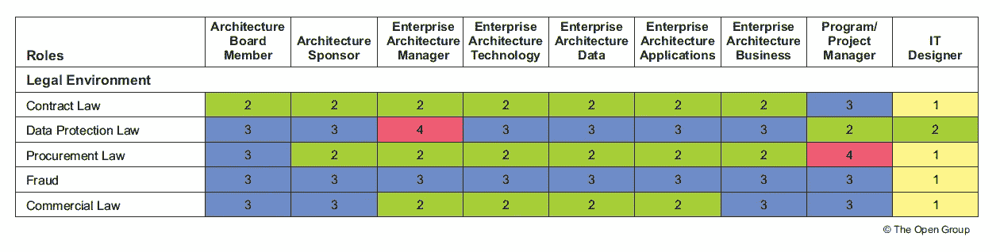

# 架构技能框架

> 原文：<https://medium.com/globant/architecture-skills-framework-5ee667482c20?source=collection_archive---------0----------------------->

技能框架提供了特定角色所需能力水平的视图。它们定义:
■工作区域内的角色
■每个角色所需的技能
■成功履行角色所需的知识深度

它们通常用于定义咨询和/或项目管理任务所需的技能，以交付特定的项目或工作包。

**对企业架构技能框架的需求** “企业架构”和“企业架构师”是当今业界广泛使用但定义模糊的术语。它们被用来表示在各种各样的架构领域中应用的各种实践和技能。有必要进行更好的分类，以便更好地理解所描述的架构/架构师的类型。

这种缺乏统一性导致组织在招聘或分配/提升员工来填补架构领域的职位时遇到困难。由于术语的不同用法，在那些寻求招聘的人和那些寻求填补架构师各种角色的人之间经常会有误解和误解。

**使用 TOGAF 架构技能框架的好处包括:**

*   减少培训、招聘和管理内部和外部体系结构专业人员的时间、成本和风险。
*   减少建立内部架构实践的时间和成本。
*   减少实现体系结构实践的时间和成本有助于减少整个解决方案开发的时间、成本和风险。

**技能类别** 技能组合需要包括以下主要技能类别:

■ **一般技能** : —通常包括领导力、团队合作、人际交往技能等。
■ **业务技能&方法** : —通常包括业务案例、业务流程、战略规划等。
■ **企业架构技能** : —通常包括建模、构建模块设计、应用程序和角色设计、系统集成等。
■ **计划或项目管理技能**:——通常包括管理业务变更、项目管理方法、工具等。
■ **IT 一般知识技能** : —通常包括代理应用程序、资产管理、迁移规划、SLA 等。
■**IT 技术技能** : —通常包括软件工程、安全、数据交换、数据管理等。
■ **法律环境** : —通常包括数据保护法、合同法、采购法、欺诈等。

**熟练程度**

**通用技能**

**法律技能**

**技术技能**

**项目管理技能**

建筑师的角色可以概括为:

■ **理解和解释需求**:探查信息，倾听信息，影响他人，促进共识的建立，综合想法并将其转化为可操作的需求，向他人表达这些想法，并确定用途或目的、约束、风险等。
架构师参与发现和记录推动解决方案的客户业务场景。架构师负责理解需求，并在架构规范中体现这些需求。

■ **创建一个有用的模型**:获取需求并开发解决方案组件的公式化模型，根据需要扩充模型以适应所有环境，并通过模型显示多个视图以有效地交流想法。架构师负责整体架构的完整性，并从架构的角度维护产品的愿景。架构师还确保利用构建模块识别利用机会，并且是职能部门(尤其是开发和营销部门)之间的联络人，以确保利用机会得以实现。架构师提供并维护这些模型，作为理解开发工作领域的框架，指导组织内部或组织外部应该做什么。架构师必须通过理解所有必要的业务组件来代表组织的架构视图。

■ **验证、提炼和扩展模型**:验证假设，引入主题专家，等等。为了改进模型并进一步定义它，在必要时添加新的想法，以使结果更加灵活，并与当前和预期的需求更紧密地联系在一起。
此外，架构师还应该评估来自现场工作的解决方案增强开发的价值，并在适当的时候将这些整合到架构模型中。

■ **管理架构**:持续监控模型，并在必要时更新它们，以显示在程序的开发和决策点期间代表架构和问题的变化、添加和变更。架构师是“变革的代理人”，代表了架构实现的需求。通过这个开发周期，架构师不断地促进组织之间的客户、架构和技术信息的共享。