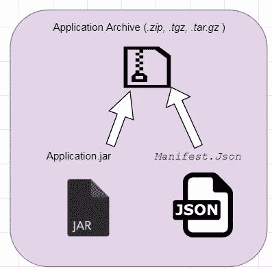
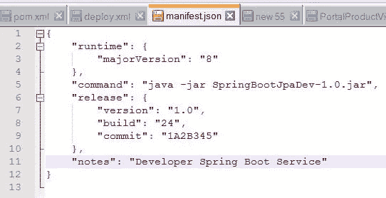
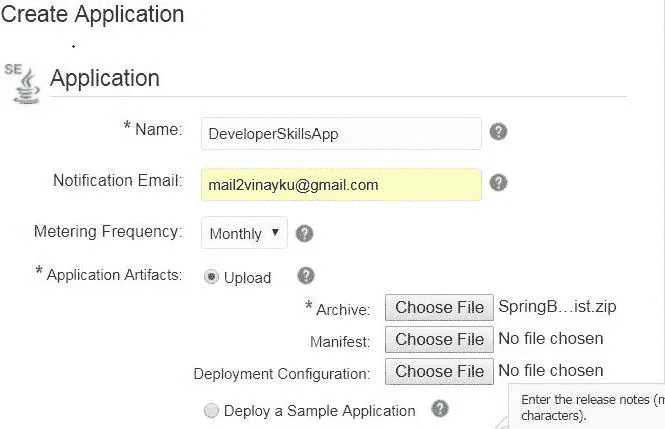

# 面向应用容器的微服务归档打包— Oracle 云

> 原文：<https://medium.com/oracledevs/archive-packaging-for-oracle-application-container-cloud-d35aaaf062f8?source=collection_archive---------3----------------------->

[应用容器云服务](/@vinaykuma201/starting-with-oracle-application-container-cloud-ba258c572de1)适合部署多语言应用。对于将要进行部署的开发人员，他们需要正确打包应用程序存档，以便在 Oracle ACCS 中上传。

完成本地测试后，在。zip/。tgz/ .tar.gz 格式，包括带有依赖库的应用程序和最重要的 manifest.json 文件。

Application archive

*   应用程序应该包含所有依赖项。它应该是独立的。使用 maven 或任何其他构建工具来获取所有依赖项并构建一个胖 jar。
*   单一触发点-执行应用程序的触发命令或启动命令。例如对于 Java，执行一个 jar

使用 **Java -jar app.jar** 或使用 shell 脚本`***sh ./applicationScript.sh* .**`执行应用程序

*   在 manifest.json 文件中添加触发器/启动命令。这将指示 Oracle ACCS 通过运行启动命令或脚本来运行应用程序。您还可以选择传递其他参数，即 service binding 选项卡中 deployment.json 中的环境变量。

应用程序必须以上述格式存档，且 manifest.json 位于根目录中。这将是一个正确的格式的档案上传到 ACCS。

manifest.json 的格式如下。您还将定义要执行的 java 版本。可以是 7，也可以是 8。您也可以从 UI 控制台进行更改。

Manifest.json for Java app

# **如何构建部署档案-**

对于构建 zip 文件，您可以使用任何 zip 或 tar 实用工具。

对于 zip 使用— `*zip myapp.zip manifest.json customapp.jar*`

对于焦油- `*tar cvfz myapp.tgz manifest.json customapp.jar*`

对于构建流程，您可以使用 maven assembly 插件来构建归档文件。我的 [GitHub](https://github.com/vinaykumar2/Developer-Microservices-App) 账户中有样片。

# **部署-**

目前有 4 种选择。

*   **通过 UI 控制台** -创建应用程序后，导航至 ACCS 控制台并上传档案。您还可以使用 Storage cloud 上传归档文件。

Upload Archive

*   ACCS 提供 REST API 来上传存档。我会在这个[博客](/@vinaykuma201/deploy-to-application-container-cloud-service-from-oracle-storage-cloud-via-rest-api-ea5e776acacb)里详细分享这个
*   平台服务管理器命令行界面。在这里阅读更多。
*   使用开发者云服务。我将在接下来的文章中发表。

快乐学习。