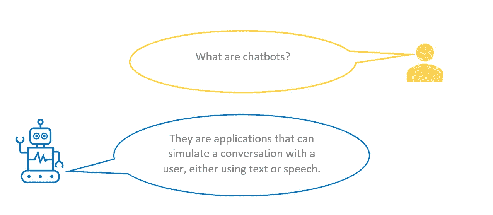
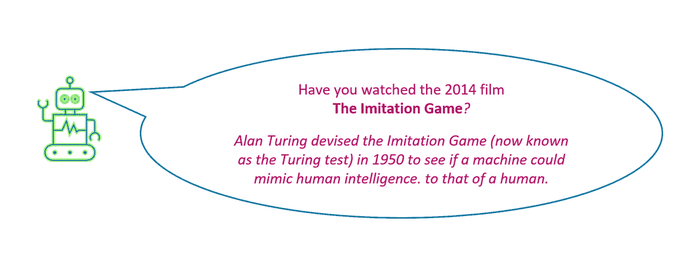
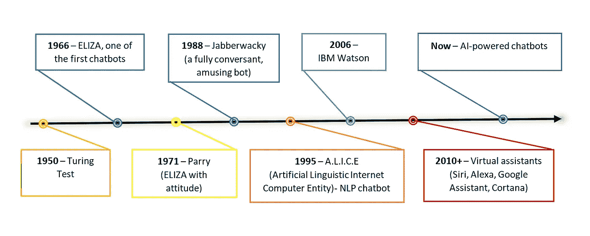
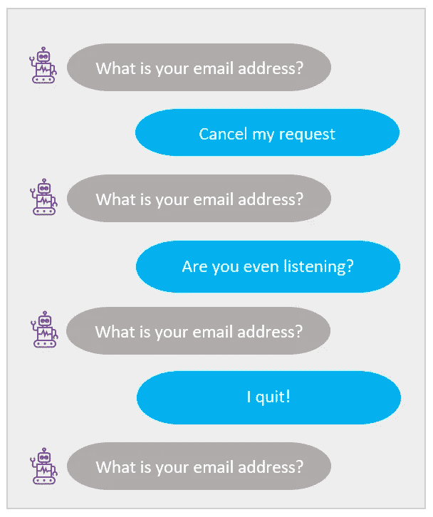

# 聊天机器人真的是未来吗？

> 原文：<https://medium.com/version-1/are-chatbots-really-the-future-9bf77d3936b9?source=collection_archive---------1----------------------->

Photo by [Priscilla Du Preez](https://unsplash.com/@priscilladupreez?utm_source=medium&utm_medium=referral) on [Unsplash](https://unsplash.com?utm_source=medium&utm_medium=referral)

你知道第一个聊天机器人诞生于 20 世纪 60 年代吗？模拟人类对话的程序已经存在很长时间了，在技术上并不新鲜！

聊天机器人现在是一种趋势，被用于从教育到娱乐的各种领域。让我们深入研究一下聊天机器人的历史。

聊天机器人的兴起:

聊天机器人已经存在了半个多世纪，但由于对话式人工智能和机器学习的发展，最近才真正流行起来。

让我们来看看聊天机器人是如何随着时间的推移而演变的。下面是一个简短的时间表:

The Chatbot Timeline

**聊天机器人革命的覆灭:**

你和聊天机器人有过不愉快的经历吗？我们大多数人都这样！
被要求重复信息或陷入“对不起，我不明白”的循环会令人沮丧。你认为这种情况为什么会一直发生？

An example for bad conversational experience

几年前，聊天机器人的人气飙升，许多人认为这是下一个大事件，是应用程序的结束和聊天机器人时代的开始。尽管最初大肆宣传，机器人失去了势头，令人失望！

应用程序和聊天机器人永远不会被比较。两者服务于不同的目的。这可能是导致他们垮台的主要原因。使用聊天机器人作为应用程序的扩展的混合方法可以提供丰富的客户体验。

另一个原因可能是，为了变得数字化和时尚，大多数公司牺牲了适当的对话设计。了解聊天机器人可以提供的价值，开展旨在获得愉快客户体验的对话，并设置限制，可以帮助创建一个成功的聊天机器人。此外，一旦它被创造出来，那就不是它的结束。这是一个基于分析学习用户行为和互动的循环过程，并不断提高聊天机器人的质量。

**进化:** 
关于聊天机器人有很多误解。消费者通常希望机器人能准确回答所有开放式问题。然而，情况可能并不总是如此！

聊天机器人的创建可能有特定的目标，以解决特定的问题并为用户提供快速响应。他们不是来取代人类的；它们是为了自动化重复的日常任务，从而节省成本和时间，人类可以将注意力转移到手头更具战略性的任务上。

他们可以为每个用户提供量身定制的交互体验，从而提高用户参与度和满意度。他们可以同时与多个用户无缝通信，并对查询提供即时响应。

随着 AI 和 ML 技术的发展，聊天机器人技术也将发展。语音和计算机视觉的巨大进步将彻底改变我们看待聊天机器人的方式。再加上复杂的说话者识别、情感分析等，他们将能够理解客户并提供更好的回应。

 [## 聊天机器人设计:要记住的 10 件事

### 你有没有遇到过单调的聊天机器人，一遍又一遍地问同样的信息，或者只在一个…

medium.com](/version-1/chatbot-design-10-things-to-keep-in-mind-553f661d683c) 

我们还有很长的路要走，要创造强大的、个性化的、高质量的对话体验，并发现与客户互动的创造性方式。但这不应该阻止我们开发聊天机器人，如果遵循正确的设计准则，并持续监控用户交互，这些聊天机器人可以增加巨大的价值。

**关于作者**

*Geethu Suresh 目前在微软工作。Net 顾问为版本 1 工作。请务必关注 Geethu，获取更多关于创新的博客。*