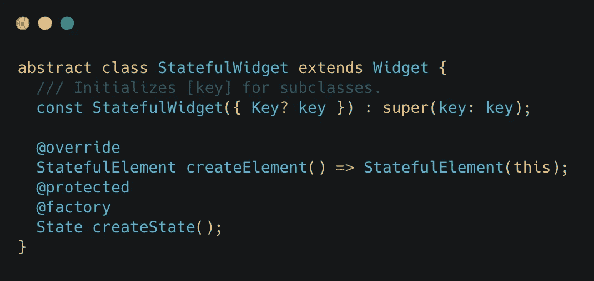
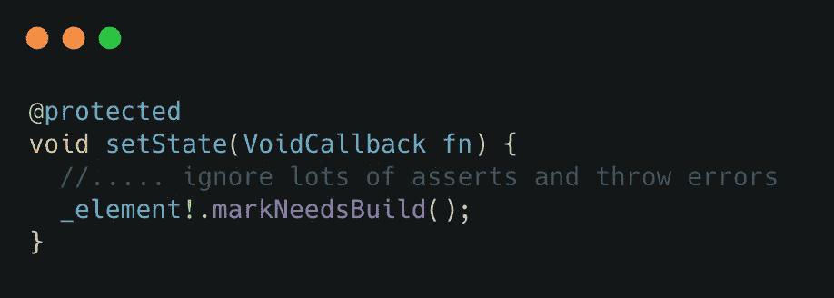
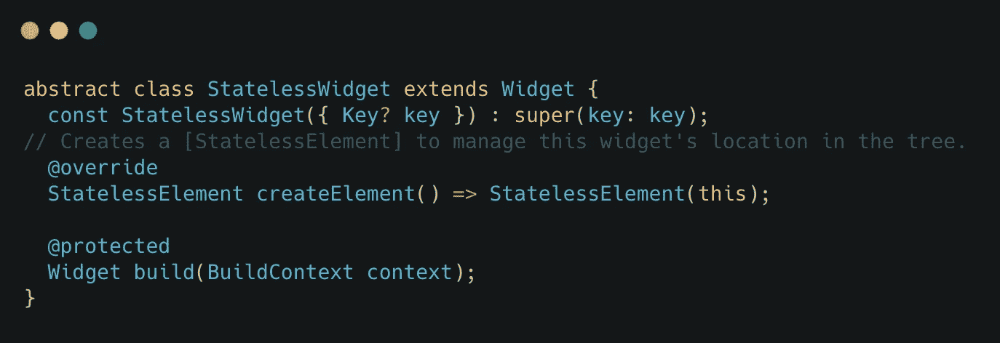
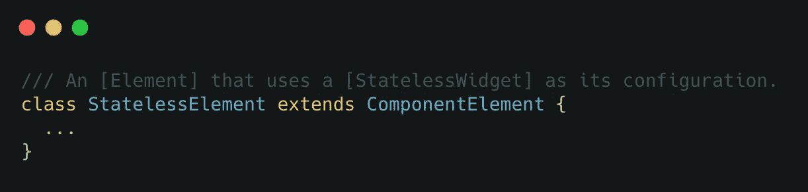
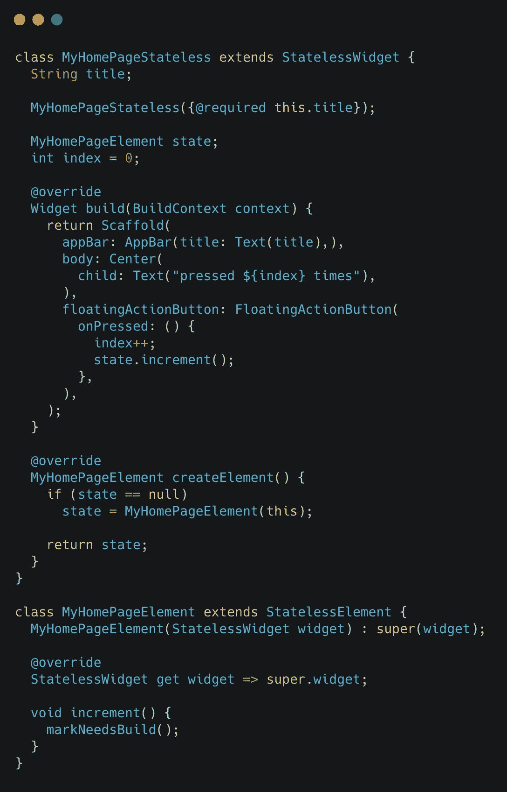
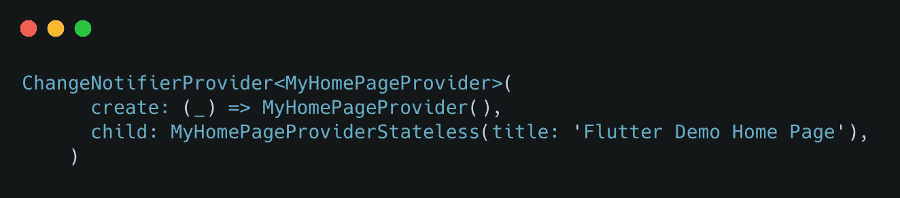
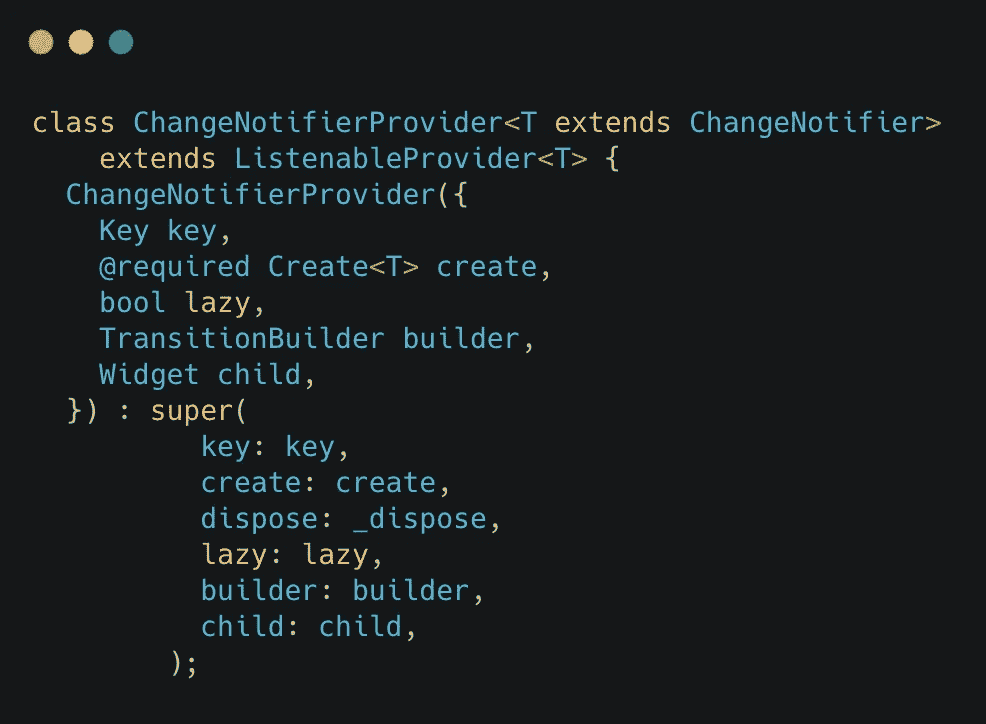
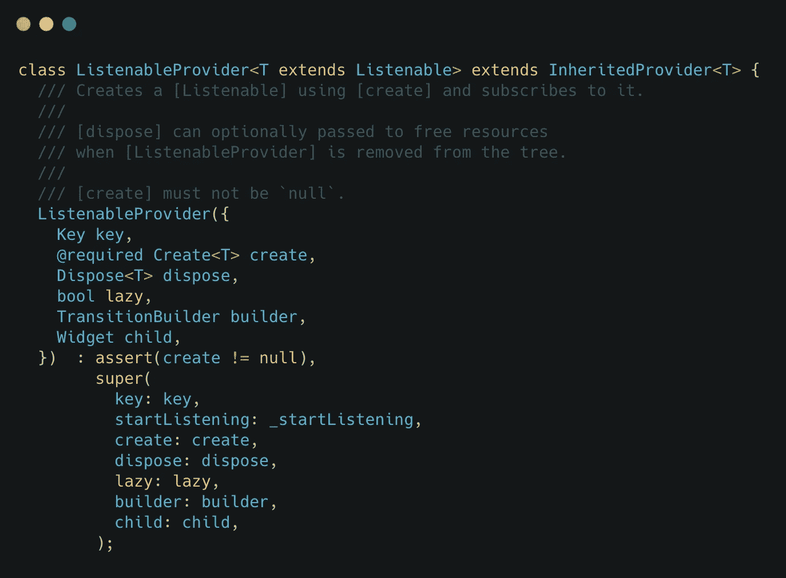
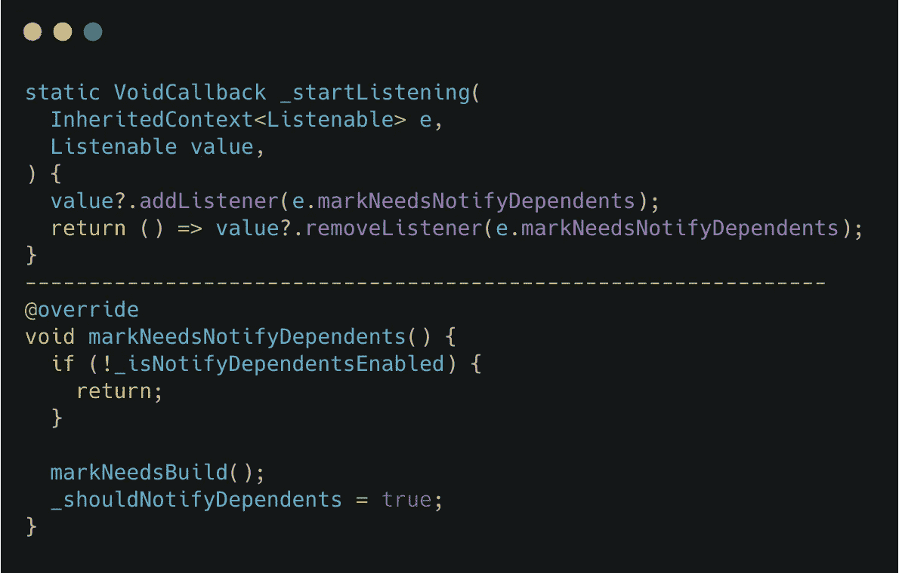

# Flutter State widgets 是错觉吗？

> 原文：<https://medium.com/globant/are-flutter-state-widgets-an-illusion-1c3b715620b7?source=collection_archive---------0----------------------->

# ***如果我说 Flutter 中只有一种 widget 类型呢？即不是无状态和 StatefulWidget 而是只有 StatefulWidget？***

继续挖掘 StatelessWidget 和 StatefulWidget 是如何工作的。让我们检查 StatefulWidget 代码:

没看到任何特别的东西！！！！奇怪。因此，当我们查看在线课程和其他资料时，他们总是给我们两种小部件类型:有状态和无状态，创建状态并调用 setState()来更新有状态小部件的屏幕，而您不能更新无状态小部件。

让我们检查 setState 的代码。

因此它转到 element 并调用来自 Element 类的 markNeedsBuild。这表明小部件已经变脏，需要重新构建。

# 什么是元素？

元素表示使用小部件来配置树中的特定位置。如果父小部件为这个位置重新构建并创建一个新的小部件，元素可能会改变。元素(可变属性)通过 [createElement()](https://api.flutter.dev/flutter/widgets/Element-class.html) 方法创建。框架调用 [mount](https://api.flutter.dev/flutter/widgets/Element/mount.html) 方法将新创建的元素添加到树中给定父节点的给定位置。

有关更多信息，请参见本[文档](https://api.flutter.dev/flutter/widgets/Element-class.html)

好的，那为什么我说只有一个小部件呢？等一下什么让我们检查无状态小部件代码

我们经常在 StatelessWidget 中编写 build 方法，因为它是抽象的，但是什么是 StatelessElement 呢？

并且这个 ComponentElement 扩展到 Element。所以一切都是相关的。

既然我们在同一个页面上，有状态和无状态小部件使用元素基于脏状态进行呈现和更新。

Stateless Widget can update by calling markNeedsBuild from Element

总而言之，如果我们比较有状态类和无状态类，它们看起来是一样的，那么为什么会有两个不同的东西呢？从我的角度来看，它可以减少开发人员在每次小部件需要数据时创建元素的问题，并对开发人员隐藏 markNeedsBuild 的真正逻辑。

但是！但是！等等，为什么知道这个很好？我们不是开源贡献者，但如果我们理解事情如何工作的本质，我们就可以。这个概念被用在 dart Provider 包中，我们几乎都用它来进行状态管理。

这里我们有 ChangeNotifierProvider，它在数据改变时通知重建子部件。

对于 ChangeNotifierProvider，它扩展了 ListenableProvider 类

检查它发送的构造函数 start listening inherited Provider，它是提供程序包类。

在 _startLitening 方法中，我们有**值？。add listener(e . markneedsnotify dependents)；** value 是一个 LinkedList，存储监听 ChangeNotifier 变化的监听器。在那个**mark needs notify dependencies**方法中，我们有一个 markNeedsBuild，它将被我们传递的子节点调用。

现在我们知道了这一点…

有两种不同的小部件类型可以降低复杂性。演示代码链接[👇](https://emojipedia.org/emoji/%F0%9F%91%87/)

 [## part hdave 93/FlutterWidgetMythDemo

### 新的颤振应用。这个项目是颤振应用的起点。一些资源让你…

github.com](https://github.com/parthdave93/FlutterWidgetMythDemo) 

希望你喜欢。

你知道你可以按拍手吗👏按钮 50 次？你走得越高，就越能激励我写更多的东西！

你好，我是帕斯·戴夫。noob 开发者和 noob 摄影师。你可以在 [Linkedin](https://in.linkedin.com/in/parth-dave-907b8177) 上找到我，或者在 [GitHub](https://github.com/parthdave93) 上跟踪我，或者在 [Twitter](https://twitter.com/the_parth_dave) 上关注我？

祝你有一个愉快的飞行日！