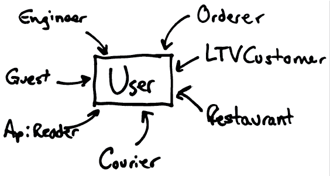

# 热狗是三明治吗？

> 原文：<https://medium.com/square-corner-blog/are-hotdogs-a-sandwich-be717e9bdc18?source=collection_archive---------4----------------------->

> 注意，我们已经行动了！如果您想继续了解 Square 的最新技术内容，请访问我们的新家[https://developer.squareup.com/blog](https://developer.squareup.com/blog)

是的。原因是一片半开或全开的面包中的蛋白质构成了三明治。好吧，那不碍事。


A sandwich. [Photo](https://www.flickr.com/photos/ddaarryynn/522885793/in/photolist-NcVJi-p2RFfR-9ZBGsT-kSgeY-a6AD7S-7x1gPw-of1KjM-2d9jAh-23gs8jH-V4suef-imarHp-3S2jF6-53fQP8-5dGrFX-2zjBmb-6nnbjF-8nbFqp-2d9r4Y-a5Xcod-aoqZR6-6R6FMR-VKz3Ad-QJ872c-4rWhSG-RUvqVf-ReNmmH-f3QvxD-22nPF9S-87AxeK-9dtUiY-VzNqLd-6oEwRJ-GN11u5-ayQgu1-ag6822-ayMr98-cHJbpq-2TQzGp-4rSeKD-6HoF1V-76N1dE-9DH28C-8iUVNB-JkQ3LC-6DBbjG-mi8UMT-dcP6PS-dbMvBr-7Y7279-dKx8Yp) by Daryn Nakhuda / [CC BY](https://creativecommons.org/licenses/by/2.0/)

关于三明治、热狗和各种食物，鱼子酱正在进行一场激烈的辩论。你可以想象，作为一家食品公司，我们会遇到各种各样有趣、古怪的食品，结果我们陷入了一场古老的关于食品是什么和不是什么的语义辩论。

当然，这是一种愚蠢的发泄情绪和享受彼此交往的方式。但是，这种语义上的争论在一个健康的、正常运作的团队中是很重要的。命名很难。这是最难做对的事情之一，而且很重要，因为它增加了团队成员之间沟通的效率，这最终决定了你发布新软件的速度。

# 命名很难

我们中的许多人在大学时就开始了自己的职业生涯，用 Java 或 Python 编写基本代码，编写代码的方式有点像这样:

```
**def** **add**(arr):
  r = 0
  **for** x **in** arr:
    r += x
  **return** r
```

写完这段代码后，我们会得到及格分数，因为代码按要求工作了。但是，在我们编写越来越多的代码后，我们发现分类和处理功能组使我们更容易理解。然后，我们将学习面向对象编程，或者至少是使用模块进行组织的概念。然后我们被介绍到某种框架，可能是像 Rails 这样的 MVC 框架，iOS SDK，或者其他一些框架。您将了解这些高级模式，如模型、视图和控制器。然后我们的代码开始扩展到这些对象中。

而且，我们在这些世界里感觉很舒服。模型是业务逻辑的归宿。视图是视图逻辑的归宿。控制器处理用户交互。如此下去，直到我们意识到我们有 1000 个线条模型和 100+列的表格。现在怎么办？

这是一个常见的故事，也是 Caviar 和 Square 的许多其他团队每天都要面对的故事。你用来走出这个世界的工具之一就是命名。但是，说起来容易，你应该给你的对象起一个合适的名字，但是很难做到。我们来举个例子。

用户对象。如果您使用 Rails，您可能会使用 device，如果您使用 device，您可能会有一个用户对象。马上，我们在一个糟糕的命名领域。什么是“用户”？他们是“使用”其他东西的人。在鱼子酱领域，这可能意味着:点餐的人、在鱼子酱工作的人、我们的快递员、工程师、API 阅读器、客人、高价值客户、创建支持案例的人等等。所有这些都是用户的有效解释。当你有这么多可以成为用户的东西时，你就稀释了用户的价值。



这样做的后果是，每当我们谈论用户时，我们都需要对其进行限定。这是一个快递用户；这是一个来宾用户；这是一个下订单的用户。这是低效和混乱的，会导致交流中的东西丢失，并最终导致错误。

# 如何给好起名

命名很重要。然而，我们如何给事物起个好名字呢？我用一些指导方针来帮助我朝着正确的方向前进。它们并不总是导致正确的答案，但是这些规则是一个很好的起点。

# 避免常见的名字

在软件开发中，有一些我们到处都在使用的名字，它们积累了意义。上面的用户对象就是一个很好的例子。通过将它命名为 User，就隐含了大量直接应用于它的含义。通过避免这些名字，你可以挑战自己去思考你真正描述的是什么。我从绵羊和奶酪邮件列表的一群虚拟朋友那里做了一个快速调查，同时也调查了一些 Square 工程师，下面是我们得出的一个列表:

*   用户
*   命令
*   助手
*   实用工具
*   冲动
*   豆
*   交易
*   经理
*   控制器
*   视图控制器
*   语境
*   [计]选项
*   以“get”开头的函数
*   o，obj，v，val
*   小部件
*   元素
*   资源
*   配置
*   命令
*   摘要*
*   调解人
*   客户
*   服务
*   助手
*   情况
*   请求
*   班级/班级

这些普通的名字有一种天然的“引力”，当它们变得越来越大时，就把代码拉向它们。如果可以的话，避免使用这些名字，这样你就解决了一大堆问题。

# 使用领域语言

命名灵感的一个来源应该来自你工作的领域。其中一些是显而易见的:在 Caviar，我们在代码库中将快递员的表示称为快递员，而不是像司机或送货用户这样的其他东西。不过，这种灵感可能以一些不明显的方式出现。当我们开始为餐馆印刷时，我们开始称这些为收据。但是，我们很快意识到餐馆称之为门票。因此，我们将收据更名为门票，以与餐馆相匹配，并创造一种更强的共同语言。

与您的领域和利益相关者使用共同的语言减少了你们每个人必须做的上下文切换的数量。这意味着你可以花更多的时间解决问题，花更少的时间争论语义。

# 依靠模式语言

我们最近看了很多 Ruby Tapas，Avdi 也讲了很多关于模式语言的内容:

> “模式语言是一套互补的思想形式，帮助一些人解决问题。”— Avdi Grimm，[图案是给人看的](http://www.virtuouscode.com/2015/03/11/patterns-are-for-people/)

Avdi 是对的。软件行业中有很多人都遇到了和你现在一样的命名问题。幸运的是，其中一些人花时间将这些命名对话写在书或文章中。利用这些资源——尤其是在描述一个类在技术上做什么的时候！

David Heinemeier Hansson 在构建 Rails 时，身边有一份企业架构模式的副本，帮助他完成艰难的命名决策，最终成为 ActiveRecord、ActionController、ActionView 等。要考虑的其他模式语言:

*   [四人帮](https://www.amazon.com/Design-Patterns-Elements-Reusable-Object-Oriented/dp/0201633612)
*   [用 Ruby](https://www.amazon.com/Design-Patterns-Ruby-Russ-Olsen/dp/0321490452) 设计模式(如果你是 Ruby 爱好者，用这个代替 GoF 书)
*   [重构模式](https://www.amazon.com/Refactoring-Patterns-Joshua-Kerievsky/dp/0321213351)
*   [实现模式](https://www.amazon.com/Implementation-Patterns-Kent-Beck/dp/0321413091)
*   [有效地处理遗留代码](https://www.amazon.com/Working-Effectively-Legacy-Michael-Feathers/dp/0131177052)(讨论用于处理遗留代码的关键模式)
*   使用您使用的框架中定义的模式语言。铁轨，弹簧，药剂，反应等等。都会嵌入模式语言。重用模式语言，它是你正在使用的框架的一部分！
*   在你可能没有使用的流行开源项目中寻找灵感。谈论在 Ruby 代码库中使用 Swift 可选类型作为灵感来源是非常好的。

# 避免重复

这是一个小规则，但是它使得代码更容易阅读。在任何给定的上下文中，尝试删除重复。这可以通过一系列例子得到最好的解释:

```
**class** **Restaurant**
  **attr_reader** :restaurant_special_notes, :restaurant_prep_time **def** **initialize**(restaurant_special_notes:, restaurant_prep_time:)
    @restaurant_special_notes = restaurant_special_notes
    @restaurant_prep_time = restaurant_prep_time
  **end**
**end**
```

在这个例子中,“餐馆”这个词出现了 9 次——太多了。在这节课中，我们已经知道一切都与餐馆有关。因此，我们可以通过从实例变量中删除这些名称来减少重复。

```
**class** **Restaurant**
  **attr_reader** :special_notes, :prep_time **def** **initialize**(special_notes:, prep_time:)
    @special_notes = special_notes
    @prep_time = prep_time
  **end**
**end**
```

而且，在我看来，这是更干净，更容易阅读。

# 简洁更好

对于用 Java 编写的应用程序中容易出现的对象名称，Java 编程语言一直受到批评。有点言过其实，但是公平。又长又复杂的名字更难读。额外的单词或字符会降低阅读速度。描述性的名字很好，但是复杂的名字会妨碍阅读。

# 避免缩写

缩略语是最糟糕的行话。它们是不透明的，缺乏描述，并且通常没有上下文。人们使用它们是因为高度技术性的术语一遍又一遍地说起来会很麻烦。然而，我们编写的代码会被多种类型的人反复阅读。所以，我们应该为了清晰和理解而优化，而不是为了写作的方便。

# 让它睡一夜，然后继续前进

有时你不得不加入一个你不喜欢的名字。与你的搭档或团队一起集思广益，想出一个更好的名字，但要给它一个时间限制。如果 5 分钟后你还没有想出一个好名字，去散散步，喝杯咖啡，看看会发生什么。

# 好听又别扭的名字

有时候，名字很尴尬。这些名字，乍一看，可能因为名字的别扭，显得不太清楚。然而，我们需要将这些名字放在上下文中，并询问他们是否在做他们的工作:向读者传达适当层次的意义。

有时候，别扭的名字之所以那样，是因为代码别扭。它并不简单，代表了一个复杂的概念。很难想出准确的名字。我们的代码库的一个例子是一个 courier 作业的存储库，我们需要获取处于“就绪”状态的作业，但是还没有以任何方式被分配或操作。

我们为此绞尽脑汁，想出了一个尴尬的名字:吉祥 _ 工作 _ 实现(fulfillment)。在正常情况下，吉祥这个词似乎是不合时宜和尴尬的。但是，它准确地表达了这个概念，并向代码读者发出信号，表明这个逻辑比您可能期望的要有趣，所以深入研究一下，并确保您理解使用这个方法的含义。

另一个名字可能是“new_jobs_for_fulfillment”或“ready_jobs_for_fulfillment ”,但这些名字只能抓住其中的一部分含义，可能会将未来的开发人员引入歧途。新工作、准备好的工作和确认的工作都有特定的含义，但它们都意味着“还没有被分配给快递员”，因此吉祥的总括术语虽然尴尬，但却准确地抓住了这一含义。

# 好名字意味着更高的生产率

所有这些指导方针和建议都意味着一件事:更快的团队。当您的团队能够轻松有效地交流高级概念时，他们可以更快地解决问题，而不必重新设置并确保每个人都在同一页面上，可以更快地阅读和理解代码，并在更短的时间内发现问题。

**在你的工程实践中建立良好的命名会对你和你的团队产生巨大的影响**。五分钟搞定；在那些情况下，它需要更长的时间，这是因为这个概念很难描述，值得关注。一开始就把名字钉上，以后就会有回报。

循环回到起点:我们如何以不同的方式处理这个问题？会有什么影响？嗯，我们首先认识到，当我们创建用户时，它意味着是一个“用餐者”(订购鱼子酱食品的顾客)。如果我们一开始就给这个对象命名为 Diner，那么我们会遇到一些有趣的对话。

当我们引入角色和管理权限时，将它们附加到 Diner 对象上是很奇怪的。但是，因为我们有了用户对象，所以我们对此并不感到尴尬。所以这些功能就落到了用户身上。当快递员需要登录时，我们对拥有快递员凭证和用户对象信息并不感到奇怪，因为快递员显然是用户。所以，在那个物体上，那些特征消失了。诸如此类。

相反，通过从一开始就命名 User -> Diner，我们可以避免代码的大量合并和复杂，创建更多可隔离的概念，并从长远来看为我们建立更好的架构。我们已经花了一些时间来解构用户对象，但是我们还有很长的路要走。如果你能在一开始就避免这些错误，你就能避免一大堆的工作来理清你的概念和名字。

# 热狗是三明治

是啊，很尴尬。但这是正确的。至少对于这个背景，这个时间，这个团队来说。我们应该继续谈论它，并确保随着时间的推移，命名对我们有用。有可能(尽管，说实话，不太可能)热狗在未来不再是三明治。这可能是因为我们对三明治选择了不同的定义。

命名很难。这些对话永远不会完整。但是它们非常重要，团队可以利用它们来不断提高生产力。如果你正在进行高效的对话，每个人都用少量的词语理解复杂的概念，你可以加快找到解决方案的速度。