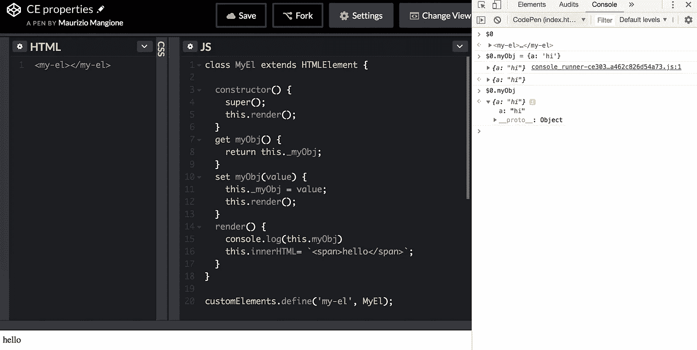

# Web 组件是一个东西吗？

> 原文：<https://medium.com/google-developer-experts/are-web-components-a-thing-5a116b1da7e4?source=collection_archive---------2----------------------->

“brown block lot” by [Tim Johnson](https://unsplash.com/@mangofantasy?utm_source=medium&utm_medium=referral) on [Unsplash](https://unsplash.com?utm_source=medium&utm_medium=referral)

在与不太喜欢 Web 组件的人交谈时，我发现他们觉得 Web 组件不会有任何发展。这可能是因为他们有一个巨大的炒作，因为，比方说，一年前，但没有在过去几个月。

对于那些关注的人来说，最近出现了一个非常重要的消息。首先，微软宣布他们开始致力于自定义元素和影子 DOM 的实现。这是一件大事，因为从几周前开始，Edge 团队就没有任何迹象了。
Firefox 中的支持终于在今天登陆了 63 版本！在我看来，未来看起来非常光明。

尽管 Web 组件规范已经存在很多年了，但是似乎很多开发人员都没有掌握这个标准的基础。围绕这个规范有很多误解和神话。让我们试着澄清一些方面。

# 不能将对象作为属性传递(对还是错？)

我看了这条推文后感到很困惑，因为我意识到即使是经验开发者也不明白自定义元素是如何工作的。我并不是说他们必须喜欢它们，但是你不能将一个对象作为属性传递，这完全是一个**错误的**陈述。那么，我如何将一个对象作为属性传递呢？简答:via *属性*！:)
看看下面这张图，你会有更好的想法。

Property values are managed with getters and setters

在上面的例子中，我们定义了一个包含名为 myObj 的属性的自定义元素。要将对象传递给属性，首先需要选择元素

`let el = document.querySelector('my-el')`

然后使用点符号赋值，在本例中是一个标准对象

`el.myObj = {a: 'test'}`

就是这样。

You can test it by yourself

# 为什么人们仍然对此感到困惑？

问题是大多数开发人员谈论'*属性'*，而他们实际上指的是'*属性'。*这两者可以相互关联，例如，我可以将属性反射到属性，但这并不总是需要的。

对于属性，您只能传递字符串或将其用作布尔值。在后一种情况下，如果属性存在，则返回 true，否则返回 false。
说清楚一点，在下面的例子中 **att === true** 。

`<my-component att="false"></my-component>`

是误导还是不符合人体工程学？你可以对此有自己的看法，但这就是 HTML 的工作方式。在我看来，这是*一贯*。

# 自定义元素的 API 不好吗？

有些人抱怨自定义元素 API 的冗长，他们认为这是完全无用的，设计糟糕。
此处赘言部分属实。以 Codepen 为例，假设您有十个属性，而不是一个。你最终会得到 10 个 getter 和 10 个 setter，在大多数情况下，它们只是在属性名称上有所不同，但是它们为每个属性做了相同的事情。
这个不方便肯定，另一方面我也不认为这代表 API 不好。
这是一个低级 API，直接使用它并不总是很方便，但是你可以在它的基础上构建。你不需要开发一个完整的框架或者库，你只需要写一些抽象就可以了。如果你不想自己做抽象，试试[超 HTML 元素](https://github.com/WebReflection/hyperHTML-Element)或 [lit 元素](https://github.com/Polymer/lit-element)它们很棒！

也就是说，如果你仍然将 Web 组件与 React、Vue、Polymer 或其他框架进行比较，你就没有抓住要点，说实话，这是不公平的。

# Web 组件可以在任何地方工作

不幸的是，这种说法不太准确。这确实是 Web 组件的一大承诺，但是事情并不总是无缝地工作。
如果你想了解更多关于 Web 组件、库和框架之间的互操作性，我强烈建议你看看由 [Rob Dodson](https://medium.com/u/d712d6fb229b?source=post_page-----5a116b1da7e4--------------------------------) 撰写的[Custom Element Everywhere](https://custom-elements-everywhere.com/)。你会发现它们在哪里工作，在哪里不工作，以及潜在的解决方法。

# 那么，Web 组件是一个东西吗？

在我看来，是的，绝对是。也许它们不适合你，但这并不意味着它们不好或没用。我认为这是开始使用自定义元素和阴影 DOM 的好时机。深入了解 Web 组件可能会有助于改变你的想法，以防你仍然对这个标准持怀疑态度。

如果你对这个话题感兴趣，并且想保持联系，[在 Twitter 上关注我。](https://twitter.com/granze)