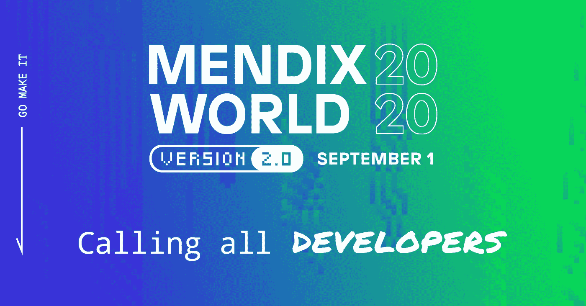

# 你是开发商吗？那么这些是给你的 Mendix 世界会议

> 原文：<https://medium.com/mendix/are-you-a-developer-then-these-are-the-mendix-world-sessions-for-you-5f0169204367?source=collection_archive---------3----------------------->

你好。感谢你点击链接阅读这篇博客。我叫 Willem van Zantvoort，是 Mendix MVP 和 TimeSeries 的高级顾问。过去六年来，我一直在用 Mendix 为各种各样的公司开发应用程序，从金融到能源，从物流到医疗保健。我也是 Mendix World (2016 年)黑客马拉松的获胜者，喜欢在我们的 [YouTube](https://www.youtube.com/channel/UCcDcES7l-TgjvzcC7OXI8-A) 和 [Twitch](https://www.twitch.tv/amoladofficial) 频道上分享知识。

在与 Mendix 合作期间，我有机会参加了多个版本的 Mendix World。第一次去是在 2014 年。我是一名实习生，只有几周的平台经验。这是一个相对较小的活动，大约有 1500 人参加，几乎可以认识社区中的所有其他开发人员。我记得最清楚的是 Mendix 5 的发布，以及所有开发人员对呈现给我们的新可能性感到的兴奋。

也正是这一点让 Mendix World 成为我的必去之地。和一群志同道合的人在一起，看到在不久的将来可能发生的事情。在宣布 Mendix World 2020 的那一刻，我感到兴奋的是，只需再等一年(而不是前两年)，就可以获得另一批令人惊叹的新功能，让我的工作变得更有趣！不幸的是，今年出现了一些全球性的挑战，Mendix World 被取消了。

然而，作为一家创新型公司，Mendix 决定推出全新 2.0 版的 Mendix World 2020，实现完全数字化！我们必须现实一点，接受这将不是我们所习惯的那种门德克斯世界。请注意，这不一定是一件坏事！显然，我会怀念与你们所有人面对面交流的时光。

但另一方面，我可以在自己舒适的沙发上，随时观看最令人期待的会议和演示。我也在考虑和同事们组织一些数字观看派对，为这个精彩的活动添加缺失的社交方面，我邀请你们所有人也这样做，并与其他读者和我分享这些想法！

以下是我最想参加的 5 个会议，以及为什么我认为其他开发人员也不应该错过这些会议！

**1。**[**CTO Johan den Haan**](https://www.mendix.com/mendix-world/?utm_medium=referral&utm_source=CommunityBlog&utm_campaign=GL-CE-2020-09-01-Mendix-World)

我能很好地回忆起约翰去年热情洋溢的开场白。 ***“你好 Mendix 世界！”***Studio 和 Studio Pro 中的新技术创新和功能是本次会议的主题*。*

一如既往，我最期待的环节是 Johan 的主题演讲。通常，这是在活动的第二天，我们都从前一天开始大肆宣传，只是为了让 Johan 的新闻超过这一天。我期待着许多关于 Studio Pro 的新信息，新功能以及该平台的生活质量改善。期待一个拥挤的时刻，它一定会让我们所有人充满活力！

**2。** [**为全天候使用而设计:Danny Roest**](https://www.mendix.com/mendix-world/?utm_medium=referral&utm_source=CommunityBlog&utm_campaign=GL-CE-2020-09-01-Mendix-World) 首次开发离线移动应用

*无论是您的客户在上下班途中通过隧道，还是现场服务员工在“死区”中，使用离线优先的方法开发您的应用程序，无论他们是否连接，您的移动应用程序都可以同样地工作。”*

越来越多的时候，我听到对离线移动应用程序的需求。它已经存在了一段时间，我觉得它已经解决了所有的初期问题(不确定这是否从荷兰语翻译过来，但我希望你能理解要点)。考虑到这一点，我很高兴看到最新的，并了解其他人已经建立了什么和我们应该采用什么最佳实践。

**3。** [**利用 Simon Black 和 Dave Brault 的多经验开发构建更好的客户应用**](https://www.mendix.com/mendix-world/?utm_medium=referral&utm_source=CommunityBlog&utm_campaign=GL-CE-2020-09-01-Mendix-World)

*“多体验应用的前景是惊人的:能够通过量身定制的应用为每个客户和员工的接触点调整和连接最佳的用户体验，使用户旅程中的每一次交互都毫不费力。”*

很容易让像我这样的人对新技术充满热情，这就是为什么我选择这个会议作为我必须参加的会议之一。作为用户，我们越来越习惯于使用语音助手、原生应用和聊天机器人(仅举几例)，用 Mendix 构建这些体验变得更容易只是时间问题。当然，这些事情中的一些已经是可能的，但看到门迪克斯对此的看法总是令人愉快的。去年，我们已经看到了 Mendix 和增强现实，而且事情从那以后变得越来越好！

**4。**[**Andrej Koelewijn 和 Jon Scolamiero**](https://www.mendix.com/mendix-world/?utm_medium=referral&utm_source=CommunityBlog&utm_campaign=GL-CE-2020-09-01-Mendix-World) 用您需要的数据做事情

"*数据集成对于完成工作来说可能是一场噩梦。您在组织内查找和共享数据的工具和流程可能会支离破碎，甚至不一致。”*

有人说数据中枢吗？！是的，请！尽管在会议标题中没有提到“数据中心”，但如果你阅读会议议程，你会发现它明显暗示了这一点。几周前，我有幸第一次看到了 Mendix 在 Studio Pro 中构建的东西，让我告诉你…它看起来非常有前途！我希望其中一个(或两个)主题演讲也能涉及数据中心，但我也希望本次会议能更深入地探讨这个主题。

**5。**[**【React Native 入门】作者 Danny Roest**](https://www.mendix.com/mendix-world/?utm_medium=referral&utm_source=CommunityBlog&utm_campaign=GL-CE-2020-09-01-Mendix-World)

"*参加本专题讲座，了解 React Native 为何是一项需要了解的重要技能，以及 Mendix 如何帮助所有背景的开发人员使用低级代码构建 React Native 应用程序。"*

这是我 5 强中的最后一个环节，对我来说是一个自然的选择。多年来我一直在说，React Native 是一个全面的 Mendix 开发人员应该具备的下一个技能之一，随着这些年的过去，我看到它一次又一次地得到验证。我很高兴能更多地了解 Danny(和 Mendix)对这个话题的看法。

我希望这篇博客提供了丰富的信息，如果没有，至少你读得很好。联系我让我知道你的想法！

你可以在 Mendix 社区 Slack @willemvanzantvoort 上找到我，但是你得先[注册](https://www.mendix.com/mendix-world/?utm_medium=referral&utm_source=CommunityBlog&utm_campaign=GL-CE-2020-09-01-Mendix-World)。注册与我和成千上万的其他开发者取得联系。那里见！