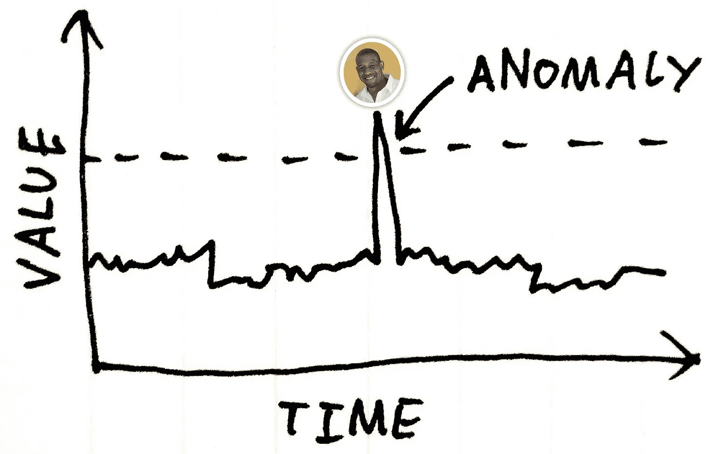
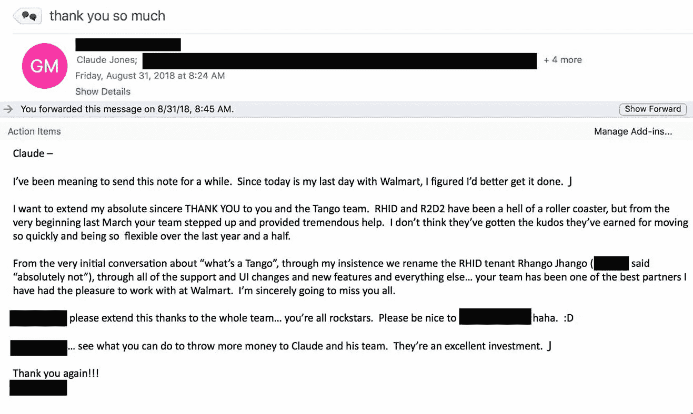

# 你是个异类吗？我是，原因如下。

> 原文：<https://medium.com/walmartglobaltech/are-you-an-anomaly-i-am-and-heres-why-541a77297fce?source=collection_archive---------2----------------------->

# **我是一个异类**

嗨，我叫克劳德·琼斯。我是个异类。

我知道这个消息可能会让一些人感到震惊，但是相信我，没关系。我开始意识到，和其他人相比，我的大脑在处理生活挑战方面的功能有点不同。

我花了一段时间来承认和接受我的“状况”，但一旦我这样做了，它给了我公开谈论我的处境的力量。

Image Credit: [YiorgosGR](https://www.istockphoto.com/photo/uniqueness-difference-individuality-and-standing-out-from-the-crowd-concept-gm615829998-106952537)

# **挑战现状**

截至 2018 年 8 月 28 日，我在沃尔玛实验室工作了 6 周年。在我 2190 天的职业生涯中，我逐渐意识到人们不喜欢改变！他们选择安顿下来，慢慢适应他们的环境，重复着咒语:*“如果它没坏，就不要修理它。”*

但是，如果东西坏了，并开始导致效率低下，浪费您、团队、公司和客户的时间和金钱，该怎么办呢？

如果 ***你*** 意识到这一点会怎么样。你会:

(A)心甘情愿地继续做同样的事情，一路抱怨？

或者

(B)表明立场，做出必要的改变，挑战现状？

如果你回答(B)，你我的朋友可能是一个异常。

Image Credit: [BrianAJackson](https://www.istockphoto.com/photo/searching-for-real-estate-house-or-new-home-gm807298046-130808171)

# **异常的症状**

有三种方法可以收缩异常行为:

# 1——你生来就有这种情况

# 2——你总是模仿一个不正常的人的行为

#3 —你练习以解决方案为导向的思维

现在，下一个逻辑问题可能是，*“我如何知道我是否是一个异常者？”*。要找到答案，请查看下面列出的症状。

## *症状#1:你对*病症过敏

> 根本原因:你通过为现实的目标提供明确的方向来组织混乱。

在团队环境中，你通常是理性的代言人，挑战他人在做决定时的客观思考吗？

如果是这样，你可能是个异类。

## *症状#2:你沉迷于自我提升*

> 根本原因:你工作更聪明，不断学习，为未来做准备。

当你开始感到自满时，你是否有强烈的愿望去提高自己的技能，积极主动地接受新的挑战？

如果是这样，你可能是个异类。

## 症状#3:你习惯于设定更高的工作标准

> 根本原因:你注重质量而不是数量。

当你遇到工作场所的挑战时，你是否在没有认可的情况下追求卓越，以确保最终产品是有价值的？

如果是这样，你可能是个异类。

Image Credit: [kieferpix](https://www.istockphoto.com/photo/hand-holding-beautiful-heart-up-to-the-sky-gm817147776-132757715)

# **治愈异常行为**

不幸的是，对于行为异常的人没有已知的治疗方法。

对我个人来说，我学会了拥抱我的症状。在这样做的时候，我的异常行为开始像传染病一样蔓延到其他人(也就是我的团队)。例如，这是我收到的一封电子邮件，是我的一个客户发来的，他受到了我的团队的异常行为的影响。

注意，如果你的心脏不好，请跳过这一部分。

Side effects of anomalous behavior

Image Credit: [phototechno](https://www.istockphoto.com/photo/leadership-concepts-gm943960736-257879051)

# **成为异类，意味着成为领导者**

读完这篇文章后，如果你意识到自己是个异类，请不要惊慌。

为了帮助调整，在以下方面保持真实和一致:

#1 —努力成为不满足现状的人

#2—选择保持敏锐和专注，提高你的个人能力

# 3——继续努力，为他人树立榜样

拥抱这些异常的品质会让你感到孤立。但随着时间的推移，异常将成为常态，你将被视为一个变革的领导者。