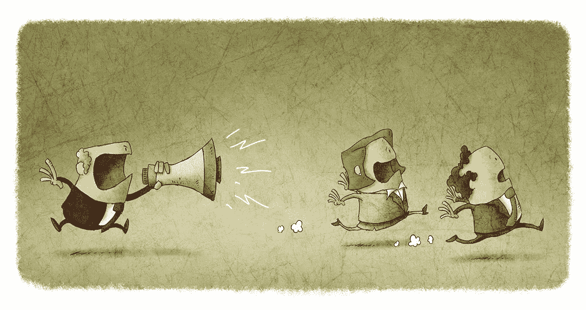
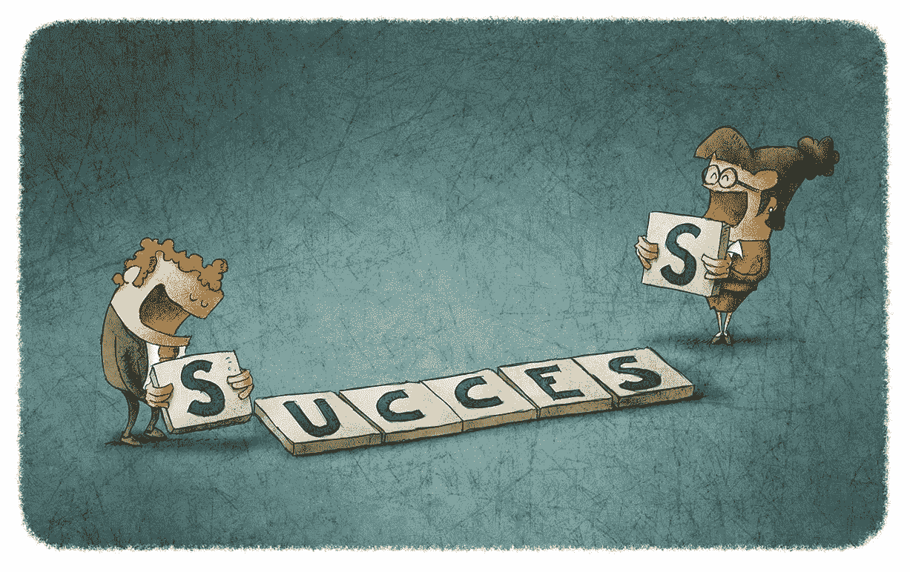

# 你是一个有效的授权者吗？现在就找出答案。

> 原文：<https://medium.com/walmartglobaltech/are-you-an-effective-delegator-find-out-now-bb27e60f138?source=collection_archive---------4----------------------->

Image Credit — [Jrcasas](https://www.istockphoto.com/vector/boss-scolding-his-employees-and-these-will-run-gm537435365-56618418)

你是一个有效的授权者吗？让我们做一个简单的测试来找出答案。

首先，请阅读下面的每个问题，并确定是否有任何情况适用于您。

## #1 你是否发现自己压力很大，花费额外的时间来完成日常任务？

你有多频繁地感觉到别人没有掌控他们的工作，而你需要介入并收拾残局？

## #2 你是否发现自己总是错过截止日期或产生平庸的结果？

*你有多少次发现自己“试图做所有的事情”却最终功亏一篑？*

## #3 你是否发现自己对他人进行微观管理，或者觉得他们没有能力完成任务？

*你有多少次觉得自己完成任务比相信别人的帮助更容易？*

如果你对这些问题中的一个或多个回答“是”，你并不孤单。

“正确地”委派任务是一项需要经验和纪律来掌握的技能。为了有所帮助，我整理了这个指南作为参考，概述了关键的好处、所需的技能和一些有效授权的有用提示。

Image Credit — [Jrcasas](https://www.istockphoto.com/vector/success-gm475109128-64382095)

# 有效授权的基础

有效的授权可以提炼为两个基本技能:自我意识和沟通。在本节中，我们将回顾每项技能，强调关键的注意事项。

# **自我意识**

意识到你作为委托人想要的控制权与需要放弃给被委托人的控制权的能力。

Image Credit — [Jrcasas](https://www.istockphoto.com/vector/man-is-thinking-while-some-questions-come-out-of-his-head-gm847311064-139018551)

## 该做的和不该做的

> 做:仔细考虑你能交给别人什么不要:一次委派太多

> 做:选择与个人职业目标一致的任务
> 不:委派给错误的人

> 做:找出提供持续发展机会的指导和导师的方法
> 不要:将委派视为一次性事件

> 做:实践适应性领导
> 不要:在整个过程中不调整你的领导风格就授权

> 做:学会从远处信任和支持
> 不要:不提供适当的自主权就授权

# **通信**

清楚地阐明角色、职责、目标、时间表和预期结果的能力。

Image Credit — [Jrcasas](https://www.istockphoto.com/vector/boss-with-employee-gm475752039-34195258)

## 该做的和不该做的

> 一定要:阐明为什么这项任务很重要
> 不要:指望别人能读懂你的想法

> 待办事项:在截止日期前完成任务
> 不要:委派没有截止日期的任务

> 做:概述成功是什么样的
> 不要:委派任务而不解释为什么必须完成某件事

> 做:讨论确保成功需要哪些资源
> 不要:只向下委派，不要向上或横向委派

> 做:建立定期检查来监控进展
> 不要:委派而不跟进

授权的艺术是一段旅程。记住要有自知之明，避免对他人或情况的过度批评，同时不断交流，提供明确的方向和指导。如果你掌握了这两种技能，你将会收获授权的好处。

Image Credit — [Jrcasas](https://www.istockphoto.com/vector/people-as-pieces-of-a-business-puzzle-gm465782083-33367900)

# **授权的好处**

如果处理得当，授权可以对工作场所的文化产生积极的影响。在这一部分，我们将回顾授权的三个好处，以及它们对你所接触的个人的影响。

## **效率:**想减轻压力？

将工作委派给技能更适合该任务的团队成员。这将保持团队的生产力，让你有时间专注于未来的计划和战略。

## **发展**:想建立信任？

鼓励团队成员成为专家，即使这意味着他们可能会超越你的能力。这不仅会加强领导和团队成员之间的关系，还会确保团队的整体成功。

## **赋权**:想促进问责？

通过辅导和指导对团队成员进行投资，帮助他们学习新技能，然后委派任务，让他们使用这些新技能。这将鼓励他们对自己的发展产生兴趣，从而学习和成长。

如你所见，授权有它的好处。作为一名领导者，掌握这项技能可以极大地提高团队的整体福祉。

你还和我在一起吗？太好了！最后一部分把所有的东西都放在一起，涵盖了 9 种你可以像专业人士一样授权的技巧。

Image Credit — [Jrcasas](https://www.istockphoto.com/vector/woman-boss-with-employees-gm480347071-36151380)

# **通过掌握这些技巧，像专家一样委派任务**

现在你已经有了基础知识，是时候运用这些知识了。

前伦敦学校专员蒂姆·布里格豪斯(Tim Brighouse)定义了九级授权，每一级代表授权者给予被授权者的自主程度。诀窍是知道什么时候使用每个级别。这就是自我意识和沟通的来源。

让我们更详细地看一看每一个。

**一级:**调查这个问题。告诉我所有的事实。我将决定做什么。

**第 2 级:**让我知道可用的选项以及每个选项的优缺点。我将决定选择什么。

**第 3 级:**让我知道你的推荐标准，你已经确定了哪些替代方案，以及哪一个对你来说是最好的，并有任何风险。我会做决定。

**第 4 级:**推荐一个行动方案供我批准。

让我知道你打算做什么。推迟行动直到我批准。

让我知道你打算做什么。除非我说不做，否则就做吧。

**第七关:**采取行动。让我知道你做了什么。让我知道结果如何。

**第八关:**采取行动。只有在行动不成功时才与我沟通。

**第九关:**采取行动。没有必要与我进一步沟通。

提示:练习使用不同级别的委托是一个好主意，这样你就可以熟悉每一种委托所需的语言类型，并且能够交替使用它们。这样做将使你能够调整你的风格，以适应情况和你要委托的人。

让我们看一个例子。

# **恰当的例子**

在本例中，我们将使用三种不同的委托级别来查看一个场景。

**场景:**你刚刚给了你的员工一套要求，需要他们在即将到来的员工会议上完成一项关键任务。

> 使用**一级委托**，你说，‘请检查需求。回来告诉我你认为完成这项任务需要多长时间，然后我可以决定你是否有时间在员工会议前完成它。

这种方法没有给员工留下太多的回旋余地，也没有给他们太多的机会来发展自己的技能或掌控自己的生活。

> 使用**第 6 级委托**，你可能会说‘请检查需求，回来告诉我你什么时候认为你可能能够完成任务。一旦你告诉我你打算什么时候做这件事，我希望你马上去做。

这种方法确保了任务中的伙伴关系以及任务完成的时间。你以后可能需要提醒他们，但是你提醒他们的是他们对你的承诺，而不是你给他们的命令。控制权是共享的。

> 使用**第 9 级委托**，你可能会说‘你需要审查这些要求，我不介意你什么时候这样做，但必须在本周五即将召开的员工会议之前完成。’

你高度信任你的员工会按照你的要求去做。这种程度的授权并没有给你任何机会说“你做完了吗？”，因为你已经给了你的员工充分的自主权。只要他们按时完成，一切都没问题。

Reaching the finish line — [Jrcasas](https://www.istockphoto.com/vector/reaching-the-finish-line-gm601012574-103333117)

# **包装**

如果使用得当，授权可以成为一个强有力的工具。关键是知道何时以及如何授权。

通过磨练你的自我意识和沟通技巧，你将很快掌握授权的九个层次。结果，你会开始看到你的团队和组织中压力减少了，信任和责任增加了。

现在你还在等什么？获得授权！

## **参考文献:**

*   [https://www . dumb little man . com/13-warning-signs-that-what-youve/](https://www.dumblittleman.com/13-warning-signs-that-what-youve/)
*   你需要的技能电子书——领导技能:发展你需要的领导技能