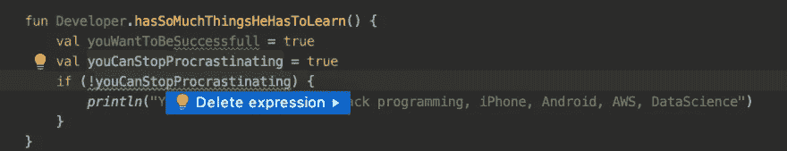

# 你感到不知所措吗？重构你的假设

> 原文：<https://blog.kotlin-academy.com/are-you-feeling-overwhelmed-refactor-your-assumptions-fc77804a0b02?source=collection_archive---------3----------------------->

克服与科特林和 IntelliJ 错过的恐惧。

作为一名开发者，**最好的事情是什么？总有新的东西要学。协程！流动！作曲！Kodein DB！Ktor！箭头！Kotest！**

作为一名开发者最糟糕的事情是什么？总有新的东西要学。协程！流动！作曲！Kodein DB！Ktor！Kotest！

我最近看过的最好的演讲之一是 Kitze 的**炒作驱动的开发**。它分析了推特引发的对错过的恐惧是如何让我们变得疯狂的。我相信我的大多数读者都会有同感:

程序员生活中的一个简单事实是，我们从来不知道也永远不会知道所有最新的语言、技术和框架。

而且，在情感上，我们没有意识到我们不需要意识到。

这种疯狂来自一个好地方:*想知道更多的欲望。*

这是优秀开发者的标志。

但是它也有黑暗的一面。

# 持久的压力会让你生病

压力是大自然发明的，用来帮助你在危险的情况下生存。压力有助于在高速公路上躲避捕食者和事故，甚至可以挽救生命。但是它必须被释放，否则你会生病的。

帮助你避免危险的压力峰值是好的。

另一方面，处于永久的生存模式是不好的。

问题不在于我们如何“管理”持久的压力，而在于我们如何消除它。

答案是:重构你的内部对话。

# 内部对话

如果我不得不猜测当你像这样强调时，你的内部对话是什么，它看起来像这样:

Internal Dialog

好，所以你认为你必须学习`JavaScript, Front-End, Back-End, iPhone, Android, AWS, DataScience`。

哇哦。那太多了。

那太多了。

但是谢谢你提交你的内部对话给我看。

以下是我注意到的一些事情。

# 这不是关于你的

不仅仅是你，这个函数对每个人都适用。

JetBrains IntelliJ 帮助强调了这个问题，并提出了一个快速解决方案。

我应用修复。

现在`feelsOverWhelmed()`功能对你来说有意义吗？🤔

为了找到答案，我尝试应用重构选项:*内联函数*。

哦，你注意到发生了什么吗？

IntelliJ 只是删除了感到不知所措的部分。

理应如此。除了我已经知道的以外，你有时感到不知所措并没有告诉我关于你的任何事情:

> *你是开发者。*

# 每个人都想成功

你还有很多东西要学，所以我们继续吧。

好吧，你想成功。

谁没有呢？

这跟你一点关系都没有。

如果您在布尔表达式上按下`Alt-Enter`，IntelliJ 再次很好地突出了这个问题。

好吧，我**简化布尔表达式**。

# 每个人都拖延

您的代码现在看起来像这样:

我按下`F2`，这是动作`Next highlighted error`的快捷方式。

IntelliJ 为什么建议删除表达式？

再说一次，你拖延的事实并没有告诉我任何关于你自己的事情，除了你是一个正常的人。

我的意思是，有些人当然可以假装他们从不拖延，这告诉我们，他们不太擅长自我意识。

但是你比那更好。

所以是的，我删除了那个表达。

# “成功是好事，拖延是坏事”

再次，我按下`F2`和`Alt-Enter`快速修复。

IDE 是对的。

那些“成功是好事，拖延是坏事”的热门话题？

它们毫无意义。我们可以让他们走。

我去掉了那些变量。

# 再说一遍，你没有任何问题

在移除了未使用的变量后，我留在了…

`F2`和`Alt-Enter`。你越来越擅长这个了！

如你所见，你没有理由特别紧张。

我应用修复。

见鬼，为什么我们甚至需要这个`developer`变量和`Developer`类？

他们没有点燃快乐，所以我们让他们走了。

# 婴儿学步

好吧，我们只剩下一个空的，无意义的功能。

我们像对`feelsOverWhelmed()`一样内联它:

# 没有压力

这就是我认为你应该如何重构让你紧张的内部对话的最终状态。

# 开始消除永久应力的算法

1.  意识到你的压力。
2.  暂停。深呼吸。
3.  意识到永久的压力是不必要的。
4.  写下让你感到压力的事情。
5.  稍后你会找到消除压力的方法。
6.  提示:和你信任的人说话通常会产生奇迹。

# 点击👏说“谢谢！”并帮助他人找到这篇文章。

了解卡帕头最新的重大新闻。学院，[订阅时事通讯](https://kotlin-academy.us17.list-manage.com/subscribe?u=5d3a48e1893758cb5be5c2919&id=d2ba84960a)，[观察 Twitter](https://twitter.com/ktdotacademy) 并在媒体上关注我们。

如果您需要 Kotlin 工作室，请查看我们如何帮助您: [kt.academy](https://kt.academy/) 。

