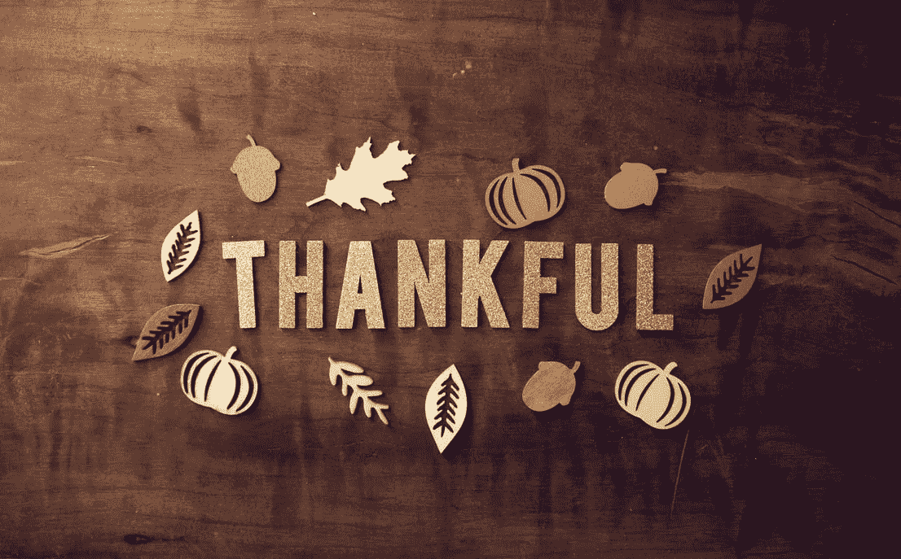

# 🍁你快乐吗😃在家学习？新的一月新的开始🦃

> 原文：<https://medium.com/quick-code/are-you-happy-to-learn-from-home-new-month-new-beginnings-885152ae4799?source=collection_archive---------0----------------------->

幽灵般的十月过去了(或者至少 2020 年就像十月的万圣节)。伙计们，现在是 11 月！！！除了 11 月不刮胡子，你还准备做什么？今年 2020 就像没有刮胡子，没有修剪。

我们居住的自然和环境的变化。

哦，对了，还有一场选举正在进行，将会产生巨大的全球影响。一旦结果公布，甚至政府也将改头换面。所以，如果你有点心烦意乱我明白，或者出去投票，这是完全可以理解的。

是的，你会问万圣节和教育或者你参加在线课程有什么一致性。

**世界上许多儿童在家里没有互联网接入**

**家庭财富是互联网接入的最大决定因素**

**互联网学习解决方案和阅读技巧之间的联系**

**成功远程学习的策略:互联网、电视、广播和“带回家”的印刷材料**

[从 Java 初学者到专业 Java 开发人员的 7 个最初步骤](/quick-code/7-first-steps-from-java-beginner-to-a-professional-java-dev-7332f8c5f928)

[如何成为云原生用户——以及帮助您实现这一目标的 13 个工具](/quick-code/how-to-become-cloud-native-and-13-tools-to-get-you-there-861bcebb22bb)

[12 个最佳科特林教程&课程——在线学习科特林](https://blog.coursesity.com/best-kotlin-tutorials/)

[每个软件开发人员都应该具备的 4 项项目管理技能](/quick-code/4-project-management-skills-every-software-developer-should-possess-154e7cc4604d)

[10 大最佳邮差教程和课程——在线学习邮差](https://blog.coursesity.com/best-postman-tutorials/)

[为什么你应该激发你的拉动式需求？](/quick-code/why-you-should-motivate-your-pull-request-c84ba9e557c7)

[2020 年 5 大 React 原生测试工具蓬勃发展–21](/quick-code/top-5-react-native-testing-tools-booming-in-2020-21-4faa2ca5bd51)

[部署&用 Firebase 托管](/quick-code/deploy-host-flutter-web-with-firebase-hosting-6821bd060874)托管你的 Flutter 网站

特别感谢我们的贡献者和激励者[Coder Society](https://medium.com/u/8e8059b1ef01?source=post_page-----885152ae4799--------------------------------)[John Selawsky](https://medium.com/u/390a59d672a2?source=post_page-----885152ae4799--------------------------------)[Sophia Martin](https://medium.com/u/a003439d3910?source=post_page-----885152ae4799--------------------------------)[oye yinka Onaolapo](https://medium.com/u/705421af99da?source=post_page-----885152ae4799--------------------------------)[Jimmie Williams](https://medium.com/u/221cebf1d3f4?source=post_page-----885152ae4799--------------------------------)[Maciej trzciński](https://medium.com/u/8bd8c5fe74ea?source=post_page-----885152ae4799--------------------------------)[BleylDev](https://medium.com/u/1b72487e1a47?source=post_page-----885152ae4799--------------------------------)

当然，我们确实为感恩节准备了好吃的东西和优惠券。

请关注这个空间，了解更多产品和交易。

回头再聊。