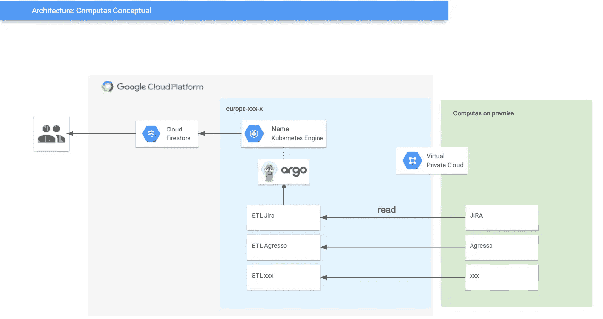
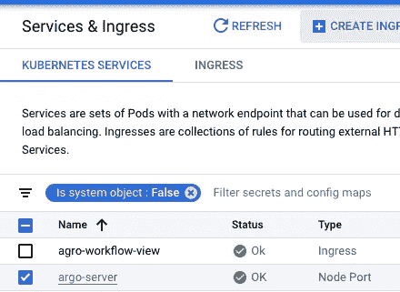
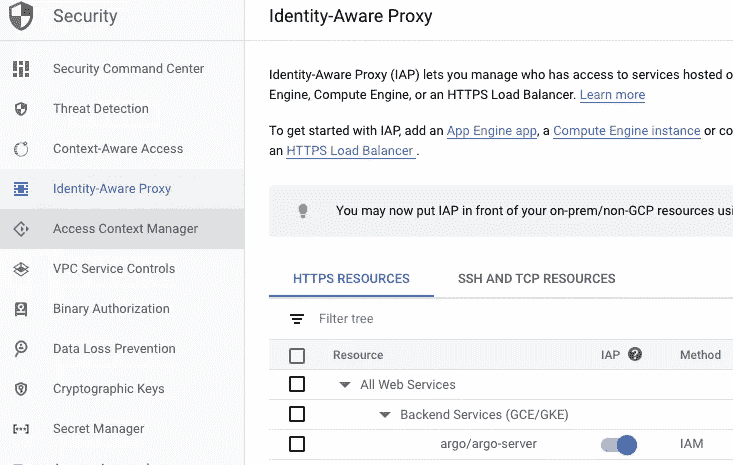

# Argo 工作流是 Cloud Composer 的替代方案

> 原文：<https://medium.com/compendium/argo-workflows-as-alternative-to-cloud-composer-db4db2bea1af?source=collection_archive---------1----------------------->

# 背景

在以前的帖子([调度作业#1](/grensesnittet/copy-data-from-cloud-sql-to-bigquery-using-apache-airflow-b51bdb277463) 、[调度作业#2](/grensesnittet/copy-data-from-cloud-sql-to-bigquery-using-apache-airflow-cloud-composer-part-2-33aa02bf456a) )中，我一直在写如何使用[GCPs Cloud Composer](https://cloud.google.com/composer)([air flow](https://airflow.apache.org/))进行工作流调度。

Cloud Composer 一直困扰我的一个问题是高昂的价格(每月最低 380 美元！).对于小型集群和少量工作，在美元和基础设施上的花费实际上并没有增加所提供的价值。

我们内部的 Computas 应用程序就是一个很好的例子。

它曾经在 kubernetes 集群中作为 cron-jobs 运行。从某种意义上说，我们开始获得作业之间的依赖性，所以 cron 不再是一个真正的选项。

> computas 的每个员工都安装了一个应用程序，让您可以访问所有其他员工的信息——图像、电话、邮件..此外，它还包含每个员工的个人信息，如假期，病假和 kks 预算。
> 
> Computas 每年也有几个内部会议，有几个平行的轨道。使用我们创建的应用程序，每个员工都可以决定去哪个赛道。这个的主数据在 JIRA。

该应用程序使用 firebase 作为其后端。为了用本地系统的相关数据填充 firebase，我们有几个 ETL 作业。



Conceptual diagram of the infrastructure involved

如果我们要启动一个 composer 集群来处理这个 ETL，成本将会过高，因为基础设施的其余部分每月不到 100 美元..

# Argo 工作流


Argo workflows to the rescue!

有几种方法可以运行 composer managed。一个不错的选择是在一个虚拟机上运行 [airflow，但是考虑到这些作业已经是 kubernetes cron 作业，我们想要一个能够以最小的开销轻松安装到 kubernetes 集群并按原样运行作业的东西。](/grensesnittet/install-apache-airflow-on-a-google-cloud-platform-virtual-machine-f9a5b01b6c33)

[Argo workflows](https://github.com/argoproj/argo) 是 kubernetes 的原生产品，与 airflow 相比占用的空间相对较小。它使用定制资源来描述作业，并部署一个控制器来运行它们——所有这些都是 kubernetes 固有的概念。这意味着 Argo 不需要外部数据库来保存状态，因为状态保存在资源本身中。

它也有一个(简单的)用户界面，但是默认情况下，它不会暴露在互联网上。

工作流可以按 cron-schedule 运行，也可以作为一次性作业运行。对于我们的用例，cron-schedule 最适合我们。如果作业已经在运行，您可以配置要执行的操作(禁止、取消现有、跳过..)

工作流在 yaml 中定义。

阿尔戈也有丰富的生态系统。例如，它有[插件来做事件驱动架构](https://github.com/argoproj/argo-events/blob/master/docs/index.md)(即，在消费 pubsub 消息等之后产生工作流)，这在 Composer 中做起来有点麻烦[。](https://cloud.google.com/composer/docs/how-to/using/triggering-with-gcf)

# 部署工作流

Argo workflows 在定义工作流时有一个非常好的概念，这使得 ci-cd 过程在 mono-repos 和 micro repos 中都非常容易。一个工作流可以由几个模板组成，一个模板可以与一个 docker 图像(带版本)一起构建。这意味着您的构建过程可以构建一个命名的模板，当它可用时，工作流将会选择它。这意味着提交代码后，构建过程就完成了，工作流就可以运行了。

将此与您在 cloud composer 中的制作方式进行比较:

*   首先创建一个触发器，它将 repo 文件夹同步到一个 bucket 进行提交..
*   然后在后台，这个桶每 30 秒同步到每个气流工作者。
*   并且您不断刷新 ui 中的 dag，直到您看到 DAG 更改的内容
*   然后你运行你的工作..

# 使用 IAP 创建入口

Argo 工作流没有开箱即用的入口。当然，您可以根据需要创建一个隧道来查看 argo ui，但是每次您想要对事物进行概述时这样做并不是最佳的。不要担心，这是很容易暴露 argo 服务器到互联网上！

*   你需要拥有一个域名。
*   在域中创建一个 A 记录，指向您的负载平衡器的 IP
*   修补 argo 服务器，使其可以被 L7 LB 暴露

```
kubectl patch svc argo-server -n argo -p '{"spec": {"type": "NodePort"}}'
```

*   使用 GKE 用户界面创建入口，并选择 argo 服务器。



select argo-server and hit “Create ingress”

*   在 LB 上启用 IAP，这样您需要登录才能访问资源



In the IAP ui you can add who should be allowed to your site!

# 所有的气流操作员呢？

你将失去一些东西，那就是所有的气流操作器。你可以通过运行 gcloud/any docker 镜像和“gsutil”、“bq”等 bash 命令来模仿其中的一些/大部分。但是，如果您的用例是使用大量内置的气流操作符，argo 工作流不适合您。

# 其他要点—作曲家 vs argo

**自动缩放**

*   Argo 自动缩放开箱即用。您可以拥有一个带有自动扩展节点池的小型集群，它将正常工作。
*   另一方面，Composer 不会——主要是因为谷歌对它的配置。如果操作得当，气流可以轻松自动缩放..有一些[中型帖子提供了一些关于如何实现这一目标的解决方案](/traveloka-engineering/enabling-autoscaling-in-google-cloud-composer-ac84d3ddd60)

**UI**

*   Argo 有一个很好的极简 UI，但是没有气流的所有特性
*   Composer 有你需要的所有特性，但是看起来很垃圾(希望这在某个时候会改变)。

**调度的根本区别**

*   阿尔戈以克朗的身份带着匕首跑。
*   Composer 在开始时间为的特定时间运行作业。(并为您回填)

**伐木**

*   Argo 日志存储在 kubernetes 资源中，这意味着一旦作业被删除，它们也会被删除。(除非运到 stackdriver)。流式日志是在用户界面中实时完成的。
*   Composer 日志存储在存储桶中并进行版本控制。

# 结束语

总而言之，我真的很喜欢阿尔戈。我现在已经部署了两次(一次是内部部署，一次是作为 Cloud Composer 的替代品在客户身上部署)，两个地方都运行得非常好。

它是 Composer 的一个很好的替代品，尤其是如果您已经有一个 kubernetes 集群，并且想要在该集群中调度作业！

对于那些每月 380 美元的最低费用对工作流程安排来说太贵的人来说，这也是一个很好的选择。

作曲家仍有其角色要扮演；这是一个强大的管理解决方案，您不需要了解任何 kubernetes，就可以从第一天开始专注于创造商业价值！