# 用于 Azure 资源管理的工具

> 原文：<https://medium.com/globant/arm-tool-for-resource-management-in-azure-3a721e02ab25?source=collection_archive---------0----------------------->

## 介绍

灵活性和配置是当今技术时代的需要，当我们谈论云时也是如此。如果您可以利用现有的模板，并且不需要额外的努力来运行系统，这难道不是一件很酷的事情吗？这就是 ARM 模板发挥作用的地方。ARM 是一个可重用的基于组件的工具，用于管理和部署 Azure 中的资源。

## 什么是 ARM (Azure 资源管理器)模板？

使用 ARM 模板，您可以在一个单元中一起部署多个资源，并且部署是幂等的。在这里，用户声明资源的类型、使用什么名称以及它应该具有哪些属性。
ARM 模板提供了在 JSON 文件中声明对象、类型、名称和属性并附加到源代码控制中的灵活性。

## **手臂模板组件**

> ARM 模板可以用两种方式定义
> 1。整个资源组的内容。
> 2。资源组中的一个或多个资源。
> 部署模板时，用户可以选择“完整”或“增量”模式。

1.  **资源**:可通过 Azure 获得的可管理项目。虚拟机、存储帐户、web 应用程序、数据库和虚拟网络都是资源的例子。资源组、订阅、管理组和标记也是资源的示例。
2.  **资源提供者**:提供 Azure 资源的服务。例如，一个常见的资源提供者是“微软。计算”，它提供虚拟机资源。“微软。存储”是另一种常见的资源提供者。
3.  **资源组**:保存 Azure 解决方案相关资源的容器。资源组包括那些要作为一个组来管理的资源。您可以根据什么对您的组织最有意义来决定哪些资源属于一个资源组。
4.  **资源管理器模板**:一个 JavaScript 对象符号(JSON)文件，它定义了一个或多个要部署到资源组 subscription 的资源。该模板可用于一致且重复地部署资源。

## 使用 Azure 资源管理器的好处

*   通过声明性模板而不是脚本来管理您的基础架构。
*   将您的解决方案的所有资源作为一个整体进行部署、管理和监控，而不是单独处理这些资源。
*   在整个开发生命周期中重新部署您的解决方案，并确信您的资源以一致的状态部署。
*   定义资源之间的依赖关系，以便按正确的顺序部署它们。
*   将访问控制应用于所有服务，因为 Azure 基于角色的访问控制被原生集成到管理平台中。
*   将标签应用于资源，以逻辑方式组织订阅中的所有资源。
*   通过查看共享相同标签的一组资源的成本，明确贵组织的帐单。

## **臂流(架构)**

1.  当用户从任何 Azure 工具、API 或 SDK 发送请求时，资源管理器接收请求。
2.  它对请求进行身份验证和授权。
3.  资源管理器向 Azure 服务发送请求，Azure 服务执行请求的操作。

因为所有请求都是通过相同的 API 处理的，所以您可以在所有不同的工具中看到一致的结果和功能。

下图显示了 Azure 资源管理器在处理 Azure 请求中扮演的角色。

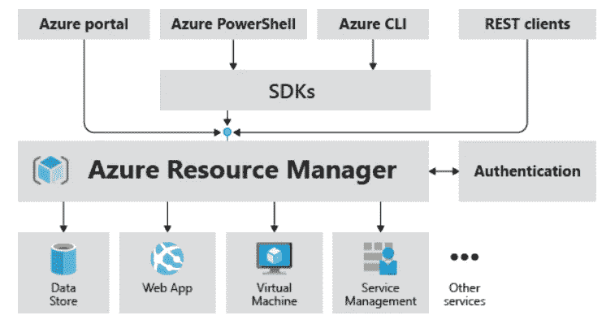

(Image courtesy from Microsoft) ARM flow

门户中可用的所有功能也可以通过 PowerShell、Azure CLI、REST APIs 和客户端 SDK 获得。最初通过 API 发布的功能将在最初发布后的 180 天内出现在门户中。

## 如何创建 ARM 模板(步骤)

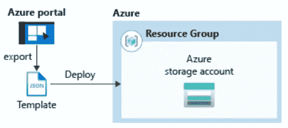

(Image courtesy from Microsoft)

## **使用门户网站创建模板**

1.  在网络浏览器中，进入 [Azure 门户](https://portal.azure.com/)并登录。
2.  从 Azure 门户菜单中，选择创建资源。

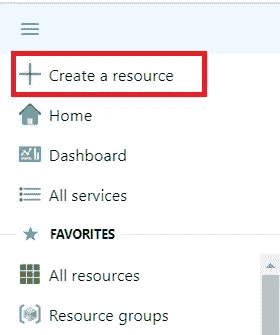

3.选择存储= >存储帐户。

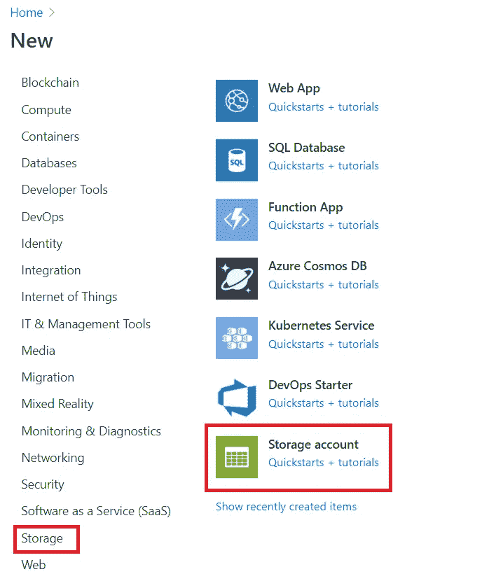

单击存储帐户后，如果没有所需的存储帐户名称，您需要提供一个资源组名称。

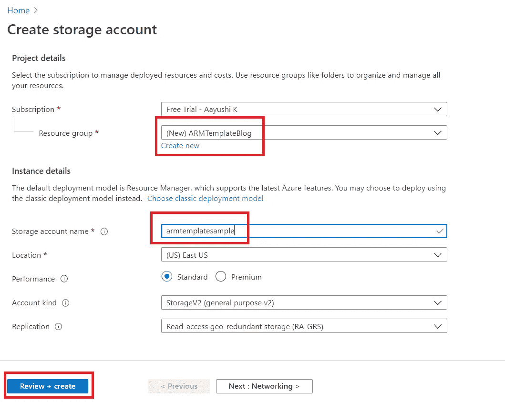

4.为下一步选择审查+创建按钮

5.单击屏幕底部的查看+创建。它将使用存储帐户创建资源组

6.选择已创建的资源组，并选择需要为其创建 ARM 模板的存储帐户。

7.点击导出模板

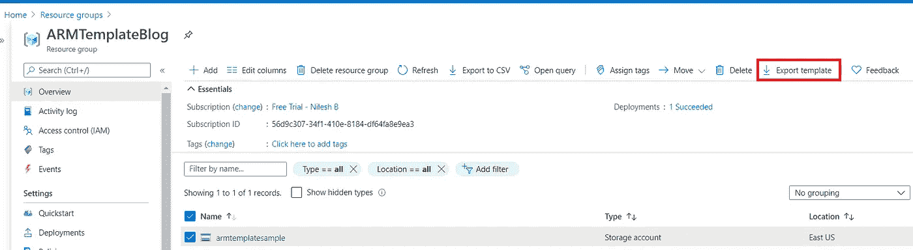

8.点击下载按钮。将下载 Zip 文件。它会给你一个自动生成的带参数的模板。

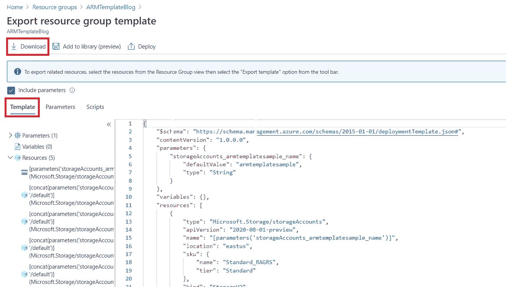

9.打开下载的 zip 文件，并将“template.json”保存到您的计算机中。

10.选择参数选项卡以查看您为参数提供的值。记下这些值，在部署模板时会用到它们。

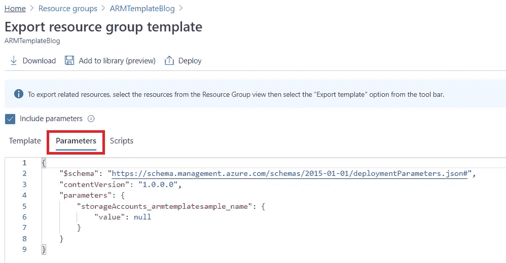

## 编辑和部署模板

> Azure Portal 用于执行基本的模板部署。您可以使用名为*模板部署*的门户工具。
> 
> Azure 要求每个 Azure 服务都有唯一的名称。如果您输入的存储帐户名称已经存在，您的部署可能会失败。为了避免这个问题，您可以修改模板以使用模板函数调用“uniquestring()”来生成唯一的存储帐户名。

1.  在 Azure 门户的搜索框中，搜索“部署”,然后从建议中选择“部署自定义模板”。

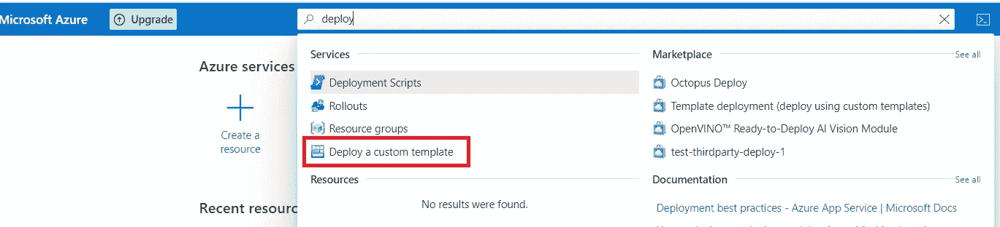

2.在编辑器中选择选项**构建您自己的模板。**

3.选择加载文件，然后按照说明加载您在上一节中下载的“template.json ”,或者您可以直接复制模板并粘贴到编辑器中。

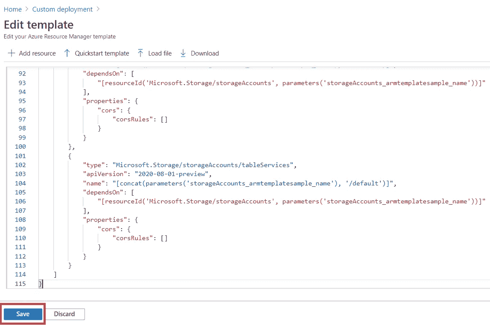

4.点击保存按钮

5.选择要部署 ARM 模板的订阅和资源组。然后点击查看+创建按钮

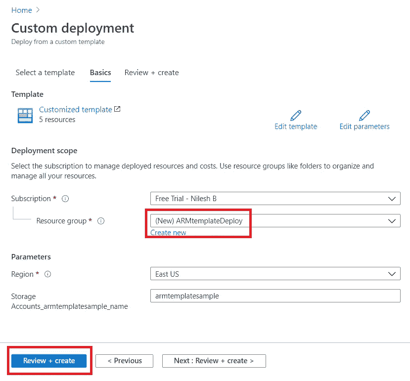

6.成功通过验证后，单击“创建”按钮进行部署。

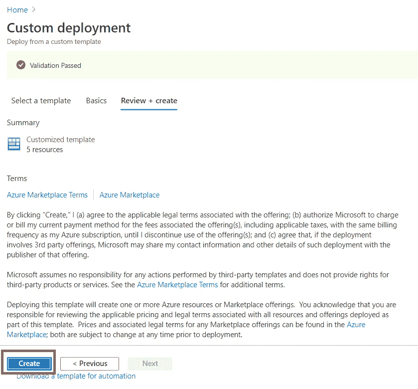

7.在下一个屏幕上，它将向您显示部署状态

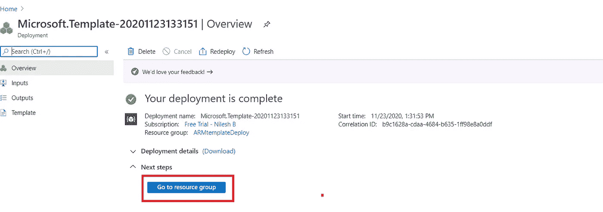

8.单击 Go to a resource group，它将显示给定资源组上部署的所有资源

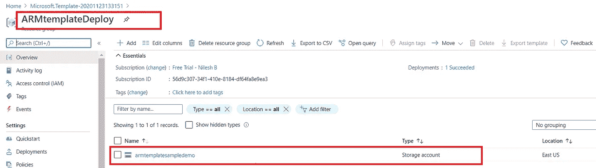

这样，您将获得所选订阅上部署的所有资源。

## 结论

通过使用 ARM 模板，你可以以一种简单的方式部署和管理你的 Azure 资源。由于其可重复使用的性质，人们可以一次创建模板，并且同一个模板可以多次使用，这可以节省时间和精力。

**了解更多信息:**[https://docs . Microsoft . com/en-us/azure/azure-resource-manager](https://docs.microsoft.com/en-us/azure/azure-resource-manager)