# JavaScript 中的数组与类数组对象

> 原文：<https://medium.com/globant/array-vs-array-like-objects-in-javascript-cc1523e21089?source=collection_archive---------0----------------------->

> 看不见的和不存在的看起来非常相似。— *作者:德洛斯·麦克科恩*

每当我们遇到类似阵列的物体时，我们都处于好奇的状态，对它下面隐藏着什么的好奇心促使我写下了这篇博客。
在探索晦涩的部分之前，我们将首先刷新一些基础知识，

**Object:**Object 是 javascript 中的一种非原语数据类型，我们用它来存储键值格式的数据。javascript 中的大多数对象都源自对象原型。javascript 中有各种对象形式，取决于访问和操作属性的行为，表现为内部方法；根据 ECMAScript 文档，一个普通的对象对于主要的内部方法需要特定的默认动作标准，而一个外来的对象对于它的一些内部方法可能没有默认动作。
**注**:外来对象，像数组对象或者字符串对象，都不是普通对象。

**Array:** 一般来说，它是一个数字索引值的列表，按照它们进入的顺序排列；在 JavaScript 中，这是一个奇特的对象，它维护称为元素的[数组索引](https://tc39.es/ecma262/#array-index)属性键和称为长度的不可配置属性，每个数组都是从这个数组对象派生的，继承了它的所有属性，如 push、pop、slice、map、shift 等等。类似地，[字符串也是一个外来对象](https://tc39.es/ecma262/#sec-string-exotic-objects)，由整数索引属性组成，每个属性对应一个字符。

**什么是类数组对象？**

如果一个对象满足下面列出的标准，它就是一个类似数组的对象:
a)索引应该从 0 开始
b)索引应该以与数组相同的方式递增
c)它应该有一个长度属性并返回一个非负整数
d)它的值应该等于整数索引键的数目

类似数组的对象和数组有什么不同？

说到数组和类数组对象的区别:
a)类数组对象的索引范围是 0≤i≤2^53–1，而数组的索引范围是 0≤I<2^32–1
b)类数组对象不是从 Array.prototype 对象派生出来的；因此，我们不能执行诸如 push、pop、forEach 等遍历和重构操作

类似数组的对象的例子有:
a)传统函数中的 Arguments 对象
b)从 document.querySelectorAll 或 document.getElementsByTagName 返回的 HTML 集合

为了理解区别，让我们看一下下面给出的例子:

```
**//example_no_1**
function printArgumentList() {
  console.log("Arguments: ", arguments);
  console.log("First argument: ", arguments[0]);
  console.log("Length of arguments: ", arguments.length);
}
printArgumentList("one", 2, 3);
```

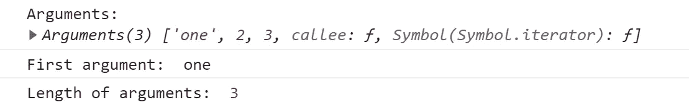

Output: example_no_1

在这里，我们可以定位' arguments '对象的元素，并像对 array 对象一样评估其长度，但是当我们试图插入元素`arguments.push("four")`时，它会抛出一个错误“TypeError: arguments.push 不是函数”或者当我们试图使用 forEach 迭代它时，它会抛出“TypeError: arguments.forEach 不是函数”。

为了更好地理解类似数组的对象，我们将讨论 javascript 中的字符串，

> 在 ECMAScript5 中，字符串作为类似数组的对象引入，其中每个字符都可以使用其数字索引进行访问。例如，string[2]将返回“r ”,尽管这些字符既不可写也不可配置。

所以，这表明我们可以获得一个字符串的字符，就像它是一个字符数组一样，尽管我们不能操作它；在下面的例子中，一个对象被定义为一个字符串来说明其类似数组的特征，

```
**//example_no_2**
let stringObj = {};
Object.defineProperties(stringObj, {
  0: {
    value: "a",
    writable: false,
    enumerable: false,
  },
  1: {
    value: "b",
    writable: false,
    enumerable: false,
  },
  length: {
    value: 2,
    writable: false,
    enumerable: false,
  },
  valueOf: {
    value: function () {
      return "ab";
    },
    writable: false,
    enumerable: false,
  },
});**//use_case_1**console.log("Before string manipulation");console.log("Primitive value of string object: ",stringObj.valueOf());console.log("String length: ", stringObj.length);console.log("Character at zeroth index: ", stringObj[0]);
```

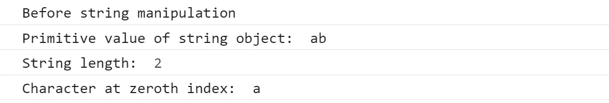

Output: example_no_2_use_case_1

```
**//use_case_2**
//Editing character at zeroth index
stringObj[0] = “test”;console.log(" -----After string manipulation----- ");console.log("Primitive value of string object: ",stringObj.valueOf());console.log("String length: ", stringObj.length);console.log("Character at zeroth index: ", stringObj[0]);
```

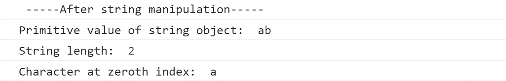

Output: example_no_2_use_case_2

```
**//use_case_3** console.log(" -----Adding new character to the string----- ");
stringObj.push("V");console.log(" -----Convert to uppercase----- ");
stringObj.push("V");stringObj.push("V");
```

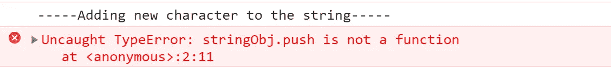

Output: example_no_2_use_case_3

在上面的例子中，“stringObj”被初始化为一个空对象，然后定义它的属性。添加的属性看起来像一个数组，并在试图添加新字符时抛出一个错误。

类似数组的对象的形状不能像普通数组一样。让我们用下面的例子来验证这一说法:

```
**//example_no_3**
let str = "JavaScript";console.log(" ---Add index as a prefix to charcter--- ");console.log("Is str an array: ", Array.isArray(str));str.map((value, index) => `${index}-${value}`);console.log(str);
```

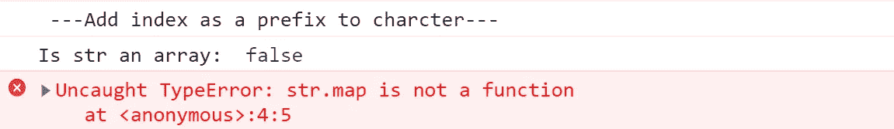

Output: example_no_3

让我们修改上面的代码片段，将“str”转换为一个数组，

```
**//example_no_4** str = Array.from(str);
str = str.map((value, index) => `${index}-${value}`);console.log(str);
```

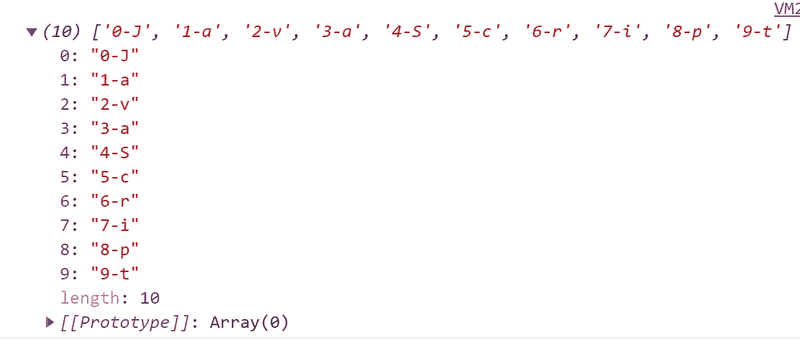

Output: example_no_4

现在我们有了 Array.map()函数的期望输出。

**对数组和类数组对象的少量操作一瞥**

```
**//example_no_5**
let array = ["a", "r", "r", "a", "y"]; //plain array
let arrayLike = { 0: "a", 1: "r", 2: "r", 3: "a", 4: "y", length: 5 }; //array-like object**//use_case_1 - Applying javacript object methods** console.log(array.hasOwnProperty(1), ":", arrayLike.hasOwnProperty(1));console.log(array.valueOf(), ":", arrayLike.valueOf());
```

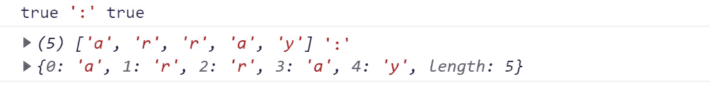

Output: example_no_5_use_case_1

```
**//use_case_2 - Iterating using for-of** for (let value of array) {
  console.log(value);
}
for (let value of arrayLike) {
  console.log(value);
}
```

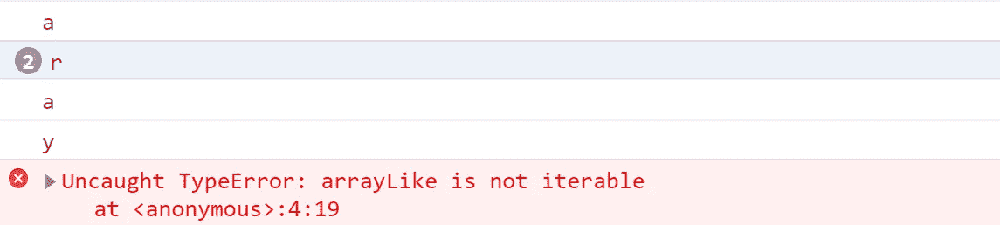

Output: example_no_5_use_case_2

```
**//use_case_3 - call join function** console.log(array.join("*"));
console.log(arrayLike.join("*"));
```

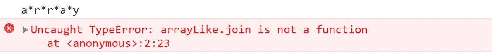

Output: example_no_5_use_case_3

在类似数组的对象上调用 Array.prototype 函数会抛出一个错误，但是我们仍然可以在稍加修改的情况下调用它，

```
**//use_case_4 - calling join function for array-like object**
console.log(arrayLike, Array.prototype.join.call(arrayLike, “*”));
```

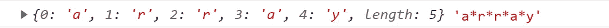

Output: example_no_5_use_case_4

但与普通数组相比，这不是一种优化的方法。因此，建议在调用内置 Array.prototype 函数之前，将类似数组的对象转换为普通数组。

**将类数组转换为数组的方法**

*   [Array.from()](https://developer.mozilla.org/en-US/docs/Web/JavaScript/Reference/Global_Objects/Array/from) :它的目的是返回一个类似数组或可迭代对象的新的浅拷贝

```
let str = "Javascript";console.log("Is array before calling Array.from(): ", Array.isArray(str));str = Array.from(string);
console.log(
  "Is array after calling Array.from(): ",
  str,
  ":",
  Array.isArray(str)
);function func() {
  let arg = Array.from(arguments);
  console.log("arguments object: ", typeof arg, " : ", arg);
}
func("One", 1, true);
```

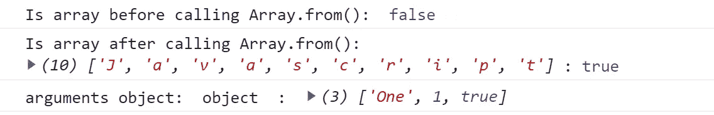

Output: Converting array-like to arrays using Array.from()

*   Spread 操作符:它允许 iterables 在需要零个或多个参数时扩展它们的元素。它由三个点(…)表示。主要用于组合两个数组

```
let str = "Javascript";
console.log("Is array before applying spread operator: ", Array.isArray(str));str = [...str];
console.log(
  "Is array after applying spread operator: ",
  str,
  ":",
  Array.isArray(str)
);function func() {
  console.log("arguments object: ", typeof [...arguments], " : ", [
    ...arguments,
  ]);
}
func("One", 1, true);
```

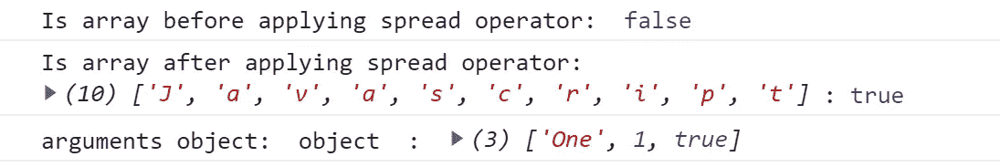

Output: Converting array-like to arrays using spread operator(…)

*   [Object.values()](https://developer.mozilla.org/en-US/docs/Web/JavaScript/Reference/Global_Objects/Object/values) :返回一个数组，包含一个对象的所有可枚举属性值。它像循环一样保持顺序，但排除原型链中的属性

```
let baseObj = { 0: "Array", 1: "Array-like", length: 2 };console.log(
  "Is array before calling Object.values(): ",
  Array.isArray(baseObj)
);let result = Object.values(baseObj);
console.log(
  "Is array after calling Object.values(): ",
  result,
  ":",
  Array.isArray(result)
);function func() {
  let arg = Object.values(arguments);
  console.log("arguments object: ", typeof arg, " : ", arg);
}
func("One", 1, true);
```

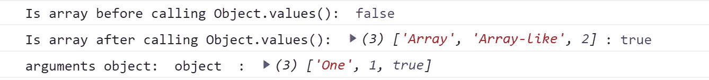

Output: Converting array-like to arrays using Object.values()

**总结**

*   数组是一种奇特的对象，它有称为元素的数组索引属性键和称为长度的不可配置属性
*   类似数组的对象类似于视图中的数组，但不是从 Array.prototype 对象派生的。因此，我们不能对它应用数组的遍历和重塑功能
*   字符串被视为一个类似数组的对象，其中每个字符都可以使用其数字索引和 length 属性来访问，返回字符串的长度
*   Array.from()、spread 运算符和 Object.values()可用于将类似数组的对象转换为数组
*   在应用任何内置数组函数之前，最好将类似数组的对象转换为数组

我们希望它有助于消除数组和类数组对象之间的混淆。谢谢你坚持到最后。:)

参考

[](https://developer.mozilla.org/en-US/docs/Web/JavaScript) [## JavaScript | MDN

### JavaScript (JS)是一种轻量级、解释型或即时编译的编程语言，具有一流的…

developer.mozilla.org](https://developer.mozilla.org/en-US/docs/Web/JavaScript) [](https://tc39.es/ecma262/#sec-intro) [## ECMAScript 2022 语言规范

### 编辑描述

tc39.es](https://tc39.es/ecma262/#sec-intro) [](https://v8.dev/blog/elements-kinds) [## V8 中的元素种类

### 注意:如果你喜欢看演示而不是阅读文章，那么请欣赏下面的视频！JavaScript 对象可以…

v8.dev](https://v8.dev/blog/elements-kinds)