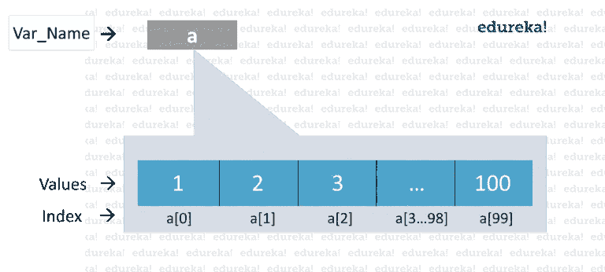
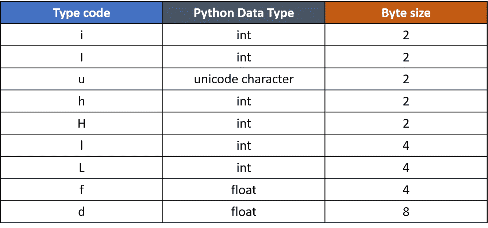
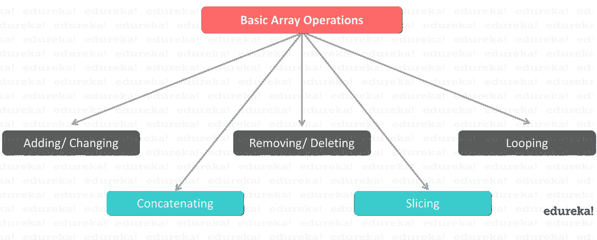

# 通过示例了解如何在 Python 中使用数组

> 原文：<https://medium.com/edureka/arrays-in-python-14aecabec16e?source=collection_archive---------0----------------------->


在这个飞速发展的世界里，人们需要足智多谋的编码技术来帮助程序员以最简单和最方便的方式总结大量的代码。数组是一种数据结构，可以帮助您将多个值写入单个变量，从而减轻记忆大量变量的负担。所以让我们继续，看看如何在 [Python 中实现数组。](https://www.edureka.co/blog/python-tutorial?utm_source=medium&utm_medium=content-link&utm_campaign=arrays-in-python)

以下是主题概述，解释了与数组相关的所有方面:

1.  为什么在 Python 中使用数组？
2.  什么是数组？
3.  Python 列表和数组一样吗？
4.  创建数组
5.  访问元素
6.  基本数组操作

*   添加/更改数组元素
*   串联
*   从数组中删除元素
*   遍历一个数组
*   限幅

# 为什么在 Python 中使用数组？

数组和 Python 的结合可以节省你很多时间。如前所述，与其他语言不同，数组帮助您减少代码的整体大小，而 [Python](https://www.edureka.co/blog/python-programming-language?utm_source=medium&utm_medium=content-link&utm_campaign=arrays-in-python) 帮助您摆脱有问题的语法。 ***例如* :** 如果你必须存储从 1 到 100 的整数，你将无法明确地记住 100 个变量名，因此，你可以使用数组轻松地保存它们。



现在您已经意识到了 Python 中数组的重要性，让我们更详细地研究一下它。

# 什么是数组？

数组基本上是一个*数据结构*，它可以一次保存多个值。它是同一类型元素的集合或有序序列。

```
a=arr.array('d',[1.2,1.3,2.3])
```

我们可以轻松地遍历数组项，并通过指定索引号来获取所需的值。数组也是可变的，因此，您可以根据需要执行各种操作。

现在，总有一个问题浮现在我们脑海里-

# Python 列表和数组一样吗？

核心 python 中的“数组”数据结构不是很高效或可靠。因此，当我们谈论 python 数组时，我们通常指的是 python 列表。

然而，python 确实提供了 Numpy 数组，这是在[数据科学中使用的数值网格。](https://www.edureka.co/blog/what-is-data-science?utm_source=medium&utm_medium=content-link&utm_campaign=arrays-in-python)

## 创建数组:

Python 中的数组可以在导入数组模块后创建，如下所示

→将数组作为 arr 导入

array(data type，value list)函数有两个参数，第一个是要存储的值的数据类型，第二个是值列表。数据类型可以是任何类型，如 int、float、double 等。请注意，arr 是别名，是为了方便使用。您也可以在没有别名的情况下导入。还有一种方法可以导入数组模块，这就是-

→从数组导入*

这意味着您希望从数组模块中导入所有函数。

以下语法用于创建数组。

**语法:**

```
#when you import using arr alias
a=arr.array(data type,value list) 
```

**T3 或 T5**

```
#when you import using *
a=array(data type,value list) 
```

**示例** : a=arr.array( 'd '，[1.1，2.1，3.1])

这里，第一个参数是“d ”,它是一种数据类型，即 float，其值被指定为下一个参数。

> **注**:所有指定的值都是浮点型的。我们不能为单个数组指定不同数据类型的值。

下表显示了各种数据类型及其代码。



## 访问数组元素:

要访问数组元素，需要指定索引值。索引从 0 开始，而不是从 1 开始。因此，索引号总是比数组长度小 1。

**语法:**

数组名称[索引值]

```
a=arr.array( 'd', [1.1 , 2.1 ,3.1] ) 
a[1]
```

**输出:**

```
2.1
```

返回的输出是数组中第二个位置的值 2.1。

现在让我们来看看一些基本的数组操作。

# 基本阵列操作:

有许多操作可以在数组上执行，如下所示



## 求数组的长度

数组长度是数组中实际存在的元素数量。您可以利用 **len()** 函数来实现这一点。len()函数返回一个整数值，该值等于数组中元素的个数。

**语法**:

→ len(阵列名称)

**示例**:

```
a=arr.array('d', [1.1 , 2.1 ,3.1] ) 
len(a)
```

**输出:**

```
3
```

这将返回值 3，该值等于数组元素的数量。

## 添加/更改数组元素:

我们可以通过使用 **append()** 、 **extend()** 和 **insert (i，x)** 函数向数组中添加值。

当我们需要在数组末尾添加一个元素时，使用 append()函数。

**例子**:

```
a=arr.array('d', [1.1 , 2.1 ,3.1] ) 
a.append(3.4) 
print(a)
```

**输出**--

```
array(‘d’, [1.1, 2.1, 3.1, 3.4])
```

得到的数组是实际的数组，在它的末尾添加了新的值。要添加多个元素，可以使用 extend()函数。这个函数接受一个元素列表作为它的参数。该列表的内容是要添加到数组中的元素。

**示例**:

```
a=arr.array('d', [1.1 , 2.1 ,3.1] ) 
a.extend([4.5,6.3,6.8]) 
print(a)
```

**输出**--

```
array(‘d’, [1.1, 2.1, 3.1, 4.5, 6.3, 6.8])
```

生成的数组将包含添加到数组末尾的所有 3 个新元素。

但是，当您需要在数组中的特定位置添加特定元素时，可以使用 insert(i，x)函数。这个函数在数组中相应的索引处插入元素。它有两个参数，第一个参数是需要插入元素的索引，第二个参数是值。

**举例**:

```
a=arr.array('d', [1.1 , 2.1 ,3.1] ) 
a.insert(2,3.8) 
print(a)
```

**输出**—

```
array(‘d’, [1.1, 2.1, 3.8, 3.1])
```

结果数组在数组的第三个位置包含值 3.8。

也可以通过执行数组连接来合并数组。

## 数组串联:

可以使用+符号连接任意两个数组。

**举例:**

```
a=arr.array('d',[1.1 , 2.1 ,3.1,2.6,7.8])
b=arr.array('d',[3.7,8.6])
c=arr.array('d')
c=a+b
print("Array c = ",c)
```

**输出-**

```
Array c= array(‘d’, [1.1, 2.1, 3.1, 2.6, 7.8, 3.7, 8.6])
```

得到的数组 c 包含数组 a 和 b 的级联元素。

现在，让我们看看如何从数组中移除或删除项目。

## 移除/删除数组元素:

可以使用 **pop()** 或 **remove()** 方法移除数组元素。这两个函数的区别在于前者返回删除的值，而后者不返回。

pop()函数要么不接受任何参数，要么接受索引值作为其参数。当没有给定参数时，这个函数弹出()最后一个元素并返回它。当您显式提供索引值时，pop()函数弹出所需的元素并返回它。

**示例**:

```
a=arr.array('d', [1.1, 2.2, 3.8, 3.1, 3.7, 1.2, 4.6]) 
print(a.pop()) 
print(a.pop(3))
```

**输出-**

```
4.6 
3.1
```

第一个 pop()函数删除最后一个值 4.6 并返回相同的值，而第二个函数弹出第四个位置的值 3.1 并返回相同的值。

另一方面，remove()函数用于删除不需要返回的值。该函数将元素值本身作为参数。如果在参数槽中给出索引值，将会抛出一个错误。

**示例**:

```
a=arr.array('d',[1.1 , 2.1 ,3.1]) 
a.remove(1.1) 
print(a)
```

**输出-**

```
array(‘d’, [2.1,3.1])
```

输出是一个包含除 1.1 以外的所有元素的数组。

当需要数组中特定范围的值时，可以对数组进行切片以返回相同的值，如下所示。

## 分割数组:

可以使用:符号对数组进行切片。这将返回我们通过索引号指定的一系列元素。

**例子**:

```
a=arr.array('d',[1.1 , 2.1 ,3.1,2.6,7.8]) 
print(a[0:3])
```

**输出**--

```
array(‘d’, [1.1, 2.1, 3.1])
```

结果是元素出现在数组的第一、第二和第三个位置。

## 遍历数组:

使用 for [循环](https://www.edureka.co/blog/loops-in-python?utm_source=medium&utm_medium=content-link&utm_campaign=arrays-in-python)，我们可以遍历一个数组。

**例如:**

```
a=arr.array('d', [1.1, 2.2, 3.8, 3.1, 3.7, 1.2, 4.6])
print("All values")
for x in a: 
print(x)
print("specific values")
for x in a[1:3]: 
print(x)
```

**输出**--

```
All values1.1
2.2
3.8
3.1
3.7
1.2
4.6
specific values
2.2
3.8
```

上面的输出显示了使用 for 循环的结果。当我们在没有任何特定参数的情况下使用 for 循环时，结果包含一次给定一个数组的所有元素。在第二个 for 循环中，结果只包含使用索引值指定的元素。请注意，结果不包含索引号 3 处的值。

希望你清楚本教程中与你分享的所有内容。这就把我们带到了关于 Python 中数组的文章的结尾。确保你尽可能多地练习，恢复你的经验。

如果你想查看更多关于人工智能、DevOps、道德黑客等市场最热门技术的文章，那么你可以参考 [Edureka 的官方网站。](https://www.edureka.co/blog/?utm_source=medium&utm_medium=content-link&utm_campaign=loops-in-python)

请留意本系列中的其他文章，它们将解释 Python 和数据科学的各个方面。

> 1. [Python 教程](/edureka/python-tutorial-be1b3d015745)
> 
> 2. [Python 编程语言](/edureka/python-programming-language-fc1015de7a6f)
> 
> 3. [Python 函数](/edureka/python-functions-f0cabca8c4a)
> 
> 4.[Python 中的文件处理](/edureka/file-handling-in-python-e0a6ff96ede9)
> 
> 5. [Python Numpy 教程](/edureka/python-numpy-tutorial-89fb8b642c7d)
> 
> 6. [Scikit 学习机器学习](/edureka/scikit-learn-machine-learning-7a2d92e4dd07)
> 
> 7. [Python 熊猫教程](/edureka/python-pandas-tutorial-c5055c61d12e)
> 
> 8. [Matplotlib 教程](/edureka/python-matplotlib-tutorial-15d148a7bfee)
> 
> 9. [Tkinter 教程](/edureka/tkinter-tutorial-f655d3f4c818)
> 
> 10.[请求教程](/edureka/python-requests-tutorial-30edabfa6a1c)
> 
> 11. [PyGame 教程](/edureka/pygame-tutorial-9874f7e5c0b4)
> 
> 12. [OpenCV 教程](/edureka/python-opencv-tutorial-5549bd4940e3)
> 
> 13.[用 Python 进行网页抓取](/edureka/web-scraping-with-python-d9e6506007bf)
> 
> 14. [PyCharm 教程](/edureka/pycharm-tutorial-d0ec9ce6fb60)
> 
> 15.[机器学习教程](/edureka/machine-learning-tutorial-f2883412fba1)
> 
> 16.[Python 中从头开始的线性回归算法](/edureka/linear-regression-in-python-e66f869cb6ce)
> 
> 17.[用于数据科学的 Python](/edureka/learn-python-for-data-science-1f9f407943d3)
> 
> 18.[Python 中的循环](/edureka/loops-in-python-fc5b42e2f313)
> 
> 19. [Python 正则表达式](/edureka/python-regex-regular-expression-tutorial-f2d17ffcf17e)
> 
> 20. [Python 项目](/edureka/python-projects-1f401a555ca0)
> 
> 21.[机器学习项目](/edureka/machine-learning-projects-cb0130d0606f)
> 
> 22.[在 Python 中设置](/edureka/sets-in-python-a16b410becf4)
> 
> 23.[Python 中的多线程](/edureka/what-is-mutithreading-19b6349dde0f)
> 
> 24. [Python 面试问题](/edureka/python-interview-questions-a22257bc309f)
> 
> 25. [Java vs Python](/edureka/java-vs-python-31d7433ed9d)
> 
> 26.[如何成为一名 Python 开发者？](/edureka/how-to-become-a-python-developer-462a0093f246)
> 
> 27. [Python Lambda 函数](/edureka/python-lambda-b84d68d449a0)
> 
> 28.[网飞如何使用 Python？](/edureka/how-netflix-uses-python-1e4deb2f8ca5)
> 
> 29.[Python 中的 Socket 编程是什么](/edureka/socket-programming-python-bbac2d423bf9)
> 
> 30. [Python 数据库连接](/edureka/python-database-connection-b4f9b301947c)
> 
> 31. [Golang vs Python](/edureka/golang-vs-python-5ac32e1ef2)
> 
> 32. [Python Seaborn 教程](/edureka/python-seaborn-tutorial-646fdddff322)
> 
> 33. [Python 职业机会](/edureka/python-career-opportunities-a2500ce158de)

*原载于 2019 年 4 月 5 日 https://www.edureka.co*[](https://www.edureka.co/blog/arrays-in-python/)**。**