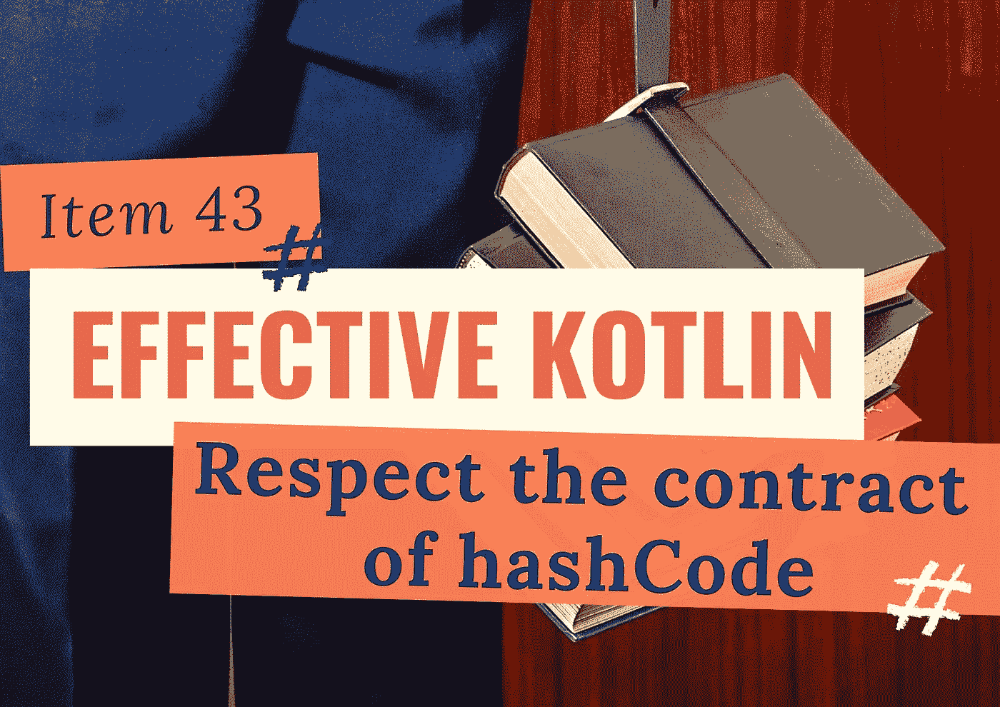
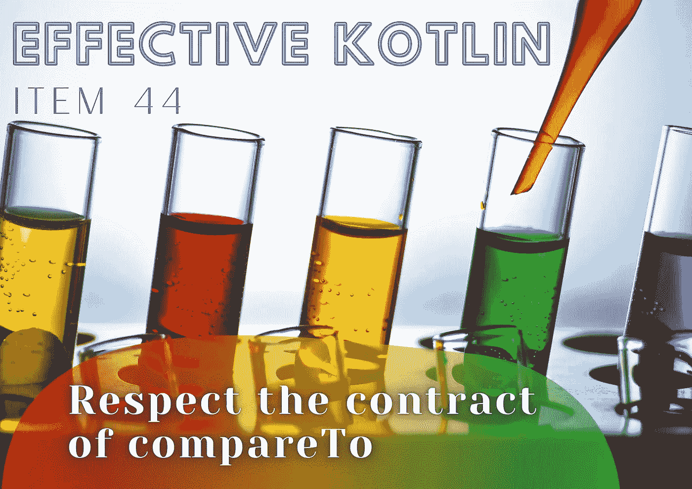
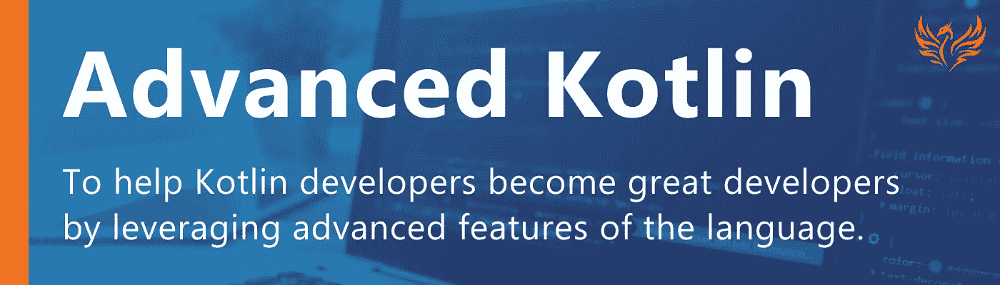
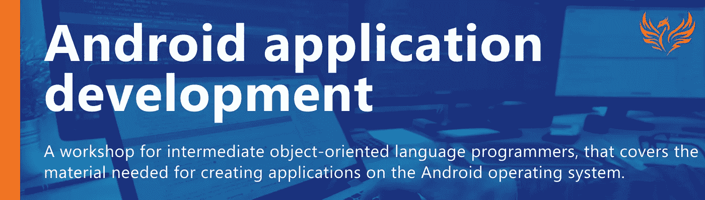

# 文章和新研讨会

> 原文：<https://blog.kotlin-academy.com/articles-new-workshops-1e4b0298d941?source=collection_archive---------3----------------------->

你好，
Kt。这里是学院**👋**

以下是您将在此简讯中找到的内容的快捷方式:

✅ 2 篇文章是有效的科特林书的一部分:
👉[尊重 hashCode](https://kt.academy/article/ek-hashcode)
的约定👉[尊重 compareTo](https://kt.academy/article/ek-compareto)
✅ [与 Gradle Kotlin DSL 分享您的 Gradle 配置 android 项目指南](/share-your-gradle-configuration-with-the-gradle-kotlin-dsl-a-guide-for-android-projects-3ce6dc34ea75)
✅ 2 个新研讨会:
👉[高级科特林](https://kt.academy/workshop/kotlinAdvanced)👉 [Android 应用开发](https://kt.academy/workshop/androidApplication)
✅播客信息—仅在波兰🇵🇱

尽情享受吧！⏬

hashCode 的契约是什么……我们为什么要关心？！🤭
在**尊重 hashCode 的契约**文章中找到答案 [Marcin Moskala](https://medium.com/u/171dab54cea9?source=post_page-----1e4b0298d941--------------------------------) 👇

[Effective Kotlin Item 43: Respect the contract of hashCode](https://kt.academy/article/ek-hashcode)

在这篇文章中， [Marcin Moskala](https://medium.com/u/171dab54cea9?source=post_page-----1e4b0298d941--------------------------------) 解释了**什么是 compareTo** 的契约，以及为什么我们应该关注它🤔

[Effective Kotlin Item 44: Respect the contract of compareTo](https://kt.academy/article/ek-compareto)

这里有一个针对 Android 项目的**指南**，它将帮助你把你的 Gradle 构建脚本从 Groovy 转换到 Kotlin，让你利用一些巨大的好处🤩
由[迈克尔·麦考密克](https://medium.com/u/248af6a9e77f?source=post_page-----1e4b0298d941--------------------------------)撰写👇

[Share your Gradle configuration with the Gradle Kotlin DSL — A guide for Android projects](/share-your-gradle-configuration-with-the-gradle-kotlin-dsl-a-guide-for-android-projects-3ce6dc34ea75)

我们的产品中有 2 个新车间！🔥

❗️ [高级 Kotlin](https://kt.academy/workshop/kotlinAdvanced) ❗️
通过利用语言的高级特性成为一名优秀的 Kotlin 开发人员💻

❗️ [安卓应用开发](https://kt.academy/workshop/androidApplication) ❗️
学习如何在安卓操作系统上创建应用🤖

🇵🇱给我们的波兰观众

2021 年 7 月 7 日**19:00**Marcin moska a 将做客播客“Przeprogramowani”**🤩**
他将讲述他的新书“ **JavaScript 从零开始**”，并透露他为何如此渴望分享自己的知识。

加入我们[这里](https://www.youtube.com/watch?v=TXxuha3IfXI)👇

[“JavaScript od podstaw” by Marcin Moskala — Przeprogramowani podcast](https://www.youtube.com/watch?v=TXxuha3IfXI)

今天就到这里吧！

谢谢，再见！

卡帕头。学院团队

www: [kt.academy](https://kt.academy/)
博客:[blog.kotlin-academy.com](http://blog.kotlin-academy.com/)
Twitter EN:[@ ktdotsacademy](https://twitter.com/ktdotacademy)
Twitter PL:[@ ktdotsacademypl](https://twitter.com/ktdotacademyPL)
FB:[@ ktdotsacademy](https://www.facebook.com/KtDotAcademy)
LinkedIn:[@ Kt。学院](https://www.linkedin.com/company/kt-academy/)

