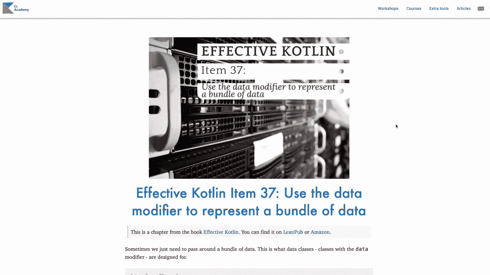
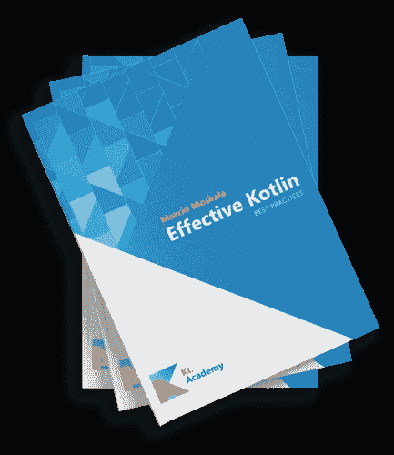

# 来自 Kt 的文章和新闻。学院

> 原文：<https://blog.kotlin-academy.com/articles-news-from-kt-academy-ef978521b1f9?source=collection_archive---------3----------------------->

你好卡帕头。这里是学院**👋**

在今天的时事通讯中你会发现:
➡️的新文章发表在我们的博客上！
➡️文章私人评论功能。
➡️为我们的波兰观众准备的新文章。
➡️购买有效科特林书的地方。

尽情享受吧！

数据修改器是一个强大的工具💪如果你想了解它是如何工作的，以及它有哪些危险，请阅读 Marcin Moskala 写的文章👇
[使用数据修饰符来表示一束数据](https://kt.academy/article/ek-data-class)。

我们希望我们的读者对我们发布的内容产生影响，这样您就可以分享您的想法或关注点，并能够给我们留下关于我们文章的任何其他反馈！

这就是为什么我们在我们的博客🥳中添加了**文章私人评论功能**

要给我们留下您的评论，请点击右侧的小聊天图标💬，写下您的想法并直接发送给我们——完全按照下面的视频所示👇

给我们的波兰观众🇵🇱

在我们的波兰博客上有两篇关于 JavaScript 的新文章👉[Tablice w JavaScript](https://kt.academy/pl/article/js-tablice)👉[Iteracja po tablicy w JavaScript](https://kt.academy/pl/article/js-iteracja)

和往常一样，你可以给我们留下你的评论或者直接从文章页面成为我们的评论者。

❗️Here's 快速提醒道，有效的科特林的书还在 sale❗️

✅纸质书在全球范围内可在[亚马逊](https://www.amazon.com/gp/product/8395452837?pf_rd_r=VNJ79JPZWGQM76DMEQNS&pf_rd_p=6fc81c8c-2a38-41c6-a68a-f78c79e7253f&pd_rd_r=00f4f460-78b8-4193-8be4-bb730a6adf7f&pd_rd_w=WJU75&pd_rd_wg=1H2qz&ref_=pd_gw_unk)亚马逊
上购买✅电子书在[亚马逊 Kindle](https://www.amazon.com/Effective-Kotlin-practices-Marcin-Moskala-ebook/dp/B08WXCRVD2/ref=tmm_kin_swatch_0?_encoding=UTF8&qid=&sr=) 上购买以及[leanpub](https://leanpub.com/effectivekotlin)✅波兰版纸质和电子书在 [Helion](https://helion.pl/ksiazki/efektywny-kotlin-najlepsze-praktyki-marcin-moskala,efkonp.htm#format/d) 上购买👉现在打折！🤩

谢谢，再见！

卡帕头。学院团队

www: [kt.academy](https://kt.academy/)
博客:[blog.kotlin-academy.com](http://blog.kotlin-academy.com/)
Twitter EN:[@ ktdotsacademy](https://twitter.com/ktdotacademy)
Twitter PL:[@ ktdotsacademypl](https://twitter.com/ktdotacademyPL)
FB:[@ ktdotsacademy](https://www.facebook.com/KtDotAcademy)
LinkedIn:[@ Kt。学院](https://www.linkedin.com/company/kt-academy/)