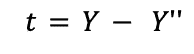
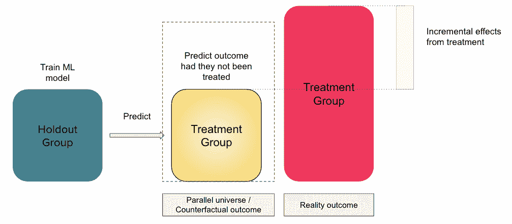
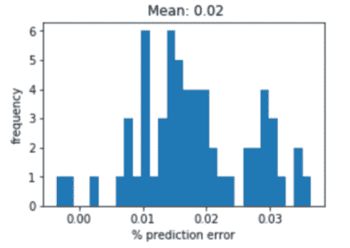
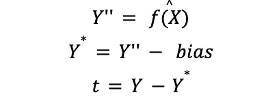
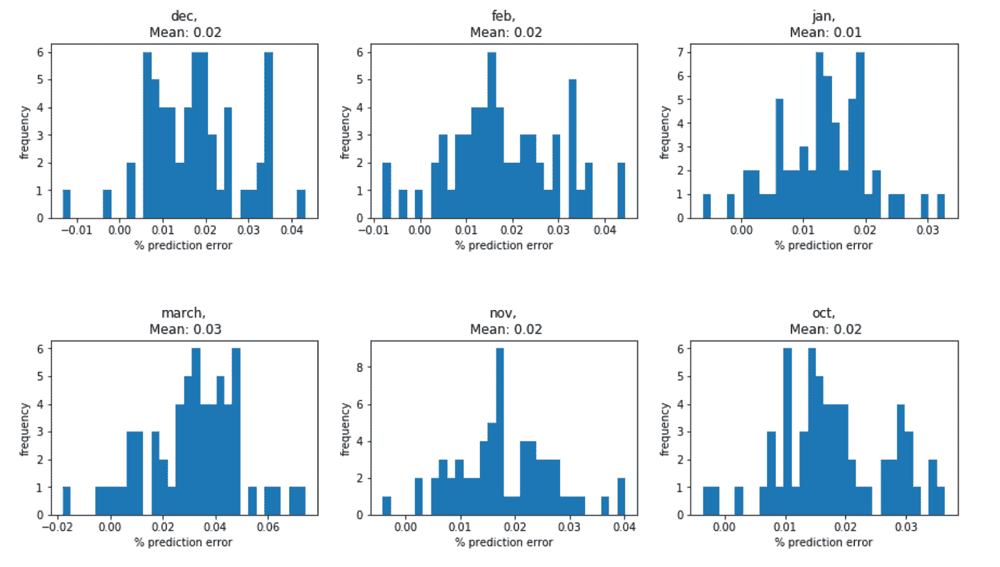
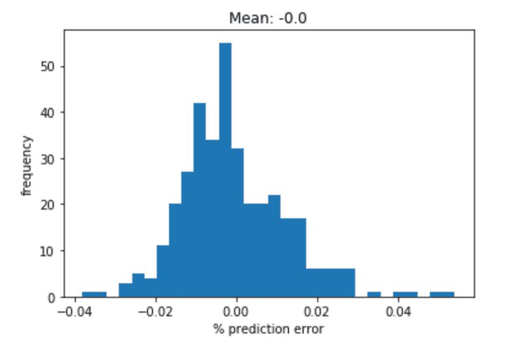
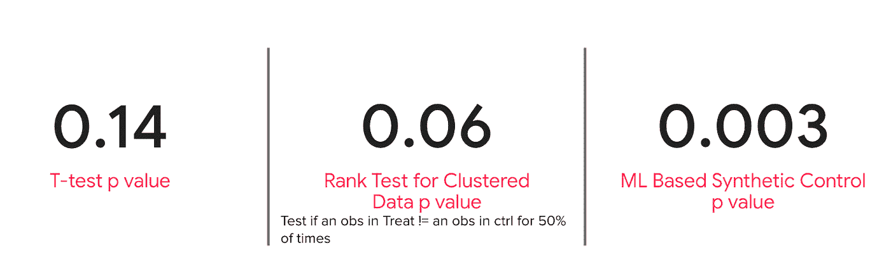

# 人工反事实估计(ACE):Airbnb 基于机器学习的因果推理

> 原文：<https://medium.com/airbnb-engineering/artificial-counterfactual-estimation-ace-machine-learning-based-causal-inference-at-airbnb-ee32ee4d0512?source=collection_archive---------0----------------------->

**By:** [**顾**](https://www.linkedin.com/in/zhiying-gu-2293a353/)**[**吴倩蓉**](https://www.linkedin.com/in/qianrongwu/)**

# **摘要**

**如果你想测量一个变化对你的业务的影响，但是不可能进行随机控制实验，那该怎么办？这正是我们在衡量 Airbnb 运营部门用来自动化其部分工作流程的新工具的好处时所面临的问题。由于组织上的限制，不可能将工具随机分配给操作代理；即使我们可以进行随机分配，样本量也太小，不足以产生足够的统计功效。那我们做了什么？我们想象了一个平行宇宙，其中没有使用新工具的操作人员在所有方面都与使用新工具的人员相同——换句话说，在这个世界中，分配标准几乎是随机的。在这篇博客文章中，我们解释了这种新的方法，称为 **ACE(人工反事实估计)**，它利用机器学习(ML)和因果推理来人工再现随机分配产生的“反事实”场景。我们将解释这在实践中是如何工作的，为什么它比匹配和合成控制等其他方法更好，以及我们如何克服与这种方法相关的挑战。**

# **不可随机操作问题**

**有两个关键的假设支撑着随机对照[实验](/airbnb-engineering/experiments-at-airbnb-e2db3abf39e7)(通常被称为“A/B 测试”):**

1.  **治疗组和对照组相似。当你有相似的组时，结果独立于组属性，如年龄、性别和位置，这意味着组之间的任何差异都可以归因于一个组接受的治疗，而不是另一个组。在统计学术语中，我们假设我们已经控制了所有的混杂因素，从而减少了我们估计的偏差。**
2.  **样本量足够大。大样本量有助于减少两个随机分组之间的机会差异，让我们相信治疗具有真正的因果影响。用专业术语来说，我们假设我们已经减少了估计值的方差，足以给我们适当的统计能力。**

**考虑到在运行 A/B 测试时需要相似的组和大样本量，任何拥有运营团队的组织都会面临挑战。首先，当对操作代理进行随机实验时，人们普遍担心不公平和破坏性体验。第二，运营地点位于不同的国家，员工数量、技能水平等各不相同，因此我们不能简单地将某些地区分配给治疗组，而将某些地区分配给对照组，而不进行比较，这将导致测量的偏差。最后，我们有数百万的客户，但没有数百万的运营代理，所以这个测试的样本量总是比其他实验的样本量小得多。**

# **王牌救援**

**有了 ACE ( **人工反事实估计)**，我们就有了随机实验的下一个最佳选择。诀窍是使用基于机器学习的因果影响估计技术同时实现**偏差减少和方差减少**。**

**因果推断是一个估计反事实结果的过程，如果治疗单位没有得到治疗，就会发生反事实结果。在我们的案例中，我们想知道如果我们的运营代理没有使用新的工作流自动化工具，他们的工作效率会有多高。有许多方法可以构建这种反事实的结果，但最常用的方法是:**

*   **使用随机对照实验中的对照组(不幸的是，在我们的案例中，这通常是不可能的)**
*   **使用匹配方法，如倾向分数匹配(加权)、[粗化精确匹配](https://gking.harvard.edu/files/political_analysis-2011-iacus-pan_mpr013.pdf)或[熵平衡](https://web.stanford.edu/~jhain/Paper/PA2012.pdf)，构建一个与治疗组相似的组**
*   **用时间序列预测构建反事实结果(例如[因果影响模型](https://research.google/pubs/pub41854/))**
*   **将反事实结果构建为所有未治疗单位的加权平均值([综合控制](https://economics.mit.edu/files/11859)、[广义综合控制](https://www.cambridge.org/core/journals/political-analysis/article/generalized-synthetic-control-method-causal-inference-with-interactive-fixed-effects-models/B63A8BD7C239DD4141C67DA10CD0E4F3))**

**我们可以通过使用混杂和非混杂因素作为特征的 ML 预测来构建反事实结果。简而言之，我们使用抵制组(即，未治疗的组)来训练 ML 模型，该模型预测在治疗后期间未治疗的反事实结果。然后，我们将经过训练的模型应用于同期的治疗组**。****预测结果用作反事实(新对照)，代表治疗组在后治疗期(下面等式中的*Y】***)未接受治疗的想象场景。******

************

********上式中， *t* 为观察到的治疗组结果** (Y) **与预测结果**(*Y】’*)之差。它代表了**对影响**的一个*天真的*估计，因为它**是*偏向*。**下图从较高的层面说明了 ACE。如图 1 所示，它有以下步骤:******

1.  ****我们使用来自抵制小组(即没有接受治疗的小组)的数据来训练机器学习模型。****
2.  ****我们将训练好的模型应用于治疗组，以获得我们没有对该组应用治疗的预测结果。****
3.  ****治疗组的实际结果和预测结果之间的差异是估计的影响。****

****在应用它之前，我们将在后面的小节中充实详细的挑战。****

********

****Figure 1: Estimation Process****

# ****ACE 面临的挑战及解决方案****

****发展 ACE 有两个主要的挑战:偏差估计和置信区间的构造。****

# ****挑战 1:偏差估计****

****来自机器学习模型的预测结果***Y”***由于两个原因经常有偏差，导致估计的因果影响 *t* 也有偏差(参见 [Chernozhukov 等人。艾尔。(2018)](https://academic.oup.com/ectj/article/21/1/C1/5056401) )。产生偏差的两个原因是 1)正则化，和 2)过拟合。****

****下图显示了 100 次合成 A/A 测试的 ML 模型预测误差，对于这些测试，估计的影响应该始终为零。然而，很明显，估计值的分布不是以零为中心的。平均预测误差实际上是 2%，这意味着 ML 预测*Y”*平均被高估了 2%。****

********

****Figure 2: Prediction Bias****

# ****挑战 2:构建置信区间****

****与传统的 A/B 测试中的 t-test 不同，当我们进行 ACE 测试时，没有置信区间的解析解。因此，我们必须为估计值构建经验置信区间。为了应对这两个挑战，我们采用了一种经验方法来消除预测中的偏差，然后基于相同的经验方法构建了我们的置信区间。****

****在 ACE 中，我们使用 A/A 测试进行去偏和构建置信区间。****

# ****挑战 1 的解决方案:Debias****

****一个自然的想法是，如果我们可以自信地估计偏差的大小，我们可以简单地通过估计的偏差来调整预测。于是，估计变为:****

********

****从业者可以自由选择任何机器学习模型来使用——*f(X)*——进行 *Y”的预测。*图 2 显示了 100 个 A/A 样本的 2%偏差。问题是:我们能说真正的偏差是 2%吗？如果我们可以系统地验证偏差为 2%(即，在相同时期内不同 A/A 样本之间一致，并且在不同时期可重复)，我们可以说偏差= 2%。图 3 显示了偏置估计随时间的可重复性。估计值总是有偏差的，偏差的平均估计值在 2%左右。图 4 显示了去除偏差后的平均预测误差(2%)。通过偏差修正，估计影响的分布以零为中心。****

********

****Figure 3: the stability of bias estimation****

********

****Figure 4: Distribution of impact estimates based on A/A after bias correction****

# ****挑战 2 的解决方案:构建经验置信区间****

****我们可以使用来自 A/A 测试的数据来构建经验置信区间和 p 值。****

*   ****经验置信区间:更具体地说，95%的置信区间是通过查看 100 个 bootstrapped A/A 样本的分布来构建的。假设我们知道 A/A 测试的真实差异为 0，并且如果 100 次 A/A 测试的 5%的估计影响在[-0.2，0.2]范围之外，那么我们知道 95%置信区间为[-0.2，0.2]。****
*   ****经验 p 值:我们可以通过从 ML 模型估计的 A/A 测试来估计 I 型误差，如下所示。假设我们估计治疗的影响为 3%。p 值是估计当零假设为真时，获得[-3%，3%]之外的估计值的概率-没有影响。这可能是用迭代 A/A 测试的经验分布来估计的。如果概率是 1%，我们将得出结论，我们至少有 98%(即 100%——(1% * 2))的信心，替代假设——影响不为零——是真实的。****

# ****确认****

****为了验证 ACE 是否能够准确地衡量影响，我们进一步从大规模随机 A/B 数据中提取 ACE 数据，并将 ACE 结果与 A/B 测试结果进行比较。A/B 测试的结果被认为是验证的基础，因为 A/B 测试是测量的黄金标准。结果几乎相同。****

# ****ACE 的优势****

****与其他评估方法相比，ACE 有几个优点:****

*   ****在估算模型的选择上具有灵活性。我们可以根据各种用例及数据属性，自由选择任何先进的 ML 模型，以达到所需的精确度..****
*   ****通过进行 A/A 测试，可以在测量计划的设计阶段轻松评估其有效性和准确性。****
*   ****它可以应用于方差减少的实验数据和用于偏差校正以及方差减少的非实验数据。****
*   ****对于实验数据:
    -与回归调整相比，更不容易出现偏差。
    -当 ML 模型具有良好的性能时，与分层相比，它具有更大的威力。
    -与等级测试相比，它评估影响的大小，而不仅仅是影响的存在。****

****您还记得，我们应用 ACE 来评估帮助运营代理自动化部分工作流的工具的增量收益。我们为三种不同的测量方法生成了 p 值:(1)经典 t 检验；(2) [非参数秩检验](https://en.wikipedia.org/wiki/Wilcoxon_signed-rank_test)(3)ACE 非参数检验基于我们在上一节描述的经验置信区间。以下是对相同样本量的 t 检验、秩检验和基于 ML 的方法的性能比较，特别是当样本量很小时，当我们试图像在 A/B 检验中那样用经典 t 检验进行推断时。****

********

# ****概述****

****在这篇博文中，我们解释了如何利用 ML 进行反事实预测，使用了一个代理工具功效的估计问题作为我们的激励例子。****

****当不可能运行 A/B 测试时，结合统计推断和机器学习方法是一种强有力的方法。然而，正如我们已经看到的，如果内在的模型偏差没有得到解决，应用 ML 方法可能是危险的..这篇文章概述了一种实用可靠的方法来纠正这种内在偏差，同时相对于竞争方法来说，最大限度地减少 I 型误差。****

****目前，我们正在努力将我们的代码模板转换成一个易于使用的 Python 包，公司内的所有数据科学家都可以访问它。****

****如果你对这类工作感兴趣，可以看看我们的相关职位！****

****[高级数据科学家—支付](https://careers.airbnb.com/positions/3859241/)****

# ****感谢****

****感谢 Alex Deng 和 Lo-hua Yuan 为 ACE 的开发提供反馈并花时间审查工作。我们还要感谢 Airbnb 实验评审委员会成员的反馈和意见。最后但同样重要的是，我们非常感谢 Joy Zhang 和 Nathan Triplett 的指导，以及 Tina Su、Raj Rajagopal 和 Andy Yasutake 的反馈和支持。****

# ****参考****

*   ****斯特凡诺·m·亚库斯，国王，加里，朱塞佩·波罗，2017。[无平衡检查的因果推理:粗化精确匹配](https://gking.harvard.edu/files/political_analysis-2011-iacus-pan_mpr013.pdf)、*政治分析。*****
*   ****Jens Hainmueller，2012，[因果效应的熵平衡:在观察性研究中产生平衡样本的多元加权方法](https://web.stanford.edu/~jhain/Paper/PA2012.pdf)，*政治分析。*****
*   ****[凯·h·布罗德森](https://research.google/people/KayBrodersen/)，法比安·加卢瑟，吉姆·克勒，[尼古拉斯·雷米](https://research.google/people/NicolasRemy/)，史蒂文·l·斯科特，2015。[利用贝叶斯结构时间序列模型推断因果影响](https://research.google/pubs/pub41854/)，*应用统计年鉴*。****
*   ****阿尔贝托·阿巴迪、亚历克西斯·戴蒙德和延斯·海恩米勒，2010 年。[比较案例研究的综合控制方法:评估加州烟草控制计划的效果](https://economics.mit.edu/files/11859)，*美国统计协会杂志。*****
*   ****徐一清，2017。[广义综合控制方法:用交互式固定效应模型进行因果推断](https://www.cambridge.org/core/journals/political-analysis/article/generalized-synthetic-control-method-causal-inference-with-interactive-fixed-effects-models/B63A8BD7C239DD4141C67DA10CD0E4F3)，*政治分析。*****
*   ****维克多·切尔诺朱科夫，丹尼斯·切特韦里科夫，梅尔特·德米勒，埃丝特·杜弗洛，克里斯蒂安·汉森，惠特尼·纽维，詹姆斯·罗宾斯，2018。[双/去偏置机器学习的处理和结构参数](https://academic.oup.com/ectj/article/21/1/C1/5056401)，*计量经济学杂志。*****

# ****类似主题的进一步阅读****

*   ****[Airbnb 如何衡量未来价值以标准化权衡](/airbnb-engineering/how-airbnb-measures-future-value-to-standardize-tradeoffs-3aa99a941ba5)****

# ************************

*****所有产品名称、标识和品牌都是其各自所有者的财产。本网站中使用的所有公司、产品和服务名称仅用于识别目的。使用这些名称、标志和品牌并不意味着认可。*****