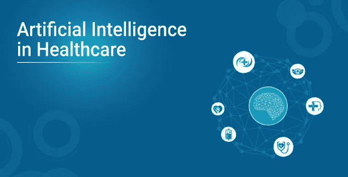
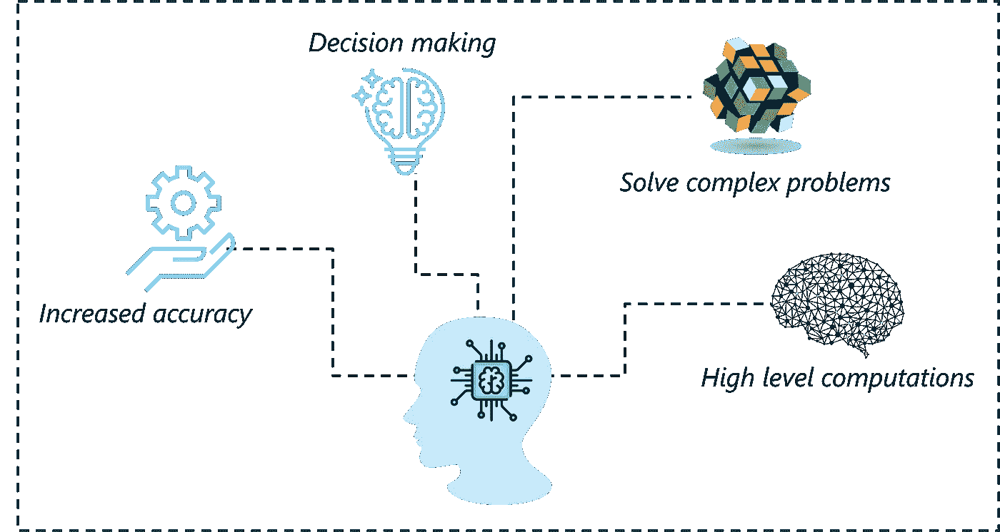
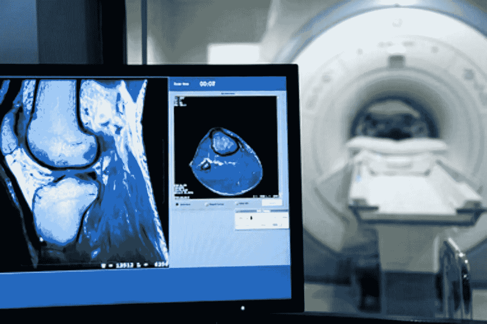

# 在医疗保健领域实施人工智能

> 原文：<https://medium.com/edureka/artificial-intelligence-in-healthcare-1e85a22fc36?source=collection_archive---------3----------------------->



尽管人工智能让我们大多数人感到恐惧，但它在许多方面给我们带来了好处。医疗保健中的人工智能通过提供帮助，正在彻底改变医疗行业。这篇文章将帮助你理解人工智能在医疗保健领域的积极影响。

以下是我将在本文中涉及的主题列表:

1.  什么是人工智能？
2.  医疗保健中的人工智能
3.  什么是机器学习？
4.  什么是深度学习？
5.  亲自动手

# 什么是人工智能？

人工智能是一个使用机器学习、深度学习、自然语言处理和许多其他技术来构建人工智能模型的过程，这些模型可以执行高级计算和解决复杂问题。



*What Is Artificial Intelligence — Artificial Intelligence In Healthcare — Edureka*

要了解更多关于人工智能的信息，您可以浏览以下由我们的人工智能专家录制的全程视频:

**人工智能全程| Edureka**

这个视频将通过实际操作的例子为您提供全面而详细的人工智能概念知识。

现在让我们来理解人工智能是如何影响医疗保健的。

# 医疗保健中的人工智能

自 20 世纪 50 年代引入人工智能以来，它一直在影响着各个领域，包括营销、金融、游戏行业，甚至音乐艺术。然而，人工智能的最大影响是在医疗保健领域。根据普华永道的最新报告，到 2030 年，人工智能将为世界经济增加 15.7 万亿美元，其中影响最大的将是医疗保健领域。

在下面的部分中，你将理解人工智能是如何被用来解决现实世界的用例的。

# 数据管理中的人工智能

人工智能正在通过实施认知技术来解开大量医疗记录并执行电力诊断，从而使医疗保健组织受益。例如，Nuance 是一家预测服务提供商，它使用人工智能和机器学习来预测用户的意图。


通过在组织的工作流中实施 Nuance，人们可以开发个性化的用户体验，使公司能够采取更好的行动来增强客户体验和整体业务利益。

以下是 Nuance 的主要功能列表:

*   服务加速:建议最佳的下一步措施，以确保满足消费者的需求。
*   呼叫转移:通过预测客户的意图并将客户转移到其他在线项目，最大限度地减少呼入量并降低费用。
*   减少流失:使用机器学习和自然语言处理技术来预测潜在客户的行为，这些潜在客户可能会根据他们的历史记录、搜索、情绪等来使他们的服务失效，并采取适当的措施来避免此类服务取消


*   自动化繁琐的任务:通过实现一个自动化系统来根除给用户打电话的单调任务，该系统通过短信或电子邮件发送通知，并使用基于人工智能的聊天机器人来简化事情。

现在我们来讨论一下人工智能是如何利用深度学习技术来改善医疗诊断的。

# 医学诊断中的人工智能

“到 2024 年，由人工智能驱动的医疗成像和诊断将增长 40%以上，超过 25 亿美元。”— 全球市场洞察。在神经网络和深度学习模型的帮助下，人工智能正在彻底改变医学图像诊断领域。它已经接管了复杂的核磁共振扫描分析，并使其成为一个简单的过程。



*   MRI 扫描很难分析，因为它们包含大量的信息。一次正常的核磁共振成像分析需要几个小时，研究人员试图从大量数据中得出结果，等待几个小时，让计算机生成扫描结果。
*   大型复杂的数据集可以在神经网络的帮助下进行分析，这正是麻省理工学院的一个研究小组所实现的。他们开发了一个名为 VoxelMorph 的神经网络，该网络在大约 7000 次 MRI 扫描的数据集上进行训练。
*   神经网络通过在一端输入数据来工作，该数据在整个网络中经历变换，直到形成最终期望的输出。神经网络的工作原理是权重和偏差。

*VoxelMorph 成功击败了传统的核磁共振分析方法。神经网络只需几秒钟就能完成 MRI 分析，而传统的 MRI 程序需要几个小时才能完成同样的分析。*

# 早期检测中的人工智能

人工智能在心脏病发作等医疗状况的早期预测中发挥了关键作用。许多基于人工智能的可穿戴健康追踪器已经被开发出来，用于监控一个人的健康状况，并在设备收集到不寻常或不太可能的东西时显示警告。这种可穿戴设备的例子包括 Fitbit、Apple Watch 和许多其他产品。

“预防总是比治疗好”，这是最新发布的 Apple watch 背后的座右铭。

*   苹果公司利用人工智能制造了一款监测个人健康的手表。
*   这款手表可以收集一个人的心率、睡眠周期、呼吸频率、活动水平、血压等数据。并且 24/7 保持这些测量的记录。
*   然后，通过使用机器学习和深度学习算法来处理和分析这些收集的数据，以建立一个预测心脏病发作风险的模型。

多亏了苹果手表，一个名叫斯科特·基利安的人救了他的命。

# 医疗援助中的人工智能

随着医疗援助需求的增长，基于人工智能的虚拟护士的发展也在增加。根据最近的一项调查，到 2027 年，虚拟护理助理的最大近期价值将达到 200 亿美元。

Sensely 就是这样一个虚拟护士的例子，它实现了自然语言处理、语音识别、机器学习和与医疗设备(如血压袖带)的无线集成，以向患者提供医疗援助。

以下是虚拟护士 Sensely 提供的主要功能列表:

*   自顾
*   临床建议
*   安排约会
*   护士专线
*   ER 方向

随着医疗保健领域的这些革命，很明显，尽管存在风险和所谓的“威胁”，人工智能正在许多方面使我们受益。

# 决策中的人工智能

人工智能在决策中发挥了重要作用。不仅在医疗保健行业，人工智能还通过研究客户需求和评估任何潜在风险来改善业务。

人工智能在决策中的一个强大用例是手术机器人的使用，它可以最大限度地减少错误和变化，并最终帮助提高外科医生的效率。一种这样的外科手术机器人是达芬奇，它的名字很恰当，允许专业外科医生以比传统方法更好的灵活性和控制力来实施复杂的手术。

达芬奇的主要特点包括:

*   用一套先进的仪器帮助外科医生
*   实时翻译控制台上外科医生的手部动作
*   产生手术区域的清晰和放大的 3D 高清晰度图像

手术机器人不仅可以辅助决策过程，还可以通过提高准确性和效率来改善整体性能。

这是人工智能在医疗保健领域的几个现实应用。在整个博客中，我提到了人工智能的两个非常重要的领域，机器学习和深度学习。让我们来理解这些术语的确切含义。

# 使用 Python 进行深度学习

**问题陈述:**研究乳腺癌威斯康星(诊断)数据集，并建模神经网络分类器，预测乳腺癌的阶段为 M(恶性)或 B(良性)。

**数据集描述:**数据集包含样本中细胞核的描述信息。它包含大约 32 个属性/特征，将有助于对特定样本是否为癌症进行分类。你可以在这里找到数据集。

**逻辑:**建立一个二元神经网络，可以将细胞样本正确分类为癌性或非癌性。产生的输出将是包含两个值的分类变量:

现在你已经知道了问题陈述背后的逻辑，是时候戴上你的侦探眼镜开始编码了。

**第一步:导入所需的包**

```
# Linear algebraimport numpy as np# Data processingimport pandas as pd
import matplotlib as mpl
import matplotlib.pyplot as plt
import matplotlib.pyplot as plt2
from sklearn import preprocessing
from subprocess import check_output
```

**第二步:读取输入数据**

```
# Import the data setdata = pd.read_csv('C://Users//NeelTemp//Desktop//data.csv') #Display the first few observations in the data set print(data.head())id diagnosis  ...  fractal_dimension_worst  Unnamed: 320    842302         M  ...                  0.11890          NaN1    842517         M  ...                  0.08902          NaN2  84300903         M  ...                  0.08758          NaN3  84348301         M  ...                  0.17300          NaN4  84358402         M  ...                  0.07678          NaN[5 rows x 33 columns]
```

**第三步:数据处理**

```
# Cleaning and modifying the datadata = data.drop('id',axis=1)data = data.drop('Unnamed: 32',axis=1)# Mapping Benign to 0 and Malignant to 1data['diagnosis'] = data['diagnosis'].map({'M':1,'B':0})# Scaling the dataset
datas = pd.DataFrame(preprocessing.scale(data.iloc[:,1:32]))
datas.columns = list(data.iloc[:,1:32].columns)
datas['diagnosis'] = data['diagnosis']# Creating the high dimensional feature space Xdata_drop = datas.drop('diagnosis',axis=1)X = data_drop.values
```

**第四步:构建神经网络**

```
# Create a feed forward neural network with 3 hidden layers
from keras.models import Sequential, Model
from keras.layers import Dense, Dropout, Input
from keras.optimizers import SGDmodel = Sequential()
model.add(Dense(128,activation="relu",input_dim = np.shape(X)[1]))
model.add(Dropout(0.25))
model.add(Dense(32, activation='relu'))
model.add(Dropout(0.25))
model.add(Dense(32, activation='relu'))
model.add(Dense(1, activation='sigmoid'))
sgd = SGD(lr=0.01, decay=1e-6, momentum=0.9, nesterov=True)
model.compile(loss='binary_crossentropy', optimizer=sgd, metrics=['accuracy'])
```

**第五步:数据拼接和交叉验证**

```
# Fit and test the model by randomly splitting it
# 67% of the data for training and 33% of the data for validation
model.fit(X, datas['diagnosis'], batch_size=5, epochs=10,validation_split=0.33)
# Cross validation analysis
from sklearn.model_selection import StratifiedKFold
# K fold cross validation (k=2)
k = 2
kfold = StratifiedKFold(n_splits=2, shuffle=True, random_state=seed)
cvscores = []
Y = datas['diagnosis']
for train, test in kfold.split(X, Y):
```

**第六步:运行模型**

```
# Fit the model
model.fit(X[train], Y[train], epochs=10, batch_size=10, verbose=0)
Train on 381 samples, validate on 188 samplesEpoch 1/15/381 [..............................] - ETA: 2:39 - loss: 0.5185 - acc: 0.800045/381 [==>...........................] - ETA: 16s - loss: 0.6274 - acc: 0.6444100/381 [======>.......................] - ETA: 6s - loss: 0.5755 - acc: 0.7100155/381 [===========>..................] - ETA: 3s - loss: 0.4560 - acc: 0.7871215/381 [===============>..............] - ETA: 1s - loss: 0.3723 - acc: 0.8326260/381 [===================>..........] - ETA: 1s - loss: 0.3404 - acc: 0.8538305/381 [=======================>......] - ETA: 0s - loss: 0.3252 - acc: 0.8623381/381 [==============================] - 3s 7ms/step - loss: 0.2802 - acc: 0.8845 - val_loss: 0.0870 - val_acc: 0.9628Epoch 2/105/381 [..............................] - ETA: 0s - loss: 0.0647 - acc: 1.0000165/381 [===========>..................] - ETA: 0s - loss: 0.0966 - acc: 0.9758381/381 [==============================] - 0s 314us/step - loss: 0.0944 - acc: 0.9659 - val_loss: 0.0497 - val_acc: 0.9894
```

**步骤 7:模型评估**

```
# evaluate the model
scores = model.evaluate(X[test], Y[test], verbose=0)# Print scores from each cross validation run
print("%s: %.2f%%" % (model.metrics_names[1], scores[1]*100))acc: 97.89%
acc: 97.89%cvscores.append(scores[1] * 100)
print("%d-fold cross validation accuracy - %.2f%% (+/- %.2f%%)" % (k,np.mean(cvscores), np.std(cvscores)))2-fold cross validation accuracy - 97.89% (+/- 0.00%)
```

如你所见，神经网络给出了 97.89%的准确率，这是一个非常好的分数。如果您希望进一步改进模型，可以执行参数调整和优化技术，例如具有更有效值的衰减方法。

就这样，我们结束了医疗保健博客中的人工智能。敬请关注更多关于最热门技术的博客。

如果你想查看更多关于 Python、DevOps、Ethical Hacking 等市场最热门技术的文章，那么你可以参考 [Edureka 的官方网站。](https://www.edureka.co/blog/?utm_source=medium&utm_medium=content-link&utm_campaign=artificial-intelligence-in-healthcare)

请留意本系列中的其他文章，它们将解释数据科学的各个方面。

> *1。* [*数据科学教程*](/edureka/data-science-tutorial-484da1ff952b)
> 
> *2。* [*数据科学*](/edureka/math-and-statistics-for-data-science-1152e30cee73) 数学与统计
> 
> *3。*[*R 中的线性回归*](/edureka/linear-regression-in-r-da3e42f16dd3)
> 
> *4。* [*机器学习算法*](/edureka/machine-learning-algorithms-29eea8b69a54)
> 
> *5。*[*R 中的逻辑回归*](/edureka/logistic-regression-in-r-2d08ac51cd4f)
> 
> *6。* [*分类算法*](/edureka/classification-algorithms-ba27044f28f1)
> 
> *7。* [*随机森林中的 R*](/edureka/random-forest-classifier-92123fd2b5f9)
> 
> *8。* [*决策树中的 R*](/edureka/a-complete-guide-on-decision-tree-algorithm-3245e269ece)
> 
> *9。* [*机器学习入门*](/edureka/introduction-to-machine-learning-97973c43e776)
> 
> *10。* [*朴素贝叶斯在 R*](/edureka/naive-bayes-in-r-37ca73f3e85c)
> 
> *11。* [*统计与概率*](/edureka/statistics-and-probability-cf736d703703)
> 
> *12。* [*如何创建一个完美的决策树？*](/edureka/decision-trees-b00348e0ac89)
> 
> 13。 [*关于数据科学家角色的十大误区*](/edureka/data-scientists-myths-14acade1f6f7)
> 
> *14。* [*顶级数据科学项目*](/edureka/data-science-projects-b32f1328eed8)
> 
> *15。* [*数据分析师 vs 数据工程师 vs 数据科学家*](/edureka/data-analyst-vs-data-engineer-vs-data-scientist-27aacdcaffa5)
> 
> 16。 [*人工智能的种类*](/edureka/types-of-artificial-intelligence-4c40a35f784)
> 
> 17。[*R vs Python*](/edureka/r-vs-python-48eb86b7b40f)
> 
> 18。 [*人工智能 vs 机器学习 vs 深度学习*](/edureka/ai-vs-machine-learning-vs-deep-learning-1725e8b30b2e)
> 
> *19。* [*机器学习项目*](/edureka/machine-learning-projects-cb0130d0606f)
> 
> *20。* [*数据分析师面试问答*](/edureka/data-analyst-interview-questions-867756f37e3d)
> 
> *21。* [*面向非程序员的数据科学和机器学习工具*](/edureka/data-science-and-machine-learning-for-non-programmers-c9366f4ac3fb)
> 
> *22。* [*十大机器学习框架*](/edureka/top-10-machine-learning-frameworks-72459e902ebb)
> 
> *23。* [*统计机器学习*](/edureka/statistics-for-machine-learning-c8bc158bb3c8)
> 
> *24。* [*随机森林中的 R*](/edureka/random-forest-classifier-92123fd2b5f9)
> 
> *25。* [*广度优先搜索算法*](/edureka/breadth-first-search-algorithm-17d2c72f0eaa)
> 
> *26。*[*R 中的线性判别分析*](/edureka/linear-discriminant-analysis-88fa8ad59d0f)
> 
> *27。* [*机器学习的先决条件*](/edureka/prerequisites-for-machine-learning-68430f467427)
> 
> *28。* [*互动 WebApps 使用 R 闪亮*](/edureka/r-shiny-tutorial-47b050927bd2)
> 
> *29。* [*机器学习十大书籍*](/edureka/top-10-machine-learning-books-541f011d824e)
> 
> 三十岁。 [*监督学习*](/edureka/supervised-learning-5a72987484d0)
> 
> *31。* [*10 本最好的数据科学书籍*](/edureka/10-best-books-data-science-9161f8e82aca)
> 
> *32。* [*机器学习使用 R*](/edureka/machine-learning-with-r-c7d3edf1f7b)

*原载于 2019 年 6 月 18 日*[*https://www.edureka.co*](https://www.edureka.co/blog/artificial-intelligence-in-healthcare/)*。*