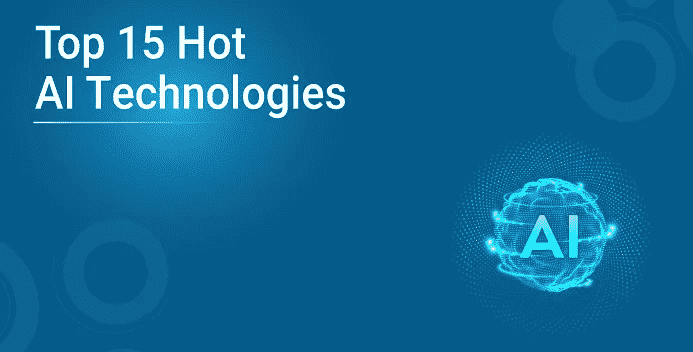
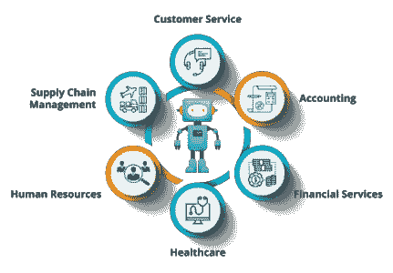
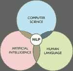

# 2020 年 15 大人工智能技术

> 原文：<https://medium.com/edureka/artificial-intelligence-technologies-c552fe921e43-c552fe921e43?source=collection_archive---------0----------------------->

人工智能诞生于 1955 年，是为了引入计算机科学的一个新学科。随着人工智能技术市场的需求和蓬勃发展，它正在迅速和彻底地改变我们日常生活的各个领域。许多初创企业和互联网巨头之间为收购它们展开了一场激烈的竞争。在本文中，我们将讨论人们应该知道的 15 大热门人工智能技术。

本文将涉及以下几点:

*   自然语言生成
*   语音识别
*   机器学习平台
*   虚拟代理
*   决策管理
*   人工智能优化的硬件
*   深度学习平台
*   机器人过程自动化
*   文本分析和自然语言处理(NLP)
*   生物计量学
*   网络防御
*   内容创作
*   情感识别
*   图像识别
*   营销自动化

那么，让我们开始吧，

# **15 大热门人工智能技术**

## **自然语言生成**

即使对人类来说，高效清晰的交流也是很棘手的。同样，机器处理信息是一个与人脑完全不同的过程，它可能非常棘手和复杂。自然语言生成是人工智能的一个子学科，它将文本转换为数据，并帮助系统尽可能清晰地交流想法和思想。它被广泛用于客户服务，以创建报告和市场总结。像 Attivio，Automated Insights，Cambridge Semantics，Digital Reasoning，Lucidworks，Narrative Science，SAS 和 Yseop 这样的公司都提供自然语言生成。难怪这一项被列为 15 大热门人工智能技术。

## **语音识别**

语音识别用于将人类语音转换成计算机应用程序处理的有用且全面的格式。如今，人类语言向有用格式的转录和转换已经屡见不鲜，而且正在迅速发展。NICE、Nuance Communications、OpenText 和 Verint Systems 等公司提供语音识别服务。

## **机器学习平台**

机器学习是计算机科学的一个分支，也是人工智能的一个重要分支。它的目标是开发新技术，使计算机能够学习，从而变得更加智能。在算法、API(应用编程接口)、开发、训练工具、大数据和应用的帮助下，机器学习平台越来越受欢迎。它们被广泛用于分类和预测。亚马逊、分形分析、谷歌、H2O 人工智能、微软、SAS、Skytree 和 Ad text 是销售机器学习平台的一些公司。

## **虚拟代理**

虚拟代理是指能够与人类有效交互的计算机代理或程序。目前，它通过聊天机器人和智能家居管理器用于客户服务。提供虚拟代理的公司有苹果、谷歌、亚马逊、Artificial Solutions、Assist AI、Creative Virtual、IBM、IPsoft、微软、Satisfi。

## **决策管理**

人工智能机器有能力将逻辑引入人工智能系统，以使它们能够用于培训、维护和调整。为了增加业务价值和利润，决策管理已经被各种组织所采用，通过将它集成到他们的应用程序中来推动和执行自动化决策。提供这种服务的公司有 Informatica、Advanced Systems Concepts、Maana、Pegasystems 和 UiPath。

## **AI 优化硬件**

由于更好和改进的图形以及中央处理器，设备正在被构造和用于执行专门面向人工智能的任务。一个突出的例子是人工智能优化的硅芯片，可以插入任何便携式设备。因此，公司和组织正在大力投资人工智能，以加速下一代应用程序。这项技术服务由 Alluviate、Google、Cray、Intel、IB 和 Nvidia 等公司提供。

## **深度学习平台**

深度学习平台是机器学习的一种形式，它复制了人脑的神经回路，以处理数据并创建决策模式。在这项独特的技术中，算法使用人工神经网络。它的一些应用是自动语音识别、图像识别和对数字领域中任何可以感知的事物的预测。深度学习平台提供商有 Deep Instinct、Ersatz Labs、Fluid AI、MathWorks、Peltarion、Saffron Technology、Sentient Technologies 和 Leverton。

所以在这篇文章中我们已经完成了一半，让我们看看更多的工具。

## **机器人流程自动化**

机器人流程自动化是指由于模仿人工任务而使企业流程发挥作用并使其自动化。在这个特定的领域，重要的是要记住，人工智能不是要取代人类，而是要支持和补充他们的技能和天赋。像 Pega systems、Automation Anywhere、Blue Prism、UiPath 和 WorkFusion 这样的公司关注这一过程。

## **文本分析和自然语言处理(NLP)**

自然语言处理侧重于人类语言和计算机之间的交互。它通过机器学习，使用文本分析来分析句子的结构以及它们的解释和意图。这项技术在欺诈检测和安全系统中被广泛采用。许多自动化助理和应用程序通过 NLP 获得非结构化数据。Basis Technology、Expert System、Coveo、Indico、Knime、Lexalytics、Linguamatics、Mindbreeze、Sinequa、Stratifyd 和 Synapsify 是一些服务提供商。难怪这些术语会进入 15 大热门人工智能技术名单。

## **生物指标**

生物统计学处理对身体结构、形态和人类行为的物理特征的识别、测量和分析。它通过触摸、图像、语音和肢体语言来促进机器和人类之间的有机互动。它主要用于市场研究的目的。#VR、Affectiva、Agnitio、FaceFirst、Sensory、Synqera 和 Tahzoo 提供这种技术服务。

## **网络防御**

网络防御是一种计算机防御机制，旨在检测、预防和减轻对系统数据和基础设施的攻击和威胁。能够处理输入序列的神经网络可以与机器学习技术一起使用，以创建学习技术，从而揭示可疑的用户活动并检测网络威胁。

## **内容创作**

虽然内容是由从事视频、广告、博客和白皮书工作的人创造的；像赫斯特、今日美国和哥伦比亚广播公司这样的品牌正在使用人工智能来生成内容。Wordsmith 是 Automated Insights 创建的一个流行工具，它应用 NLP 来生成新闻故事。

## **情感识别**

这种人工智能技术能够使用高级图像处理或音频数据处理来读取和解释人类表达的情感。执法人员经常在审讯中使用这种技术。一些使用情绪识别的公司超过了 Verbal、nViso 和 Affectiva。

## **图像识别**

图像识别是指识别和检测视频或图像中的特征的过程。它可以极大地帮助图像搜索过程，以及检测车牌，诊断疾病和研究个性。Clarifai、SenseTime 和 GuGum's 提供这项技术服务。

## **营销自动化**

营销和销售团队和部门已经采用了人工智能，并从中受益匪浅。通过自动化客户细分、客户数据集成和活动管理来整合人工智能的方法得到了广泛应用。AdextAI 已经成长为采用营销自动化的先锋。

所以这个 it 家伙，这就把我们带到了这篇文章的结尾。我希望你喜欢这篇文章，它给了你一些新的知识。

说到这里，我们就到此为止了。如果你对这个话题有任何疑问，请在下面留下评论，我们会尽快回复你。如果你想查看更多关于 Python、DevOps、Ethical Hacking 等市场最热门技术的文章，你可以参考 Edureka 的官方网站。

请留意本系列中的其他文章，它们将解释数据科学的各个方面。

> *1。* [*数据科学教程*](/edureka/data-science-tutorial-484da1ff952b)
> 
> *2。* [*数据科学的数学与统计*](/edureka/math-and-statistics-for-data-science-1152e30cee73)
> 
> *3。*[*R 中的线性回归*](/edureka/linear-regression-in-r-da3e42f16dd3)
> 
> *4。* [*数据科学教程*](/edureka/data-science-tutorial-484da1ff952b)
> 
> *5。*[*R 中的逻辑回归*](/edureka/logistic-regression-in-r-2d08ac51cd4f)
> 
> *6。* [*分类算法*](/edureka/classification-algorithms-ba27044f28f1)
> 
> *7。* [*随机森林中的 R*](/edureka/random-forest-classifier-92123fd2b5f9)
> 
> *8。* [*决策树中的 R*](/edureka/a-complete-guide-on-decision-tree-algorithm-3245e269ece)
> 
> *9。* [*机器学习入门*](/edureka/introduction-to-machine-learning-97973c43e776)
> 
> *10。* [*朴素贝叶斯在 R*](/edureka/naive-bayes-in-r-37ca73f3e85c)
> 
> *11。* [*统计与概率*](/edureka/statistics-and-probability-cf736d703703)
> 
> *12。* [*如何创建一个完美的决策树？*](/edureka/decision-trees-b00348e0ac89)
> 
> *13。* [*关于数据科学家角色的 10 大误区*](/edureka/data-scientists-myths-14acade1f6f7)
> 
> *14。*[*5 大机器学习算法*](/edureka/machine-learning-algorithms-29eea8b69a54)
> 
> 15。 [*数据分析师 vs 数据工程师 vs 数据科学家*](/edureka/data-analyst-vs-data-engineer-vs-data-scientist-27aacdcaffa5)
> 
> 16。 [*人工智能的种类*](/edureka/types-of-artificial-intelligence-4c40a35f784)
> 
> *17。*[*R vs Python*](/edureka/r-vs-python-48eb86b7b40f)
> 
> *18。* [*人工智能 vs 机器学习 vs 深度学习*](/edureka/ai-vs-machine-learning-vs-deep-learning-1725e8b30b2e)
> 
> 19。 [*机器学习项目*](/edureka/machine-learning-projects-cb0130d0606f)
> 
> 20。 [*数据分析师面试问答*](/edureka/data-analyst-interview-questions-867756f37e3d)
> 
> *21。* [*面向非程序员的数据科学和机器学习工具*](/edureka/data-science-and-machine-learning-for-non-programmers-c9366f4ac3fb)
> 
> *22。* [*十大机器学习框架*](/edureka/top-10-machine-learning-frameworks-72459e902ebb)
> 
> *23。* [*用于机器学习的统计*](/edureka/statistics-for-machine-learning-c8bc158bb3c8)
> 
> *24。* [*随机森林中的 R*](/edureka/random-forest-classifier-92123fd2b5f9)
> 
> *25。* [*广度优先搜索算法*](/edureka/breadth-first-search-algorithm-17d2c72f0eaa)
> 
> *26。*[*R 中的线性判别分析*](/edureka/linear-discriminant-analysis-88fa8ad59d0f)
> 
> *27。* [*机器学习的先决条件*](/edureka/prerequisites-for-machine-learning-68430f467427)
> 
> *28。* [*互动 WebApps 使用 R 闪亮*](/edureka/r-shiny-tutorial-47b050927bd2)
> 
> *29。* [*机器学习十大书籍*](/edureka/top-10-machine-learning-books-541f011d824e)
> 
> *三十。* [*无监督学习*](/edureka/unsupervised-learning-40a82b0bac64)
> 
> *31.1* [*0 最佳数据科学书籍*](/edureka/10-best-books-data-science-9161f8e82aca)
> 
> 32。 [*监督学习*](/edureka/supervised-learning-5a72987484d0)
> 
> 33。 [*数据科学项目*](/edureka/data-science-projects-b32f1328eed8)

*原载于 2019 年 9 月 26 日*[*https://www.edureka.co*](https://www.edureka.co/blog/top-15-hot-artificial-intelligence-technologies/)*。*