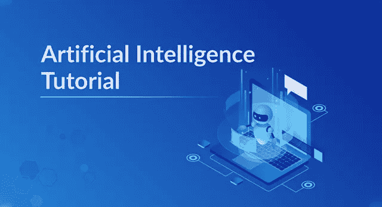
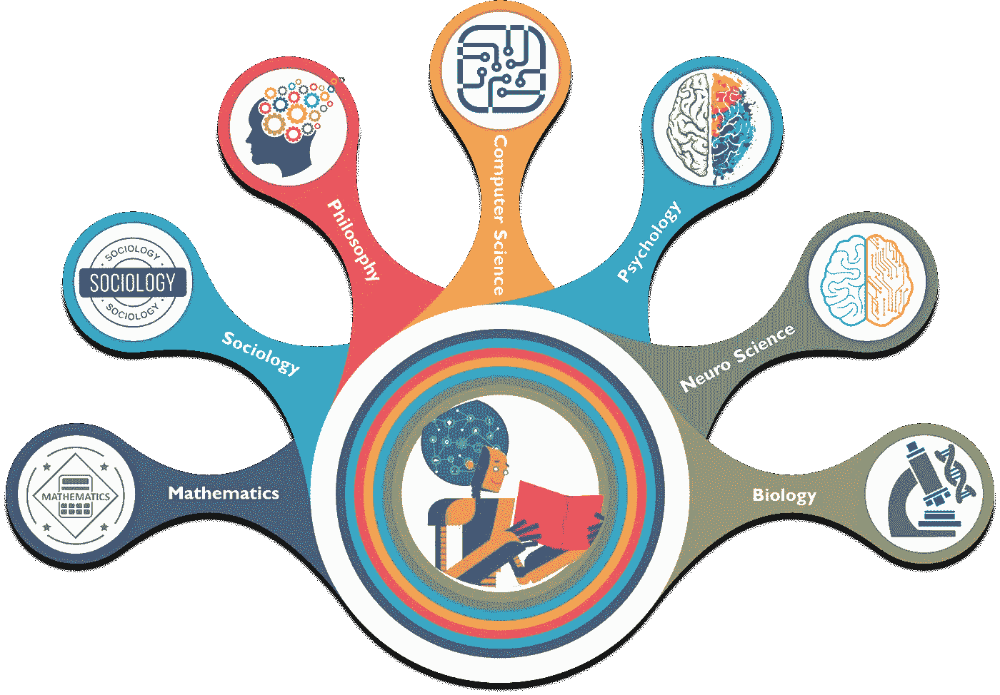
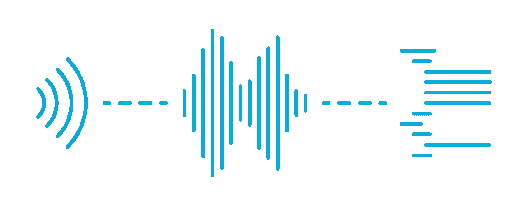
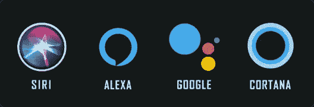
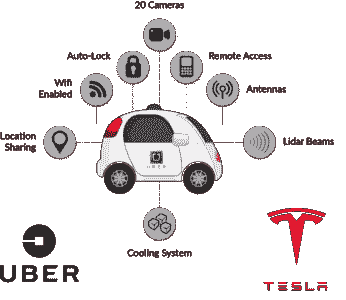
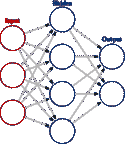
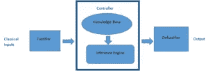
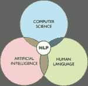
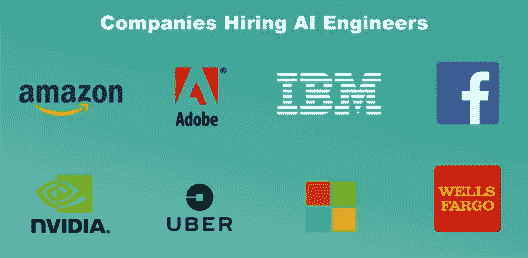

# 人工智能教程——人工智能综合指南

> 原文：<https://medium.com/edureka/artificial-intelligence-tutorial-4257c66f5bb1?source=collection_archive---------1----------------------->

Artificial Intelligence Tutorial - Edureka

人工智能是当今业界的一个时髦词，这是有充分理由的。人工智能或人工智能已经在技术领域取得了如此大的进展，根据 Gartner 的报告，人工智能到 2020 年将创造 230 万个工作岗位，取代它将消除的 180 万个工作岗位。因此，让我们按照以下顺序开始这篇文章:

*   什么是人工智能？
*   人工智能的重要性
*   人工智能应用
*   人工智能领域
*   人工智能中的不同工作简介
*   公司招聘

# 什么是人工智能？

人工智能是一种使机器能够模仿人类行为的技术。人工智能是计算机系统的理论和发展，能够执行通常需要人类智能的任务，如视觉感知、语音识别、决策和语言之间的翻译。

要我说，AI 就是我们编程的机器对人类智能做的模拟。机器需要学习如何推理，并根据需要进行自我修正。

人工智能是通过研究人类大脑在试图解决问题时如何思考、学习、决策和工作来实现的，然后将这项研究的结果作为开发智能软件和系统的基础。所以，让我们继续这个人工智能教程，并理解它的重要性。

# 人工智能的重要性

人工智能(AI)使机器能够从经验中学习，并发展到执行类似人类的任务。你听说过的许多华而不实的人工智能例子，比如**自动驾驶汽车**、**下棋计算机**严重依赖 ***深度学习*** 和 ***自然语言处理*** 。使用这些技术，可以训练计算机通过处理大量数据和识别数据中的模式来完成特定的任务。

有很多领域都对人工智能有贡献，即:

*   数学
*   社会学
*   哲学
*   计算机科学
*   心理学
*   神经系统科学
*   生物

***如果我们看看人工智能的重要性:***

*   AI **通过数据自动化重复学习**和发现。人工智能可以可靠地、无疲劳地执行频繁、大量的计算机化任务
*   AI **为现有产品增加智能**。在大多数情况下，AI 不会作为一个单独的应用程序出售。相反，你已经在使用的产品将通过人工智能功能得到改善，就像谷歌助手作为一项功能被添加到新一代手机中一样。
*   AI **通过渐进式学习算法**进行适应，让数据进行编程。该算法成为分类器或预测器。所以，就像算法可以教会自己如何玩任何游戏一样，它也可以教会自己下一次在线推荐什么产品。
*   AI 使用具有许多隐藏层的神经网络来分析**更多更深层次的数据**。你需要大量数据来训练深度学习模型，因为它们直接从数据中学习。你提供给他们的数据越多，他们就变得越准确。
*   AI **通过深度神经网络实现令人难以置信的准确性**，这在以前是不可能的。来自深度学习、图像分类和对象识别的人工智能技术现在可以用来在核磁共振成像上发现癌症，精确度与训练有素的放射科医生一样。

现在，让我们继续这篇文章，了解人工智能在行业中的各种应用。

# 人工智能的应用

人工智能在行业中有各种各样的应用，下面是我们日常工作中的一些重要应用。

*   **语音识别**

*   **机器翻译**

*   **面部识别和自动标记**

*   **虚拟个人助理**

*   **自动驾驶汽车**

*   **聊天机器人**

# 人工智能领域

如今，人工智能涵盖了很多领域。让我们继续这个人工智能教程，并讨论正在进行大量研究的主要领域，即:

*   **神经网络:**

神经网络是一般机器学习文献中的一类模型。神经网络是一组特定的算法，这些算法彻底改变了机器学习和人工智能。

*   **机器人学:**

机器人学是人工智能的一个分支，由机器人的不同分支和应用组成。人工智能机器人是在真实世界环境中行动的人工智能体。人工智能机器人旨在通过感知、拾取、移动和摧毁物体来操纵物体。

*   **专家系统:**

在人工智能中，专家系统是模拟人类专家决策能力的计算机系统。它是一种计算机程序，使用人工智能(AI)技术来模拟在特定领域拥有专业知识和经验的人或组织的判断和行为。

*   **模糊逻辑系统:**

模糊逻辑是一种基于“真实度”的计算方法，而不是现代计算机所基于的通常的“真或假”(1 或 0)布尔逻辑。模糊逻辑系统可以接受不精确的、失真的、有噪声的输入信息。

模糊逻辑是生活所有领域中复杂问题的解决方案，包括医学，因为它类似于人类的推理和决策。

*   **自然语言处理:**

自然语言处理(NLP)是指使用自然语言与智能系统进行通信的人工智能方法。

通过利用 NLP 及其组件，人们可以组织大量的文本数据，执行大量的自动化任务，并解决各种各样的问题，如机器翻译、命名实体识别、情感分析、语音识别和主题分割等。

# 人工智能职位简介

事实上，根据工作网站，在过去的三年里，对人工智能技能的需求已经超过了**的两倍**，职位发布的数量增长了 **119 %** 。如果没有不同的工作简介，这个人工智能教程将是不完整的。所以，如果人工智能对你有吸引力，你想在人工智能领域工作，那么如果你有人工智能技能，你可以申请不同的工作简介。

## **1。机器学习工程师**

机器学习工程师是复杂的程序员，他们开发可以学习和应用知识而无需特定方向的机器和系统。人工智能是机器学习工程师的目标。

他们是计算机程序员，但他们的重点不仅仅是为机器编写特定的程序来执行特定的任务。他们创造程序，使机器能够采取行动，而无需专门指导来执行这些任务，并每年赚取高达 111，490 美元。

## **2。数据科学家**

数据科学家是那些利用他们在某些科学领域的专业知识来解决复杂数据问题的人。他们研究与数学、统计学、计算机科学等相关的几个要素。

数据科学家的角色是专家的职位。你可以专攻不同类型的技能，如语音分析、文本分析(NLP)、图像处理、视频处理、医学模拟、材料模拟等。这些专家角色的数量非常有限，因此这类专家的价值是巨大的，平均工资为**91，470 美元。**

## **3。人工智能工程师**

人工智能工程师使用算法、神经网络和其他工具，以某种方式推进人工智能领域。工程师还可以在涉及弱人工智能或强人工智能的项目之间进行选择，不同的设置侧重于不同的能力。一名人工智能工程师的工资大约是 105244 美元。

## **4。商业智能开发人员**

商业智能开发人员花费大量时间研究和规划公司内部现有问题的解决方案。商业智能开发人员负责将来自多个来源的数据聚合到一个高效的数据仓库中，并为超大型多维数据库设计企业级解决方案。

商业智能开发人员在提高企业效率和盈利能力方面发挥着关键作用。这是一个需求量很大的职业，年薪中位数为 92278 美元。

## **5。研究科学家**

研究科学家负责设计、承担和分析来自受控实验室调查、实验和试验的信息。你可以为政府实验室、环保组织、专业研究机构或大学工作，平均工资为**105666 美元。**

## **6。大数据工程师/架构师**

大数据工程师和架构师是人工智能领域薪酬最高的工作之一。事实上，他们的年薪中值是 151307 美元。

大数据解决方案架构师负责管理 Hadoop 解决方案的整个生命周期。这包括创建需求分析、平台选择、技术体系结构设计、应用程序设计和开发、测试以及建议解决方案的部署。

# 公司招聘

雇佣顶级人工智能人才的公司从 Argo AI 这样的初创公司到 IBM 这样的科技巨头都有。根据 Glassdoor 的说法，这些是过去一年雇用顶级人工智能人才的领先雇主。

所以，就这样，我们来结束这篇人工智能教程文章。我希望你了解了人工智能的各种要素以及人工智能的应用领域。一个人可以选择的不同工作类型都有合适的技能。

如果你想查看更多关于人工智能、DevOps、道德黑客等市场最热门技术的文章，那么你可以参考 [Edureka 的官方网站。](https://www.edureka.co/blog/?utm_source=medium&utm_medium=content-link&utm_campaign=artificial-intelligence-tutorial)

请留意本系列中的其他文章，它们将解释深度学习的各个其他方面。

> 1.[张量流教程](/edureka/tensorflow-tutorial-ba142ae96bca)
> 
> 2. [PyTorch 教程](/edureka/pytorch-tutorial-9971d66f6893)
> 
> 3.[感知器学习算法](/edureka/perceptron-learning-algorithm-d30e8b99b156)
> 
> 4.[神经网络教程](/edureka/neural-network-tutorial-2a46b22394c9)
> 
> 5.什么是反向传播？
> 
> 6.[卷积神经网络](/edureka/convolutional-neural-network-3f2c5b9c4778)
> 
> 7.[胶囊神经网络](/edureka/capsule-networks-d7acd437c9e)
> 
> 8.[递归神经网络](/edureka/recurrent-neural-networks-df945afd7441)
> 
> 9.[自动编码器教程](/edureka/autoencoders-tutorial-cfdcebdefe37)
> 
> 10.[受限玻尔兹曼机教程](/edureka/restricted-boltzmann-machine-tutorial-991ae688c154)
> 
> 11. [PyTorch vs TensorFlow](/edureka/pytorch-vs-tensorflow-252fc6675dd7)
> 
> 12.[用 Python 进行深度学习](/edureka/deep-learning-with-python-2adbf6e9437d)
> 
> 13.[tensor flow 中的对象检测](/edureka/tensorflow-object-detection-tutorial-8d6942e73adc)
> 
> 14.[张量流图像分类](/edureka/tensorflow-image-classification-19b63b7bfd95)
> 
> 15.[人工智能应用](/edureka/artificial-intelligence-applications-7b93b91150e3)
> 
> 16.[如何成为一名人工智能工程师？](/edureka/become-artificial-intelligence-engineer-5ac2ede99907)
> 
> 17.[问学习](/edureka/q-learning-592524c3ecfc)
> 
> 18. [Apriori 算法](/edureka/apriori-algorithm-d7cc648d4f1e)
> 
> 19.[马尔可夫链与 Python](/edureka/introduction-to-markov-chains-c6cb4bcd5723)
> 
> 20.[人工智能算法](/edureka/artificial-intelligence-algorithms-fad283a0d8e2)
> 
> 21.[机器学习的最佳笔记本电脑](/edureka/best-laptop-for-machine-learning-a4a5f8ba5b)
> 
> 22.[12 大人工智能工具](/edureka/top-artificial-intelligence-tools-36418e47bf2a)
> 
> 23.[人工智能(AI)面试问题](/edureka/artificial-intelligence-interview-questions-872d85387b19)
> 
> 24. [Theano vs TensorFlow](/edureka/theano-vs-tensorflow-15f30216b3bc)
> 
> 25.[什么是神经网络？](/edureka/what-is-a-neural-network-56ae7338b92d)
> 
> 26.[模式识别](/edureka/pattern-recognition-5e2d30ab68b9)
> 
> 27.[人工智能中的阿尔法贝塔剪枝](/edureka/alpha-beta-pruning-in-ai-b47ee5500f9a)

*原载于 2019 年 3 月 1 日*[*【www.edureka.co】*](https://www.edureka.co/blog/artificial-intelligence-tutorial/)*。*