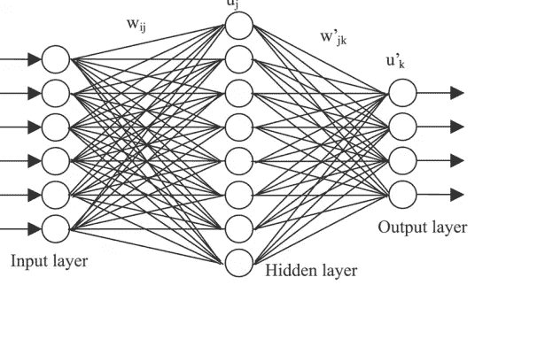
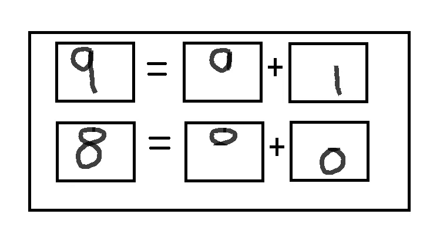
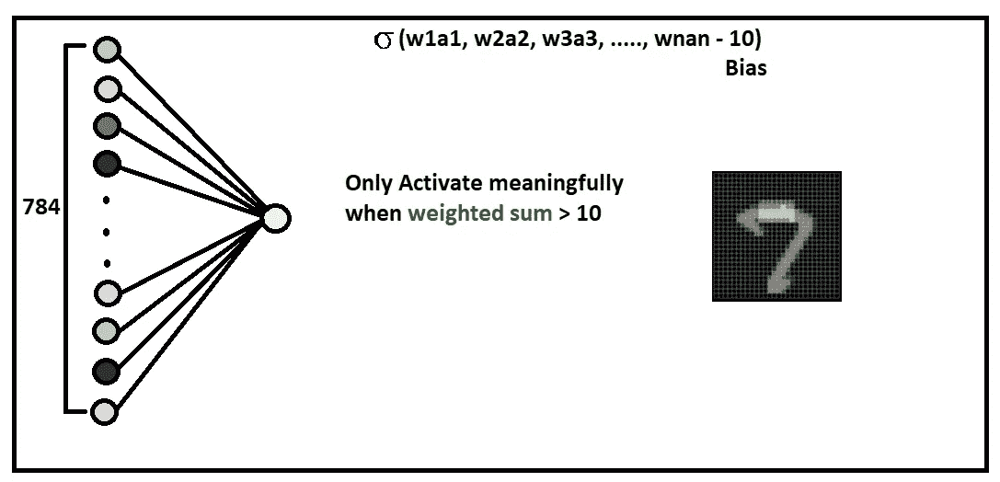

# 人工神经网络

> 原文：<https://medium.com/globant/artificial-neural-networks-74dc96e9621c?source=collection_archive---------2----------------------->

我们已经看过很多关于人工智能的电影，在这些电影中，我们能够完全投入到一个世界中，在这个世界中，人工智能成为朋友、爱人、杀手、士兵、奴隶，并发现它有能力实现令人惊叹的事情，如创造人类的生物工程复制品和创造人工智能以改善军事。人工智能确实是人类最伟大的发明。正如电影中所见，人工智能要么是我们的死亡，要么让我们做不可思议的事情。

AI 代表人工智能。智能是指获得和应用知识和技能以及人类制造或生产的人工手段的能力。人工智能:任何能够感知环境并采取行动以最大化其成功实现目标的机会的设备。一个更详细的定义将 AI 描述为“一个系统正确解释外部数据，从这些数据中学习，并使用这些学习通过灵活的适应来实现特定目标和任务的能力。"

**艾的历史**
了解一下艾的历史。让我们回到 1940-1960 年之间的时代，我们将能够看到来自不同领域(数学、心理学、工程学、经济学和政治学)的少数科学家开始讨论创造人工大脑的可能性，这就是旅程开始的时候。人们开始研究机器学习，机器人技术，神经网络。在这篇博客中，我们将关注神经网络，并看看它是如何在内部工作的。

**那么什么是人工神经网络，它是如何工作的？**
人工神经网络的灵感来源于我们大脑中的神经网络。科学家们研究了我们的大脑是如何工作的，并试图模拟人脑分析和处理信息的方式。

人脑包含大约 1000 亿个被称为神经元的基本单位。神经元是信息信使。他们使用电脉冲和化学信号在大脑的不同区域之间传递信息。每一个神经元都与大约 10⁴的其他神经元相连。突触是一个神经元与另一个神经元通信的接触点。有了这种神经元结构，人脑可以做许多事情，如分析、解释数据，并可以学习新的东西。

类似地，在人工神经网络中，人工神经元是一种数学函数，它获取一个或多个输入数据，对其进行处理，并将信号传输到其他神经元，如人脑中的突触。在这些人工神经网络的帮助下，我们正试图帮助机器做人脑能做的不可思议的事情。

人工神经网络有多种应用，让我们放大其中一个应用，看看它是如何详细工作的。

**以识别手写数字为例**

对我们来说，识别手写数字很容易。不同的人写数字的方式不同，但我们仍然能够识别数字。但是，如果我们被要求写一个程序来识别数字的输入将是说 28 * 28 网格，那么这将是一个相对困难的任务。

通过使用神经网络，让我们看看如何解决在 28 * 28 网格中识别手写数字的问题。网格中的每个元素称为一个神经元。因此，我们总共有 784 个神经元数据将被输入系统。

每个神经元保存相应像素的灰度值，范围从黑色像素的 0 到白色像素的 1。这个灰度数称为激活。所以这 784 个神经元构成了我们网络的第一层。
最后一层可能包含 10 个 0 到 9 之间的神经元，并且每个神经元都会有一些激活(0-1 之间的一些数目)。因此，最后一层中最活跃的最亮神经元就是网络认为给定的数字。

这个网络中间可能有一些隐藏层。
一层的激活决定了另一层的激活。想象一层中的激活对应于隐藏层中的一些激活模式，隐藏层对应于输出层中的激活，基于最后一层中的激活，你得到你的输出。

现在，为什么我们需要所有这些层？那些隐藏层实际上在做什么？
以识别数字 9 为例。为了识别，我们应该把数字分成更小的部分，以便更好地理解它。像 9 上面有一个循环，下面有一条线。现在 8 在顶部也有一个循环，但这次在底部也有一个循环。
在第一层中，假设所有在顶部有回路的神经元被激活，在第二层中，8 被删除，因为我们需要在下面的部分有一条线，这就是 9 在输出层中被激活的方式。

我们还可以在中间引入更多的层来再次分解圆和直线，使网络更加精确。在这样做的同时，我们也将在我们的神经元和第一层中的神经元之间分配一些权重。现在基于前一层的激活，我们将根据它们的权重计算它们的加权和。因此，为了识别任何模式，比如循环，我们将调整我们的权重，以便激活循环像素，而不激活所有其他周围像素(即，朝向 0)。
我们需要我们的激活在 0 到 1 的范围内。要做到这一点，我们需要使用一些函数，将我们的加权和，并适合它在 0 到 1 之间的规模。这个函数被称为 Sigmoid。你可能还需要你的神经元不仅在加权和大于 0 时被激活，而且在加权和大于 10 时也被激活。要做到这一点，我们可以简单地从我们的加权和中减去
数。这个数字叫做偏差。偏差值允许激活功能向左或向右移动。因此，权重的变化会改变 sigmoid 曲线的陡度，而偏差会移动整个曲线，以便更好地拟合数据。

我们对每个连接都有权重，对每个神经元都有偏好，这给了我们很大的空间来利用网络。我们可以调整所有的权重和偏差，使网络表现不同，更准确。是不是很牛逼…

一旦产生了输出，学习并没有结束。人工智能模型将因其如何产生输出而获得奖励或惩罚，该模型甚至可以从其过去的经验中学习，并可以调整自己以最大化奖励。这就是所谓的强化学习。这可能是我博客的下一个主题:)

在这篇博客中，我刚刚介绍了人工神经网络的一个用例。除了简单地识别手写数字，它还可以做很多事情。
现在有很多框架和实用程序可用于处理神经网络，如 Deeplearning4j、TensorFlow、Keras。下载其中一个，玩玩看。

快乐编码快乐学习……

**参考文献**

1.  艾:[https://en.wikipedia.org/wiki/Artificial_intelligence](https://en.wikipedia.org/wiki/Artificial_intelligence)
2.  Deeplearning4j (O *pen-source，分布式，用于 JVM 的深度学习库*):[https://deeplearning4j.org/](https://deeplearning4j.org/)
3.  张量流:[https://www.tensorflow.org/tutorials](https://www.tensorflow.org/tutorials)