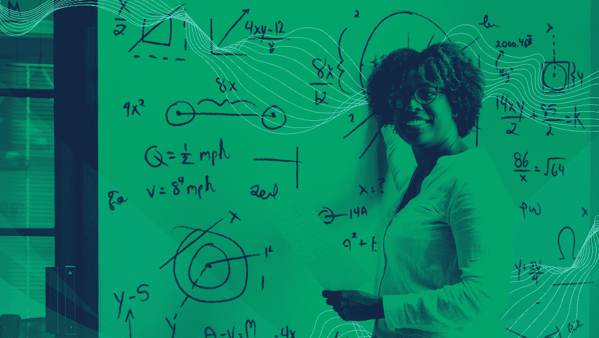
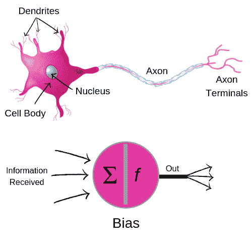
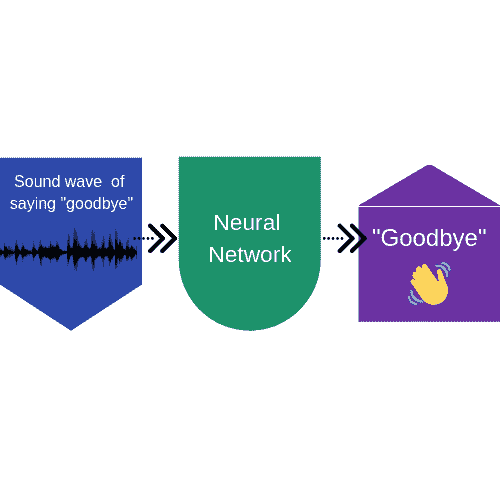
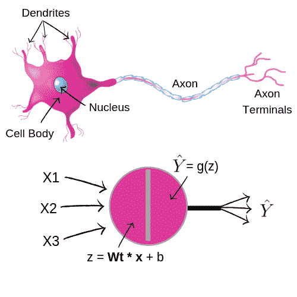
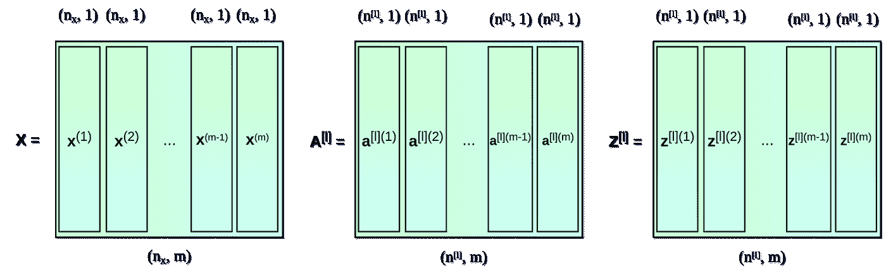
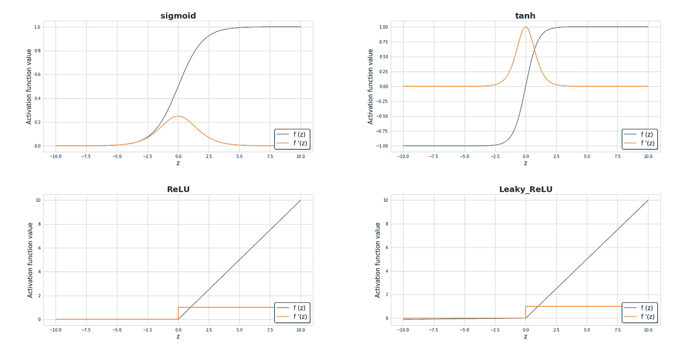

# 用于机器学习的人工神经网络

> 原文：<https://medium.com/capital-one-tech/artificial-neural-networks-for-machine-learning-79c67d0681e9?source=collection_archive---------4----------------------->

机器学习算法介绍系列的第 5 部分

*我们已经讲述了* [*k 近邻*](/capital-one-tech/k-nearest-neighbors-knn-algorithm-for-machine-learning-e883219c8f26) *和* [*k 均值聚类*](/capital-one-tech/k-means-clustering-algorithm-for-machine-learning-d1d7dc5de882) *，和* [*朴素贝叶斯分类器*](/capital-one-tech/naives-bayes-classifiers-for-machine-learning-2e548bfbd4a1) *，和* [*随机森林算法*](/capital-one-tech/random-forest-algorithm-for-machine-learning-c4b2c8cc9feb) *，今天我们将讲述人工神经网络。*

# 介绍

人工神经网络(ANN)是目前机器学习领域的一个热门词汇——无论是对技术专家还是日常用户而言。我们每天都看到这些算法在工作，对安全图像进行分类，当你去解锁手机时识别你的脸，并解释你的语音命令。在当今这个技术驱动的世界，我们每天都在使用神经网络，在各种各样的地方，你可能都没有意识到！

然而，虽然应用程序可能是新的，但技术本身已经存在一段时间了。自 1943 年以来，人工神经网络一直存在，当时它们首次出现在沃伦麦卡洛克和沃尔特皮茨的论文[“神经活动中内在思想的逻辑演算”](http://www.cse.chalmers.se/~coquand/AUTOMATA/mcp.pdf)中，描述了人工神经元网络如何用于解决各种逻辑问题。然而，直到 1969 年，一种叫做[反向传播](https://en.wikipedia.org/wiki/Backpropagation)的技术被创造出来，它们才被广泛使用。这项技术允许人工神经元在他们提出的解决方案不是预期的解决方案时进行自我调整。它通过允许研究人员创建自我调整的网络来修改神经元之间的连接，从而提高了网络的准确性。

今天，由于可用数据量和计算能力的增加，人工神经网络越来越受欢迎。在过去，这是阻碍研究人员在学术环境中使用它们的两个因素。现在我们有了比以往更多的数据和更快的计算机处理速度，我们可以在更实际的环境中恰当地应用人工神经网络。

你可能在想，*“那么，人工神经网络到底是什么？”*它们是模仿人脑的系统，模仿我们学习和决策的方式。这些网络由输入和输出层以及隐藏层组成，类似于我们大脑中的神经网络。

每一层都只是一组神经元。输入层代表我们提供给人工神经网络的数据。输出层是显示算法结果供我们检查的地方。在具有更多信息和更多复杂性的情况下，在输入和输出层之间存在执行额外计算的隐藏层。

具有一个以上隐藏层的神经网络被分类为深度学习，并且它们的深度由隐藏层的确切数量来确定。

**优点:**

*   高绩效。
*   解决人类无法概念化的问题。
*   可用于回归和分类问题。
*   可以处理大量数据。

**缺点:**

*   “黑箱”性质，这意味着研究人员很难理解为什么人工神经网络会得出这样的结论，因为很难追溯这些模型产生的数值。
*   训练模型的时间更长。
*   需要大量数据，比典型算法更多。
*   由于所需的计算能力的数量而昂贵。

人工神经网络非常强大和准确，尤其是在我们现在拥有大量数据的情况下。然而，它们仍然是监督学习模型，这意味着研究人员必须正确标记数据，以便训练模型并取得结果。

# 在哪里使用人工神经网络

人工神经网络不仅用于尖端的机器学习应用，还用于已经存在了几十年的情况和应用。名为 MADALINE 的人工神经网络实际上是 1959 年第一个应用于现实世界问题的人工神经网络。这种型号使用一层作为声音过滤器来消除电话线产生的回声。

人工神经网络最近的一个应用是在语音识别技术中。对于这种应用，人工神经网络必须经过训练，以准确理解不同声音和口音的人在说什么。这些数据是通过观察声波背后的数学和某个单词的构成来训练的。一旦这些数据经过适当的训练，您就可以将数据输入到模型中，并允许隐藏层进行计算。这些层学习区分模仿语言的波型。一旦这些隐藏层输出准确的信息，该模型就可以用于识别人类发出的不同语音命令。

# 人工神经网络背后的数学原理

今天，有多种程序可以为你建立人工神经网络。在使用它们时，开发者的主要任务是确定层数、每层神经元的数量、激活函数以及 [epoch](https://en.wikipedia.org/wiki/Epoch) 值(或参考时间点)。这需要对线性代数有深刻的理解，但是如果你对这类数学不太熟悉，我会尽量让它简单易懂。

首先，让我们从单个神经元背后的数学开始。

每个神经元都有一个权重( *wT* )和偏差的列向量，每个向量都随着神经元从训练数据中学习而变化。模型每次运行 *z* (向量的加权平均值)，都要重新计算。这个结果然后被传递到一个激活函数中。

现在，让我们来看看神经元的层次。为了确定层背后的数学，你必须查看从单个神经元中找到的 *z* 值，并使用它们来创建矩阵方程。

如果你不熟悉矩阵，这就相当复杂了，所以我会给你看一张图。

[https://towardsdatascience.com/https-medium-com-piotr-skalski92-deep-dive-into-deep-networks-math-17660bc376ba](https://towardsdatascience.com/https-medium-com-piotr-skalski92-deep-dive-into-deep-networks-math-17660bc376ba)

**如果你想更深入地研究线性代数，读读** [**这个**](https://towardsdatascience.com/https-medium-com-piotr-skalski92-deep-dive-into-deep-networks-math-17660bc376ba) **。**

人工神经网络高度依赖于激活函数，这使得它们能够遵循非线性模型并非常快速地学习数据。以下是一些最受欢迎的方法，您可以选择实施:

[https://towardsdatascience.com/https-medium-com-piotr-skalski92-deep-dive-into-deep-networks-math-17660bc376ba](https://towardsdatascience.com/https-medium-com-piotr-skalski92-deep-dive-into-deep-networks-math-17660bc376ba)

还有一种叫做[损失函数](https://en.wikipedia.org/wiki/Loss_function)的东西，用于确定人工神经网络的结果有多精确，或者网络如何收敛。该函数用于根据训练数据和输出图层来确定我们离实现准确预测还有多远。

如您所见，神经元的值以及神经元的层由每个神经元的权重和偏差值决定。为了确定这些值，我们必须查看[梯度下降函数](https://en.wikipedia.org/wiki/Gradient_descent)，这是微积分中常用的函数。通过查看损失函数，每次计算的梯度可以帮助我们确定是否需要增加或减少我们的 *w* 和 *b* 值。这个梯度是用反向传播计算的，我在引言中简单提到过。

# 结论

正如你所看到的，人工神经网络依赖于线性代数和微积分，这使得它们非常注重数学。如果你对这些模型有进一步的兴趣，那么你必须学习基本向量、矩阵和导数。构建和实现人工神经网络需要对这些概念有深刻的理解。没有这门学科的过硬本领，是不可能计算出 ANN 背后的公式的。

随着我们开发新技术，收集的数据量和计算能力的增加，人工神经网络只会继续普及。对于那些对机器学习领域感兴趣的人来说，加深对这种算法的理解是极其重要的。

要获得更多资源，请查看一些使用人工神经网络的项目:

*   [神经网络:操场练习](https://developers.google.com/machine-learning/crash-course/introduction-to-neural-networks/playground-exercises)
*   [使用 R 的神经网络练习](https://www.r-bloggers.com/neural-networks-exercises-part-1/)
*   [使用 Python 构建自己的神经网络](https://towardsdatascience.com/how-to-build-your-own-neural-network-from-scratch-in-python-68998a08e4f6)

# 相关:

*   [机器学习的 K 均值聚类算法](/capital-one-tech/k-means-clustering-algorithm-for-machine-learning-d1d7dc5de882)
*   [机器学习的 K-最近邻(KNN)算法](/capital-one-tech/k-nearest-neighbors-knn-algorithm-for-machine-learning-e883219c8f26)
*   [用于机器学习的朴素贝叶斯分类器](/capital-one-tech/naives-bayes-classifiers-for-machine-learning-2e548bfbd4a1)
*   [机器学习的随机森林算法](/capital-one-tech/random-forest-algorithm-for-machine-learning-c4b2c8cc9feb)

披露声明:2019 首创一。观点是作者个人的观点。除非本帖中另有说明，否则 Capital One 不隶属于所提及的任何公司，也不被这些公司认可。使用或展示的所有商标和其他知识产权是其各自所有者的财产。