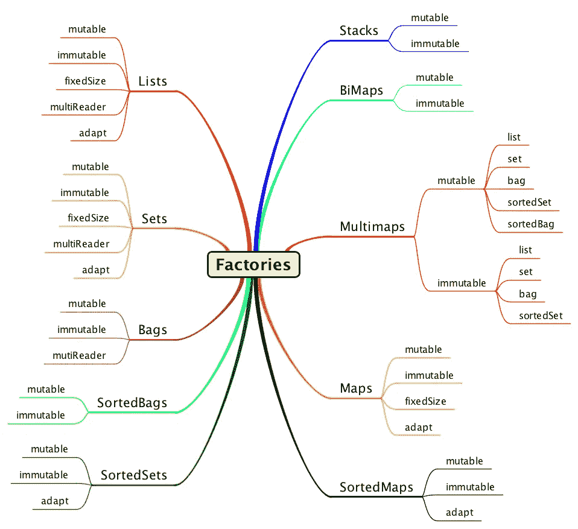

# 就工厂而言，工厂很重要

> 原文：<https://medium.com/oracledevs/as-a-matter-of-factory-factories-matter-482d8adff094?source=collection_archive---------0----------------------->

我们在 Java 中一直在创建集合，所以让它变得简单是 [Eclipse Collections](https://github.com/eclipse/eclipse-collections) 的首要任务。

Factories have plural names in Eclipse Collections

# 关于工厂的事实

我发表了三篇关于 Eclipse 集合中可用工厂的博客。对于对象和原始类型，Eclipse 集合中的每种类型都有静态工厂。下面的博客有可变、不可变和方法链工厂的例子。

 [## 作为工厂事务—第 1 部分(可变)

### 在过去的一年里，我阅读了一些关于 Java 9 即将推出的新特性的博客、文章和推文。有些文章…

medium.com](/@donraab/as-a-matter-of-factory-part-1-mutable-75cc2c5d72d9)  [## 工厂问题—第 2 部分(不可变)

### 在这个关于集合工厂的博客系列的第 1 部分中，我说明了 Eclipse 集合中的工厂类如何能够…

medium.com](/@donraab/as-a-matter-of-factory-part-2-immutable-8cb72ff897ee)  [## 工厂问题—第 3 部分(方法链接)

### 了解如何通过利用 Eclipse 中一些不太为人所知的 API，流畅地在 Java 集合中添加或删除元素…

medium.com](/oracledevs/as-a-matter-of-factory-part-3-method-chaining-224217074d31) 

# 介词偏好

一些开发人员更喜欢名为“of”的工厂方法。有些开发人员更喜欢名为“with”的工厂方法。Eclipse Collections 对这两者都提供了支持，除了在方法链接方面,“with”是唯一的选项。阅读下面的博客来理解对称性如何帮助验证这个决定。

 [## 介词偏好

### 怎么了？一个介词。

medium.com](/@donraab/preposition-preference-1f1c709b098b) 

# 代码示例

这里有一个要点，展示了 Eclipse 集合中对象和原始工厂的各种例子。

[*月食收藏*](https://github.com/eclipse/eclipse-collections) *为* [*投稿*](https://github.com/eclipse/eclipse-collections/blob/master/CONTRIBUTING.md) *。如果你喜欢这个库，你可以在 GitHub 上让我们知道。*