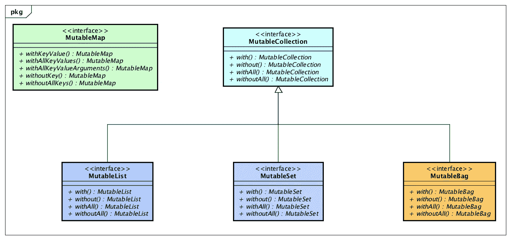

# 工厂问题—第 3 部分(方法链接)

> 原文：<https://medium.com/oracledevs/as-a-matter-of-factory-part-3-method-chaining-224217074d31?source=collection_archive---------0----------------------->

学习如何通过利用 [Eclipse 集合](https://github.com/eclipse/eclipse-collections)中一些不太为人所知的 API，流畅地在 Java 集合中添加或删除元素。


Let’s take a look under the hood at some lesser known APIs in Eclipse Collections.

# 静态工厂

在“工厂问题”博客系列的第一期[、第二期](/@donraab/as-a-matter-of-factory-part-1-mutable-75cc2c5d72d9)[和第二期](/@donraab/as-a-matter-of-factory-part-2-immutable-8cb72ff897ee)中，我描述了如何使用`Lists`、`Sets`和`Maps`类中可用的方法来创建和初始化可变和不可变集合。例如，Lists 类中有静态实例`MutableListFactory`和`ImmutableListFactory`，它们存储在名为*可变*和*不可变*的公共静态最终变量中。

```
MutableList<String> list = 
    Lists.mutable.with("1", "2", "3");

ImmutableList<String> list = 
    Lists.immutable.with("1", "2", "3");
```

方法`with`在`MutableListFactory`类上重载。一个版本的`with`方法不带参数，返回一个空的`MutableList`。该方法的另一个版本采用一个 *varargs* 参数，它将使用指定的参数构造一个`MutableList`。

# 流畅多变的界面

静态工厂方法并不是初始化`List`、`Set`、`Bag`或`Map`的唯一方法。可变接口上有直接可用的方法，可以用来流畅地改变集合。每个方法都会通过添加或移除元素来改变基础集合，然后返回相同的集合。



Fluent methods available on Mutable interfaces for mutating collections

## JDK 接口的等效方法

*   `with`->-`add`
*   `without`->-`remove`
*   `withAll`->-`addAll`
*   `withoutAll`->-`removeAll`
*   `withKeyValue`——>——
*   `withoutKey`->-`removeKey`

# 流利地构建地图

`MutableListFactory`上的`with`方法可以构造一个具有可变项数的`MutableList`，但是对于`MutableMapFactory`来说就不一样了。`MutableMapFactory`上的`with`方法过载五次。

```
<K, V> MutableMap<K, V> with();
<K, V> MutableMap<K, V> with(K key, V value);
<K, V> MutableMap<K, V> with(K key1, V value1, K key2, V value2);
<K, V> MutableMap<K, V> with(K key1, V value1, K key2, V value2, K key3, V value3);
<K, V> MutableMap<K, V> with(K key1, V value1, K key2, V value2, K key3, V value3, K key4, V value4);
```

您只能使用`with`方法创建一个最多有四个键和值的`MutableMap`。

```
MutableMap<Integer, String> map =
        Maps.mutable.with(
                1, "One",
                2, "Two",
                3, "Three",
                4, "Four");
```

## 如果需要四个以上的键和值，该怎么办？

在`MutableMap`上有一个名为`withKeyValue`的方法，通过利用方法链接，它可以用来流畅地添加无限数量的键和值对。

## 使用 withKeyValue 流畅地构建一个可变映射

```
MutableMap<Integer, String> numbers =
        Maps.mutable.<Integer, String>empty()
                .withKeyValue(0, "Zero")
                .withKeyValue(1, "One")
                .withKeyValue(2, "Two")
                .withKeyValue(3, "Three")
                .withKeyValue(4, "Four")
                .withKeyValue(5, "Five")
                .withKeyValue(6, "Six")
                .withKeyValue(7, "Seven")
                .withKeyValue(8, "Eight")
                .withKeyValue(9, "Nine")
                .withKeyValue(10, "Ten");

Assert.assertEquals("Zero", numbers.get(0));
Assert.assertEquals("One", numbers.get(1));
Assert.assertEquals("Ten", numbers.get(10));
```

## withKeyValue 方法

```
public MutableMap<K, V> withKeyValue(K key, V value)
{
    this.put(key, value);
    return this;
}
```

## 流畅地构建一个不变的地图

```
ImmutableMap<Integer, String> numbers =
        Maps.mutable.<Integer, String>empty()
                .withKeyValue(0, "Zero")
                .withKeyValue(1, "One")
                .withKeyValue(2, "Two")
                .withKeyValue(3, "Three")
                .withKeyValue(4, "Four")
                .withKeyValue(5, "Five")
                .withKeyValue(6, "Six")
                .withKeyValue(7, "Seven")
                .withKeyValue(8, "Eight")
                .withKeyValue(9, "Nine")
                .withKeyValue(10, "Ten")
                .toImmutable();

Assert.assertEquals("Zero", numbers.get(0));
Assert.assertEquals("One", numbers.get(1));
Assert.assertEquals("Ten", numbers.get(10));
```

## 流畅地构建一个不可变的对象/原语映射

```
ObjectIntMap<String> numbers =
        ObjectIntMaps.mutable.<String>empty()
                .withKeyValue("Zero", 0)
                .withKeyValue("One", 1)
                .withKeyValue("Two", 2)
                .withKeyValue("Three", 3)
                .withKeyValue("Four", 4)
                .withKeyValue("Five", 5)
                .withKeyValue("Six", 6)
                .withKeyValue("Seven", 7)
                .withKeyValue("Eight", 8)
                .withKeyValue("Nine", 9)
                .withKeyValue("Ten", 10)
                .toImmutable();

Assert.assertEquals(0, numbers.get("Zero"));
Assert.assertEquals(1, numbers.get("One"));
Assert.assertEquals(10, numbers.get("Ten"));
```

## 流畅地构建一个不可变的原语/对象映射

```
IntObjectMap<String> numbers =
        IntObjectMaps.mutable.<String>empty()
                .withKeyValue(0, "Zero")
                .withKeyValue(1, "One")
                .withKeyValue(2, "Two")
                .withKeyValue(3, "Three")
                .withKeyValue(4, "Four")
                .withKeyValue(5, "Five")
                .withKeyValue(6, "Six")
                .withKeyValue(7, "Seven")
                .withKeyValue(8, "Eight")
                .withKeyValue(9, "Nine")
                .withKeyValue(10, "Ten")
                .toImmutable();

Assert.assertEquals("Zero", numbers.get(0));
Assert.assertEquals("One", numbers.get(1));
Assert.assertEquals("Ten", numbers.get(10));
```

## 流利地建立一个不可变的原始/原始地图

```
IntCharMap numbers = IntCharMaps.mutable.empty()
        .withKeyValue(0, '0')
        .withKeyValue(1, '1')
        .withKeyValue(2, '2')
        .withKeyValue(3, '3')
        .withKeyValue(4, '4')
        .withKeyValue(5, '5')
        .withKeyValue(6, '6')
        .withKeyValue(7, '7')
        .withKeyValue(8, '8')
        .withKeyValue(9, '9')
        .toImmutable();

Assert.assertEquals('0', numbers.get(0));
Assert.assertEquals('1', numbers.get(1));
Assert.assertEquals('9', numbers.get(9));
```

# 流利地建立清单，集和袋

使用方法链接流畅地构建一个`Map`通常比流畅地构建一个`List`、`Set`或`Bag`更有用。如果您需要，功能仍然存在。

## 流利地建立一个列表

```
ImmutableList<Integer> numbers =
        Lists.mutable.with(1)
                .with(2)
                .with(3)
                .with(4)
                .withAll(Interval.fromTo(5, 10))
                .toImmutable();

Assert.assertEquals(Interval.oneTo(10), numbers);
```

注意，我使用了两种方法来流畅地构建`MutableList`。方法`with`采用单个参数，方法`withAll`采用一个`Iterable`。

## with 方法

```
public MutableList<T> with(T element)
{
    this.add(element);
    return this;
}
```

## withAll 方法

```
public MutableList<T> withAll(Iterable<? extends T> elements)
{
    this.addAllIterable(elements);
    return this;
}
```

## 流利地搭建布景

```
ImmutableSet<Integer> numbers =
        Sets.mutable.with(1)
                .with(2)
                .with(3)
                .with(4)
                .withAll(Interval.fromTo(5, 10))
                .toImmutable();

Assert.assertEquals(Interval.oneTo(10).toSet(), numbers);
```

## 流利地制作一个包

```
ImmutableBag<Integer> numbers =
        Bags.mutable.with(1)
                .with(2)
                .with(3)
                .with(4)
                .withAll(Interval.fromTo(5, 10))
                .toImmutable();

Assert.assertEquals(Interval.oneTo(10).toBag(), numbers);
```

## 流利地建立原始列表、集合和包

```
ImmutableIntList list =
        IntLists.mutable.with(1)
                .with(2)
                .with(3)
                .with(4)
                .withAll(IntInterval.fromTo(5, 10))
                .toImmutable();

Assert.assertEquals(IntInterval.oneTo(10), list);

ImmutableIntSet set =
        IntSets.mutable.with(1)
                .with(2)
                .with(3)
                .with(4)
                .withAll(IntInterval.fromTo(5, 10))
                .toImmutable();

Assert.assertEquals(IntInterval.oneTo(10).toSet(), set);

ImmutableIntBag bag =
        IntBags.mutable.with(1)
                .with(2)
                .with(3)
                .with(4)
                .withAll(IntInterval.fromTo(5, 10))
                .toImmutable();

Assert.assertEquals(IntInterval.oneTo(10).toBag(), bag);
```

# 在收集器 2 中使用 withAll

`withAll`方法对于构建返回集合的收集器非常有用。在 Eclipse 集合的`Collectors2`类中，`withAll`方法被反复用作方法引用。

## Collectors2.toList()

```
public static <T> Collector<T, ?, MutableList<T>> toList()
{
    return Collector.of(
            Lists.mutable::empty,
            MutableList::add,
            MutableList::withAll,
            EMPTY_CHARACTERISTICS);
}
```

## Collectors2.toImmutableList()

```
public static <T> Collector<T, ?, ImmutableList<T>> toImmutableList()
{
    return Collector.<T, MutableList<T>, ImmutableList<T>>of(
            Lists.mutable::empty,
            MutableList::add,
            MutableList::withAll,
            MutableList::toImmutable,
            EMPTY_CHARACTERISTICS);
}
```

## Collectors2.countBy(函数)

```
public static <T, K> Collector<T, ?, MutableBag<K>> 
countBy(Function<? super T, ? extends K> function)
{
    return Collector.of(
            Bags.mutable::empty,
            (bag, each) -> bag.with(function.valueOf(each)),
            MutableBag::withAll,
            EMPTY_CHARACTERISTICS);
}
```

# 有或没有

我们喜欢在 Eclipse 集合中提供良好的对称性。如果您可以流畅地向集合中添加项目，那么能够流畅地从集合中移除项目也是有意义的。

## UnifiedSet 上的 without 方法

```
public UnifiedSet<T> without(T element)
{
    this.remove(element);
    return this;
}
```

这里有一个结合了 Eclipse 集合工厂的一些流畅方面的例子。

```
ImmutableSet<String> strings =
        Sets.mutable.with("or", "without", "you")
                .with("or")
                .without("you")
                .toImmutable();

Assert.assertEquals(Sets.mutable.with("or", "without"), strings);
```

# 最后的想法

希望这篇博客中的信息和例子对你有用。这个博客的灵感来自最近提交给 Eclipse Collections 的 [pull 请求](https://github.com/eclipse/eclipse-collections/pull/699)。Eclipse 集合中有许多隐藏的珍宝。当它们变得不那么容易被发现时，我喜欢写它们。

*我是*[*Eclipse Collections*](https://github.com/eclipse/eclipse-collections)*OSS 项目在*[*Eclipse Foundation*](https://projects.eclipse.org/projects/technology.collections)*的项目负责人。* [*月食收藏*](https://github.com/eclipse/eclipse-collections) *开作* [*投稿*](https://github.com/eclipse/eclipse-collections/blob/master/CONTRIBUTING.md) *。如果你喜欢这个库，你可以在 GitHub 上让我们知道。*