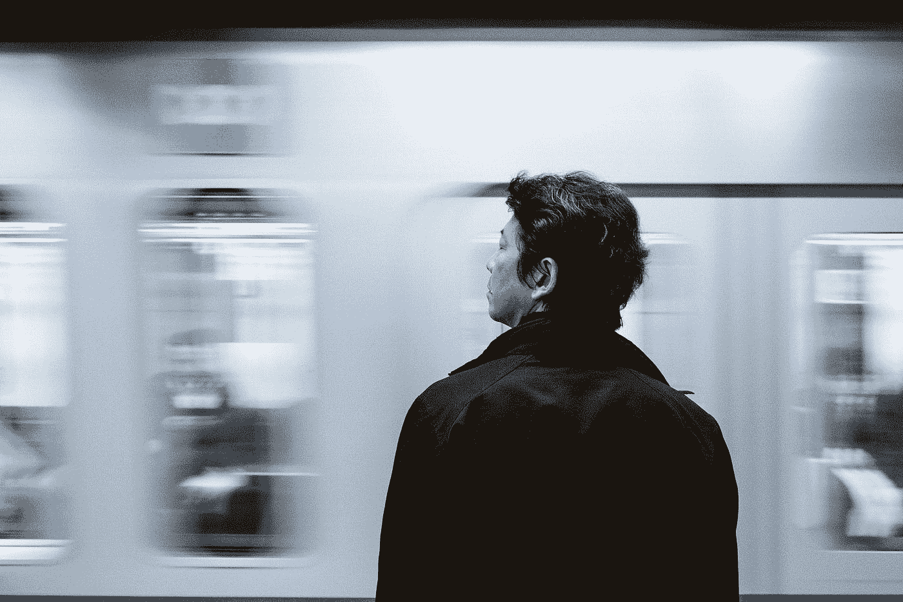

# 由于时间是有限的，你应该考虑如何利用它来工作

> 原文：<https://medium.easyread.co/as-time-is-finite-you-should-consider-how-you-spend-it-for-work-82508b9b3fbe?source=collection_archive---------2----------------------->

## 在不牺牲自己时间的情况下，发展你的事业，增加你的财富

Photo by [Amos Bar-Zeev](https://unsplash.com/@amosbarzeev?utm_source=medium&utm_medium=referral) on [Unsplash](https://unsplash.com?utm_source=medium&utm_medium=referral)

每个在印尼生活的人都知道，你需要在雅加达工作才能获得更好的生活。从小企业到大公司，大多数都位于雅加达，因为它是这个国家的城市地区和首都。我曾经是在雅加达四处寻找机会的人之一。具有讽刺意味的是，尽管前景光明，但对于住在郊区但在雅加达工作的人来说，这是一个漫长而又令人疲惫的过程:

*早起，前往火车站，跳上一辆摩托车出租车，在城市的交通堵塞中冲浪，到达办公室，工作到晚上，跳上一辆摩托车出租车去火车站，最后回家*

有些人对这种惯例没什么意见。但对我来说，我是如此讨厌它。我不喜欢去火车站。这里的公共交通状况远不如其他国家。上午 10 点之前的任何时候，火车总是运力过剩。你甚至不需要抓住把手来保持平衡，因为它里面太挤了，你真的会被人挤压。雅加达的交通堵塞也是非常灾难性的。空气又热又干燥，还有很多污染。到达办公室后，我从未真正有过 100%的精神，因为我一半的精力已经在通勤中消耗掉了。我总是汗流浃背，需要带额外的衣服——因此，我的洗衣费加倍了。

如果我计算我工作+通勤的时间，每天需要 11 个小时。9 小时工作+ 2 小时通勤。所以我在工作日只剩下 5 个小时用于我生活的其他方面，比如朋友、家庭、健康、精神和爱好。我们甚至还没有盘点定性的部分，比如办公室的工作质量、我的心情和我的精力水平。

# 工作不总是关乎收入，也关乎你的开销

费用并不总是财务费用。在生活中，你要处理多种货币。金钱、时间和精力。有了钱，看起来更明显。只要确保你有一个好的收入，不超支，那么你就可以走了。但是时间和精力呢？你不能给你的生活增加更多的时间。我们每个人每天都有 24 小时。你只能管理如何分配你的时间。能量？这也取决于你如何度过你的时间。你花越多的时间在你喜欢的事情上，那些带给你快乐和感激的事情上，你就会有更多的精力。

以前，当我致力于在雅加达工作的整个过程时，我只考虑收入(当然，还有职业发展)。我的工资是多少？我会每年加薪吗？这点工资能省下钱吗？

但是生活不仅仅是工作。你有家人和朋友。你有爱好。你需要注意你的健康和健身。你需要培养你的灵性。你需要花时间反思，为你的未来计划新的想法。

> 为了这一大笔钱，牺牲你的大部分时间，忽略你生活的其他部分，值得吗？

你需要考虑一下。

# 清点你的时间

我对当时的生活不满意。从某种意义上说，我的薪水很高，但我觉得我放弃了很多东西。

让我们盘点一下我们的时间吧！

每天，我们都有 24 小时。我曾经有 8 个小时的睡眠，9 个小时的工作，2 个小时的通勤，总共 1 个小时的浴室时间(一天两次，包括淋浴，梳洗，沉思)，1 个小时的吃饭时间(早餐和晚餐——午餐包含在工作时间内)。因此，我每天只剩下 3 个小时，也就是说，我在工作日还有 15 个小时的空闲时间。

此外，我每周有一次花两个小时的小型事工小组。作为管理小组的负责人，我需要时间来计划和汇报小组会议，这大约需要 1 个小时。所以总的来说，我在工作日只剩下 12 个小时的空闲时间。

# 与时间不同，能量可以弯曲。但是你需要明智地使用它

*12 小时听起来不算太糟。至少，我周末还有时间，对吧？虽然它可能听起来好像给我留了足够的时间，但它并没有给我留下多少精力。*

能量在你的生活中扮演着重要的角色。取决于睡眠、食物、运动等多重因素。返老还童有助于你增强精力，更好地完成工作或其他你需要做的事情。

经常在我通勤回家后，我没有心情或足够的精力去做其他事情。我觉得累了。身体衰竭。我想通过锻炼、与他人交谈、玩耍等方式让自己恢复活力。但是我的身体太累了，不能做所有这些事情！

> “时间是固定的，但能量可以伸缩”
> 自由聚焦，迈克尔·凯悦

当我对自己如何度过时间有了一个高层次的认识后，我问自己:

我真的想这么做吗？为了雅加达的一份工作牺牲其他东西值得吗？在未来，我能挽回我错过的一切吗？我的责任增加了，套路继续这样拖下去怎么办？

# 这个数字时代可以帮助你释放你的时间

没有多少组织接受这样的事实，即数字工作者能够在任何地方工作，并产生与在办公室一样的结果。

说一下背景，我是一名软件工程师。据我所知，一些公司通常会给员工一周只远程工作一两天的额外津贴。我知道的另一家公司只允许远程工作，如果你有紧急的事情，如去医院或处理法律文件，需要离线完成。我在一家允许我偶尔远程工作的公司也有过一次经历，然而，这种来自其他部门的社会压力——因为这种特权只给了技术团队。

令我着迷的是，在印度尼西亚之外，有一些公司 100%远程工作，允许你在自己的时间管理自己的工作。互联网不仅帮助人们从世界的另一端联系起来，而且使我们能够一起工作，这一事实令人惊讶。你能想象当你在当地的咖啡馆享受拿铁咖啡时，你能为你的客户建立网站或写文章吗？再也不需要等到假期去环游世界了。相反，你可以在完成工作的同时去任何你想去的国家。年轻家庭可以开车送孩子去学校，而不用担心他们需要晚 15 分钟到达办公室，这也很棒。这不再是你在办公室花了多少时间(包括日常工作)，而是你能完成的工作质量。无论你在哪里，你的生活是什么样子，你都可以享受时间，建立你想要的生活，同时发展你的事业或让你的客户快乐。

# 给你一些建议

长话短说，我在一家欧洲公司找到了一份远程工作。对我来说，这不是一段轻松的旅程。在开始申请职位空缺之前，我先掌握了一些技能。有了所有的灵活性和它的优点，远程工作是困难的，需要你领域之外的某些技能。如果你想远程工作，这里有一些你需要掌握的重要技能。

## 学术论文交流

因为你的同事没有坐在你旁边，而是在世界的另一边工作，口头或同步交流可能会很困难。如果你习惯于口头交流，你需要学会通过写作来交流你的想法。异步沟通非常重要，因为你不能指望你的同事马上回复你。也许 12 小时后他们就能回复了。为了让自己畅通无阻，你需要能够提前一步思考，提供一些选项，而不是仅仅等待他们回答你的问题。

## 时间管理

灵活性是有代价的。你可能会不停地工作，或者你没有一个连贯的时间表来预测和计划你的一天。时间管理至关重要。你需要能够管理你的时间和你的优先事项，这样你的工作和生活才能平衡。我个人使用时间块来管理我的时间。它帮助我管理我的时间，防止我过度工作。

## 财务管理

如果你有需要按时支付的账单，财务管理也是一个需要解决的重要问题。钱从另一个国家到达你的银行账户需要时间。它在一至三天之间变化。你需要能够处理和计划你的个人现金流。不要让管理不善的财务毁了你的工作表现。

## 值得信赖！

这是你需要具备的所有软硬技能中最重要的部分。如果你不被信任，你所有的技能都毫无意义。这个有很多不同的意思。遵守最后期限，确保在关键时刻可以联系到你，主动传达你的情况和期望，确保你管理好自己的生活，这样就不会降低你的工作表现等等。即使你在现实生活中可能从未见过你的同事或雇主，你也应该保持对他们的信任。

# 结论

工作不应该成为负担。这是我们表达自己并对社会产生影响的一种方式。如果你有数字技能，比如编程、平面设计、写作等等，不要犹豫接受这种平衡工作与生活的特权。