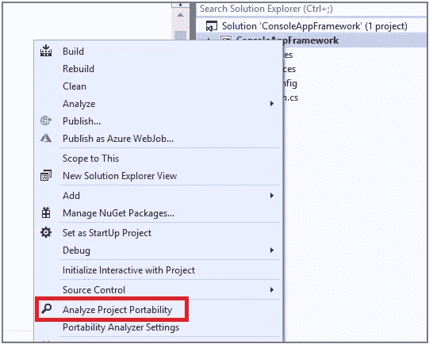
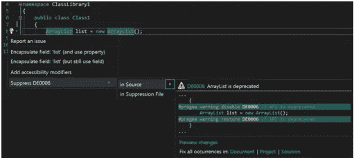
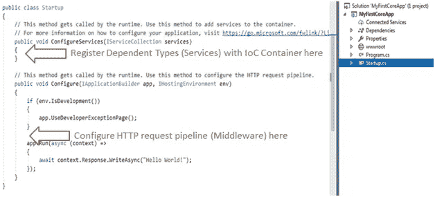

# ASP。净到。网络核心迁移:您需要知道的一切

> 原文：<https://medium.com/quick-code/asp-net-to-net-core-migration-everything-you-need-to-know-5f55bce781e9?source=collection_archive---------0----------------------->

微软不断投资于其技术堆栈，使开发人员能够构建安全和增强的软件产品，使企业能够满足不断变化的客户需求。微软的旗舰云服务和商业智能产品的用户数量没有下降，而开发平台如。Net 与现代功能和增强保持同步发展。

。Net framework 于 2001 年推出，即使在 19 年后，它仍然是开发人员构建可伸缩、安全且功能强大的商业应用程序的首选。ASP。Net Core 是一个广受欢迎的开源 web 框架，它完全重写了 ASP.NET MVC 和 ASP.NET Web API，具有高级功能。

许多版本的。Net 框架正在变得过时，微软在不久的将来将不再支持这些。因此，迁移到一个升级的平台似乎是必要的，以利用你的应用程序中的现代功能。

。Net 平台支持大量的。NET 开发服务，这也是它在未来一段时间内仍将继续的原因之一。。Net Core 确实是未来的趋势，根据最新消息，微软正计划移除 Core 并发布。Net 5 —统一且唯一的。NET 框架的未来。

越来越多。Net 应用程序正在迁移到。Net 核心来构建超现代的解决方案。在这篇文章中，我们将讨论迁移到的每一个可能的原因。Net Core，包括业务优势、顺利迁移的技巧和原因。

好书:。NET 框架与. NET 核心

# ASP。净到。核心网迁移:主要原因

*   **跨平台支持**

ASP。NET Core 开发提供了跨平台的支持，这在以前是不可能的。Net 版本。开发人员可以为 Windows、Mac 和 Linux 平台构建应用程序，它可以用于构建具有现代架构的云和物联网应用程序。

*   **更好的性能和可扩展性**

该框架得到了增强，以提供更好的性能、速度和效率。有了容器化和微服务等现代架构概念，可伸缩性就不是问题了。Net Core 旨在管理由数百个微服务或 Docker 等技术构建的应用程序。

*   **更快的上市时间和安全**

模块化架构、Razor Pages、强大的 UI 组件、定期更新、更广泛的社区支持、安全流程、客户端框架的轻松集成、轻量级、云就绪和内置依赖注入——这些使得开发速度更快，并允许企业利用持续开发和部署。

# 如何从 ASP 迁移？Net 转 ASP。网芯？

以下是的一些基本步骤。净核心迁移:

*   **重定目标**您希望移植到目标的所有项目。NET framework 4.7.2 或更高版本。什么时候。Net 核心不支持特定的 API，这一步确保您可以使用替代的 API。Net Framework 特定的目标。
*   使用。Net 可移植性分析器。该工具分析程序集并判断它们是否可移植到。网芯。

Credit: Microsoft

*   安装。NET API analyzer 来识别在某些平台上引发 PlatformNotSupportedException 的 API，并识别其他潜在的兼容性问题。

Credit: Microsoft

*   使用转换工具将所有 packages.config 依赖项转换为 PackageReference 格式，因为 packages.config 不起作用。网芯。
*   。Net Core 使用比。所以您需要为. NET framework 创建新项目。NET 核心和复制源文件或转换您现有的文件与工具。
*   移植你的测试代码是明智的:移植是一个如此重大的变化，如果事情进展不顺利，它会造成损害。强烈建议移植您的测试项目并运行/测试代码。

## 其他一些重要的事情你需要注意。净核心迁移:

*   的。csproj 文件格式现在在 ASP。网芯。无需在 Visual Studio 中卸载即可编辑该文件。
*   。Net Core 提供了定位的灵活性。网芯，。Net Framework，或者两者都有。
*   在 ASP。Net Core，一个 app 的入口点是 Startup，你对 Global.asax 没有依赖，Startup 必须有一个 Configure 方法。您需要在 Configure 中将必要的中间件添加到管道中。

*Image Source:* [*tutorialsteacher.com*](https://www.tutorialsteacher.com/core/aspnet-core-startup)

*   依赖注入是软件架构中一个有用的概念，其中一个对象提供另一个项目的依赖。这在构建大型、松散耦合、可伸缩的应用程序时非常重要。DI 在这种情况下有所帮助，现在它是点网络核心架构的本地组件。
*   中不支持多值 cookies。网芯。您可以为每个值创建一个 cookie。
*   ASP 中没有应用程序生命周期。Net 核心，中间件处理响应也没有顺序。它不同于模块使用的顺序。你可以这样做:

[**将 HTTP 处理程序和模块迁移到 ASP。NET 核心中间件**](https://docs.microsoft.com/en-us/aspnet/core/migration/http-modules?view=aspnetcore-2.2#modules-and-handlers-revisited) **。**

# 更平滑的有用提示。净到。净核心迁移

任何框架迁移都需要预先计划、持续监控、网络准备、代码安全，以及在出现问题时解决问题的措施。

为了更顺利地迁移，

*   您可以尝试较小的模块/项目，而不是将整个代码库移到。网芯。
*   dotnet try-convert 工具帮助您将项目转换为。Net Core，但它不是保证的解决方案，它可能会导致行为的微妙变化。你可以把它作为自动化基础工作的起点。
*   确定库的“基础”。数据模型或类和方法可能是最重要的。将基础复制到新的。NET 核心项目。进行编译代码所需的任何更改。再复制一层代码，重复一遍。
*   。NET 核心开发人员还可以使用微软的开源代码编辑器，名为 [Visual Studio (VS)](https://www.spec-india.com/tech-in-200-words/what-is-visual-studio) code，它在所有主流操作系统(Windows、Linux 和 macOS)上都受到支持。

越来越多的公司迁移到。Net core 提供更好的性能、速度、灵活性、模块化和易于部署。

**不过，这种方法也有几个缺点。网芯，如:**

*   中不支持 Windows 窗体和 WPF 应用程序。网芯。
*   。Net Core 不支持 WCF。
*   ASP。NET Web 页面和 ASP.NET Web forms 是没有的。网芯。
*   部分支持 VB。NET 和 [F#](https://www.spec-india.com/tech-in-200-words/what-is-f-sharp) 。
*   没有计划将 WF/WCF+WF/WCF 数据服务引入。网核还没。
*   中缺少第三方库支持和一些功能。网芯。
*   您需要访问特定于 Windows 的 API。如果您的应用程序需要使用 Windows 注册表、WMI 或其他特定于 Windows 的 API，它将无法使用。网芯。

迁移的过程伴随着风险。这就是为什么它应该被最大限度的小心和关注。的开源开发者社区。Net 提供一致的支持和想法/建议/技巧来实现更高的性能。此外，微软正在进行频繁的更新，并通过全面的指南和文档帮助开发人员保持最新状态。正如微软正在做的。Net 5 来使它成为一个统一的平台，我们都期望一个更好的结果，速度，灵活性和适用性。Net 框架作为一个强大的现代开发平台。

注意:这篇文章之前发表在 [SPEC INDIA 的博客](https://www.spec-india.com/blog/asp-net-to-net-core-migration)上