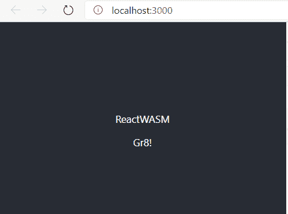

# 用 Web 程序集组装 React 应用程序

> 原文：<https://medium.com/globant/assembling-react-application-with-web-assembly-d683274d0afe?source=collection_archive---------0----------------------->

## 从我之前的[文章](/globant/step-up-your-game-with-web-assembly-3f787fe6e95?source=friends_link&sk=254233ca0a7a3793f9b6386c71bd1ca7)继续，我们现在知道了什么是 web 组装，也就是 WASM，以及它是多么的简单和有益！现在，我们通过让 WASM 与 ReactJS 合作来加强我们的游戏。


ReactJs+ WASM

最初，我能够用 c++和 rust 创建和编译 wasm 文件，但是缺少了一块拼图，这不允许我完成它。

> "当你尝试得筋疲力尽时，再试一次."#克里斯·费罗斯

我喝了口咖啡，开始重新思考这件事，

> "我正试图让 WASM 内心有所反应，你也必须如此！"
> 
> “这也意味着我擅长 Javascript，你也是！”

那么，为什么不用 React 来尝试 AssemblyScript(它是 typescript 的一种变体)呢

> “在那里我找到了我丢失的那块！我会告诉你怎么做”

我正在创建 2 个独立的项目

1.  *assemblyscript-wasm:它将拥有与我们的 wasm 相关的文件*
2.  *react-wasm:它用 wasm 加载器加载了 react 文件。*

如果你想要一个项目，而不是我创建的两个独立的项目，请随意。

> “那么，我们开始组装吧！”

在汇编脚本中建立一个项目是迅速的，

使用初始化新项目

```
npm init
```

并安装下面提到的加载程序和编译器，

```
npm install — save @assemblyscript/loadernpm install — save-dev assemblyscript
```

现在使用以下命令快速设置一个新的 AssemblyScript 项目

```
npx asinit .
```

> “别忘了复印一下。(点)"

它将为您创建目录结构和配置文件。

就这样，您现在已经准备好将您的函数编译到 WASM 了。

如果你想知道更多关于配置和目录结构的信息，或者你被困在某个地方，那么汇编脚本快速入门部分将会帮助你，[链接](https://www.assemblyscript.org/quick-start.html)

打开汇编目录内的 index.ts 文件，你会看到**添加**功能已经存在，

```
export function concat(a: i32, b: i32): i32 { return a + b}
```

我们将在这个文件中添加新的函数 **concat**

```
export function concat(a: string, b: string): string { return a + b}
```

如果移除类型，这两个函数是相同的。一个是添加数字，另一个是连接字符串。

这里你可以有其他功能。

> “你该编译它了”

🚀发出命令！

```
npm run asbuild
```

你的优化。wasm 文件将在构建文件夹中为您准备好。

> 现在让我们创建 react 项目，

```
npx create-react-app react-wasm
```

我们必须在 react 应用程序中加载 wasm 文件。因此，我们需要一个加载程序，我们有一个来自 AssemblyScript 的加载程序。使用下面的命令在 react 项目中安装加载程序。

```
npm install — save @assemblyscript/loader
```

既然加载程序已经可以使用了，

创建一个文件 *wasmLoader.js* 并添加以下代码

```
const loader = require(“@assemblyscript/loader”);
```

我们将创建一个函数，在首次安装应用程序时加载 wasm 文件。

```
export const loadWASM = () => { return loader.instantiate(fetch(“optimized.wasm”)) .then(result => { //storing the response inside a wasm variable for now wasm = result; return true; })
    .catch(error => { console.error(‘Error loading WASM file’); return false; })}
```

汇编脚本为我们提供了不同的实例化方法。

在这里，我使用了异步实例化方法，你可以有

*实例化 Sync* —从 WebAssembly 同步实例化 AssemblyScript 模块。模块或二进制缓冲区。不推荐。

*实例化流* —从响应中异步实例化一个 AssemblyScript 模块，即通过 fetch 获得。

**加载器**基本上使用 WebAssembly APIs 来实例化该模块，但是在评估导出名称并为它们创建一个良好的对象结构时，还向它添加了额外的实用程序。

**结果**我们例子中的对象包含

1.  *导出(使用我们的函数 add 和 concat)*
2.  *实例*
3.  *模块*

我们现在将结果存储在 wasm 变量中。

您可以在此 找到更多关于装载机 [*的信息*](https://www.assemblyscript.org/loader.html#installation)

下一步是在我们的应用程序组件中调用这个 *loadWASM()* 方法。

所以打开 *app.js* ，插入下面的代码

```
const [wasmLoaded, setWasmLoaded] = useState(false)useEffect(() => { loadWASM().then(result => setWasmLoaded(result));}, []);
```

这里，装载时我们获取文件，成功时我们设置标志 wasmLoaded。

既然 WASM 文件已经加载，我们可以在 app.js 中调用我们的 WASM 函数 *concat* 和 *add*

```
useEffect(() => { if (wasmLoaded) { setConcat(concatString(‘React’, ‘WASM’)); setSum(addNumbers(4, 4)); }}, [wasmLoaded])
```

这里，我们调用两个函数，第一个是 concatString，第二个是 addNumbers

让我们来定义这个函数

> wasmLoader.js

```
export const addNumbers = (a, b) => wasm.exports.add(a, b);
```

> “上面的函数没什么复杂的。对！”

让我们看看我们的串联函数，

```
export const concatString = (aStr, bStr) => { const { concat } = wasm.exports; const { __allocString, __getString, __retain, __release } = wasm.exports; let aPtr = __retain(__allocString(aStr)) let bPtr = __retain(__allocString(bStr)) let cPtr = concat(aPtr, bPtr) let cStr = __getString(cPtr) __release(aPtr) __release(bPtr) __release(cPtr) return cStr}
```

乍一看似乎很复杂但其实很简单。

我来试着解释一下，我们 wasm(AssemblyScript)函数中的字符串参数不能只是 Javascript 字符串，它需要在内存模块中分配。

加载器确实为我们提供了可以在这里使用的功能。

所以我们有**_ _ alloct string**，如果你正在使用数组，那么你将有**_ _ alloct Array**。

**__retain** :保留对一个托管对象的引用，这样做是为了在我们使用它的时候，这个对象不会被收集。我们不保留 concat 函数返回的值。

**__getString** :将一个字符串的值从模块的内存中复制到一个 JavaScript 字符串。

**_ _ 释放**:释放之前保留的值

你一定在想，为什么我们不在 add 函数中做这些呢？

Add 函数取 **i32** 为基本值，不是对象。所以不要保留或释放它们。

我们差不多完成了，是时候让它运行了。

从 app.js 中删除不需要的代码，最终文件将如下所示

> App.js

```
import React, { useState, useEffect } from ‘react’;import logo from ‘./logo.svg’;import ‘./App.css’;import { concatString, addNumbers, loadWASM } from ‘./util/AssemblyLoader’;function App() { const [concat, setConcat] = useState(‘’); const [sum, setSum] = useState(); const [wasmLoaded, setWasmLoaded] = useState(false) useEffect(() => { loadWASM().then(result => setWasmLoaded(result)); }, []); useEffect(() => { if (wasmLoaded) { setConcat(concatString(‘React’, ‘WASM’)); setSum(addNumbers(4, 4)); } }, [wasmLoaded])return ( <div className=”App”> <header className=”App-header”> <p>{concat}</p> Gr{sum}! </header> </div> );}export default App;
```

🚀发出命令！

```
npm start
```

> “哎呀！我忘了说你需要复制优化过的。wasm 文件复制到 react-wasm 项目的公共文件夹中。

复制它，WASM 文件就会加载到你的 react 应用中。



# 我们学到了什么？

您可以使用 AssemblyScript 轻松集成 WASM 和 ReactJs。然而，它也有一些缺点。你可以在这里 阅读更多关于它的 [*，自己决定是否需要在你的项目中使用它。这篇文章讲述了如何轻松地从 react 应用程序中与 WASM 函数进行交互。这就像为我打开了潘多拉的盒子，希望现在不会是你！*](https://www.assemblyscript.org/loader.html#convenience-vs-efficiency)

> “感谢阅读这篇文章！”