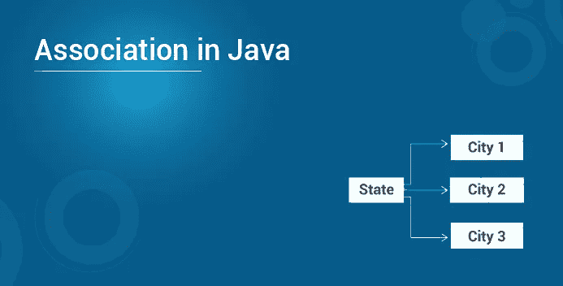
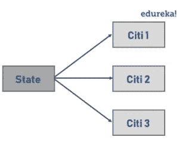
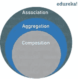

# Java 中的关联是什么？

> 原文：<https://medium.com/edureka/association-in-java-3d0facf63d56?source=collection_archive---------1----------------------->



在编写 Java 程序时，如何在两个类之间建立连接？很简单。你可以利用一个叫做联想的概念。听起来很有趣，对吗？在本文中，让我们详细检查一下 Java 中的关联。

本文讨论的主题是:

*   Java 中的联想是什么？
*   两种形式的关联
*   聚合
*   作文

# 协会是什么？

Java 中的关联是通过对象建立的两个独立类之间的连接或关系。关联关系表明对象如何相互认识，以及它们如何使用彼此的功能。可以是一对一、一对多、多对一、多对多。



*   例如，一个人只能有一本护照。那是一种“**一对一**的关系。
*   如果说银行和员工的关联，一个银行可以有很多员工，所以是“**一对多**的关系。
*   同样，每个城市存在于一个州，但是一个州可以有多个城市，这是一个“**多对一**的关系。
*   最后，如果我们讨论教师和学生之间的关联，多个学生可以与单个教师相关联，单个学生也可以与多个教师相关联，但两者都可以独立创建或删除。这是一种“**多对多**的关系。

让我们用一个例子来理解一下联想。

```
**package** MyPackage;
**import** java.util.*;**class** CityClass {
**private** String cityName;
**public** String getCityName() {
**return** cityName;
}**public** **void** setCityName(String cityName) {
**this**.cityName = cityName;
}
@Override
**public** String toString() {
**return** cityName;
}
}**class** State {
**private** String stateName;
List<CityClass> citys;**public** String getStateName() {
**return** stateName;
}**public** **void** setStateName(String stateName) {
**this**.stateName = stateName;
}
**public** List<CityClass> getCities() {
**return** citys;
}
**public** **void** setState(List<CityClass> citys) {
**this**.citys = citys;
}
}
**public** **class** AssociationExample {
**public** **static** **void** main(String[] args) {
State state = **new** State();
state.setStateName("California");CityClass city = **new** CityClass();
city.setCityName("Los Angeles");
CityClass city2 = **new** CityClass();
city2.setCityName("San Diago");List<CityClass> empList = **new** ArrayList<CityClass>();
empList.add(city);
empList.add(city2);state.setState(empList);System.out.println(state.getCities()+" are cities in the state "+
state.getStateName());
}
}
```

**输出:**

洛杉矶和圣地亚哥是加利福尼亚州的城市

如你所见，在这个示例程序中有两个类，即 ***【状态】、*** ，这两个独立的类通过它们的对象关联在一起。此外，每个城市只存在于一个州中，但是一个州可以有多个城市，因此有“多对一”关系这个术语。重要的是，Java 中的关联有两种特殊形式。我们去看看。

# 两种形式的关联

**合成**和**聚合**是关联的两种特殊形式。让我们借助一个例子来检验它们。



# 作文

这是一种“属于”类型的关联。它仅仅意味着其中一个对象是一个逻辑上更大的结构，它包含另一个对象。换句话说，它是更大物体的一部分或成员。或者，它通常被称为**“has-a”关系**(与“is-a”关系相对，后者是[继承](https://www.edureka.co/blog/inheritance-in-java/))。

比如一栋楼有一个房间，或者换句话说，一个房间属于一栋楼。**组合**是一种很强的“有-有”关系，因为对象的生命周期是捆绑在一起的。这意味着，如果我们毁灭了所有者对象，它的成员也会随之毁灭。例如，在前面的例子中，如果建筑物被摧毁，房间也会被摧毁。但是，请注意，这并不意味着，没有它的任何部分，包含对象就不能存在。例如，如果我们拆除一栋建筑内的所有房间，这座建筑将仍然存在。

# 聚合

聚合也是一种“有-有”的关系，但是，它与组合的区别在于，对象的生命周期不是绑定的。两个**条目可以单独存在**，这意味着结束一个实体不会影响另一个实体。两者都可以彼此独立存在。因此，它通常被称为周协会。

我们举一个球员和球队的例子。即使团队不复存在，作为团队一部分的球员也可以存在。您需要聚合的主要原因是为了**维护代码的可重用性。**

这就把我们带到了本文的结尾，在这里我们学习了 Java 中的关联。如果你想查看更多关于人工智能、DevOps、道德黑客等市场最热门技术的文章，你可以参考 Edureka 的官方网站。

请留意本系列中解释 Java 其他各方面的其他文章。

> *1。* [*面向对象编程*](/edureka/object-oriented-programming-b29cfd50eca0)
> 
> *2。*[*Java 中的继承*](/edureka/inheritance-in-java-f638d3ed559e)
> 
> *3。*[*Java 中的多态性*](/edureka/polymorphism-in-java-9559e3641b9b)
> 
> *4。*[*Java 中的抽象*](/edureka/java-abstraction-d2d790c09037)
> 
> *5。* [*Java 字符串*](/edureka/java-string-68e5d0ca331f)
> 
> *6。* [*Java 数组*](/edureka/java-array-tutorial-50299ef85e5)
> 
> *7。* [*Java 集合*](/edureka/java-collections-6d50b013aef8)
> 
> *8。* [*Java 线程*](/edureka/java-thread-bfb08e4eb691)
> 
> *9。*[*Java servlet 简介*](/edureka/java-servlets-62f583d69c7e)
> 
> 10。 [*Servlet 和 JSP 教程*](/edureka/servlet-and-jsp-tutorial-ef2e2ab9ee2a)
> 
> *11。*[*Java 中的异常处理*](/edureka/java-exception-handling-7bd07435508c)
> 
> *12。* [*Java 教程*](/edureka/java-tutorial-bbdd28a2acd7)
> 
> 13。 [*Java 面试题*](/edureka/java-interview-questions-1d59b9c53973)
> 
> *14。* [*Java 程序*](/edureka/java-programs-1e3220df2e76)
> 
> 15。 [*科特林 vs Java*](/edureka/kotlin-vs-java-4f8653f38c04)
> 
> *16。* [*依赖注入使用 Spring Boot*](/edureka/what-is-dependency-injection-5006b53af782)
> 
> *17。* [*堪比 Java 中的*](/edureka/comparable-in-java-e9cfa7be7ff7)
> 
> *18。* [*十大 Java 框架*](/edureka/java-frameworks-5d52f3211f39)
> 
> *19。* [*Java 反射 API*](/edureka/java-reflection-api-d38f3f5513fc)
> 
> *20。*[*Java 中的 30 大模式*](/edureka/pattern-programs-in-java-f33186c711c8)
> 
> *21。* [*核心 Java 备忘单*](/edureka/java-cheat-sheet-3ad4d174012c)
> 
> *22。*[*Java 中的套接字编程*](/edureka/socket-programming-in-java-f09b82facd0)
> 
> *23。* [*Java OOP 备忘单*](/edureka/java-oop-cheat-sheet-9c6ebb5e1175)
> 
> *24。*[*Java 中的注释*](/edureka/annotations-in-java-9847d531d2bb)
> 
> *25。*[*Java 中的库管理系统项目*](/edureka/library-management-system-project-in-java-b003acba7f17)
> 
> *26。*[*Java 中的树*](/edureka/java-binary-tree-caede8dfada5)
> 
> *27。*[*Java 中的机器学习*](/edureka/machine-learning-in-java-db872998f368)
> 
> *28。* [*顶级数据结构&Java 中的算法*](/edureka/data-structures-algorithms-in-java-d27e915db1c5)
> 
> 29。 [*Java 开发者技能*](/edureka/java-developer-skills-83983e3d3b92)
> 
> *三十。* [*前 55 名 Servlet 面试问题*](/edureka/servlet-interview-questions-266b8fbb4b2d)
> 
> *31。*[](/edureka/java-exception-handling-7bd07435508c)*[*顶级 Java 项目*](/edureka/java-projects-db51097281e3)*
> 
> *32。 [*Java 字符串备忘单*](/edureka/java-string-cheat-sheet-9a91a6b46540)*
> 
> **33。*[*Java 中的嵌套类*](/edureka/nested-classes-java-f1987805e7e3)*
> 
> **34。* [*Java 集合面试问答*](/edureka/java-collections-interview-questions-162c5d7ef078)*
> 
> **35。*[*Java 中如何处理死锁？*](/edureka/deadlock-in-java-5d1e4f0338d5)*
> 
> *36。 [*你需要知道的 50 个 Java 合集面试问题*](/edureka/java-collections-interview-questions-6d20f552773e)*
> 
> *37。[*Java 中的字符串池是什么概念？*](/edureka/java-string-pool-5b5b3b327bdf)*
> 
> **38。*[*C、C++和 Java 有什么区别？*](/edureka/difference-between-c-cpp-and-java-625c4e91fb95)*
> 
> **39。*[*Java 中的回文——如何检查一个数字或字符串？*](/edureka/palindrome-in-java-5d116eb8755a)*
> 
> **40。* [*你需要知道的顶级 MVC 面试问答*](/edureka/mvc-interview-questions-cd568f6d7c2e)*
> 
> **41。*[*Java 编程语言的十大应用*](/edureka/applications-of-java-11e64f9588b0)*
> 
> **42。*[*Java 中的死锁*](/edureka/deadlock-in-java-5d1e4f0338d5)*
> 
> **43。*[*Java 中的平方和平方根*](/edureka/java-sqrt-method-59354a700571)*
> 
> **44。*[*Java 中的类型转换*](/edureka/type-casting-in-java-ac4cd7e0bbe1)*
> 
> **45。*[*Java 中的运算符及其类型*](/edureka/operators-in-java-fd05a7445c0a)*
> 
> *46。[*Java 中的析构函数*](/edureka/destructor-in-java-21cc46ed48fc)*
> 
> **47。*[*Java 中的二分搜索法*](/edureka/binary-search-in-java-cf40e927a8d3)*
> 
> **48。*[*Java 中的 MVC 架构*](/edureka/mvc-architecture-in-java-a85952ae2684)*
> 
> *49。 [*冬眠面试问答*](/edureka/hibernate-interview-questions-78b45ec5cce8)*

**原载于 2019 年 10 月 15 日*[*https://www.edureka.co*](https://www.edureka.co/blog/association-in-java/)*。**