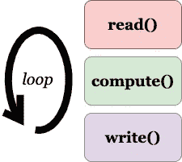
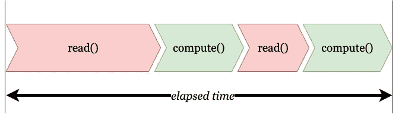
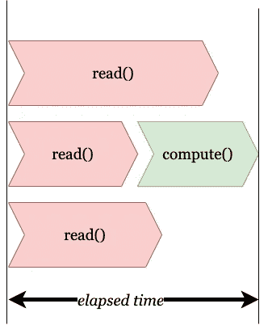

# Python 中的异步处理——让数据管道尖叫

> 原文：<https://medium.com/capital-one-tech/async-processing-in-python-make-data-pipelines-scream-a1e8467e7919?source=collection_archive---------2----------------------->

## 轻松控制程序中单个函数的异步执行，而不是并行处理


# 序文

“那么，你能不能在这个问题上投入一堆额外的服务器，让这个过程并行运行，让它更快？”Acme Widgets 的首席技术官恼怒地问**汤姆**。

Acme 的数据管理团队开发了多条数据管道，用于将数据传输、转换和交付给各种系统以供使用。管道从各种来源读取数据，如 kafka 流、队列、磁盘甚至网络套接字，并在将数据发送到目标系统之前对数据执行重要的计算。虽然计算的时间是相当可预测的，但是数据到达的时间与计算相比通常要慢得多；零星且不可预测。如果按顺序执行，整个流程会变慢，导致机会丧失和大量客户不满。

但是 Acme 可以访问其云服务上几乎无限数量的虚拟服务器。难道他们就不能让多台服务器以多线程的方式运行这条管道，从而提高速度吗？这是汤姆提出的问题。但是**开发负责人黛布拉**认为将程序从单线程改写成多线程是一个过于复杂的解决方案，不仅昂贵，容易出错，有时甚至是不可能的。肯定会有更好的解决办法。他们都向首席建筑师阿曼达寻求启示。

对阿曼达来说这不是新情况。在加入 Acme 之前，她在许多组织中担任数据领导者，她必须就数据模式的微妙差异对许多其他技术领导者进行教育，包括精心设计以避免不可信数据的风险。她从过去的经验中知道，用清晰的例子解释什么能做什么不能做通常是证明什么对 Acme 最有利的最佳方式。

阿曼达同意汤姆和黛布拉的观点。“有好消息，”她宣布。*“而且不好。首先，好消息是:有可能以更简单的方式在 Python 中实现伪多线程功能，从而使流水线更快。不好的一面是:这种方法有细微的差别，而且不是所有的事情都可以很容易地多线程化。但总体来说，应该会更快。”*

大家都催她详细解释。

# 管道

首先，Amanda 解释了为什么有些进程很慢，多线程不可能让它们变得更快。她举例说明了该过程的以下部分:

1.  **读取**数据。该函数等待从某个地方读取数据，例如 kafka 流、网络套接字或者甚至从磁盘读取数据。一个例子是获取客户点击网站的次数。
2.  **对数据计算**。该函数对接收到的数据进行计算，例如将特定类型浏览器的所有点击次数相加。
3.  **写入**数据。该函数将结果写入某个存储或发送到队列。

它类似于以下循环:



如果按顺序执行，它类似于这个流程，v 形的长度表示该函数所用的时间。Amanda 指出，read()函数的执行时间经常不同。



随着读取操作数量的增加，经过的时间也会增加。Amanda 解释说，为了使管道多线程化，我们必须执行 compute()函数的多个实例；但是我们需要知道如何划分 read()函数的输出，并跟踪谁做了多少。正如黛布拉所说，这使得设计非常复杂，难以维护。雪上加霜的是，在某些情况下，创建 compute()的多个实例甚至是不可能的，因为数据可能需要实时处理。

Amanda 解释说，一个更实际的方法是只并行运行*几个函数*，其他的按顺序运行。通常，读取操作很慢，并且具有不可预测的时序；因此，这些可以并行执行。数据状态更重要的计算操作可以按顺序执行，如下图所示。



Amanda 解释说，在这里，读函数()是并行的。compute()函数按顺序运行，在任何 read()函数的第一次输出之后立即开始，而不是等待所有操作完成。然后，它可以在其他 read()函数完成时获取它们的结果。这大大缩短了运行时间。以这种方式交错函数会导致更快的总体执行时间。

但是这不是并行处理，黛布拉插嘴说，因为不是所有的组件都并行运行。

*“不，不是这样的，”*阿曼达回应道，“它有选择地异步运行组件。诀窍是这样只运行一些组件。而且用 Python 实现也是比较琐碎的任务。”

# “传统”的方式

首先，阿曼达考察了传统的编写程序的方式。她展示了一个名为 **sync.py** 的示例程序，其中一个名为 **myproc()** 的函数做了一件耗时 5 秒的事情。为了简单起见，她只是让**休眠(5)** 来模拟 5 秒的执行时间。当进行函数调用时，程序打印一行“myproc started …”。同样，当函数完成执行时，它会打印“myproc finished …”。最后，使用时间模块，她记录了经过的时间。

```
# sync.py
import time
def myproc():
   print("myProc started ...")
   t1 = time.perf_counter()
   time.sleep(5)
   t = time.perf_counter() - t1
   print(f"   myProc finished in {t:0.5f} seconds.")

def main():
   for _ in range(5):
       myproc()

if __name__ == "__main__":
   start_sec = time.perf_counter()
   main()
   elapsed_secs = time.perf_counter() - start_sec
   print(f"Job finished in {elapsed_secs:0.5f} seconds.")
```

Amanda 用 Python 执行了这个程序，并显示了输出:

```
myProc started ...
  myProc finished in 5.00262 seconds.
myProc started ...
  myProc finished in 5.00281 seconds.
myProc started ...
  myProc finished in 5.00011 seconds.
myProc started ...
  myProc finished in 5.00042 seconds.
myProc started ...
  myProc finished in 5.00504 seconds.
Job finished in 25.01145 seconds.
```

正如预期的那样，该作业总共花费了 25 秒，因为函数 myproc()的每次运行花费了 5 秒。依次运行 5 次，它在 25 秒内完成了任务。

# 异步方式

阿曼达指出，这就是数据管道的传统发展方式。现在，她以异步方式重写程序。下面是修改后的代码，命名为 async1.py。她添加了注释(前面有#)来标识修改的部分。

```
# async1.py
import asyncio # new module 
import time
async def myproc(): # async is new
   print("myProc started ...")
   t1 = time.perf_counter()
   await asyncio.sleep(5) # await asyncio is new
   t = time.perf_counter() - t1
   print(f"   myProc finished in {t:0.5f} seconds.")
async def main(): # async is new
   await asyncio.gather( # await asyncio is new
     myproc(),
     myproc(),
     myproc(),
     myproc(),
     myproc()
   )
if __name__ == "__main__":
   start_sec = time.perf_counter()
   asyncio.run(main()) # asyncio.run is new
   elapsed_secs = time.perf_counter() - start_sec
   print(f"Job finished in {elapsed_secs:0.5f} seconds.")
```

以下是她运行代码时的输出:

```
myProc started ...
myProc started ...
myProc started ...
myProc started ...
myProc started ...
  myProc finished in 5.00337 seconds.
  myProc finished in 5.00347 seconds.
  myProc finished in 5.00349 seconds.
  myProc finished in 5.00351 seconds.
  myProc finished in 5.00353 seconds.
Job finished in 5.00495 seconds.
```

大家惊呼。整个过程现在只用了 5 秒钟就完成了(这是函数 myproc()的每次运行*所花费的时间)。这怎么可能——他们都问阿曼达。*

# 异步/等待组合

Amanda 解释说，诀窍是在代码中包含 async 和 await 关键字。这些关键字确保函数以异步方式运行。她指向下面一行:

```
await sleep(5)
```

await 关键字告诉 Python 不要等待它的完成；而是立即将控制发送回调用者并继续处理。

房间里有一种普遍的混乱感。因此，Amanda 重复了这一点，因为这是一个非常强有力的概念，可以让小组成员理解。关键字告诉 Python 解释器*立即将控制权交还给调用者*(在本例中是程序 main())，但*继续处理函数中剩余的语句*。一旦执行结束，该函数将取回控制权。

然后她指向下面一行字:

```
asyncio.run(main())
```

Amanda 继续说道，它以一种*异步*的方式执行 main()函数，即不等待 myproc()的完成。但是，看看代码，她注意到 main()函数代码中没有其他内容；因此 main()函数调用 myproc()的下一次迭代，还是像以前一样异步，并且只要遇到 await 关键字，它就传递控制。

黛布拉似乎很害怕。myproc()函数应该执行一些有用的操作，比如读取、处理或写入数据。如果控制已经立即返回到 main()函数，并且程序忘记了 myproc()的结果发生了什么，那么它在管道处理中是如何有用的——她想知道。

啊哈！这就是魔力所在——阿曼达解释道。就在函数 myproc()完成的那一刻(按照设计，大约是 5 秒钟)，*控件将*传递回最初调用它的函数 main()。main()函数执行下一行，打印结束行以及经过的时间。

函数 myproc()用了 5 秒(如预期)；但是整个程序以一种并行的方式执行所有的函数调用。因此总时间也只有 5 秒。

*“注意，我称之为并行，”* Amanda 继续说道。执行实际上不是并行的。她在函数代码中加入了 async 子句，以告知何时将控制权交还给调用者。它*模仿*并行。因此，Tom 认为，被调用的函数只是一个非阻塞调用。正是，阿曼达回答道。*“对于那些熟悉 unix shell 的人来说，这有点类似于同时多次调用带有 nohup 和后台处理选项(末尾带有一个“&”的命令。”*

```
nohup somecommand.sh &
nohup somecommand.sh &
nohup somecommand.sh &
nohup somecommand.sh &
nohup somecommand.sh &
```

*“它们都将异步运行。但是，"*她澄清道，*"与 unix shell 不同，当内部代码行执行完毕时，我的函数调用会取回控制权。这就是它如此强大的原因。”*

# 我们控制异步部分

所有的目光都转向黛布拉，以确认这是否会缩短漫长的时间；但她对此表示怀疑。*“我知道你可以以异步方式调用函数，以伪并行方式执行，减少执行时间，”*她解释道，*“但并不是所有的函数调用都可以异步。例如，读取数据的函数可以是异步的；但不能转换函数。后面的函数，如果异步调用，会引入数据错误。”*

Amanda 承认这是合理的考虑，并解释说有选择地控制函数的异步性是可能的。为了进行说明，她将代码 async1.py 修改为 async2.py，并在注释中显示了这些更改。在这段修改后的代码中，她假设了两个任务，每个任务耗时 2.5 秒。一部分是异步的，可以并行运行。在现实生活中，这将类似于从磁盘、套接字、队列等读取数据。另一部分，同样需要 2.5 秒，不能异步。在现实生活中，这将类似于转换。

```
# async2.py
import asyncio
import time
async def myproc():
   print("myProc started ...")
   t1 = time.perf_counter()
   # the following is an async call function that takes 2.5 secs
   await asyncio.sleep(2.5)
   # the following is an sync call function that takes 2.5 secs
   time.sleep(2.5)
   t = time.perf_counter() - t1
   print(f"   myProc finished in {t:0.5f} seconds.")
async def main():
   await asyncio.gather(
     myproc(),
     myproc(),
     myproc(),
     myproc(),
     myproc()
   )
if __name__ == "__main__":
   start_sec = time.perf_counter()
   asyncio.run(main())
   elapsed_secs = time.perf_counter() - start_sec
   print(f"Job finished in {elapsed_secs:0.5f} seconds.")
```

以下是她运行脚本的结果:

```
myProc started ...
myProc started ...
myProc started ...
myProc started ...
myProc started ...
  myProc finished in 5.00751 seconds.
  myProc finished in 7.50905 seconds.
  myProc finished in 10.01197 seconds.
  myProc finished in 12.51726 seconds.
  myProc finished in 15.02254 seconds.
Job finished in 15.02414 seconds.
```

所有人都觉得输出很有趣。当然，正如预期的那样，所有的函数调用都立即开始了。然而，黛布拉观察到，现在每次通话花费的时间越来越多，实际上比上一次通话多了 2.5 秒。这很奇怪，她想知道为什么。

黛比解释说，这是因为只有 2.5 秒的通话是异步的，而不是整个通话。一旦到达异步部分，控制返回到函数 myproc()来执行其余的行。紧接着的下一行是第二个 sleep()，它不是异步的。这就是为什么函数 myproc()没有将控制权返回给调用者——在本例中是模块 main (),直到睡眠完成。因此这是一个**阻塞**呼叫。这就是为什么函数调用的第二次迭代必须等待 2.5 秒睡眠的执行。

Amanda 举的这个例子让大家意识到为什么这个技术不是真正的并行执行。这仅仅是一个选择性异步(非阻塞)执行，她控制实现伪并行；但是他们都承认这项技术对于许多用例来说已经足够了。

# 通话顺序很重要

"你在一个函数中调用异步和同步部分的顺序是一样的吗？"汤姆沉思着。

是的，这是一个需要解决的大问题，阿曼达警告说。为了说明顺序的有用性和重要性，她对程序做了另一个小小的修改，并将其命名为 async3.py。在这个例子中，她只是颠倒了调用 async 和 sync sleep 命令的顺序，如注释所示:

```
# async3.py
import asyncio
import time
async def myproc():
   print("myProc started ...")
   t1 = time.perf_counter()
   # Now it is sync first and then async
   time.sleep(2.5) 
   await asyncio.sleep(2.5)
   t = time.perf_counter() - t1
   print(f"   myProc finished in {t:0.5f} seconds.")
async def main():
   await asyncio.gather(
     myproc(),
     myproc(),
     myproc(),
     myproc(),
     myproc()
   )
if __name__ == "__main__":
   start_sec = time.perf_counter()
   asyncio.run(main())
   elapsed_secs = time.perf_counter() - start_sec
   print(f"Job finished in {elapsed_secs:0.5f} seconds.")
```

她运行程序并得到以下输出:

```
myProc started ...
myProc started ...
myProc started ...
myProc started ...
myProc started ...
  myProc finished in 12.51053 seconds.
  myProc finished in 10.00526 seconds.
  myProc finished in 7.50407 seconds.
  myProc finished in 5.00093 seconds.
  myProc finished in 5.00068 seconds.
Job finished in 15.01211 seconds.
```

虽然在这个静态截图中看不到，但是函数调用的第一行“myProc started …”现在交错出现，中间间隔 2.5 秒。早些时候，所有行“myProc started …”同时出现。观众首先对这个有趣的变化感到好奇。

Amanda 将他们的注意力指向了第一个 2.5 秒的睡眠呼叫，这是同步的；因此，myproc()在将控制发送回主程序之前必须等待那么长时间。main()程序直到那时才能再次调用 myproc()。她解释说，这就是为什么这条信息会在 2.5 秒后出现。

观众好奇的第二部分是台词**“my proc 完成了……”**，这是执行时间的逆序，不像上次是从最小到最大。

Amanda 解释道:2.5 秒后，函数 myproc()遇到了*异步*睡眠调用。因为它是异步的，所以它立即将控制返回给 main()，然后 main 调用 myproc()的第二个实例。同样的事情发生在 myproc()的第二个实例中，即它等待了 2.5 秒。最后，在 myproc()函数的第 5 次迭代之后，main()又回到了 myproc()的第一次调用；但那是在所有其他电话打完之后。因此，我们这里有一个有趣的模式，Debra 指出:对 myproc()的第一次调用是最长的，与前一种情况相反，最后一次调用是最长的。不过，总的时间保持不变。

黛比警告说，这就是为什么调用函数的同步和异步部分的顺序很重要。它决定了程序将如何从子组件返回值。总时间不会变化。

# 秩序法则

但是汤姆不相信。这真的与现实世界相关吗——他想知道。

有道理，阿曼达同意并考虑了这个项目中的另一个小任务。她继续说道，假设我们获得了网站的点击量，我们需要计算函数调用的总和。为了简单起见，她只是在每次调用函数时将名为 sum 的变量加 1。她还添加了一些代码来显示函数是如何被一个接一个地调用的。她修改函数代码来接受一个名为 **callid** 的参数，这个参数只是一个数字，用来清楚地表示对函数的每个调用。然后她打印出一串**callid**来显示函数的哪一次迭代被调用。

```
import asyncio
import time
chain = ""
sum = 0
async def myproc(callid):
   global chain
   global sum
   print(f"myProc {callid} started ...")
   t1 = time.perf_counter()
   await asyncio.sleep(2.5)
   chain = chain + "->" + str(callid)
   sum = sum + 1
   time.sleep(2.5)
   t = time.perf_counter() - t1
   print(f"   myProc {callid} finished in {t:0.5f} seconds. sum = {sum} chain {chain}")
async def main():
   await asyncio.gather(
     myproc(1),
     myproc(2),
     myproc(3),
     myproc(4),
     myproc(5)
   )
if __name__ == "__main__":
   start_sec = time.perf_counter()
   asyncio.run(main())
   elapsed_secs = time.perf_counter() - start_sec
   print(f"Job finished in {elapsed_secs:0.5f} seconds.")
```

以下是输出:

```
myProc 1 started ...
myProc 2 started ...
myProc 3 started ...
myProc 4 started ...
myProc 5 started ...
  myProc 1 finished in 5.00606 seconds. sum = 1 chain ->1
  myProc 2 finished in 7.51137 seconds. sum = 2 chain ->1->2
  myProc 3 finished in 10.01224 seconds. sum = 3 chain ->1->2->3
  myProc 4 finished in 12.51499 seconds. sum = 4 chain ->1->2->3->4
  myProc 5 finished in 15.01671 seconds. sum = 5 chain ->1->2->3->4->5
Job finished in 15.01861 seconds.
```

观众注意到这些函数是按照她调用它们的顺序被调用的，如链中所示；但是 sum 变量在每个函数调用中都是不同的。他们想知道为什么会这样。

Amanda 让他们注意函数 myproc()的代码。第一次调用时，遇到了*异步*睡眠；所以它立即将控制权返回给 main()，然后 main()继续第二次 myproc()函数调用。然而，当第二个函数调用(callid=2)开始执行同步部分时，第一个函数调用(callid=1)已经开始计算并完成了工作。当时的总和是 0；所以它加了 1 得出 1。当第二个函数调用到达代码的计算部分时，总和已经是 1；于是就想出了 1 + 1 = 2。接下来的电话也是如此。

所以，汤姆再次恳求道，这有什么关系呢？

阿曼达解释道，如果你需要的只是最终的金额，也就是工作结束时的金额，那就没问题了。这个数字无论如何都是正确的。但是，如果您在函数中使用 sum *，例如，检查 sum 是否大于 3 以执行一些其他操作，那么显然调用 1、2 和 3 会失败，但 4 和 5 会成功。她警告说，这可能会无意中引入一个漏洞。例如，如果你有不同类型的函数:一个执行一些计算，另一个观察和微调计算函数的执行，重要的是把它们按正确的顺序排列；否则你会陷入一种竞争状态。*

举例来说，Amanda 做了一个小小的改变，她*颠倒了*同步和异步调用的顺序。

```
import asyncio
import time
chain = ""
sum = 0
async def myproc(callid):
   global chain
   global sum
   print(f"myProc {callid} started ...")
   t1 = time.perf_counter()
   time.sleep(2.5)
   chain = chain + "->" + str(callid)
   sum = sum + 1
   await asyncio.sleep(2.5)
   t = time.perf_counter() - t1
   print(f"   myProc {callid} finished in {t:0.5f} seconds. sum = {sum} chain {chain}")
async def main():
   await asyncio.gather(
     myproc(1),
     myproc(2),
     myproc(3),
     myproc(4),
     myproc(5)
   )
if __name__ == "__main__":
   start_sec = time.perf_counter()
   asyncio.run(main())
   elapsed_secs = time.perf_counter() - start_sec
   print(f"Job finished in {elapsed_secs:0.5f} seconds.")
```

以下是输出:

```
myProc 1 started ...
myProc 2 started ...
myProc 3 started ...
myProc 4 started ...
myProc 5 started ...
  myProc 1 finished in 12.51241 seconds. sum = 5 chain ->1->2->3->4->5
  myProc 2 finished in 10.01062 seconds. sum = 5 chain ->1->2->3->4->5
  myProc 3 finished in 7.51010 seconds. sum = 5 chain ->1->2->3->4->5
  myProc 4 finished in 5.00613 seconds. sum = 5 chain ->1->2->3->4->5
  myProc 5 finished in 5.00680 seconds. sum = 5 chain ->1->2->3->4->5
Job finished in 15.01523 seconds.
```

Amanda 指出，虽然最终结果是相同的，即工作在大约 15 秒内完成，但函数内部的行为却非常不同。她吸引观众的注意力来展示 sum 的值是如何相同的，以及在函数调用的所有迭代中链是如何相同的。她解释说，这是因为第一个调用是 sync(而不是前面例子中的 async ),函数调用一直等到 sync 调用完成。当 sync 调用完成时，所有的值都被适当地赋值，并且总和被更新。她观察到，在这种情况下，在任何迭代中检查变量的值都是安全的。

Amanda 警告说，底线是要密切注意函数调用的哪些部分是同步或异步的，以及在哪里检查函数内部设置的变量值。它可能会在你没有意识到的情况下产生不同的结果。汤姆、黛布拉和所有的观众都非常乐意学习这种技巧和要避免的潜在问题。他们非常感谢阿曼达。

# 概括起来

让我们重温一下故事开头描述的场景——带有两个示例函数的数据管道:

1.  **read():** 等待数据到达的地方
2.  **compute():** 对收到的数据进行计算

read()函数很慢，不可预测，是并行化的好选择；compute()函数速度很快，但无法并行化。按顺序调用它们会降低整个管道的速度。您可以交错这些函数，以使管道速度更快，但您必须确保以正确的顺序调用它们。

*   在许多情况下，您可以使用 Python 中的异步处理来模拟并行处理，只需修改一些语法，而不是进行真正的并行处理，后者通常更难。
*   但它不是多线程的。您可以控制哪些部分是异步的，哪些不是。
*   两个关键字的组合使之成为可能。async 应用于函数定义，告诉 Python 该函数是一个异步调用。await 告诉命令立即将控制传递回调用者，但继续处理其余的语句。
*   注意函数调用内部的逻辑对于同步和异步事件的行为。如果没有在正确的位置访问或更新，变量可能会有错误的值。

# 后续步骤

关于异步处理的更多信息，请阅读官方 Python 文档:【https://docs.python.org/3/library/asyncio.html 

*gstudioimagen 创建的业务向量—*[*【www.freepik.com】*](http://www.freepik.com)

*原载于*[*https://www.capitalone.com*](https://www.capitalone.com/tech/software-engineering/async-processing-in-python-for-faster-data-pipelines/)*。*

*披露声明:2021 资本一。观点是作者个人的观点。除非本帖中另有说明，否则 Capital One 不隶属于所提及的任何公司，也不被这些公司认可。使用或展示的所有商标和其他知识产权是其各自所有者的财产。*