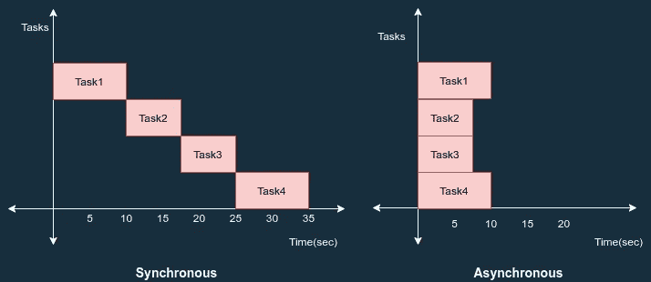
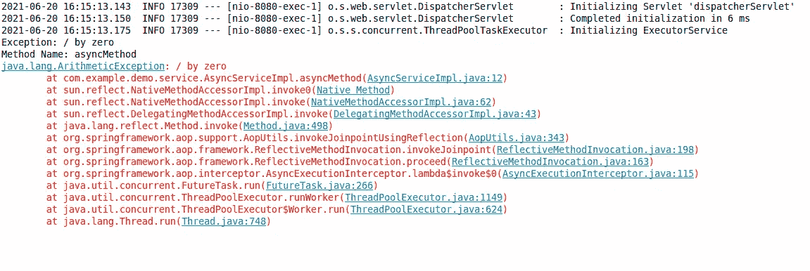

# 使用@Async 注释在 Spring Boot 进行异步调用

> 原文：<https://medium.com/globant/asynchronous-calls-in-spring-boot-using-async-annotation-d34d8a82a60c?source=collection_archive---------0----------------------->


这篇文章是关于如何在 spring boot 中实现异步行为的。但是首先我们来看看同步和异步的区别。

*   同步编程:在同步编程中，一次执行一个任务，只有当一个任务完成时，下一个任务才被解除阻塞。
*   **异步编程:**在异步编程中，可以同时执行多个任务。在前一个任务完成之前，您可以移动到另一个任务。



Figure 1.1

在 spring boot 中，我们可以使用@Async 注释实现异步行为。但是仅仅@Async 注释是不行的。为此，您需要理解@Async 内部是如何工作的。

**先决条件:**

必须通过使用@EnableAsync 批注来批注主应用程序类或任何直接或间接的异步方法调用方类，从而启用异步支持。默认模式是代理，另一种是 AspectJ。在本帖中，我们将讨论代理模式。代理模式只允许通过代理拦截呼叫。永远不要从定义异步方法的同一个类中调用异步方法，这将不起作用。

**@ Async 注释是如何工作的？**

首先，用@Async 注释该方法。当您使用@Async 批注来批注方法时，它会基于“proxyTargetClass”属性为该对象创建一个代理。

当 spring 执行这个方法时，默认情况下，它会搜索相关的线程池定义。上下文中唯一的 spring framework TaskExecutor bean 或名为“task Executor”的 Executor bean。如果这两个都不可解析，默认情况下它将使用 spring framework simpleasynctaskmexecutor 来处理异步方法执行。

**AsyncService.java**

```
package com.example.demo.service;public interface AsyncService {
    void asyncMethod() throws InterruptedException;
}
```

**AsyncServiceImpl.java**

```
package com.example.demo.service;import org.springframework.scheduling.annotation.Async;
import org.springframework.stereotype.Service;@Service
public class AsyncServiceImpl implements AsyncService {
   @Async
   @Override
   public void asyncMethod() throws InterruptedException {
      Thread.sleep(3000);
      System.out.println("Calling other service..");
      System.out.println("Thread: " +
          Thread.currentThread().getName());
   }
}
```

AsyncServiceImpl 应该是 spring 管理的 bean。此外，您的异步方法必须是公共的，以便它可以被代理。就异步方法签名而言，任何参数类型都受支持。但是，返回类型被限制为 void 或 Future。

AsyncController.java

```
package com.example.demo.controller;import org.springframework.beans.factory.annotation.Autowired;
import org.springframework.scheduling.annotation.EnableAsync;
import org.springframework.web.bind.annotation.GetMapping;
import org.springframework.web.bind.annotation.RestController;import com.example.demo.service.AsyncService;@RestController
@EnableAsync
public class AsyncController {
   @Autowired
   AsyncService asyncService;
   @GetMapping("/async")
   public String asyncCallerMethod() throws InterruptedException {
      long start = System.currentTimeMillis();
      asyncService.asyncMethod();
      String response = "task completes in :" + 
      (start -   System.currentTimeMillis()) + "milliseconds";
      return response;
   }
}
```

这里，我用@EnableAsync 注释了这个类。当您运行服务并到达端点时，asyncMethod()将由默认任务执行器创建的另一个线程执行。主线程不需要等待完成异步方法的执行。

您可以自定义自己的任务执行器。我们将在讨论如何处理异步方法中出现的异常时看到它。

**异步方法中的异常处理:**

要在异步方法中处理异常，我们需要配置 AsyncUncaughtExceptionHandler，如下所示。

**AsynConfiguration.java**

```
package com.example.demo.config;import java.lang.reflect.Method;
import java.util.concurrent.Executor;import org.springframework.aop.interceptor.AsyncUncaughtExceptionHandler;
import org.springframework.context.annotation.Configuration;
import org.springframework.scheduling.annotation.AsyncConfigurerSupport;
import org.springframework.scheduling.concurrent.ThreadPoolTaskExecutor;@Configuration
public class AsynConfiguration extends AsyncConfigurerSupport {
   @Override
   public Executor getAsyncExecutor() {
      ThreadPoolTaskExecutor executor = new 
                ThreadPoolTaskExecutor();
      executor.setCorePoolSize(3);
      executor.setMaxPoolSize(4);
      executor.setThreadNamePrefix("asyn-task-thread-");
      executor.setWaitForTasksToCompleteOnShutdown(true);
      executor.initialize();
      return executor;
  }
  @Override
  public AsyncUncaughtExceptionHandler  
         getAsyncUncaughtExceptionHandler() {
     return new AsyncUncaughtExceptionHandler() {

        @Override
        public void handleUncaughtException(Throwable ex, 
           Method method, Object... params) {
           System.out.println("Exception: " + ex.getMessage());
           System.out.println("Method Name: " + method.getName());
           ex.printStackTrace();
        }
    };
  }
}
```

**AsyncServiceImpl.java**

```
package com.example.demo.service;import org.springframework.scheduling.annotation.Async;
import org.springframework.stereotype.Service;@Service
public class AsyncServiceImpl implements AsyncService {

   @Async
   @Override
   public void asyncMethod() throws InterruptedException {
      int a = 1;
      int b = 0;
      System.out.println(a/b);
   }
}
```

运行应用程序并点击端点[**http://localhost:8080/async**](http://localhost:8080/async)****浏览器将在 AsyncController 类中显示响应字符串 return，并且算术异常(被零除)将被记录在控制台中。****

******控制台日志:******

********

****Figure 1.2****

******结论:******

****在本文中，我们看到了在 spring boot 中使用@Async 注释和 Async 方法中的异常处理来实现异步行为的方法之一。****

****如果你觉得这很有用，或者有什么建议，请在评论中告诉我。另外，请随时在 LinkedIn 上联系我。****