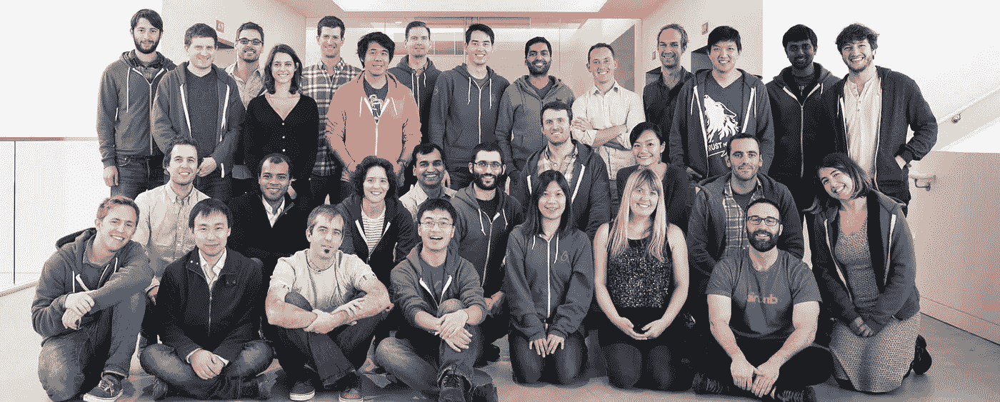
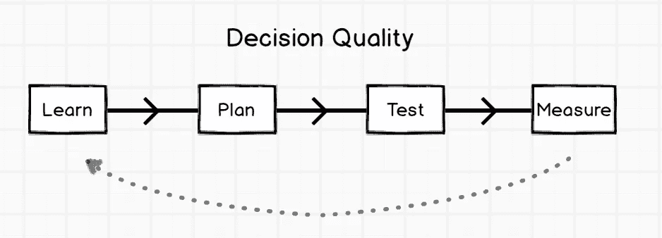
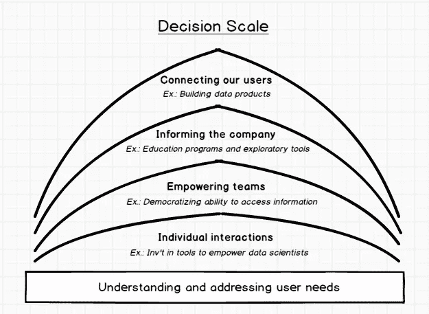

# 在 Airbnb，数据科学属于任何地方

> 原文：<https://medium.com/airbnb-engineering/at-airbnb-data-science-belongs-everywhere-917250c6beba?source=collection_archive---------0----------------------->

## 五年高速增长的启示

赖利·纽曼

五年前，我加入了 Airbnb，成为它的第一位数据科学家。

那时，少数几个听说过这家公司的人还在琢磨如何念它的名字，大约 7 人的团队(取决于你是否把沙发上的那个人、实习生和我们最喜欢的咖啡店的咖啡师算在内)还在创始人位于 SOMA 的公寓里工作。简而言之，这是相当早期的阶段。

让我加入是我们创始人的前瞻性举措。这发生在大数据热潮和数据可以成为决定性竞争优势的传统观念之前。当时，在公司生命周期的后期建立数据团队要常见得多。但他们渴望尽快学习和发展，我被这家公司的文化和使命所吸引。因此，尽管我们当时是一个非常小的数据商店，我还是决定参与进来。

硅谷有一种创业初期的浪漫主义:你行动迅速，做出基础性决策，任何好主意都可能成为下一个大事件。在我看来，这都是真的。

当时我们对这个行业知之甚少，任何见解都是开创性的；数据基础设施是快速、稳定和实时的(我正在查询我们的生产 mysql 数据库)；公司很小，每个人都参与了每个决策；数据团队(me)围绕一套单一的指标和方法保持一致。

但是五年后，43，000%的增长，事情变得有点复杂。我很高兴地说，我们在利用数据的方式上也更加成熟，现在有了更多的数据。诀窍是以一种将早期的魔力与当前日益增长的需求结合起来的方式来管理规模——我知道我们并不是唯一面临这一挑战的人。

因此，我认为有必要将我们关于我们正在解决的具体问题的帖子与数据团队在公司发展过程中遇到的更高层次问题的概述以及我们 Airbnb 的应对方式结合起来。这将主要围绕如何将数据科学与其他业务功能联系起来，但我将把它分成三个概念——我们如何描述数据科学，它如何参与决策，以及我们如何将其扩展到 Airbnb 的各个方面。我不会说我们的解决方案是完美的，但我们每天都在努力保留早期的兴奋、文化和影响。

# 数据不是数字，而是人

数据科学团队的基础是组织中其他地方的文化和对数据的看法，因此定义我们如何看待数据是将数据科学植入业务职能的先决条件。

在过去，数据经常以冷冰冰的数字术语引用。它被解释为纯粹的测量工具，将数据科学家描绘成斯波克式的人物，期望他们记住统计数据，并根据要求提供。因此，与我们的交互往往以请求事实的形式出现:我们在巴黎有多少个列表？意大利 10 大目的地有哪些？

虽然回答问题和测量东西肯定是工作的一部分，但在 Airbnb，我们以更人性化的方式描述数据:**这是我们客户的声音**。数据是一个行为或事件的记录，在大多数情况下反映了一个人所做的决定。如果你能重现导致那个决定的事件顺序，你就能从中吸取教训；这是一个人告诉你他们喜欢什么和不喜欢什么的间接方式——这个属性比那个属性更有吸引力，我发现这些特征很有用，但是那些..没有那么多。

这种反馈可以成为关于社区发展、产品开发和资源优先化决策的金矿。但前提是你能破译它。因此，数据科学是一种解释行为，我们将客户的“声音”翻译成更适合决策的语言。

这个想法在 Airbnb 引起了共鸣，因为倾听客人和主人是我们文化的核心。从早期开始，我们的团队就与社区成员会面，了解如何让我们的产品更好地满足他们的需求。我们仍然这样做，但社区的规模现在已经超出了可以与任何地方的任何人联系的程度。

所以，数据成了盟友。我们使用统计数据来了解个人经历，并汇总这些经历来确定整个社区的趋势；这些趋势会影响推动业务发展的决策。

随着时间的推移，我们在其他团队的同事逐渐明白，数据团队不是一群火神，而是我们代表了客户的真实心声。这为 Airbnb 数据科学结构的变化铺平了道路。

# 主动合作关系与被动统计数据收集

因此，一名优秀的数据科学家能够了解使用我们产品的人的想法，了解他们的需求。但是如果他们独自一人在森林里，没有人对他们发现的洞察力采取行动，那又有什么区别呢？

我们区分好与伟大的标准是影响力——利用洞察力来影响决策，并确保决策达到预期效果。虽然这似乎是显而易见的，但它不会自然发生——当数据科学家时间紧迫时，他们倾向于将分析结果“扔过墙”,然后转移到下一个问题。这并不是因为他们不想看到项目完成，而是因为他们投入了如此多的精力来理解数据，确保统计方法严谨，并确保结果得到正确解释，他们工作的交流可能感觉像是微不足道的事后想法。

但是，当决策者不理解洞察力的后果时，他们不会采取行动。当他们不采取行动时，洞察力的价值就丧失了。

我们认为，解决方案是将数据科学家与决策者尽可能紧密地联系起来。在某些情况下，这是自然发生的；例如，当我们开发数据产品时(在以后的文章中会有更多的介绍)。但 Airbnb 也有跨职能合作的强烈信念，这带来了如何在更广泛的组织内构建团队的问题。

关于集中式和嵌入式数据科学团队的利与弊，已经有很多文章发表了，所以我不会重点讨论这些。但可以说我们已经到达了两者的混合体。

我们从集中式模型开始，被它提供的相互学习的机会所吸引，并在度量、方法和过去工作的知识上保持一致。虽然这都是真的，但我们最终是在决策业务中，并且发现我们无法成功地做到这一点，因为我们的合作伙伴团队不完全了解如何与我们互动，我们团队中的数据科学家不了解他们要解决的问题的完整背景，也不知道如何使其可行。随着时间的推移，我们被视为一种资源，因此，我们的工作变得被动——回应对统计数据的要求，而不是能够主动思考未来的机会。

因此，我们决定从完全集中的安排转向混合的集中/嵌入式结构:我们仍然遵循集中模式，因为我们有一个单一的数据科学团队，我们的职业生涯在这里展开，但我们已经将其分成子团队，这些子团队与工程师、设计师、产品经理、营销人员和其他人更直接地合作。这样做加快了整个公司对数据的采用，并将数据科学家从被动的统计收集者提升为主动的合作伙伴。通过不完全转向嵌入式模式，我们能够在业务的每个方面保持优势，使我们能够形成一个神经核心，帮助公司的各个方面相互学习。

# 客户驱动的决策

结构是实现有影响力的数据科学的一大步，但这不是全部。一旦在一个团队中，可以对一个观点采取行动，问题就变成了如何以及何时在商业决策中利用社区的声音。

通过我们与公司各个方面的合作，我们遇到了许多关于如何将数据集成到项目中的观点。有些人天生好奇，喜欢从了解他们面临的问题的背景开始。其他人认为数据反映了过去，因此对规划的指导作用较弱；但是这些人更倾向于衡量他们直觉决定的影响。

两种观点都是公平的。完全由数据驱动会导致向局部最大值优化；找到一个全局最大值需要不时地震动系统。但是它们反映了在项目生命周期中可以利用数据的不同点。

随着时间的推移，我们发现决策过程的四个阶段受益于数据科学的不同元素:

1.  我们从了解问题的背景开始，将过去的研究和为抓住机会所做的努力汇总起来。这更像是一个探索性的过程，旨在确定机会的大小，并提出假设，从而得出可操作的见解。
2.  这个概要转化为一个计划，它包括对我们打算使用的杠杆进行优先排序，并对我们努力的效果形成一个假设。预测分析在这一阶段更有意义，因为我们必须根据我们预计会产生最大影响的领域来决定要走的路。
3.  随着计划的进行，我们设计了一个受控的实验来推出计划。A/B 测试现在非常普遍，但我们与业务各方的合作为在更广泛的意义上使用实验开辟了机会——基于市场的操作测试，以及更传统的在线环境。
4.  最后，我们测量实验的结果，确定我们努力的因果影响。如果成功，我们向整个社区推出；如果没有，我们会循环回去学习为什么它没有成功，并重复这个过程。

有时候，一个步骤相当简单，例如，如果问题的背景很明显——我们应该构建一个移动应用程序的事实并不需要预先有一个沉重的概要。但是，我们越是严格按照顺序执行每一步，Airbnb 的每个人就变得越有影响力。这是有意义的，因为最终，这个过程推动我们以满足社区需求的方式解决与社区相关的问题。

# 数据科学民主化

当数据科学家有足够的带宽时，上述模型非常棒。但是，超高速增长的创业公司的现实是，需要做出决策的规模和速度将不可避免地超过数据科学团队的增长。

这一点在 2011 年 Airbnb 在国际上爆发时变得尤为明显。今年年初，我们还是一家完全位于旧金山的小公司，这意味着我们的三名数据科学家可以有效地与每个人合作。

六个月后，我们同时开设了 10 多个国际办事处，同时扩大了我们的产品、营销和客户支持团队。我们与每个员工直接合作的能力突然不可逆转地消失了。

正如不可能见到社区的每一个新成员一样，现在也不可能见到每一个员工并与他们一起工作。我们需要找到一种方法来使我们的工作民主化，从个人互动扩展到授权团队、公司甚至我们的社区。

要成功做到这一点，需要变得更加高效和有效，主要是通过围绕数据的技术投资。以下是我们如何处理每个级别的一些示例:

1.  随着数据科学家能够更加快速地行动，个人互动变得更加高效。投资于数据基础设施是最大的杠杆——采用更快、更可靠的技术来查询不断增长的数据量。稳定 ETL 也很有价值，例如通过我们开发的[气流](http://nerds.airbnb.com/airflow/)。
2.  增强团队能力是指从数据科学家的肩上卸下报告和基本数据探索的负担，以便他们可以专注于更有影响力的工作。仪表板是解决方案的一个常见示例。我们还开发了一个工具，帮助人们根据强大而直观的数据仓库编写查询( [Airpal](http://nerds.airbnb.com/airpal/) )。
3.  在单个团队之外，我们的工作更具战术性，我们从整体上考虑公司的数据文化。教育人们如何看待 Airbnb 的生态系统，以及如何使用 Airpal 等工具，可以消除进入壁垒，激发人们对每个人如何更好地利用数据的好奇心。类似于授权团队，这有助于将我们从特别的统计请求中解放出来。
4.  扩展数据科学最广泛的例子是让来宾和主机能够直接相互学习。这主要通过数据产品来实现，其中机器学习模型解释来自一组社区成员的信号，以帮助指导其他人。[位置相关性](http://nerds.airbnb.com/location-relevance/)是我们写的一个例子，但随着这项工作在公司其他领域变得越来越常见，我们开发了一些工具，让[更容易推出](http://nerds.airbnb.com/architecting-machine-learning-system-risk/)和[更容易理解](http://nerds.airbnb.com/aerosolve/)我们开发的模型。

将一个数据科学团队扩展到一家高速发展的公司并不容易。但这是可能的。尤其是如果每个人都认同这不仅仅是公司美好的一部分，还是公司必不可少的一部分。

# 与猴子摔跤的火车

五年来，我们学到了很多。我们改进了利用我们收集的数据的方式；我们如何与决策者互动；以及我们如何将这种能力推广到公司。但是所有这些工作在多大程度上是成功的呢？

具有讽刺意味的是，衡量数据科学团队的影响非常困难，但一个信号是，现在人们一致希望参考数据来做出决策，这些决策需要由技术人员和非技术人员做出。我们的团队成员被视为决策过程中的合作伙伴，而不仅仅是被动的统计收集者。

另一个原因是，我们从工作中提取因果影响的能力越来越强，这有助于我们把火车从猴子身上摔下来。这比人们想象的要棘手，因为 Airbnb 的生态系统很复杂——一个具有网络效应、季节性强、交易不频繁和时间跨度长的双边市场——但这些挑战让这项工作更加令人兴奋。尽管我们在过去几年里取得了很大成就，但我认为我们仍然只是触及了我们潜力的皮毛。

我们现在的基础设施稳定，工具先进，仓库干净可靠。我们准备好迎接令人兴奋的新问题。在不久的将来，我们期待从批处理转移到实时处理；开发更强大的异常检测系统；加深我们对网络效应的理解；增加我们在匹配和个性化方面的复杂性。

但是这些想法仅仅是开始。数据是我们客户的(聚合)声音。无论我们下一步去哪里，无论我们下一步属于哪里，都将受到这些声音的推动。

## 在 [airbnb.io](http://airbnb.io) 查看我们所有的开源项目，并在 Twitter 上关注我们:[@ Airbnb eng](https://twitter.com/AirbnbEng)+[@ Airbnb data](https://twitter.com/AirbnbData)

*本帖最初出现在* [Venturebeat](http://venturebeat.com/2015/06/30/how-we-scaled-data-science-to-all-sides-of-airbnb-over-5-years-of-hypergrowth/) 上。

*随后于 2015 年 7 月 7 日在*[*nerds.airbnb.com*](http://nerds.airbnb.com/scaling-data-science/)*转贴。*