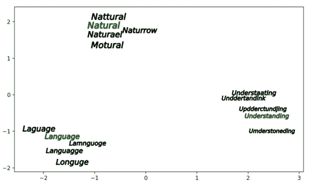

# 参加微软 One 商业合作伙伴(OCP)虚拟黑客马拉松

> 原文：<https://medium.com/version-1/attending-a-microsoft-one-commercial-partner-ocp-virtual-hackathon-81ed439258a6?source=collection_archive---------6----------------------->

Photo by [You X Ventures](https://unsplash.com/@youxventures?utm_source=medium&utm_medium=referral) on [Unsplash](https://unsplash.com?utm_source=medium&utm_medium=referral)

微软于 2021 年 3 月 2 日至 4 日举办了一场虚拟黑客马拉松，产生了许多优秀的想法。One Commercial Partner (OCP)计划通过推动新的市场和解决方案来转变企业的工作方式，从而加速了发展。作为一种创新和引领新潮流的努力，Acclaim 与微软合作推出了微软 OCP 计划——一个承诺大量学习和酷奖励的旅程。

Credit: GlobalExec.

## 版本 1 —创新团队:

版本 1 创新团队的 4 个人参加了黑客马拉松。创新团队一直在与几个政府客户一起开发表单审查和输入工具。该工具用于处理包含大量 PDF/扫描表格的申请。参加黑客马拉松的主要目的是探索在最终审查和提交之前对数据进行进一步后处理和验证的可能性。

## 用例:智能数据捕获

我们选择了客户面临的一个常见问题。他们在手动数据输入上花费了大量的时间和资源。表单识别器在从表单中提取打印文本方面做得很好，但手写表单有时会非常棘手。因此，我们希望在表单识别功能的基础上构建一个解决方案，在处理手写文本时自动建议和纠正。

通过突出显示建议的更正和构建验证(使用向量空间)来清理手写表单的表单识别器输出。

附加功能可用于以下领域:

*   姓名(名和姓)
*   地址
*   县
*   国家
*   电子邮件
*   Eircode

# 对 Azure 表单识别器中识别不佳的数据进行文本自动建议/更正

## Azure 表单识别器:

表单识别器是一种人工智能支持的文档提取服务，它可以理解表单，并从 W2 税务报表、完成报告、发票和采购订单等文档中提取键值对、表格和文本。表单识别器增加了对手写和混合模式(打印和手写)以及打印表单的支持。

在我们的解决方案中，我们开发了一个 Flask 应用程序，它使用表单识别器的定制模型从扫描的表单中提取上述字段，这些表单大部分是手写的。

要了解更多关于设置 Azure 表单识别器和构建自定义模型的信息，请阅读我们之前的[博客](/version-1/data-extraction-using-azure-form-recognizer-custom-model-python-sdk-ec40bb89a611)。

**挑战:**

在分析文档时，我们发现 Form Recogniser 在处理手写不良或扫描不正确的文档时有困难。一些字符没有被正确识别。

**我们的解决方案:**

添加一个额外的验证层，使用预定义的正则表达式模式(基于特定的字段)来识别提取的数据是否是有效的格式。如果任何字段值未能通过验证，我们会将该数据发送到我们的自动更正模型(如下所述),以生成接近实际答案的建议。

## 现场验证

对于黑客马拉松，我们只集中验证了一些字段，如 MPRN、Eircode 和 RECI 号码。我们考虑了以下参数来验证每个字段。

1.  **数据类型**:字符串、日期、整数。
2.  **模式**:正则表达式检查，包括允许的字符。
3.  **规则**:基于逻辑，如数字范围、日期范围、最大数等。
4.  **检查**:内部或外部查找，例如，假设我们想要查看被识别的 MPRN 是否有效。我们需要查找一些数据库或外部服务。

我们创建了一个 python 脚本，该脚本接受表单识别器的结果，并根据由每个字段的 regex 模式组成的查找 JSON 文件对它们进行验证。如果模式匹配上面定义的验证(规则、数据类型和检查)，我们就前进到工作流的下一步。如果验证失败，我们尝试使用机器学习和向量空间算法自动更正并向用户建议潜在选项。

## 文本自动更正

为了自动更正字段，我们找到了正确单词和错误单词之间的相似性。例如

在上表中，右边的单词是不正确的，但它们与左边的密切相关。因此，在二维平面上可视化这些单词时，拼写相似的单词彼此更接近，如下所示。

我们开发了一个类似的模型，可以自动更正爱尔兰人的名字，它基于以下三个概念。

1.  **文字嵌入**:

它是单词的向量表示，其中向量中的每个值都有一些权重。这是一种习得性的文本表达方式，意思相同的单词有相似的表达方式。使用这种技术的好处是它们具有低维空间并且是密集的(向量中的大多数值是非零的)。

主要目标是使单词具有相似的上下文并占据接近的空间位置。从数学上来说，这些向量之间的角度的余弦应该接近 1，即接近 0 的角度。直观上，我们引入了一个单词对其他单词的某种依赖。

**2。Word2Vec:**

这是一种构建上述嵌入的方法。它可以通过两种方法获得，两种方法都涉及神经网络。

*   **连续词袋(CBOW):** 该方法以每个词的上下文(单个或多个上下文)为输入，尝试预测该上下文对应的词。
*   **Skip Gram:** 我们使用目标词(我们想要生成其表示)通过生成表示来预测上下文。

关于 Word2Vec 及其方法的更多细节，请阅读这个[链接](https://en.wikipedia.org/wiki/Word2vec)。

**3。Char2Vec:**

Word2Vec 模型使用固定的词汇表，通常不考虑罕见的单词或错别字。为了解决这个限制，我们需要只基于拼写的单词嵌入，并将相似的向量整理成拼写相似的单词。

[**Char2Vec**](https://hackernoon.com/chars2vec-character-based-language-model-for-handling-real-world-texts-with-spelling-errors-and-a3e4053a147d) 模型用固定长度的向量表示任意长度的每个符号序列；向量之间的距离度量表示单词拼写的相似性。

对于黑客马拉松，我们用爱尔兰和英国字符创建了一个定制的 Char2Vec 模型，并训练了 LSTM 模型。训练完模型后，我们创建了一个包含所有可用名字的向量空间。该模型以这样的方式工作，即输入测试拼写错误的名称被矢量化，余弦距离用向量空间的其余部分来计算。返回具有最小余弦角或最高相似度的单词。

# 学习和结论

总的来说，黑客马拉松是一次很棒的经历，会见了雄心勃勃的开发人员，从微软获得了对我们战略的积极反馈，并传播了关于版本 1 的消息。

我们还确定了一些 Azure 表单识别器约束，并向微软的产品团队解决了这些问题，并收到了他们的快速响应。值得考虑的是，他们未来运行的黑客技术和潜在的想法是一个克服任何技术挑战的机会。微软为他们提供了巨大的支持，比平常更快的周转和与人(和产品团队)的接触。

**关于作者**

*Sumit Kumar 目前是 Version 1 创新实验室的数据科学家，他为客户开发创新解决方案和价值证明，以确保 Version 1 始终处于颠覆性技术的前沿。*

*Ankit Kumar 目前是创新数据科学家顾问，在 Version 1 的创新实验室工作。*