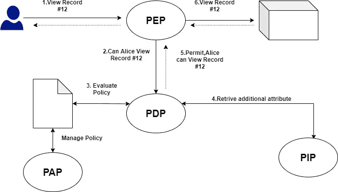
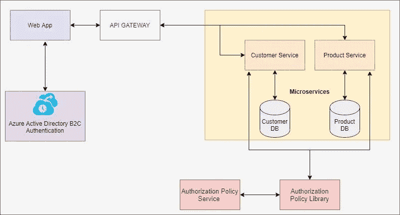
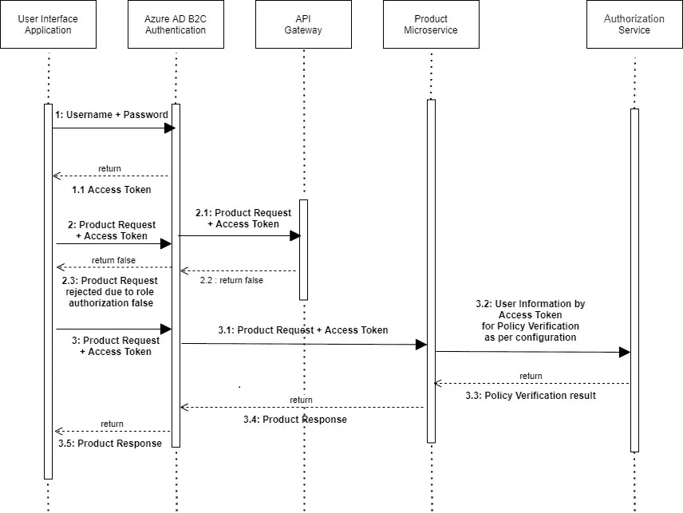
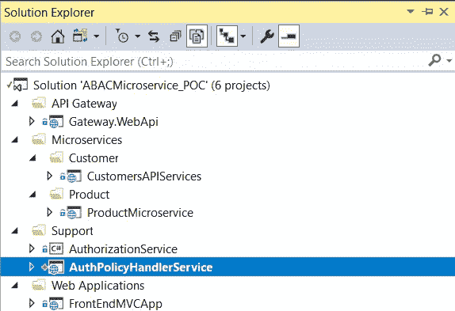
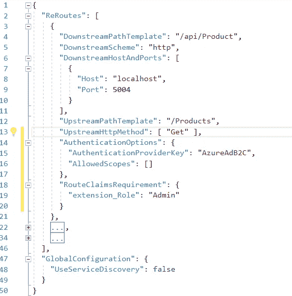
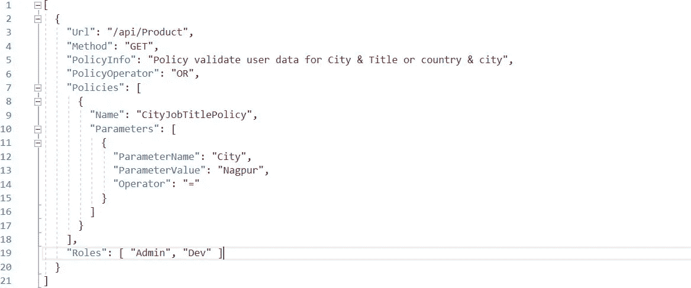

# 微服务架构中基于属性的访问控制

> 原文：<https://medium.com/globant/attribute-based-access-control-in-a-microservices-architecture-7c68f633b2d3?source=collection_archive---------0----------------------->

访问控制是任何公司安全基础设施的基本要素。每个安全官都希望在不损害公司工作流程的情况下应用少特权、零信任、职责分离和其他最佳实践的原则。有几种组织访问管理系统的方法。在这篇博客中，我们分析了两种最流行的访问控制模型:基于角色的和基于属性的。我们将讨论基于属性的访问控制实施挑战，并通过 POC 实施进行演练。

什么是基于角色的访问控制(RBAC)？

基于角色的访问控制(RBAC)是一种基于定义组织内员工角色和相应权限的访问控制方法。这个模型的思想是给每个员工分配一个角色。每个角色都有一组权限和限制。只有当员工在系统中的角色具有相关权限时，员工才能访问对象和执行操作。

例如，公司的会计应该被允许处理财务信息，但不应该接触客户联系信息或信用卡数据。

一个用户可能被分配一个或多个角色。当一个新员工来到你的公司，很容易给他们分配一个角色。当有人离开公司时，你不需要改变角色参数或中心政策。

让我们考虑一下基于角色的访问控制方法的主要组件:

●用户有权访问系统的个人(拥有 UID)

●角色一个指定的工作职能(表明权力级别)

●等同于访问权限的权限

●会话在工作时间的上下文中，用户和用户被分配到的一组角色之间的映射

●需要访问权限的系统资源

●操作受保护网络中的任何动作

RBAC 的基本规则是:

●只有为主体分配了角色，用户才能执行操作。

●识别和认证不被认为是操作。

●所有的用户活动都是通过运营来进行的。

**什么是基于属性的访问控制(ABAC)** ？

基于属性的访问控制是从 RBAC 发展而来的一种模型。该模型基于为系统的任何元素建立一组属性。中央策略定义了执行任何操作所需的用户和对象属性的组合。让我们考虑一下 ABAC 模型的主要组成部分:

让我们考虑一下 ABAC 车型的**主要部件**:

*   属性—网络中任何元素的特征。属性可以定义:
*   **用户**特征——员工职位、部门、IP 地址、权限等级等。
*   **物体**特征——类型、创建者、灵敏度、要求的间隙等级等。
*   **动作类型** —读取、写入、编辑、复制、粘贴等。
*   **环境**特征——时间、星期几、地点等。
*   **主体** —网络中任何可以执行动作的用户或资源；一个主题被分配属性来定义它的许可级别
*   **对象** —网络中存储的任何数据；对象被赋予属性来描述和识别它们
*   **操作** —网络中任何主体采取的任何行动
*   **策略** —允许或限制您的信息检索系统中的任何操作的一组规则；规则是基于任何元素(用户、资源、环境)属性的“IF/THEN”语句

**ABAC 建筑:**

ABAC Architecture

这幅图强调了 ABAC 是如何工作的:你有一个拦截器或执行点(PEP)的概念，它拦截用户和应用程序之间的流。这个执行点将检查用户是否可以访问他们想要访问的任何东西(数据、API 调用、小部件……)。这个想法是，PEP 是你要保护的地方，但决策是集中的，这将给予什么

你的**一致**授权。您可以拥有针对 SPA 和 API 的 pep，他们可以一致地实施相同的授权策略。

PDP 或策略决策点是处理授权请求并根据您之前编写的一组策略对其进行评估的点。编写的语言策略通常是 [alfa](https://stackoverflow.com/questions/tagged/alfa) 或 [xacml](https://stackoverflow.com/questions/tagged/xacml) 。

PIP(策略信息点)是您的数据源和用户目录(AD、DB……)的抽象表示，您可以在其中存储有关用户和资源的附加信息。它们有助于做出正确的决定。

**基于角色的访问控制(RBAC)与基于属性的访问控制(ABAC)**

让我们比较一下这两种流行的方法——基于角色的访问控制和基于属性的访问控制——以确定各自的优缺点。

# RBAC 赞成和反对

RBAC 是限制访问最流行的方法。这种模式的主要优势在于，公司不再需要以个人为基础授权或撤销访问，而是根据用户的角色将他们聚集在一起。在中小型公司中建立一套角色并不具有挑战性。另一方面，在大型企业中建立这样的系统并不容易。

RBAC 模型有几个限制。在用户开始工作之前，您不能使用系统未知的参数来设置规则。权限只能分配给用户角色，不能分配给对象和操作。此外，使用 RBAC，您可以限制对系统中某些操作的访问，但不能限制对某些数据的访问。

# ABAC 赞成和反对

ABAC 的关键**优势在于，它不是基于用户角色而是基于每个系统组件的属性授予访问权限。这样，您可以描述任何复杂性的业务规则。即使您需要使某些数据只能在工作时间访问，也可以通过一个简单的策略轻松实现。最重要的是，ABAC 规则可以评估尚未被授权系统编目的主题和资源的属性。**

至于 **ABAC 限制**，由于必须指定和维护策略的方式，这种类型的系统很难配置。很难执行事前审计并确定特定用户可用的权限。不可能确定任何给定员工职位的风险暴露。

Gartner 预测，到 2020 年，70%的组织将使用 ABAC，包括 RBAC 和 ABAC

公司通常从实施平面 RBAC 开始。这种模式更容易设置和维护。随着组织的发展和管理更加敏感的数据，他们意识到需要更复杂的访问控制系统。RBAC 和 ABAC 可以一起使用，RBAC 做粗略的工作，ABAC 用更精细的过滤来补充。

三种 RBAC-安方法处理角色和属性之间的关系:

*   **以属性为中心**。角色成为其中一个用户属性的名称。它类似于一个职位名称。在这样的模型中，“角色”属性用于标记某个职位所需的一组属性。
*   **以角色为中心**。添加属性是为了约束角色。在这样的模型中，属性可以减少用户可用的权限。这种方法增强了数据的安全性。
*   **动态角色**。诸如一天中的时间之类的属性用于确定主体的角色。在某些情况下，用户的角色可以完全由动态属性决定。

**ABAC 微传动样品应用**

**开发环境**

*   [。网芯 2.2 SDK](https://dotnet.microsoft.com/download)
*   [Visual Studio。Net 2017](https://visualstudio.microsoft.com/downloads/)

**技术**

*   C#。网
*   ASP。NET WEB API 核心
*   Azure 云服务

**使用的开源工具**

*   Ocelot(用于 API 网关聚合)
*   Swashbuckle(用于 API 文档)

**WEBAPI 端点**

该应用程序在 API 网关中配置了四个 API 端点，以演示启用了基于令牌的安全选项的特性。这些路由向客户端应用程序公开，以使用后端服务。

**通过 API 网关配置和访问终端**

1.  **“/用户/认证”——**认证用户并颁发令牌
2.  **"/Products"** —检索产品信息。
3.  **"/客户"** —检索客户信息。

**在微服务级别实施的端点**

1.  **"/API/user/authenticate "**-对用户进行身份验证并颁发令牌
2.  **"/API/Products" -** 检索产品信息。
3.  **"/API/Customers "-**检索客户信息。

Fig: ABAC MICRO SERVICE SAMPLE APP ARCHITECTURE DIAGRAM

Fig: SAMPLE APPLICATION IMPLEMENTATION UML SEQUENCES DIAGRAM

**解决方案结构**

*   **Azure AD B2C 认证**

1.  使用用户名、密码作为输入参数处理身份验证部分，并发布一个包含声明身份信息的 JWT 不记名令牌。

*   **网关服务**

1.  通过检查传入的 HTTP 请求中是否有授权的 JWT 令牌来验证该请求。
2.  根据基于角色声明处理授权。
3.  将 HTTP 请求重新路由到下游服务。
4.  使用 Ocelot 开源 NuGet 包，借助配置设置处理所有网关操作。

*   **MVC 应用**

1.  一个连接到 API Gateway 的 MVC 客户端应用程序，可以使用用户名、密码登录，并显示产品和客户信息。

*   **产品服务**

1.  支持 HTTP Get 方法。接收对这些方法的 HTTP 请求。
2.  从包含承载令牌的授权头中读取身份信息
3.  将响应结果返回给客户端

*   **客服**

1.  支持 HTTP Get 方法。接收对这些方法的 HTTP 请求。
2.  从包含承载令牌的授权头中读取身份信息
3.  将响应结果返回给客户端

*   **授权类库**

1.类库用于包含所有的策略定义和验证逻辑

*   **授权处理程序服务**

1.  服务用于在运行时处理策略配置设置，因此无需编译解决方案或项目
2.  提供 UI 来处理所有与策略配置 JSON 相关的 CRUD 操作。
3.  我们可以通过应用程序 JSON 提供一个角色列表。因此，我们可以向授权处理程序服务提供一个可配置角色列表&应用一个策略，让角色访问微服务中可用的 API。

**应用架构**

示例应用程序是基于微服务架构构建的。使用微服务架构构建应用程序有几个优势，比如服务可以独立开发、部署和扩展。下图显示了后端体系结构的高级设计。

*   **Azure AD B2C 身份验证** —基于用户名和密码验证用户，并颁发包含基于声明的身份信息的 JWT 不记名令牌。Azure AD B2C 认证支持多重身份认证，如 Google、Amazon、LinkedIn 等。
*   **产品微服务** —进行产品相关的数据操作。
*   **客户微服务** —执行客户相关数据操作。
*   **API 网关** —充当后端应用程序的中心入口点，提供数据聚合和微服务的通信路径。此外，维护基于声明的授权。所有设置都使用配置设置 JSON 文件进行管理。

Fig: Ocelot open-source configuration setting file

*   **授权类库—** 类库用于包含所有 ABAC 策略定义&验证逻辑。
*   **授权策略处理程序服务** —服务用于在运行时处理策略配置设置，因此无需编译解决方案或项目。使用 JSON 配置文件，我们可以在运行时更改策略结构，从微服务 API 的已定义策略列表中添加或删除策略。授权策略处理程序 UI 只有管理员用户可以访问，否则我们会得到一个“访问被拒绝”的错误。

Fig: Customize ABAC Policy JSON configuration file

**如何选择访问控制解决方案**

说到安全性，仔细规划和监控您的访问控制流程至关重要。使用强大的访问管理工具来帮助您设置访问控制，并定期检查您的设置，以确保它仍然符合您的组织需求。

无论您是否投资 Access Rights Manager，请确保您选择的工具可以建立一个协议和机制，以确保用户能够正确访问他们工作所需的内容，仅此而已。

**结论**

使用定制的 ABAC POC，我们可以在运行时轻松地对不同的微服务执行授权和认证，而无需更改实际的应用代码。

此外，使用各种 Azure B2C 身份提供者来访问不同门户中的应用程序。该解决方案将提供集中式微服务配置以及策略部署获取器。这里我们解决了微服务中各种 API 网关设计模式的问题，并提供了一个在运行时部署 ABAC 策略的解决方案。

使用以下链接从 Github 下载 ABAC 微服务架构示例应用:-[https://Github . com/chetandravekar/abacmicroservicearchitecture PC . git](https://github.com/chetandravekar/ABACMicroserviceArchiTecturePOC.git)