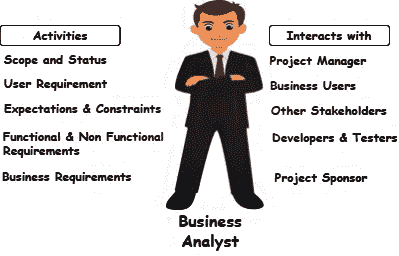
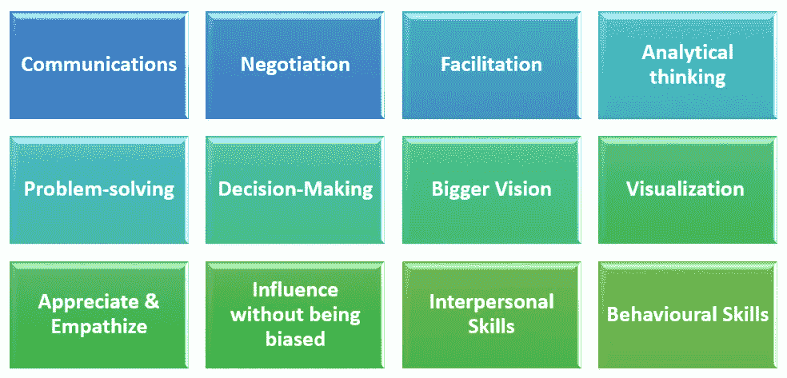
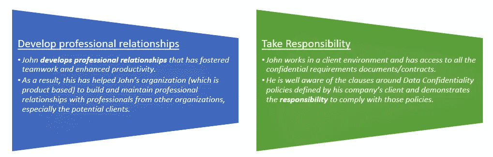
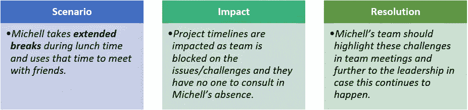
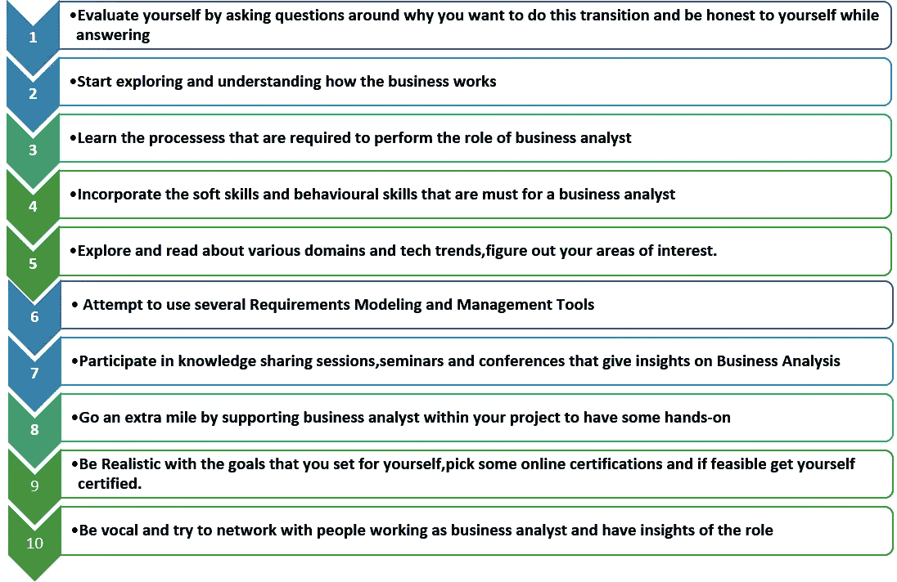
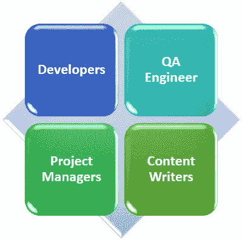

# 优秀商业分析师的特质，以及如何转变成一名优秀商业分析师？

> 原文：<https://medium.com/globant/attributes-of-a-great-business-analyst-and-how-do-you-transform-to-one-5bb874062a01?source=collection_archive---------0----------------------->

由[瑞玛·帕布](https://medium.com/u/754becc32599?source=post_page-----5bb874062a01--------------------------------)、[尼兰詹·乔杜里](https://medium.com/u/792096939e75?source=post_page-----5bb874062a01--------------------------------)和[安纳亚·萨胡](https://medium.com/u/fea13cc2d19d?source=post_page-----5bb874062a01--------------------------------)

## 介绍

我们大多数在软件开发生命周期中扮演各种角色的人都觉得业务分析师的工作是最容易的，因为他们所做的就是从客户那里获得需求。只有当他们完成一项没有业务分析师的任务时，人们才会意识到这个角色的重要性。

## 在产品开发过程中，业务分析师如何做出贡献？

让我们来看看下面的场景:

> 一家名为“ABC Technologies”的公司希望向客户提供服务，最终用户可以来到他们的网站，并获得传送到指定位置的上传照片的打印副本。
> 
> 因此，这家公司联系了“XYZ 技术”的一个实施团队，并说“请建立这个网站”。但是现在，实施团队不确定他们应该遵循的流程，也不确定是否需要满足任何额外的服务。“XYZ 技术”的实施团队花费了大量精力来获得所需的答案，如果有业务分析师在场的话，这些问题本可以很容易解决。"

所以通俗地说，一个**业务分析师就是与一个组织的多个业务涉众沟通，了解他们的需求，并将其转化为最终需求的人。他们与项目实施和质量保证团队一起计划、设计和验证收到的要求的最终结果。**

## 业务分析师能带来什么？为什么这个角色如此重要？

当 BA 开始一个项目的工作时，他们做的第一件事是将所有收到的需求分成更小的片段，这样每个团队成员都可以拥有这些片段并相应地进行工作。有了这些更小的片段，实现及其质量保证就可以快速完成。

项目活动一开始，业务分析师就确保跟踪每个团队成员取得的所有进展。这有助于他们评估项目的计划里程碑是否能够实现。基于日常的跟踪和评估，业务分析师向项目经理更新他们预见到的与项目相关的任何风险，以便他们可以一起工作来减轻风险。

开发产品有多种角色，但业务分析师是关键的联系人。由于他们有效的沟通技巧，他们与客户交谈，了解他们的困难领域，并向开发团队强调它们。一旦开发团队理解了客户的痛苦，他们就会致力于交付定性的解决方案。

业务分析师以其精确和面向过程的文档而闻名。创建的文档总是非常详细的信息，因为业务分析师总是知道所有正在进行的活动，因为他们与组织中的多个部门保持联系。

组织总是热衷于扩张或适应最新的趋势，但是，他们无法得出他们的扩张或适应愿景是否会成功，在这里，业务分析师将进行详细的研究，并进行各种计算，以确定扩张或适应是否有利可图，基于业务分析师提交的研究报告，组织将相应地制定其扩张或适应计划。

## 让我们更详细地了解一下业务分析师日是怎样的:

Eva 是一名业务分析师，在一家根据客户需求开发应用程序的公司工作，而 James 是一名企业家，希望建立一个销售服装和配饰的电子商务网站。

詹姆斯向伊娃的公司提出建立电子商务网站的要求。伊娃向詹姆斯保证，她和她的团队将帮助詹姆斯实现他的愿景。

方佩蓉首先向她的项目经理 Matt 报告了该项目的最新情况，并要求他完成与该项目的相关手续，以便她可以与 James 进一步讨论以了解他的需求，James 同意支持方佩蓉获取所有业务需求。没有任何进一步的延迟，方佩蓉开始进行启动此专案所需的所有必要行动。

方佩蓉执行下列动作:

*   她试图理解问题陈述和 James 希望通过构建电子商务网站实现的业务目标。她分析这些细节，并提出最适合詹姆斯业务的建议。
*   一旦他们就所有的要求达成一致，她会记录下来，并与 James 分享以供审阅，这有助于她获得信心，相信她和 James 在同一页上。
*   现在，她与项目经理一起计划将要参与建设该项目的工作，并向 James 和他的合作伙伴 Luke 提供相同的细节，Luke 将赞助该项目。
*   一旦批准到位，她就计划团队成员(架构师、开发人员和质量保证工程师团队)以及项目预算范围内的项目经理。
*   她开始向开发人员分配任务，并与他们密切合作，以了解是否有任何挑战或问题。
*   她定期与詹姆斯举行会议，以解决任何未决问题。
*   为了让开发团队更好地理解这个项目，她创建了以下人工制品:*流程图和用户如何与系统交互的图表*
*   她和开发团队一起创建应用程序布局，这将有助于所有利益相关者可视化网站看起来会是什么样子。
*   当原型被构建时，她与测试团队一起设定正确的期望，以根据功能性和非功能性需求来验证产品。
*   测试阶段完成后，伊娃将原型移交给詹姆斯和他的团队进行验证，并开始收集他们的反馈- *这有助于伊娃确定詹姆斯是否满意所做的一切，或者他是否有任何需要考虑的建议。*
*   Eva 还执行构建报告的关键活动，该报告将使所有的业务利益相关者得到更新。
*   所有活动完成后，方佩蓉将创建文档和演示文稿，其中包含与此项目相关的所有学习内容。

伊娃现在准备将服装网站移交给詹姆斯，**詹姆斯对交付的产品非常满意，并向伊娃保证，他会回到她的公司处理任何未来的项目需求。**

## 技术和行为技能的正确结合使业务分析师在工作中脱颖而出。

“我做生意的模式是披头士。有四个人互相控制着对方的消极倾向。它们相互平衡，总和大于各部分之和。这就是我对商业的看法。你知道，生意场上的大事从来不是一个人完成的。它们是由一群人完成的。”— ***苹果公司创始人史蒂夫·乔布斯***

## 想知道行为特征对商业分析师有多重要吗？请继续阅读。

互联网上发布的大多数研究/期刊也表明，道德是商业分析师最重要的行为特征之一。根据 BABOK v3，行为特征中最重要的核心能力之一是道德。BA 能够识别提议的解决方案何时会给组织带来道德难题，从而有助于降低风险。此外，如果 BA 意识到道德问题，那么他们可以识别道德困境何时发生，并建议解决此类困境的方法。

BA 的有效道德行为的结果不仅有助于他们与利益相关方建立信任和关系，还有助于

*   透明沟通
*   没有任何偏袒和偏见的决策
*   诚实和责任

让我们通过回顾“约翰”和“林可唯”在工作场所表现出的一些道德和不道德行为来了解不同的工作场所行为。

约翰是一个商业分析师，他在道德上没有任何牺牲，在道德标准上为每个人树立了榜样。

## **道德行为类型**

另一方面，林可唯是一名首席商业分析师，他展示了工作场所的不道德行为。

## **不道德行为类型 1**

## **不道德行为类型 2**

## 谁说你只是商业分析师？猜猜你是什么领导。

随着业务分析师角色的增长，今天的业务分析师执行领导角色，与项目经理合作。大多数时候，我们发现团队对他们的工作失去了兴趣，因为他们不知道他们和他们的工作对交付成功的产品有多大价值。或者在一个项目中有不同的团队，团队的大部分成员没有得到完整的图片，他们没有感觉到联系，所以他们失去了兴趣。

就像在 sprint 中，我们要求开发人员开发一个用户故事，却没有告诉他这个特定的用户故事将如何在这个特定的版本中发挥重要作用，以及我们将从这个增强中获得什么商业利益。

## 为什么这对知识工作者有效

作为拥有端到端产品愿景的业务分析师，他们应该传递产品目标是什么，一个小人物的工作如何帮助整个团队实现该目标的知识。当你把这些知识传递给团队时，那些知识工作者就会变得聪明。他们有创新的头脑。他们独立且有上进心。他们创造了最少政治的环境，解决了最复杂的商业挑战。

当人们感到自己受到重视时，通常会观察到他们更多地作为一个团队工作，而不觉得工作是他们的负担。我们应该通过业务分析师实现从业务到开发人员的自上而下的愿景，通过业务分析师实现从开发人员到业务的自下而上的目标实现方法

## 给你的团队一个安全网

我们需要消除团队中的恐惧，确保机会的合理分配。

有些员工确实想知道你期望他们如何完成任务。也许他们是需要被塑造和引导的小三。同样，也许你的知识工作者正在成长为一种新的能力，比如一个长期的网页设计师开始了他们的第一个移动应用程序设计项目。在这种情况下，最有效的领导者认识到给他们的团队多少设计自由。

如果你能在团队中保持这种同步的和谐，你将被称为一个成功的商业分析师。

## 你愿意转型吗？

这是你成为一名业务分析师必须采取的 10 个步骤。

## 谁能转型？

任何具备上述技能的人都可以转变为业务分析师，所需要的只是有意识的努力和学习成长的兴趣。

产品开发生命周期中的每一个角色都很重要，可以将你转变为业务分析师。但是，很少确定的角色是:

## Globant 如何支持过渡到 BA 角色？

有志于向商业分析师职业转型的专业人士经常纠结于如何在这个竞争激烈的行业获得这样的机会。Globant 通过学院项目支持这些专业人士的抱负。

你现在很想知道更多关于 Globant 是如何做的吗？继续阅读…Globant 支持通过 Academy 向业务分析师角色过渡。通过该计划，一组培训人员通过各种侧重于加强核心业务分析和产品管理技能的培训课程，帮助提升 cross studio globers 的技能。来自 cross studios 和不同领域(如质量保证、招聘、数字营销、业务开发等)的几位 Globers 已经成功参加了该计划并加入了产品工作室。

## 成为专业人士的参考书籍和文章:

*   [业务分析知识体系指南(BABOK guide)](https://www.iiba.org/career-resources/a-business-analysis-professionals-foundation-for-success/babok/)
*   [劳拉·布兰登伯格《如何开始商业分析师生涯》](https://www.bridging-the-gap.com/start-a-business-analyst-career/)
*   [杰米·香槟《掌握商业分析的 7 个步骤》](https://www.modernanalyst.com/Resources/Books/tabid/88/ID/5509/Seven_Steps_to_Mastering_Business_Analysis_The_Essentials_Business_Analysis_Professional_Development.aspx)
*   [美国 Adaptive 公司的 Adaptive Babok 学习指南](https://www.adaptiveus.com/babok/)
*   [商业分析:史蒂文·布雷斯的成功最佳实践](https://www.wiley.com/en-us/Business+Analysis:+Best+Practices+for+Success-p-9781118076002)