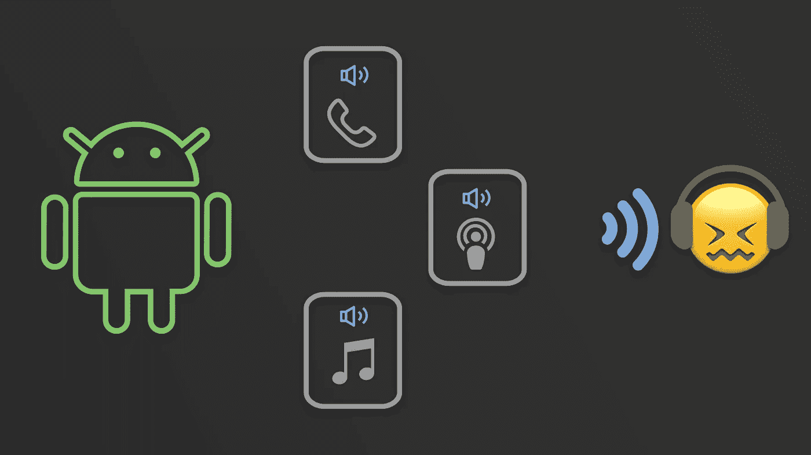
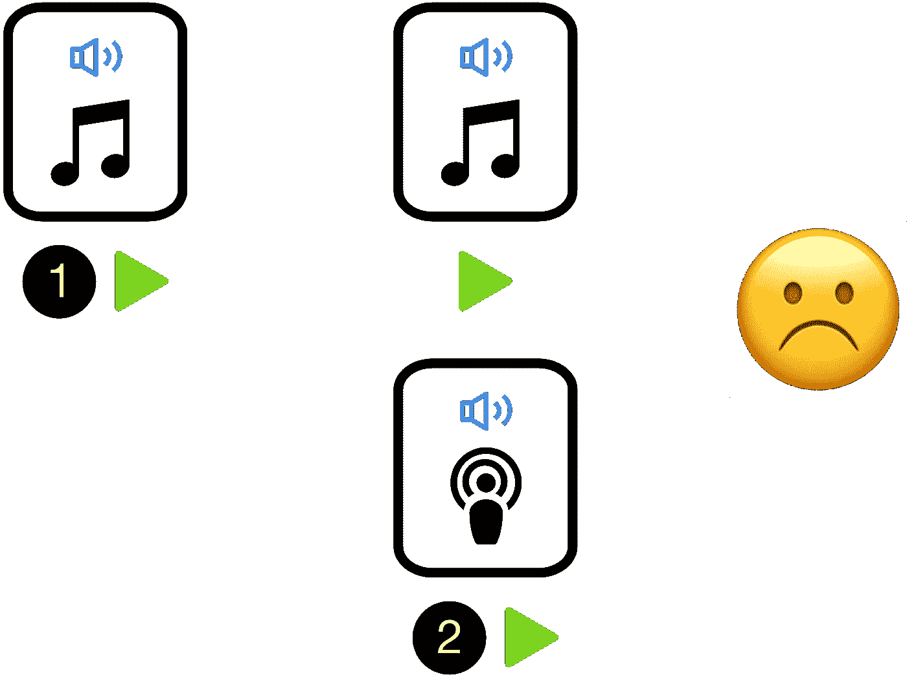
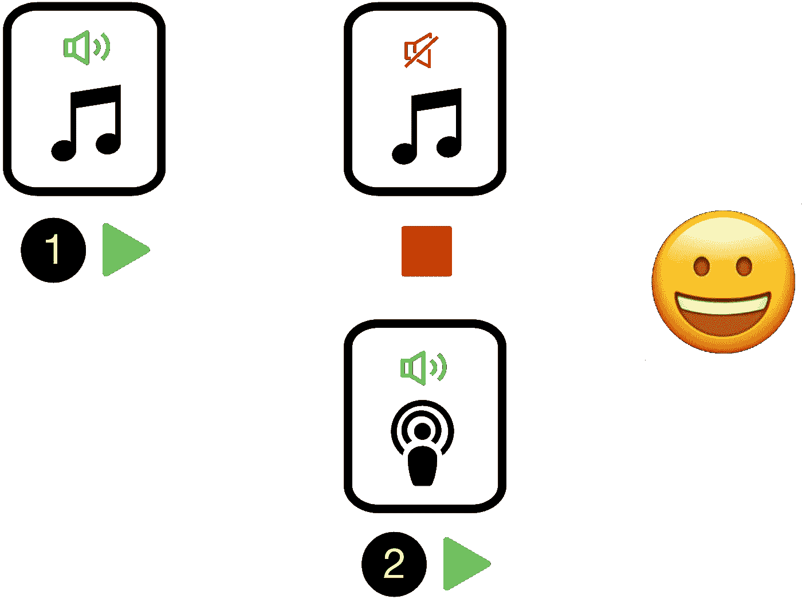
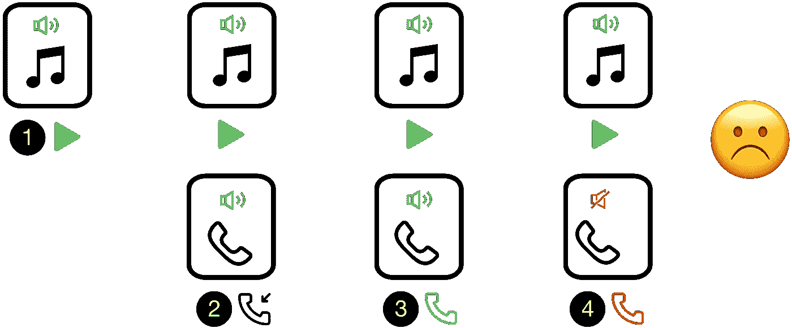
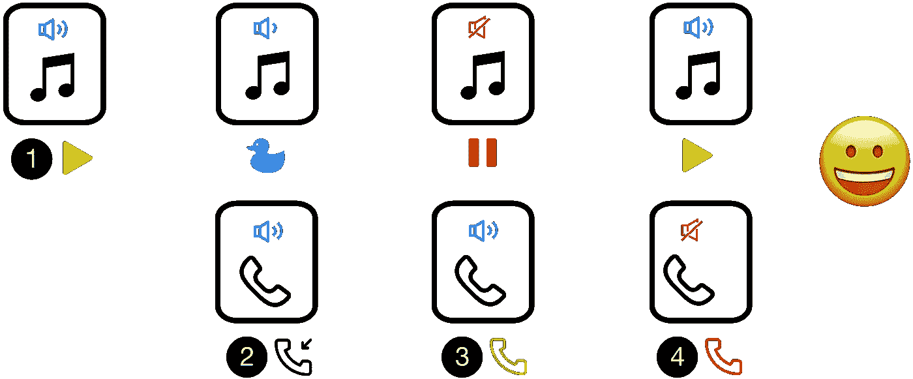

# 了解音频焦点(第 1 / 3 部分)

> 原文：<https://medium.com/androiddevelopers/audio-focus-1-6b32689e4380?source=collection_archive---------3----------------------->

## 常见音频焦点用例

Android 手机上的许多应用程序可以同时播放音频。虽然 Android 操作系统将所有音频流混合在一起，但当多个应用程序同时播放音频时，可能会对用户造成很大的干扰。这导致用户在他们的电话上体验不佳。为了提供良好的 UX，Android 提供了一个 [API](https://developer.android.com/guide/topics/media-apps/audio-focus.html) ，让应用程序共享*音频焦点*，一次只有一个应用程序可以保持音频焦点。

这一系列文章的目标是让您深入了解什么是音频聚焦，为什么它对提供一个好的媒体 UX 很重要，以及如何使用它。这是三部分系列的第一部分，包括:

1.  做一个好媒体公民的重要性和最常见的音频焦点用例( ***本文*** )
2.  [音频聚焦对您的媒体应用的 UX 很重要的其他使用案例](/@nazmul/audio-focus-2-42244043863a)
3.  [在应用中实现音频聚焦的三个步骤](/@nazmul/audio-focus-3-cdc09da9c122)

Audio focus 是合作性的，依靠应用程序来遵守 audio focus 指南。系统不会强制执行规则。如果一个应用程序想在失去音频焦点后继续大声播放，没有什么可以阻止这一点。然而，这给手机用户带来了糟糕的用户体验，他们很有可能会卸载这种行为不当的应用程序。

以下是音频焦点发挥作用的一些场景。假设用户已经启动了你的应用程序，它正在播放音频。

当你的应用程序需要输出音频时，它应该请求音频焦点。只有在它被授予焦点后，它才应该播放声音。

# 用例 1 —当播放应用程序中的音频时，用户启动另一个媒体播放器应用程序，并开始在该应用程序中播放

## 如果你的应用不能处理音频焦点会怎么样

当其他媒体应用程序开始播放音频时，它也会与您的应用程序播放音频重叠。这导致了糟糕的 UX，因为用户将无法正常听到来自任何一个应用程序的音频。

## ***处理音频焦点的应用程序应该如何处理***

当另一个媒体应用程序开始播放时，它会请求永久音频焦点。一旦系统允许，它将开始播放。您的应用程序需要通过停止播放来应对音频焦点的永久丢失，以便用户只能听到其他媒体应用程序的音频。

现在，如果用户试图在你的应用程序中开始播放，那么你的应用程序将再次请求永久音频焦点。只有获得这个焦点，你的应用程序才能开始播放音频。另一个应用程序将不得不通过停止播放来响应音频焦点的永久丢失。

# 用例 2——当你的应用程序正在播放音频时，有一个来电

## ***如果你的应用不能处理音频焦点会怎么样***

当手机开始响铃时，除了铃声之外，用户还会听到来自应用程序的音频，这不是一个好的 UX。如果他们选择拒绝通话，您的音频将继续播放。如果他们选择接受呼叫，则音频将与电话音频一起播放。当他们结束通话时，你的应用程序不会自动恢复播放，这也不是一个好的 UX。

## ***你的应用处理音频焦点*** 会发生什么

当电话铃响时(用户还没有回答)，你的应用程序应该对暂时失去音频焦点做出反应，并选择闪开(因为这是电话应用程序所要求的)。它应该通过将音量降低到大约 20%(称为*闪避*)或暂停播放(如果是播客或其他口语类型的应用程序)来做出响应。

*   如果用户拒绝通话，那么你的应用程序应该通过恢复音量或恢复播放来对音频焦点的增加做出反应。
*   如果用户接受呼叫，系统将向您发送一个音频焦点丢失(没有选择*鸭*)。你的应用程序应该暂停播放作为响应。当他们结束通话时，您的应用程序应该通过以最大音量恢复音频播放来对音频焦点的增加做出反应。

# 摘要

当你的应用程序需要输出音频时，它应该请求音频焦点。只有在它被授予焦点后，它才应该播放声音。但是，在您获得音频焦点后，您可能无法保持它，直到您的应用程序完成播放音频。另一个应用程序可以请求焦点，这将抢占您对音频焦点的控制。在这种情况下，你的应用程序应该暂停播放或降低音量，让用户更容易听到新的音频源。

要了解更多关于音频焦点在应用中发挥作用的其他用例，请阅读本系列的第二篇文章。

 [## 了解音频焦点(第 2 / 3 部分)- Nazmul Idris (Naz) - Medium

### 这一系列文章的目标是让您深入了解什么是音频焦点，为什么它很重要…

medium.com](/@nazmul/audio-focus-2-42244043863a) 

要了解如何在应用中实现音频聚焦，请阅读本系列的最后一篇文章。

 [## 了解音频焦点(第 3 / 3 部分)- Nazmul Idris (Naz) - Medium

### 这一系列文章的目标是让您深入了解什么是音频焦点，为什么它很重要…

medium.com](/@nazmul/audio-focus-3-cdc09da9c122) 

# Android 媒体资源

*   [示例代码— MediaBrowserService](https://github.com/googlesamples/android-MediaBrowserService)
*   [示例代码—媒体会话控制器测试(支持音频焦点测试)](https://github.com/googlesamples/android-media-controller)
*   [了解 MediaSession](/google-developers/understanding-mediasession-part-1-3-e4d2725f18e4)
*   [媒体 API 指南—媒体应用概述](https://developer.android.com/guide/topics/media-apps/media-apps-overview.html)
*   [媒体 API 指南—使用媒体会话](https://developer.android.com/guide/topics/media-apps/working-with-a-media-session.html)
*   [使用 MediaPlayer 构建简单的音频播放应用](/google-developers/building-a-simple-audio-app-in-android-part-1-3-c14d1a66e0f1)