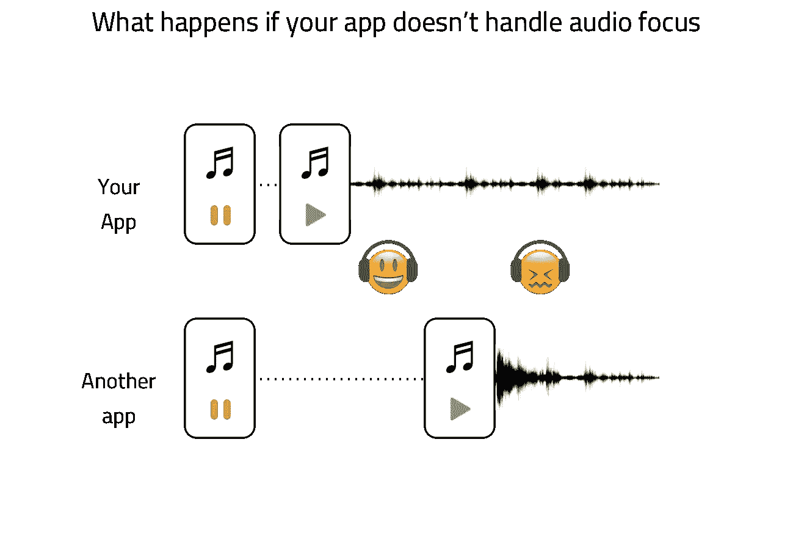
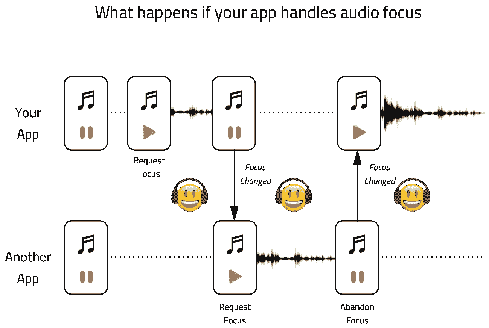
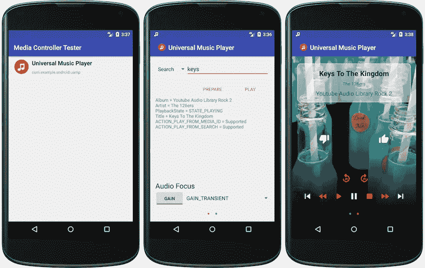

# 了解音频焦点(第 3 / 3 部分)

> 原文：<https://medium.com/androiddevelopers/audio-focus-3-cdc09da9c122?source=collection_archive---------1----------------------->


## 在应用中实现音频聚焦的 3 个步骤

这一系列文章的目标是让您深入了解什么是音频聚焦，为什么提供一个好的媒体 UX 很重要，以及如何使用它。这是该系列的最后一部分，包括:

1.  [成为优秀媒体公民的重要性和最常见的音频焦点使用案例](/@nazmul/audio-focus-1-6b32689e4380)
2.  [音频聚焦对您的媒体应用的 UX 很重要的其他使用案例](/@nazmul/audio-focus-2-42244043863a)
3.  在你的应用中实现音频聚焦的三个步骤( ***本文*** )

如果您没有正确处理音频焦点，下图描述了您的用户在电话上可能遇到的情况。



现在你知道了你的应用成为一个好的媒体公民对于用户在他们的手机上有一个好的媒体体验的重要性，让我们来看看让你的应用正确处理音频焦点的步骤。

在进入代码之前，下图总结了我们在应用程序中实现音频聚焦的步骤。



# 步骤 1:提出焦点请求

获得音频焦点的第一步是请求 Android 系统获取它。请记住，仅仅因为你提出了请求并不意味着它会被批准。为了请求获取音频焦点，您必须向系统声明您的“意图”。这里有一些例子。

*   你的应用程序是媒体播放器还是播客播放器，可以无限期地保持音频焦点(只要用户选择播放你的应用程序中的音频)？这是`[AUDIOFOCUS_GAIN](https://developer.android.com/reference/android/media/AudioManager.html#AUDIOFOCUS_GAIN)`。
*   或者，你的应用程序暂时需要音频焦点(带有闪避选项)，因为它需要播放音频通知，或语音提示，或者它需要在短时间内记录用户的音频？这是`[AUDIOFOCUS_GAIN_TRANSIENT_MAY_DUCK](https://developer.android.com/reference/android/media/AudioManager.html#AUDIOFOCUS_GAIN_TRANSIENT_MAY_DUCK)`。
*   当电话接通时，你的应用程序会像电话应用程序一样暂时需要音频聚焦(但持续时间未知，没有躲避选项)吗？这是`[AUDIOFOCUS_GAIN_TRANSIENT](https://developer.android.com/reference/android/media/AudioManager.html#AUDIOFOCUS_GAIN_TRANSIENT)`。
*   你的应用程序是否暂时需要音频聚焦(持续时间未知，在此期间不应产生其他声音)，因为它需要像语音备忘录应用程序一样记录音频？这是`[AUDIOFOCUS_GAIN_TRANSIENT_EXCLUSIVE](https://developer.android.com/reference/android/media/AudioManager.html#AUDIOFOCUS_GAIN_TRANSIENT_EXCLUSIVE)`。

在 Android O 和更高版本上，你必须创建一个`[AudioFocusRequest](https://developer.android.com/reference/android/media/AudioFocusRequest.html)`对象(使用一个`[builder](https://developer.android.com/reference/android/media/AudioFocusRequest.Builder.html)`)。在这个对象中，你必须指定你的应用程序需要多长时间来获得音频焦点。下面的代码片段声明了从系统永久获取音频焦点的意图。

```
AudioManager mAudioManager = (AudioManager) mContext.getSystemService(Context.AUDIO_SERVICE);AudioAttributes mAudioAttributes =
       new AudioAttributes.Builder()
               .setUsage(AudioAttributes.USAGE_MEDIA)
               .setContentType(AudioAttributes.CONTENT_TYPE_MUSIC)
               .build();AudioFocusRequest mAudioFocusRequest =
       new AudioFocusRequest.Builder(AudioManager.AUDIOFOCUS_GAIN)
               .setAudioAttributes(mAudioAttributes)
               .setAcceptsDelayedFocusGain(true)
               .setOnAudioFocusChangeListener(...) // Need to implement listener
               .build();int focusRequest = mAudioManager.requestAudioFocus(mAudioFocusRequest);switch (focusRequest) {
   case AudioManager.AUDIOFOCUS_REQUEST_FAILED:
       // don’t start playback
   case AudioManager.AUDIOFOCUS_REQUEST_GRANTED:
       // actually start playback
}
```

《守则》说明:

1.  `[AudioManager.AUDIOFOCUS_GAIN](https://developer.android.com/reference/android/media/AudioManager.html#AUDIOFOCUS_GAIN)`是向系统请求永久音频焦点。你也可以给它传递其他的 int 值，比如`[AUDIOFOCUS_GAIN_TRANSIENT](https://developer.android.com/reference/android/media/AudioManager.html#AUDIOFOCUS_GAIN_TRANSIENT)`，或者`[AUDIOFOCUS_GAIN_TRANSIENT_MAY_DUCK](https://developer.android.com/reference/android/media/AudioManager.html#AUDIOFOCUS_GAIN_TRANSIENT_MAY_DUCK)`，如果你只是想要暂时的音频焦点。
2.  您必须将一个`[AudioManager.OnAudioFocusChangeListener](https://developer.android.com/reference/android/media/AudioManager.OnAudioFocusChangeListener.html)`实现传递给`[setOnAudioFocusChangeListener()](https://developer.android.com/reference/android/media/AudioFocusRequest.Builder.html#setOnAudioFocusChangeListener(android.media.AudioManager.OnAudioFocusChangeListener))`方法。这部分代码将处理音频焦点的变化，这些变化是由系统中发生的事件驱动的。这些可能从其他应用程序中的用户交互开始。例如，你的应用程序可能已经获得了永久的音频焦点，但是用户启动了另一个应用程序，就把它拿走了。这个侦听器是你的应用程序必须处理这种焦点丢失的地方。
3.  一旦你创建了`[AudioFocusRequest](https://developer.android.com/reference/android/media/AudioFocusRequest.html)`对象，你现在可以使用它通过调用`[requestAudioFocus(…)](https://developer.android.com/reference/android/media/AudioManager.html#requestAudioFocus(android.media.AudioFocusRequest))`来请求`AudioManager`获得音频焦点。这将返回一个整数值，表示您的音频焦点请求是否被批准。只有当该值为`[AUDIOFOCUS_REQUEST_GRANTED](https://developer.android.com/reference/android/media/AudioManager.html#AUDIOFOCUS_REQUEST_GRANTED)`时，您才应该立即开始回放。如果是`[AUDIOFOCUS_REQUEST_FAILED](https://developer.android.com/reference/android/media/AudioManager.html#AUDIOFOCUS_REQUEST_FAILED)`，那么系统已经拒绝你的应用程序在那一刻获得音频焦点。

在 Android N 和更早的版本中，你可以声明这个意图，而不需要使用如下所示的`AudioFocusRequest`对象。你还是要实现`AudioManager.OnAudioFocusChangeListener`。下面是上面代码片段的等效代码。

```
AudioManager mAudioManager = (AudioManager) mContext.getSystemService(Context.AUDIO_SERVICE);int focusRequest = mAudioManager.requestAudioFocus(..., // Need to implement listener
       AudioManager.STREAM_MUSIC,
       AudioManager.AUDIOFOCUS_GAIN);switch (focusRequest) {
   case AudioManager.AUDIOFOCUS_REQUEST_FAILED:
       // don't start playback
   case AudioManager.AUDIOFOCUS_REQUEST_GRANTED:
       // actually start playback
}
```

接下来，我们必须实现`AudioManager.OnAudioFocusChangeListener`，以便应用程序可以对音频焦点增益和损失的变化做出反应。

# 步骤 2:响应音频焦点状态变化

一旦你的应用程序获得音频焦点(无论是暂时的还是永久的)，它可以随时改变。你的应用程序必须对这种变化做出反应。这就是在您的`OnAudioFocusChangeListener`实现中发生的事情。

以下代码片段包含播放音频的应用程序的此接口的实现。并且它处理暂时音频焦点丢失的回避。它还处理由于用户暂停播放而导致的音频焦点变化，而另一个应用程序([如谷歌助手](https://developer.android.com/guide/topics/media-apps/interacting-with-assistant.html))会导致短暂的音频焦点丢失。

```
private final class AudioFocusHelper
        implements AudioManager.OnAudioFocusChangeListener {private void abandonAudioFocus() {
        mAudioManager.abandonAudioFocus(this);
    }[@Override](http://twitter.com/Override)
    public void onAudioFocusChange(int focusChange) {
        switch (focusChange) {
            case AudioManager.AUDIOFOCUS_GAIN:
                if (mPlayOnAudioFocus && !isPlaying()) {
                    play();
                } else if (isPlaying()) {
                    setVolume(MEDIA_VOLUME_DEFAULT);
                }
                mPlayOnAudioFocus = false;
                break;
            case AudioManager.AUDIOFOCUS_LOSS_TRANSIENT_CAN_DUCK:
                setVolume(MEDIA_VOLUME_DUCK);
                break;
            case AudioManager.AUDIOFOCUS_LOSS_TRANSIENT:
                if (isPlaying()) {
                    mPlayOnAudioFocus = true;
                    pause();
                }
                break;
            case AudioManager.AUDIOFOCUS_LOSS:
                mAudioManager.abandonAudioFocus(this);
                mPlayOnAudioFocus = false;
                stop();
                break;
        }
    }
}
```

当用户开始暂停播放时，应用程序的行为应该与另一个应用程序请求瞬时音频焦点并因此暂停播放时不同(而不是只是闪避)。当用户开始暂停播放时，你的应用程序应该放弃音频焦点。但是，如果您的应用程序暂停播放以响应音频焦点的短暂丢失，那么它不应该放弃音频焦点。这里有一些用例来说明这一点。

假设您有一个音频播放应用程序，可以在后台播放音频。

1.  当用户按下 play 时，你的应用程序会请求永久的音频焦点。假设它被系统授予了音频焦点。
2.  现在，他们长按 home 键，启动谷歌助手。助手将请求获得瞬时音频焦点。
3.  一旦系统将此授权给助手，您的`OnAudioFocusChangeListener`将获得一个`AUDIOFOCUS_LOSS_TRANSIENT`事件。在这里，您可以暂停回放，因为助手需要录制音频。
4.  一旦助手完成，它将放弃其音频焦点，你的应用程序将在`OnAudioFocusChangeListener`中被授予`AUDIOFOCUS_GAIN`。这是你必须决定是否继续播放的地方。这就是上面代码片段中的`mPlayOnAudioFocus`标志的作用。

下面的代码片段是用户启动的暂停方法在这个音频播放器应用程序中的样子。

```
public final void pause() {
   if (!mPlayOnAudioFocus) {
       mAudioFocusHelper.abandonAudioFocus();
   }
  onPause();
}
```

正如你所看到的，当用户开始暂停播放时，它会放弃音频焦点，但当其他应用程序导致它发生时(当它们获得`AUDIOFOCUS_GAIN_TRANSIENT`)不会。

## 暂时音频焦点丢失时闪避与暂停

您可以在`OnAudioFocusChangeListener`中选择暂停播放或暂时降低音频播放的音量，这取决于您的应用需要提供什么样的 UX。Android O 支持自动闪避，系统会自动降低你的应用程序的音量，而你不必编写任何额外的代码。在你的`OnAudioFocusChangeListener`中，忽略`AUDIOFOCUS_LOSS_TRANSIENT_CAN_DUCK`事件即可。

在 Android N 和更早的版本中，你必须自己实现闪避(如上面的代码片段所示)。

## 延迟增益

Android O 引入了延迟音频焦点增益的概念。为了实现这一点，当您请求音频焦点时，您可以得到一个`AUDIOFOCUS_REQUEST_DELAYED`结果，如下所示。

```
public void requestPlayback() {
    int audioFocus = mAudioManager.requestAudioFocus(mAudioFocusRequest);
    switch (audioFocus) {
        case AudioManager.AUDIOFOCUS_REQUEST_FAILED:
            ...
        case AudioManager.AUDIOFOCUS_REQUEST_GRANTED:
            ...
        case AudioManager.AUDIOFOCUS_REQUEST_DELAYED:
            mAudioFocusPlaybackDelayed = true;
    }
}
```

在您的`OnAudioFocusChangeListener`实现中，当您响应`AUDIOFOCUS_GAIN`时，您必须检查`mAudioFocusPlaybackDelayed`变量，如下所示。

```
private void onAudioFocusChange(int focusChange) {
   switch (focusChange) {
       case AudioManager.AUDIOFOCUS_GAIN:
           logToUI("Audio Focus: Gained");
           if (mAudioFocusPlaybackDelayed || mAudioFocusResumeOnFocusGained) {
               mAudioFocusPlaybackDelayed = false;
               mAudioFocusResumeOnFocusGained = false;
               start();
           }
           break;
       case AudioManager.AUDIOFOCUS_LOSS:
           mAudioFocusResumeOnFocusGained = false;
           mAudioFocusPlaybackDelayed = false;
           stop();
           break;
       case AudioManager.AUDIOFOCUS_LOSS_TRANSIENT:
           mAudioFocusResumeOnFocusGained = true;
           mAudioFocusPlaybackDelayed = false;
           pause();
           break;
       case AudioManager.AUDIOFOCUS_LOSS_TRANSIENT_CAN_DUCK:
           pause();
           break;
   }
}
```

# 第三步:记住放弃音频焦点

当你的应用程序完成播放它的音频时，它应该通过调用`[AudioManager.abandonAudioFocus(…)](https://developer.android.com/reference/android/media/AudioManager.html#abandonAudioFocus(android.media.AudioManager.OnAudioFocusChangeListener))`来放弃音频焦点。在上一步中，我们遇到了这样的情况:当用户开始暂停播放时，应用程序放弃了音频焦点，但当它被其他应用程序暂时中断时，应用程序保留了音频焦点。

# 代码示例

## 你可以在应用程序中使用的要点

你可以在这个 [GitHub gist](https://gist.github.com/nic0lette/c360dd353c451d727ea017890cbaa521) 中找到 3 个类，它们涵盖了你可以在应用中使用的音频聚焦代码。

*   `[AudioFocusRequestCompat](https://gist.github.com/nic0lette/c360dd353c451d727ea017890cbaa521#file-audiofocusrequestcompat-java)` —使用此类描述您的应用程序需要的音频焦点类型。
*   `[AudioFocusHelper](https://gist.github.com/nic0lette/c360dd353c451d727ea017890cbaa521#file-audiofocushelper-java)` —这个类实际上为你处理音频焦点。你可以将它包含在你的应用中，但你必须确保你的音频播放服务使用下面的接口。
*   `[AudioFocusAwarePlayer](https://gist.github.com/nic0lette/c360dd353c451d727ea017890cbaa521#file-audiofocusawareplayer-java)` —这个接口应该由管理您的媒体播放器的服务(`MediaPlayer`或`ExoPlayer`)来实现，它将允许`AudioFocusHelper`类使其与音频焦点一起工作。

## 完整的代码示例

`[android-MediaBrowserService](https://github.com/googlesamples/android-MediaBrowserService)`示例展示了如何在使用`MediaPlayer`在后台实际播放音频的 Android 应用程序中处理音频焦点。它也用`MediaSession`。

该示例有一个展示音频焦点最佳实践的`[PlayerAdapter](https://github.com/googlesamples/android-MediaBrowserService/blob/master/app/src/main/java/com/example/android/mediasession/service/PlayerAdapter.java)`类。请看看`pause()`和`onAudioFocusChange(int)`方法的实现。

# 测试您的代码

一旦你在应用中实现了音频聚焦，你就可以使用 Android 媒体控制器工具来测试你的应用对聚焦增益和损失的反应。你可以在 [GitHub](https://github.com/googlesamples/android-media-controller#audio-focus) 上得到它。



# Android 媒体资源

*   [示例代码— MediaBrowserService](https://github.com/googlesamples/android-MediaBrowserService)
*   [示例代码—媒体会话控制器测试(支持音频焦点测试)](https://github.com/googlesamples/android-media-controller)
*   [了解 MediaSession](/google-developers/understanding-mediasession-part-1-3-e4d2725f18e4)
*   [媒体 API 指南—媒体应用概述](https://developer.android.com/guide/topics/media-apps/media-apps-overview.html)
*   [媒体 API 指南—使用媒体会话](https://developer.android.com/guide/topics/media-apps/working-with-a-media-session.html)
*   [使用 MediaPlayer 构建简单的音频播放应用](/google-developers/building-a-simple-audio-app-in-android-part-1-3-c14d1a66e0f1)