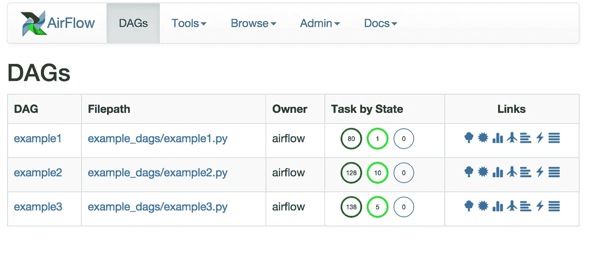
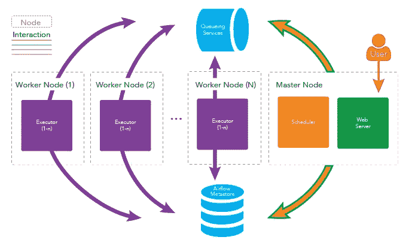

# 审核气流作业运行

> 原文：<https://medium.com/walmartglobaltech/auditing-airflow-batch-jobs-73b45100045?source=collection_archive---------1----------------------->

> 动机
> 
> 我们建立了一个系统来预测沃尔玛商店的需求，该系统由数据工程和 ML 管道组成。确保管道中的批处理作业按照计划运行对业务至关重要。作业运行的延迟或错过一次运行会产生数百万美元的影响。这篇博客文章解释了我们在调度器检测作业运行缺失和延迟的能力之外所做的事情。
> 
> 先决条件
> 
> 我们使用 Apache Airflow(开源)来编写和调度数据管道。这篇博文要求对 Apache 气流和数据管道有一个基本的概念。重点不在于 Airflow 的特性，而在于我们如何在它的基础上构建审计系统。



Airflow UI (courtesy — airflow.apache.org)

我们已经考虑了气流的以下方面，以确保调度程序 24/7 可用并且作业被触发-

1.  气流红外线监控(调度程序守护程序、芹菜工人、RabbitMQ、Metastore)
2.  气流 HA(将在单独的博客文章中详细介绍)
3.  气流 SLA 功能



Airflow Architecture(courtesy — clairvoyantsoft.com)

我们遇到过这样的情况，AF 没有触发我们的 ETL 任务(在我们的例子中是 spark 任务),但是它的 Web UI 错误地显示相应的任务处于“运行”状态。除非随叫随到的工程师手动验证，否则没有办法知道这一点——Airflow 的 SLA 特性在这里没有帮助，因为 air flow 本身的行为是错误的。这可能是由于 Infra(不太可能)的气流配置不良或气流的运动部件不稳定或气流本身有缺陷。 ***不管根本原因是什么，我们都必须知道工作何时被延迟，以便待命工程师立即采取手动纠正措施*** 。我们实现了一个独立于 AF 运行的审计器，当管道中的任何 Spark 作业没有按时开始时，它会发出警报。

# 审计方法

E 使用来自 Airflow 后端的运行历史估计 ETL 任务的开始时间。每个 Spark 批处理作业(我们的 ETL 执行单元，又名 Airflow 任务)都用惟一的 id 将自己注册到一个数据库表中。这向审计系统表明该作业需要被审计。该作业还会在运行时发送其心跳。如果没有按照估计按时收到任务心跳，则发出警报。我们假设气流历史是正常的，即大多数以前的运行是按照通常的时间表进行的。有人可能想知道，当您可以直接使用 DAG 的调度信息时，为什么要从历史中进行估计，但这是不够的，因为 schedule 将整个 DAG 作为一个单元给出了预期的开始时间，而不是其中各个任务的开始时间。

# 积极着手进行

我们用两张桌子

1.  task_instance —由气流维护
2.  audit_registration —由每次运行的每个 spark 作业更新。

```
audit_registration: task_id, is_registered, last_updatedtask_instance: task_id, start_date, dag_id and so on.
```

## 审计员组件

Auditor 是作为一个独立的 java 程序实现的，它有以下组件

1.  审计守护线程:它始终保持活动状态，主要是每 X(可配置)小时触发另一个线程运行 2 & 3 次。
2.  Interval Estimator:它查看 task_instance，并为每个 *concat(dag_id，task_id)，*计算间隔估计值，这是连续 start_times 之间间隔的数学模型。如果重复至少两个间隔仍不能达到众数，则使用中位数。
3.  当前运行检查器:对于 audit_registration 中的每个 task_id，如果 last_update 不在当前时间和当前时间减去估计时间间隔之间，它将发送预警。

Auditor 以快速失败模式运行，即 auditor 的 java 进程一旦发现错误就会失败，例如，它无法在 X 小时内完成线程执行(步骤 2 和 3)，它无法到达 Airflow 后端，警报服务无法到达。这将通过我们的流程监控向 Ops 发出警报。

## 更精细的细节和进一步的改进

1.  间隔四舍五入到最接近的半小时。
2.  关于同一作业延迟的警报被限制为每天 1 个。
3.  这可以进一步细化，以考虑诸如季节性(例如，由于繁忙的源系统，星期一的每日数据提取需要更长时间)和异常值(例如，偶尔的缓慢提取)等模式。不在一周的某一天运行的作业会导致错误警报，可以改进算法以从历史中学习相同的内容。
4.  Spark 作业还可以根据完全限定的 dag_id+task_id 注册 heartbeat，而不仅仅是 task_id，并在运行时与 Airflow 合作来获取 dag_id。这是因为给定的 spark 作业可以在多个 Dag 中重用。
5.  新工作没有足够的历史来估计开始时间。我们只是发送一个警告通知不充分的历史。
6.  由于陈旧的历史记录，重新计划的 Dag 在接下来的 N 次运行中将会出现误报/漏报。留出足够的时间积累正确的历史。

这使我们多次避免错过 SLA，并且对我们今天的 ETL 管道至关重要。这反过来允许我们安全地依赖相对较新但功能丰富的 Apache 气流，因为它会继续成熟。通过适应后端数据模型，这也可以用于任何其他调度程序。