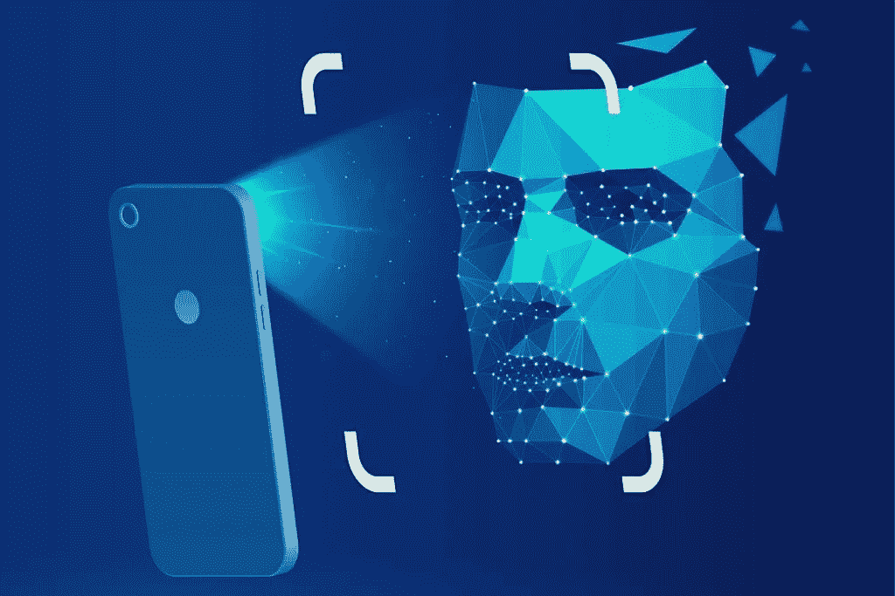

# 增强认证——认证的新时代

> 原文：<https://medium.com/globant/augmented-authentication-the-new-era-of-authentication-4fe2918a635d?source=collection_archive---------2----------------------->

传统和增强的认证方式。

在本主题中，您将学习身份验证的标准方法和增强方法。是的，你没看错。增强的认证方式将是应用安全世界的未来。想知道怎么做吗？向下滚动以了解更多信息。

# 认证方式

## A.传统认证

传统的方法只不过是我们遵循了很久的方法。想猜猜会是什么吗？

是的，你猜对了。仅仅使用“用户名/电子邮件”和“密码”。只有两个领域，我们倾向于设置为我们独特的身份。有时在它上面，我们也使用“*验证安全问题*，并设置一些只有我们知道的答案。大多数时候，这个额外的安全问题层用于银行或类似的应用程序。*输入密码加一次性密码(OTP)，或密码加安全问题答案。这种组合称为多因素身份认证。*

毫无疑问，这种传统方式是安全的，对我们中的一些人来说很容易，但对我们中的许多人来说却很麻烦。对那些记忆力好的人或天生记忆力强的人来说，这的确很容易！然而，对于我们中的许多人来说，很难使用“记住我”选项将凭证保存到浏览器中，以便摆脱这种具有挑战性的记忆游戏。不是吗？说实话，没有人愿意每天花费额外的时间来处理登录和访问资源的许多障碍。

但是如果给你一个选择，你不需要把你的密码保存到浏览器中，也不需要麻烦你的大脑一直记住它，这不是很棒吗？不解！？这可能吗？？

> 是的，这是可能的！通过增强身份认证，多因素身份认证的未来:人工智能、ML 等。

## B.增强认证

我们知道多因素身份认证在不断发展。为我们提供安全性并减少最终用户的不便。在我们的日常生活中，我们使用生物识别技术，这是一个很好的例子。在这里认证变得更加安全，因为没有人可以绑架我们独特的脸或指纹。所以用户不需要花费额外的精力去记住任何像密码这样的东西。

想到这里，我首先想到的是*无密码认证*。而不是键入密码作为验证身份的主要方法，并用其他非密码方法作为补充。无密码身份验证作为一种身份验证形式取消了密码。很有趣，对吧？以下是我们实现这一目标的几种方法。

***1。人脸识别:***

用我们的脸做应用密码，是不是很刺激？什么会比我们的脸更独特，对吧？我们已经在移动应用中使用人脸识别。但是现在这在浏览器中也是可能的。现在有了 **face-api.js** 我们可以在浏览器上实现一个人脸识别系统。

## 什么是 face-api.js？

Face-api 是 Vincent Mühler 创建的 javascript 库。，通过浏览器检测人脸。它建立在 [**tensorflow.js 核心**](https://github.com/tensorflow/tfjs-core) **之上。**实现人脸检测、人脸识别、人脸地标检测、年龄性别检测等各种 CNN(卷积神经网络)。它兼容网络和移动设备。

***2。语音识别:***

声音具有可以与个人相关联的独有特征。与人脸识别系统一起，语音识别可以成为应用程序的有效安全层。Azure 认知服务是一个很好的平台，可以使用说话人识别服务来验证和识别说话人的语音特征。

## 扬声器验证:

Azure 提供了两种识别说话人的方法:文本相关和文本无关的说话人验证。

## 什么是文本相关的说话人确认？

在基于文本的验证中，说话者必须选择在*注册*和*验证*阶段使用的相同密码。说话人识别服务中有一组预定义的短语。说话者可以在说话者注册过程中通过说出口令来记录语音，从而使用这两者中的任何一个。

说话人验证 API 从记录的音频中提取语音特征以创建独特的语音签名。总之，声音签名和密码将用于验证说话者。该服务还将与说话者相关联的 ID 作为输入语音记录的输入参数。

我们也可以创建自己的密码短语。向文本无关的说话人确认 API 和语音到文本 API 发送单独的请求。然后通过结合各自的结果，我们可以确定说话者的身份。

## 什么是文本无关的说话人确认？

在与文本无关类型的说话人识别和验证方法中，说话人不受说话内容的限制。

在注册阶段，从说话者的音频中提取语音特征，以创建唯一的语音签名。在验证阶段，说话者可以随机说话(不受任何密码限制)。语音记录和与说话者相关联的 ID 被发送到说话者验证 API，在该 API 上将语音特征与相应说话者的注册简档中的语音签名进行比较。

在这两种情况下，服务根据语音相似性得分返回“接受”或“拒绝”。如果语音相似度大于等于 0.5，API 返回“*接受*”，即*识别说话人*。而如果语音相似度分数小于 0.5，API 返回“*拒绝*”，即说话者是*不匹配者*。

要了解更深入的内容，请关注即将发布的文章。我希望你觉得这篇文章有趣。请不要忘记在下面的评论中添加您的想法或反馈。

**参考文献:**
[https://github.com/tensorflow/tfjs-core](https://github.com/tensorflow/tfjs-core)

[https://justadudehohacks . github . io/face-API . js/docs/index . html](https://justadudewhohacks.github.io/face-api.js/docs/index.html)

[https://docs . Microsoft . com/en-us/rest/API/speaker recognition/](https://docs.microsoft.com/en-us/rest/api/speakerrecognition/)