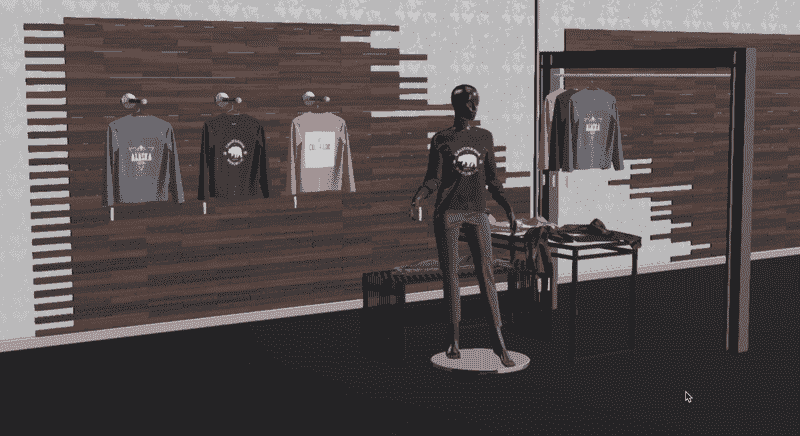
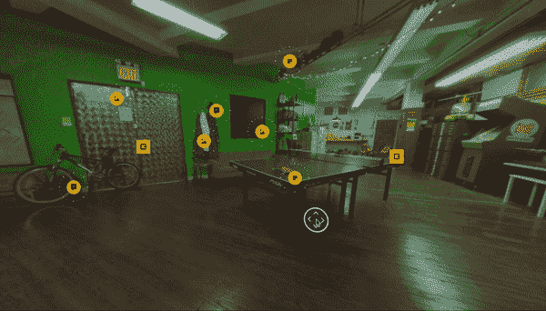
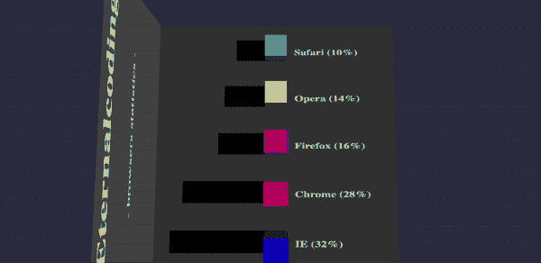
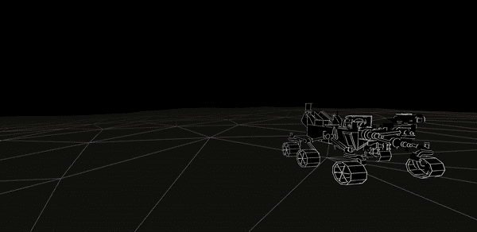

# 增强现实(AR):用浏览器做更多事情？

> 原文：<https://medium.com/globant/augmented-reality-ar-do-more-with-the-browsers-e2236c1959c5?source=collection_archive---------4----------------------->

自蒂姆·伯纳斯·李爵士和他的 Nexus 软件时代以来，今天的网络浏览器已经走过了漫长的道路。得益于 WebGL 等出色的 JavaScript APIs，现代浏览器完全能够在没有第三方插件帮助的情况下呈现高级 2D 和 3D 图形。通过利用专用图形处理器的马力，WebGL 使我们的网页能够访问动态阴影和真实的物理效果。源自不断探索的努力，我们在 [**Globant**](https://www.globant.com/) 都在想，如果我们能取得比这更多的成就会怎么样？

**为什么是网络？？**

全球有 27.1 亿[智能手机用户](https://www.statista.com/statistics/330695/number-of-smartphone-users-worldwide)，而且还在逐日保持增长。

这位分析师估计，在未来几年里，这个数字可能会达到世界人口的一半。现在只要坐下来，把这当成一个机会，如果你能通过[**【PWA】**](https://en.wikipedia.org/wiki/Progressive_web_applications)(由浏览器支持)向他们提供这种出色的沉浸式用户体验，会怎么样？

网络无处不在的特性是这项技术普及到大众的理想选择。通过浏览器即时获得身临其境的体验将有助于各种企业更快地连接到其最终用户。

想象一下一个超级购物市场，你只需拿出手机，在浏览器上点击一个 URL，就可以立即打开商店的页面，让你扫描商品，并以增强的方式当场提供相关信息，让你轻松购物。这将完全减少去应用商店下载应用程序以获得与本地平台相同的体验的痛苦。此外，由于网络可以在幕后升级，体验可以无缝增强。

原生应用目前主导着沉浸式体验的市场，它有自己的利弊，而每天浏览器的规范正在采用一种新的方式来提供最佳的用户体验。

> “我确实认为发达国家的相当一部分人口，最终是所有国家的人口，每天都会有 AR 体验，几乎就像一日三餐一样。它会成为你的一部分。*——****蒂姆库克***

一个商品经理可以取消他店里的试衣间吗？

这些创作是不是很神奇？谁不想给最终用户这种奇异(但令人愉快)的体验呢！

W3C 正在制定一个新的浏览器规范，这个规范已经被许多框架和库用来支持网络上的 [**AR-VR**](https://www.w3.org/immersive-web/) 。这是为了在网络上支持以下内容:

1.  360°视角
2.  虚拟现实
3.  增强现实
4.  60 FPS 动画
5.  赌博

顶级科技公司如**谷歌**(ARCore)**苹果**(ARKit)**Mozilla**(A-Frame)**脸书** (React360)和**微软** (Babylon.js)正在投入巨大的努力将 AR-VR 引入浏览器，以大规模带来无缝和沉浸式的用户体验，因为网络具有高度的可扩展性和普遍性。

在本文中，我们列出了一些最有前途的框架和库，它们通过带来身临其境的体验来帮助 web。

[**REACT-360:**](https://facebook.github.io/react-360/)

React 360 支持 3D 和 VR 用户界面。由于它是建立在 React 之上的，它允许您使用熟悉的工具和概念在 web 上创建身临其境的 360 度内容。如果您的应用程序由用户交互驱动，并且具有许多 2D 或 3D UI 元素，React 360 将提供您需要的工具。照片和视频查看器、360°游览、经典冒险游戏和 3D 棋盘游戏都是迄今为止用 React 360 构建的事物的例子。

[**三. js:**](https://threejs.org/examples/#webgl_animation_cloth)

创建 Three.js 的目的只有一个:利用基于 web 的渲染器来创建 GPU 增强的 3D 图形和动画。因此，这个框架采用了一种非常广泛的方法来处理网络图形，而不是专注于任何单一的动画领域。

这种灵活的设计使三。js 是一个伟大的工具，一般用途的网络动画，如标志或建模应用程序，除此之外，它允许使用。glTF assets <<link>>在 3D 场景的传输和加载方面非常高效。glTF 资源可以提供一个或多个场景，包括网格、材质、纹理、皮肤、骨架、变形目标、动画、灯光和/或摄像机。使用 ThreeJs 加载 glTF 的有趣例子。

[了解更多信息](https://ark-shelter.com/)

[巴比伦 JS:](https://www.babylonjs.com/)

Three.js 试图为 WebGL 表带来广泛的动画特性，Babylon.js 则采取了更有针对性的方法。最初是作为 Silverlight 游戏引擎设计的， [Babylon.js](https://www.babylonjs.com/) 保持了其对基于 web 的游戏开发的偏好，具有碰撞检测和抗锯齿等功能。

[Babylon.js](https://www.babylonjs.com/) 通过专注于引擎和定制照明等传统游戏引擎要求，巧妙地使自己与众不同。

[**A 字架:**](https://aframe.io/)

A-Frame 是一个用于构建虚拟现实(VR)体验的 web 框架。A-Frame 基于 HTML 之上，使入门变得简单。它不仅仅是 3D 场景图或标记语言；核心是一个强大的实体组件框架，它为 three.js 提供了一个声明性的、可扩展的、可组合的结构

它支持 Vive、Rift、Windows 混合现实、Daydream、GearVR、Cardboard、Oculus Go 等大多数 VR 头戴设备，甚至可以用于增强现实。一个很大的好处是 A-frame 社区非常活跃——更有经验的开发人员经常向库中添加新的组件。

[**WEB VR:**](https://webvr.info/)

WebVR 是一个 JavaScript 浏览器 API，充当 VR 硬件的接口。WebVR 是跨平台的，可以在任何支持 VR 的浏览器上开发、查看和分享 VR 内容。WebVR API 提供了 VR 硬件的接口，允许开发人员在 web 上构建引人注目、舒适的 VR 体验。

想象一下，如果你可以建立一个虚拟教室，让你在世界各地培训新员工，或者你可以建立一个虚拟环境，让人们远程参观哈利法塔。借助基于 Web VR 的亚马逊苏美尔**，人们可以构建高度沉浸式和交互式的场景，这些场景可以在 Oculus Go、Oculus Rift、HTC Vive、HTC Vive Pro、谷歌 Daydream 和联想 Mirage 等流行硬件以及 Android 和 iOS 移动设备上运行。WebXR 可以轻松创建构建高度沉浸式和交互式 3D 体验所需的所有构建块，包括添加对象(例如角色、家具和风景)，以及设计、动画和脚本环境。**

**你可以建立一个虚拟教室，让你在世界各地培训新员工，或者你可以建立一个虚拟环境，让人们远程参观一栋大楼。我们@ **Globant** 通过亚马逊苏美尔人创造了一艘具有个性的人力资源船，探索了网络虚拟现实的潜力，这里是它的一瞥。**

**[了解更多信息](https://bear71vr.nfb.ca/)**

**[8i](https://8i.com/)**

**8i 是一家立体视频技术公司，提供 SDK，使人们能够通过**全息图**以最真实的方式体验人类内容和彼此。使用这个 SDK，您可以创建、分发和体验真实人物的立体视频，看起来和感觉就像他们在同一个房间里一样。**

**只要看看下面的场景，它不是来自游戏或预先编辑的视频。这只是放在视频中的一个人的全息图，看起来非常自然。**

****

**[了解更多信息](https://www.youtube.com/watch?v=pK9UpsuVP18)**

# **外卖和未来的道路…**

**沉浸式体验的发展已经开始以各种方式触及人类的生活。无论是虚拟的公寓之旅，谷歌地图的[街景](https://www.instantstreetview.com/)还是汽车的 360 度视角，它都在改变我们探索世界的方式。**

**通过使用所讨论的沉浸式网络技术，我们@ **Globant** 正致力于创建下一代交互界面，因为我们确实相信这样的体验更加自然，并且有潜力将可用性提升到一个新的水平。我们希望利用网络，因为它有更自然和普遍的影响力，让用户更容易发现。**

**你认为沉浸式网络将会走向何方？请在下面的评论区告诉我们。**