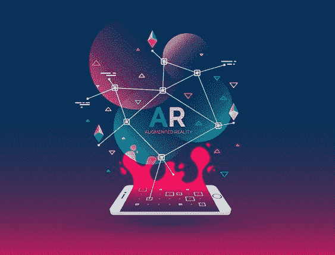
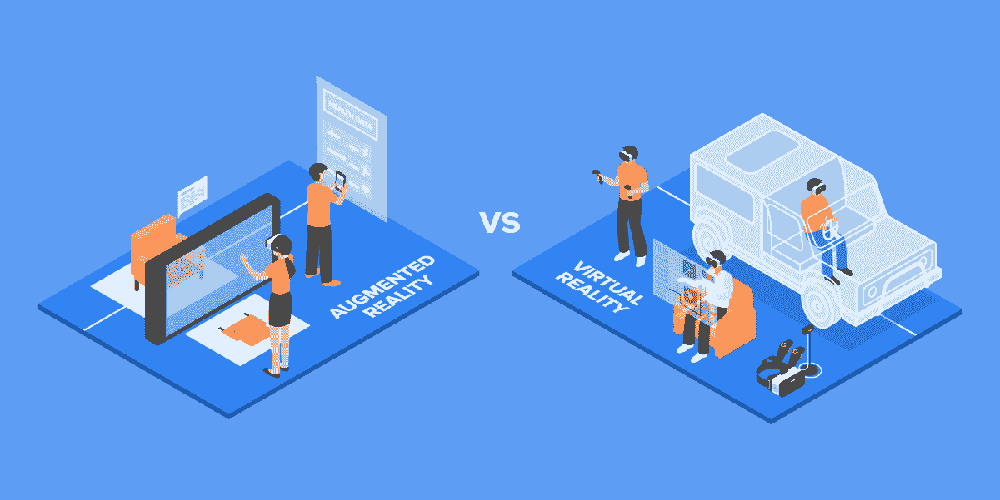
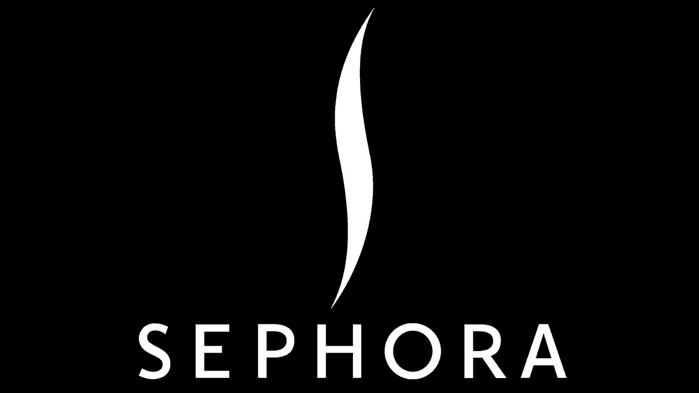
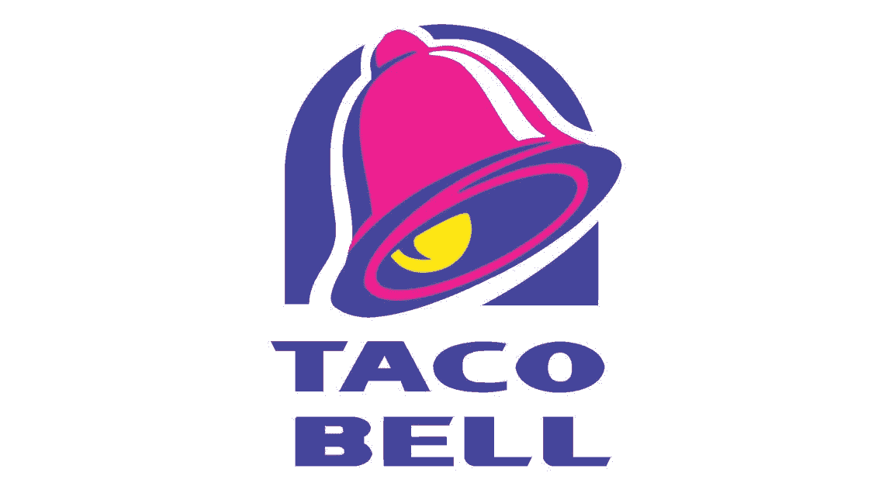
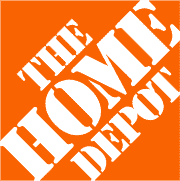
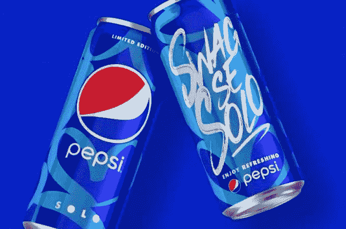

# 数字营销中的增强现实——新的扩展现实

> 原文：<https://medium.com/globant/augmented-reality-ar-in-digital-marketing-the-new-extended-reality-12581c9b7f41?source=collection_archive---------4----------------------->

Image Source: freepik.com

几十年来，我们目睹了无数的趋势进入数字营销的世界，有些趋势会持续下去，有些趋势会在几周内消失。但是，自从我们被整个数字化转型云吞没后，事情就变得不同了，或者说完全不同了。

数字营销领域的新参与者——虚拟现实和增强现实——不只是在这里影响或影响几周，而是成为新的游戏规则改变者！增强现实正在广泛展开翅膀，在每个领域掀起波澜，无论是游戏、娱乐、广告还是数字营销。

但是，当我们谈到最大限度地利用这些技术进行数字营销时，它不是增强或虚拟现实，而是超越这一点的一步——扩展现实。

# 增强现实和虚拟现实的区别

大多数营销人员犯的最大错误之一就是认为 AR 和 VR 绝对是一回事。但实际上，这两种技术是截然相反的。在虚拟现实中，真实用户被置于虚拟世界中，用户需要使用耳机来完全沉浸在虚拟环境中。在 AR 中，各种数字元素被添加到用户周围的现实世界中，用户可以通过他们的手机或平板电脑体验 AR。随着 web AR 的盛行，用户不再需要依赖特殊的硬件设置或应用程序来体验它。

**新时代——扩展现实**

“扩展现实”一词涵盖了沉浸式技术的所有体验:

*   混合现实
*   虚拟现实
*   增强现实
*   或者任何其他即将到来的沉浸式技术

所有这些技术迟早都会受到数字营销行业的影响。

# 数字营销战略

在众多沉浸式技术中，对数字营销影响最大的将是增强现实。

现在，许多人会想，为什么不是虚拟现实呢？主要是因为虚拟现实需要用户沉浸在体验中。作为一个例子，游戏和娱乐业已经用这项技术赚了大钱。还有，VR 不是每个人都能接触到的。然而，其他行业正在尽最大努力寻找创新的方式将虚拟现实纳入他们的营销策略。

另一方面，AR 更容易被每个人接触到。任何拥有平板电脑或智能手机的人都可以获得 AR 的完整体验。用户需要做的只是将智能设备的摄像头对准二维码，启动 AR 体验，然后启动体验。

***让我们来探讨一下增强现实的一些好处:***

*   与用户周围的真实世界互动的能力
*   任何规模的企业都可以实施
*   不依赖任何特殊的软件或应用程序
*   易于访问
*   能够将任何印刷营销材料转换为数字营销材料
*   不依赖外部硬件或耳机

当正确使用时，AR 可以在营销行业中掀起波澜。以下是一些品牌如何释放这项技术的真正潜力。

1.  **丝芙兰**

Image Source: Sephora.com

许多女性还不习惯在网上购买化妆品。只是现实和网络中的体验不一样而已。这个行业的领导者之一 Sephora 听到并理解了这种斗争，并创建了一种增强现实体验——ModiFace 和虚拟艺术家应用程序。这项技术允许用户通过手机摄像头看到脸上的妆容。

这种新的实现不仅对用户有帮助，而且对推动销售也很重要，因为它对 Sephora 更懂技术的消费者有吸引力。

**2。塔可钟**

Image Source: tacobell.com

塔可钟是最早在 2012 年开始使用 AR 为用户建立更强大的社交媒体社区的品牌之一。他们在汽水杯和玉米卷包装上安装了 AR 功能，当扫描时，会向用户显示他们的实时社交媒体内容和活动。这导致他们成为展示重大创新的主要快餐品牌之一。

**3。网飞**

Image Source: Netflix.com

在他们的一个著名节目《陌生人》的宣传发布会上，第二季的宣传活动包括 AR 和 VR 营销策略。网飞推出了 Snapchat 镜头过滤器，允许用户记录自己走过房子和在节目中被看到的样子。此外，他们还可以使用镜头滤镜，把自己变成剧中著名的怪物——狄摩高根。

**4。家得宝**

Image Source: thehomedepot.com

通过装饰让你的房子变得与众不同并不是一件容易的事情，每个人都会为此而奋斗。家得宝听到了这一斗争，并发布了 Project Color 应用程序，它让用户可以清楚地看到他们家墙上的油漆颜色。这项技术还考虑了照明、房间阴影和放置的物体，以了解颜色在现实生活中的样子。

**5。百事可乐**

Image Source : pepsicoindia.co.in

早在 2014 年，百事可乐就开始在伦敦公交候车亭安装 AR 技术，让它们看起来像飞碟、狮子或 UFO。这些物体看起来像是朝向伦敦人的。这个展示展示了百事好玩的个性，也给人一种特殊的体验。

发布他们的活动成功启动，当这个 AR 体验的视频在 YouTube 上发布时，它成为 YouTube 上观看次数最多的活动。当你非常了解你的受众时，他们的活动真正展示了一个有效的 AR 活动。

# AR 在数字营销中的现状

虽然许多品牌仍在寻找在其数字营销战略中实施增强现实的最佳方式，但营销人员应该从上述品牌中了解如何在他们的战略中使用和实施 AR。

归根结底，是时候了。很快，当增强技术进入更高级的阶段，并且当前的媒体格局也发生变化时，它将为营销人员提供实施这项技术的空间。每当这一天到来时，我们作为营销人员需要记住创造性地实施这项技术，以引起我们的利基受众的共鸣。