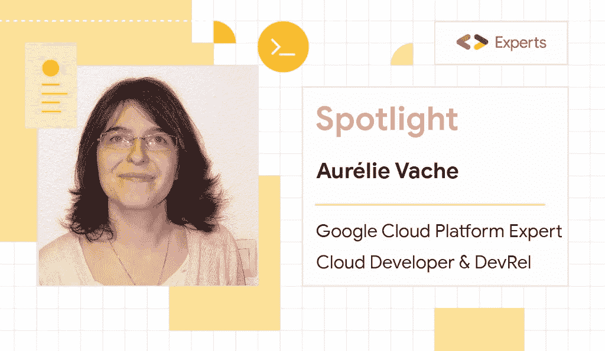
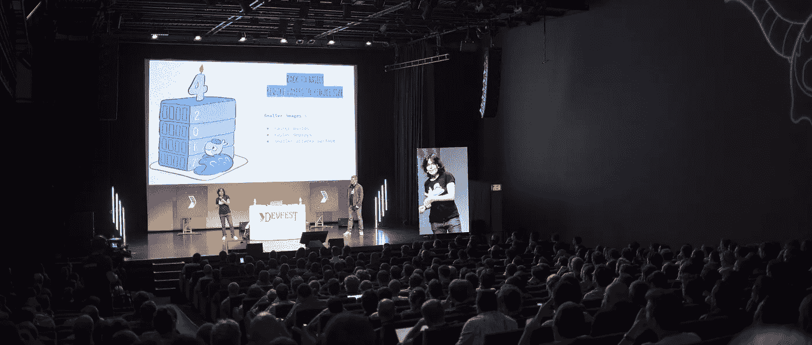
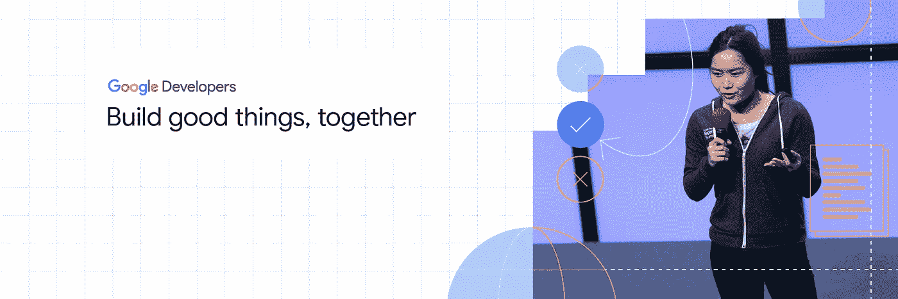

# Aurélie Vache:“代码没有性别”

> 原文：<https://medium.com/google-developer-experts/aur%C3%A9lie-vache-code-has-no-gender-womenareexperts-68fcc82474a9?source=collection_archive---------6----------------------->

现在是 2021 年，女性在科技领域仍然是少数。改变这种情况的一个方法是让那些在技术世界的人更加引人注目，这样其他人就可以跟随他们的道路。

***# WomenAreExperts****是一个新系列，展示了来自* [*谷歌开发者专家*](https://developers.google.com/community/experts) *社区的出色女性开发者。*

*今天，认识一下*[***aurélie Vache***](https://twitter.com/aurelievache)***:****Google Cloud 的开发者和专家。*

# ***你是如何、何时成为云开发者的？***

我从事云开发已经 3 年多了。起初，我在大陆公司工作，从事联网和自动驾驶汽车项目。但是总的来说，我已经做了超过 15 年的开发人员。我以前是 Java / JEE 开发人员、Ops，然后是 Web、全栈和首席开发人员。

如今，我是 Stack Labs 的一名云开发人员(& DevRel)，在那里我为多个客户工作，他们有着不同的、非常有趣的业务需求。

# *为什么云？*

当我 3 年前开始我作为云开发人员的前一份工作时，我发现了云技术的整个神奇世界:云提供商的托管服务、容器、orchestrator、可观察性、监控、作为代码的基础设施、CI/CD 和真正的 DevOps 方法和文化…我爱上了这些技术。

理解所有的新概念并不容易，但它非常有趣和丰富。

# *在云世界做女人是怎样一种体验？*

和做人没什么区别！

我看不出我的工作和我的男性同事在云上的工作有什么不同。

里面女性不多，云或者 DevOps 就更少了，这是事实。但是，我和男人们一样，与同样的云技术、同样的云问题、麻烦、神秘、迁移和惊喜打交道。

# 你如何回馈开发者社区？你为什么要这么做？

我喜欢与他人分享我的知识并帮助他人。

我是法国女公爵协会(Duchess France)的领导人之一，这是一个法国协会，旨在促进女性开发人员和在其中工作的女性的发展。我积极参与了他们的# AdoptADuchess 辅导计划。

我是辛普伦图卢兹的导师。我喜欢在人们日常转变为开发人员的过程中指导他们。

几年来，我一直[在我的个人博客、公司博客和其他几个博客上写了很多技术文章](http://scraly.com/#publication)，然后在 [DZone](https://dzone.com/users/170858/scraly.html) 、 [Dev.to](https://dev.to/aurelievache) 和“Programmez！杂志”——一本关于编程的法国技术纸质杂志。

Aurelie speaking at DevFest Nantes 2019.

我也是一个会议和 meetups 组织者(图卢兹数据科学)，组织了 4 年的图卢兹 DevFest，复习了关于 [Hibernate](https://www.packtpub.com/product/mastering-hibernate/9781782175339) 、 [JPA](https://antoniogoncalves.org/2019/05/20/welcome-my-fascicle-on-jpa/) 和 DevOps 的书籍。

我是一个公共演讲者:我谈论像 Docker、Kubernetes、Istio 这样的云技术，但也谈论 Golang、BigQuery 和冒名顶替综合症…

几年来，我一直在写关于冒名顶替综合症和神经非典型人群的学习方法的文章。我做过一个关于如何对抗冒名顶替综合症的演讲[用法语录制](https://www.youtube.com/watch?v=7IxY7XkHSNU&t=171s)和[用英语转录](https://dev.to/aurelievache/moving-forward-the-impostor-syndrome-3hlm)。

我也为孩子和年轻人做一些事情:我是德乌斯托大学创建的 STEAM Decks 项目的一部分。 [STEAM Decks](https://steamdecks.deusto.es/#/) 是一款关于科学、技术、工程、艺术和数学的纸牌游戏。STEAM Decks 提供了一个免费的在线平台，中小学生可以通过一个多人在线纸牌游戏，以一种情境化和有意义的方式开发陈述性知识。

我一直在为孩子们和年轻女性组织研讨会，关于如何学习编码和共同创造一个叫做用 Scratch 编码你自己的自动驾驶汽车。

最后，我正在画[技术草图笔记](https://gumroad.com/aurelievache)以更简单和直观的方式解释复杂和抽象的概念。到目前为止，我已经发表了关于 Kubernetes，Istio 和 Docker 的文章。我喜欢尝试用简单的插图和文字来解释抽象复杂的概念。

# *真多！你对想提升职业生涯的女性开发人员有什么建议？*

即使你没有计算机科学或工程师学位，你也可以成为一名开发人员。这并不容易，但这是可能的😊。

和科技界的其他女性成为一个团体的一部分——这会让你觉得你并不孤单。参加聚会和会议去结识朋友。

不要听从内心告诉你自己不够好的声音。也许这个小小的声音有时候会告诉你，你不在你的位置上，或者你没有什么可以和别人分享的。

关注积极的事情，倾听善良的人。

相信自己。即使你觉得自己很渺小，你也可以做大事🙂💪

# Google 开发者专家计划给了你什么？

感谢 [GDE 项目](https://twitter.com/GoogleDevExpert)，我成为了一个分享和帮助他人的社区的一员。

我可以访问像谷歌群这样的关于谷歌云的内容，或者访问阿尔法和贝塔 GCP 组件。我希望我能在现实世界中见到每个人，不仅仅是在网上，很快！

# *如果你能许一个与科技界女性有关的愿望，你会许什么？*

如果我能许一个愿望，那一定是关于孩子和年轻女孩的。

我们知道，目前在技术领域女性很少，这是事实，过去几年的统计数据非常惊人。科技行业的女性人数没有增加。为了扭转这种趋势，应该从根本上解决问题，所以在学校、大学和高中都是如此。

我希望年轻女孩可以做任何她们想做的工作，没有限制。你不必成为数学专家。编程不仅仅是男人的事。代码没有性别。

*如果你有兴趣加入* [*Google 开发者专家*](https://developers.google.com/community/experts) *计划，* [*让我们知道*](https://docs.google.com/forms/d/e/1FAIpQLSf_erRFX8n2Vh_Nv23W0g7807HV01l0H8cZlh9eII190oIPSA/viewform) *！*

