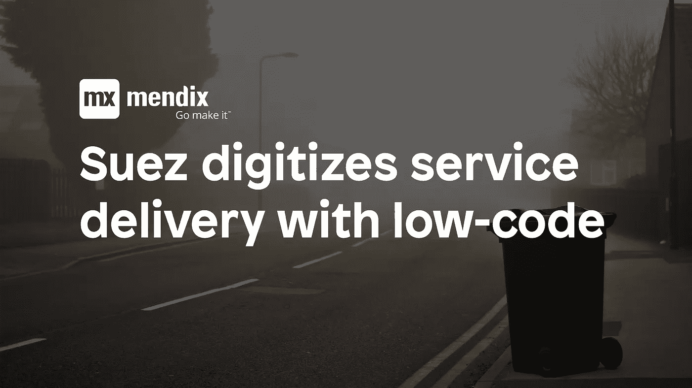
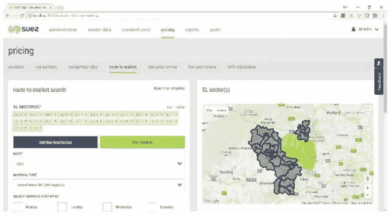

# 苏伊士以低代码数字化端到端服务交付

> 原文：<https://medium.com/mendix/auraq-helps-global-utility-company-digitise-end-to-end-service-delivery-with-rapid-app-development-6d89fe2e9c3a?source=collection_archive---------6----------------------->

随着日常生活变得越来越数字化，公司发现不仅需要快速地数字化他们的服务，而且需要以合理的价格来跟上消费者的需求和期望。转变客户体验需要传统方法无法满足的速度和精确度水平。

SUEZ recycling and recovery UK 认识到，为了实现转型目标，他们需要超越传统，选择快速应用程序开发来推动业务发展。通过在业务中引入[低代码](https://www.mendix.com/low-code-guide/)开发，苏伊士已经看到他们在几周内而不是几个月内交付应用程序，并且正在成功的数字化转型之旅中前进！

**使用快速应用程序开发(RAD)**
数字化的需求全球苏伊士集团的一部分，在英国苏伊士雇佣了 5000 多名员工，苏伊士回收英国工商(I & C)部门为 30，000 多家企业提供废物收集服务。

苏伊士集团引以为豪的是，在确保符合最新法规的同时，为总回收和废物管理服务提供创新和环保的解决方案。该企业希望改变劳动密集型的手动流程，并找到一种更智能的方式来管理定价和提供数字化客户体验。为了实现竞争激烈的市场所要求的速度和精度，苏伊士希望抛弃传统流程，支持数字化和快速应用程序开发。

为了解决这个问题，SUEZ 与 AuraQ 合作，使用 [Mendix](https://www.mendix.com/) 低代码平台实施“价格引擎”解决方案。价格引擎管理定价策略的核心领域，包括系统管理、主数据管理、路线管理、价格审核、价格模拟和报告。

**借助 Mendix**
实现数字化转型通过该应用程序，苏伊士现在能够在最精细的地理层面上制定价格政策，区域经理现在可以在智能地图上可视化并绘制其区域的价格政策，并随意点击和选择邮政编码部门、地区和区域。增强这种精确定价逻辑的是通过 Mulesoft 与苏伊士后端系统的集成，因此定价现在考虑了所有成本信息，如折旧期和租赁成本。创建了报告和控制面板来快速识别缺失数据或旧数据，这确保了定价政策继续保持相关性和一致性。

该应用程序仅在 12 周内交付，受到了企业的热烈欢迎，并在英国推广到所有地区经理和销售团队。现在可以向客户提供实时价格，其优势已经得到了企业多个部门的认可。

**交付数字化客户体验**
世界各地的公司已经对数字化客户需求和现有产品之间的鸿沟做出了回应，但是，确实有些公司还没有意识到端到端数字化的巨大潜力，甚至还没有意识到这种需求。

这仅仅是苏伊士之旅的开始，他们继续将 Mendix 的使用扩展到其他业务领域，包括一个新的电子商务网站和一个新的社区门户网站，以实现供应链管理方式的现代化。

要了解更多关于苏伊士英国如何使用低代码在比传统设计和建造方法少得多的时间内交付高度精炼的计划，请下载我们的[案例研究](https://www.auraq.com/work/suez-recycling-and-recovery-uk)。或者，要了解更多关于我们服务的信息，请访问 AuraQ 网站。