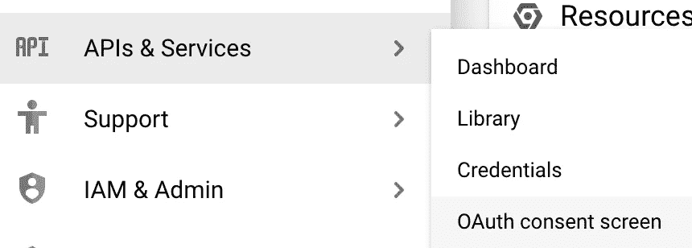

# 使用 AppAuth 库在 Android 上进行身份验证

> 原文：<https://medium.com/androiddevelopers/authenticating-on-android-with-the-appauth-library-7bea226555d5?source=collection_archive---------1----------------------->


虽然谷歌自己的 Android 认证平台[不支持 WebViews](https://developers.googleblog.com/2021/06/upcoming-security-changes-to-googles-oauth-2.0-authorization-endpoint.html) ，但 Android 团队[最近宣布](https://blog.google/products/android-enterprise/art-of-control/)他们正在与多个身份提供商(IDP)合作伙伴合作，包括 ForgeRock、微软、Okta 和 Ping Identity，以通过拥抱和更广泛地支持定制标签来超越 WebViews 的使用。定制标签已经成为一种选择有一段时间了，我们发现编写一份指南非常重要，它可以指导您如何使用 [AppAuth 库](https://github.com/openid/AppAuth-Android)(在其实现中使用定制标签)来更新您的应用程序，以便对您的 Android 用户进行认证和授权。

本文将介绍用于代码交换 (PKCE)实现的[证明密钥，这是在移动设备上使用身份验证的推荐方式，使用带有 Google OAuth 的 AppAuth 库作为身份提供者。在本文结束时，您将了解到:](https://datatracker.ietf.org/doc/html/rfc7636)

*   如何通过您的身份提供商让用户登录
*   如何通过 OpenID 检索该用户的配置文件信息
*   如何将您的用户从您的应用中注销
*   以及如何在 IDP 授权后为该用户进行 API 调用。


Example app flow using third-party authorization

虽然我使用 Google 作为 IDP 的例子，但是同样的逻辑也适用于其他提供商。我还打算尽可能保持代码片段的架构无关性，这样你就可以更容易地将本指南应用到你自己的应用程序中，使用它们现有的架构和模式。

# 认证流程

在深入研究代码之前，理解传统的 OAuth 2.0 身份验证代码流是如何工作的很重要。一旦你理解了传统的方法，我们将看看推荐给移动开发的 PKCE 实现，你会看到它是传统授权代码流的一个变种。


Authorization code grant flow

1.  *用户采取的第一个行动是点击按钮或通过其他方式重定向到 IDP 进行身份验证。*
2.  *一旦用户登录并且 IDP 确认了他们的账户，授权码连同客户端 ID、潜在的客户端秘密和其他可选项目一起返回给用户。*
3.  这个授权码、客户端 ID 和可选的秘密可以被发送到 IDP 的令牌端点，以请求将用于所有后续 API 调用的访问令牌。该步骤还可以返回刷新令牌，一旦访问令牌过期并且不能再使用，该刷新令牌可以用于更新访问令牌。
4.  *当用户客户端拥有访问令牌时，它可以在进行调用时作为授权头的一部分发送给 API。如果它仍然有效并且被 API 接受，那么预期的数据将被返回给用户。*
5.  *在访问令牌过期且无法再与 API 一起使用后，用户可以将其刷新令牌和客户端 ID 发送回 IDP 的令牌端点，以请求一对新的访问和刷新令牌，或者他们可以从头开始重复授权流程，以允许他们继续使用其服务。*

现在，您已经了解了验证码流背后的一般概念，是时候来看看 PKCE 流了:


PKCE authentication flow diagram

虽然这个流程是类似的，但主要的区别是应用程序现在将生成一个代码验证器和代码质询，用于授权用户，而不是直接将授权代码发送给应用程序。移动应用程序还将明确请求用户同意继续身份验证过程，而不是在身份验证时自动发回授权码。

定义了这个模式之后，是时候进入本教程的核心了！

# Android 应用程序设置

对于本教程，你需要做的第一件事是设置一个 Android 应用程序。你可能已经有一个准备好了，你打算与它一起工作，这是非常好的。如果没有，请现在创建一个。在下一节中设置 Google OAuth 时，您的包名是必需的，但是在我的例子中，我将使用包名 com.ptruiz.authtest。

一旦你的应用被创建，你需要在本教程的应用级 **build.gradle** 文件中添加一些依赖项。这是来自 Auth0 的 JSON Web Token (JWT)解码器库(稍后将更详细地解释)和 OpenID AppAuth 库。

我的应用程序还使用了其他一些依赖项，比如用于图像加载的 [Picasso](https://square.github.io/picasso/) ，用于网络调用的 [OkHttp](https://square.github.io/okhttp/) ，以及用于异步操作的 Kotlin [coroutines](https://kotlinlang.org/docs/coroutines-overview.html) ，但是你现在可以忽略这些，因为你可能已经有了自己的偏好或工具。

仍然在您的 **build.gradle** 文件中，进入`android`节点中的`defaultConfig`节点，并使用您的应用程序包名称添加一个清单占位符。

一旦完成，你就为你的 **build.gradle** 文件做好了准备。接下来的步骤将在您的 **AndroidManifest.xml** 文件中进行。

与大多数应用程序一样，你需要在你的清单中添加`INTERNET`权限，除非你是被动攻击性消息传递的粉丝，我们已经见过太多次了。

接下来，您需要将一个`intent-filter`添加到一个处理授权响应的活动中。对于这个例子，我只是使用我的**主活动**，尽管你可能有你自己的首选位置。

最后，您需要专门为**net . OpenID . app auth . redirecturireceiveractivity**类添加一个活动节点。这将有一系列的`intent-filter`节点支持重定向回你的应用程序。所使用的方案应该是专门针对您的应用程序的唯一标识符，因此您的应用程序的包名是一个完美的候选(并且在 Google OAuth 的情况下是必需的)。`path`属性是一个额外的标识符，在你的应用程序监听多种类型的`Intent`的情况下，你可以使用它。这个部分存在的主要原因是定制标签是*而不是*可由你的应用程序以编程方式关闭，但是这个`Activity`可以在弹出 back stack 以从屏幕上移除定制标签之前接受重定向，为你的用户提供更无缝的体验。

这里值得注意的一点是，你*不会在本教程中使用注销重定向`intent-filter`，但是我想把它包括进来，以便提供一个更完整的例子。虽然 Google OAuth 不支持注销时的重定向，但其他 IDP(如 Ping Identity)支持，所以我将在本教程的稍后部分解决这种差异。*

此时，您的应用程序应该准备好通过 AppAuth 添加身份验证功能。下一步是设置 Google OAuth，然后你将返回到你的 Android 应用程序来完成这个过程。

# 设置 Google OAuth

既然您已经有了一个预先存在的或全新的 Android 应用程序，那么是时候为您的项目设置一个身份提供者了。虽然 Google 建议为我们的身份提供者服务使用 Google 登录库，但我将介绍如何在没有该库的情况下将 Google OAuth 设置为示例 IDP，以便展示一个类似于您如何使用不是来自 Google 的*的联合登录环境的过程。鉴于此，我们非常欢迎您使用另一个最符合您需求的提供商，例如 [Auth0](https://auth0.com/) 或 [Ping Identity](https://www.pingidentity.com/en.html) 。如果您确实使用了另一个 IDP，请随意浏览这一部分，了解如何设置 Google OAuth，或者直接进入下一部分。*

要开始使用 Google OAuth，你需要首先进入 [Google 云平台控制台](https://console.cloud.google.com/)。如果您之前没有设置 Google Cloud 项目，系统会提示您一个服务条款屏幕，您可以查看并必须同意才能继续。


Initial Google Cloud Platform project creation dialog for Terms of Service

此时，您需要创建一个新项目，方法是转到屏幕顶部，点击**选择一个项目**下拉菜单。


Google Cloud Platform’s Select a Project dropdown

接下来，从弹出窗口中选择**新项目**，进入新项目屏幕。


Project selection screen showing that no projects are currently available

在这个新屏幕上，您可以输入一个新的项目名称，也可以使用为您提供的自动生成的名称。选择项目名称后，点击蓝色的**创建**按钮。


Dialog window for creating a new Google Cloud Platform project

一旦创建了项目，您应该会收到通知。


Notification announcing that a Google Cloud Platform project has finished being created

返回到页面顶部，选择项目下拉列表，并确保从对话框窗口中选择您的项目。


Project selection screen showing the currently selected project

接下来，转到控制台屏幕左侧的导航栏，选择**API&服务- > OAuth 同意屏幕**。



在下一个屏幕上，点击**外部**旁边的单选按钮，然后点击蓝色的**创建**按钮。这会将您带到另一个屏幕，要求您填写一些关于您的应用程序的项目(主要是联系信息)。输入完数据后，点击**保存并继续**进入下一个屏幕。

接下来的屏幕有点复杂。这是您将进入您的应用程序将支持的*范围*的地方。作用域是一种限制用户访问权限的方式，以此来提供更高的安全性。继续点击白色的**添加和删除示波器**按钮，调出示波器选择器窗口。您将为本教程添加 **userinfo.email** 、 **userinfo.profile** 和 **openid** 范围，因为它们都不被视为*敏感*。


一旦您选择了这三个项目，点击**更新**按钮保存您的选择。


现在您可以滚动到页面底部，点击**保存并继续**按钮。您可以继续阅读本部分的剩余页面。

最后，返回 OAuth 同意主屏幕，点击**发布应用**按钮，向非预定义测试人员公开您的应用。如果你现在更喜欢保持你的应用程序私有，那么请随意返回到应用程序配置屏幕来添加测试电子邮件帐户。


由于您没有请求任何敏感范围，此应用程序不需要通过审查过程即可使用。完成 OAuth 同意屏幕后，在左侧导航窗格中选择凭据选项。


从这里，您可以单击屏幕顶部的蓝色 **+ CREATE CREDENTIALS** 按钮，正如您可能已经猜到的那样，创建一些新的凭证。对于这个用例，您需要从下拉列表中选择 **OAuth 客户端 ID** 选项。


出现的下一个屏幕将要求您识别您正在使用的应用程序的类型。选择 **Android** 调出剩余的选项栏。您还有两个数据需要填写:您的应用程序包名称和 SHA-1 证书指纹。

软件包名称是与您的认证应用程序相关联的名称，因此在我的示例中它是 **com.ptruiz.authtest** 。SHA-1 变得有点复杂，因为指令会根据您的计算机操作系统而有所不同。在我的例子中，我使用的是 Macbook，所以我可以运行下面的终端命令从我的调试键中获取 SHA-1。您可能想要检查[堆栈溢出](https://stackoverflow.com/)以获取关于如何为您的特定机器获取密钥的信息。


一旦获得这些信息，将其添加到**创建 OAuth 客户端 ID** 屏幕，并单击蓝色的**创建**按钮。


创建完凭证后，您应该会收到一个弹出对话框，其中包含您的新*客户端 ID* 。把这个复制下来，存放在某个地方，因为你很快就会需要它。


此时，您已经准备好开始编写一些代码来利用 **Google OAuth API** 。

# 启动授权请求

在深入我们的认证和授权流程之前，我想指出我的应用程序中保存了一系列常量，我将在本指南中使用它们。

需要注意的主要事情是，`CLIENT_ID`应该与您的 IDP 提供的您自己的客户端 ID 相匹配，重定向 URL 应该反映您自己的包名，如果您没有使用 Google OAuth，那么您还需要更新`URL_AUTHORIZATION`、`URL_TOKEN_EXCHANGE`和`URL_API_CALL`来满足您的需求。

解决了这个问题之后，是时候看看如何最终实现身份验证了。对于我的实现，我在类的顶部包含了四个值，它们将在整个示例中使用。`authState`如你所料，存储了我们应用的授权状态。这包括 ID、访问和刷新令牌。`jwt`将为您的认证用户存储身份信息。最后，`authorizationService`和`authServiceConfig`都是用来管理你的应用中的授权流的。

现在您已经有了`AuthState`对象，如果用户之前已经通过了身份验证，您可能还想在应用程序启动时恢复它(比如在`onCreate()`或**视图模型**的`init`)。使用`AuthState`对象的推荐方法是将其序列化并存储在某种形式的永久存储器中。在这个例子中，我将使用一个`SharedPreference`。如果`AuthState`对象包含一个 ID 标记，那么您也可以初始化您的`JWT`对象。

假设您现在有了一个`restoreState()`函数，您还会希望有另一个持久化`AuthState`的函数。

与`AuthState`一起，前面您定义了一个`AuthorizationServiceConfiguration`对象和一个`AuthorizationService`对象。您可以在启动时初始化`AuthorizationServiceConfiguration`对象，方法是传入您的应用程序需要的各种端点。

至于将用于所有 auth 调用的对象`AuthorizationService`，您可以通过创建一个新的`AppAuthConfiguration`对象来初始化它，然后将它传递给构造函数。

这里值得注意的是，我为*添加了一个`BrowserAllowList`，我的应用程序将支持这些自定义标签* 。虽然这不是*必须的，但*在设置你的应用程序时，这是一个有趣的功能，我强烈建议你通过`AppAuthConfiguration`查看可用的选项。

此时，是时候开始我们的认证请求了！这是事情变得有点复杂的地方，但它肯定是可管理的。首先创建一个新函数，我称之为我的`attemptAuthorization`，当用户点击登录按钮或执行其他需要授权的动作时，您可以调用这个函数。

因为您是按照 PKCE 身份验证流程进行的，所以您需要创建一个代码验证器和一个代码质询来处理您的请求。您可以从代码验证器开始，从一个`SecureRandom()`对象生成一个字节数组，然后用 Base64 标志`URL_SAFE`、`NO_PADDING`和`NO_WRAP`对其进行编码，以准备发送给 Google OAuth。

代码挑战稍微有点微妙，但仍然不可怕。这是 Google 文档目前提供的示例:

```
code_challenge = BASE64URL-ENCODE(SHA256(ASCII(code_verifier)))
```

有点帮助，但不完美，对吧？这意味着`code_verifier`应该使用 SHA256 算法散列，然后再次编码为 Base64。您可以用这三行代码来实现:

有了这两部分数据，您就可以开始使用 AppAuth 库提供的`Builder`来创建您的`AuthorizationRequest`。这将需要您之前创建的`AuthorizationServiceConfiguration`对象、您的客户端 ID、响应类型(对于本例，您可以只使用`ResponseTypeValues.CODE`)、您的重定向 URI 以及您刚刚创建的代码验证器和代码质询(您*可以只使用代码验证器并在将代码验证器/质询与您的`AuthorizationRequest`相关联时使用`“plain”`质询方法，但不推荐)。这也是您将范围与用户相关联的地方。*

如果您有 IDP 需要的任何其他参数，您可以通过创建一个新的`HashMap<String, String>`对象并通过一个`setAdditionalParameters()`调用将其添加到请求构建器来将它们添加到这个请求中。

一旦你设置好了，你就可以调用构建器上的`build()`，从`authorizationService`对象中检索一个意图，然后为一个`Result`启动这个意图。

为了给你一个我如何发射和接收这个`Intent`的例子，我创建了一个新的发射器来发射`Intent`，然后监听`Result`。

在这一点上，你应该希望能够点击一个登录按钮来调用`attemptAuthorization()`，然后看到谷歌认证屏幕


和驱动器范围批准屏幕，因为该范围要求用户提供额外的权限。这里需要注意的一点是，请求的驱动器权限可以访问*所有用户的驱动器文件*，因此有一个额外的警告，因为应用程序本身尚未验证，尽管这是目前为止您所能获得的。


在下一节中，您将了解收到的响应以及如何使用它们来更新您的应用的身份验证状态。

# 处理授权响应和令牌交换

在您的 IDP 收到您的`AuthorizationRequest`后，它将被处理，一个响应将被发送到您的应用程序，该响应将被重定向回您指定的与`Intent`关联的`Activity`。这个响应(如下所示的例子)将包含一个可以用来交换令牌的代码。

```
com.ptruiz.authtest:/oauth2redirect?state=nZGBhSGUj7r8eCy4y3EGfA
**&code=4/0AX4XfWi8xQr5DkoSPSXEKftoY050pLdRn1aKeavmHMjatxlUeaYxTVLPjjXLb4hmHLOZKw**
&scope=email%20profile%20https://[www.googleapis.com/auth/userinfo.profile%20https://www.googleapis.com/auth/userinfo.email%20openid%20https://www.googleapis.com/auth/drive.file](http://www.googleapis.com/auth/userinfo.profile%20https://www.googleapis.com/auth/userinfo.email%20openid%20https://www.googleapis.com/auth/drive.file)
&authuser=0&prompt=consent
```

您对这个响应要做的第一件事是将相关信息提取到`AuthorizationResponse`和`AuthorizationException`对象中。此外，由于这个响应包含一个**状态**参数，您可以用它来更新`AuthState`对象。

假设`authorizationResponse`不是`null`，你可以用它创建一个新的`TokenExchangeRequest`。

当这个请求被转换成序列化的 JSON 字符串时，它包含在整个身份验证过程中使用的各种数据。

最后，要发送这个请求，你只需要调用你的`AuthorizationService`上的`performTokenRequest`函数，然后监听`response`。如果没有出现异常，那么您可以更新您的`AuthState`并将接收到的 ID 令牌转换为`JWT`来提取用户的标识信息。

在继续之前，有必要更详细地讨论一下这些回答。这是您的应用程序收到令牌交换响应时的样子:

这里特别有趣的是`id_token`属性，因为它目前是一个长字符串，在被解码成`JWT`对象之前没有什么意义。

然而，一旦您能够通过前面导入的 Auth0 JWT 库解码这个令牌，您就可以获得下面的 JSON，它可以用于显示用户概要信息。对于我的示例应用程序，我基于 AuthState 更新了一个`LiveData`对象，但是一旦`JWT`对象可用，您可以以任何适合您项目的方式更新您的 UI。


# 进行 API 调用

既然您已经能够对用户进行身份验证，那么是时候让他们做点什么了。返回谷歌云控制台，打开 **API 库**部分。在那里，搜索 **Google Drive API** ，选择它，然后点击蓝色的**启用**按钮。


虽然您已经请求了必要的驱动器范围，但是仍然需要启用 API 来查看文件并与之交互。一旦你完成启用 API，返回到你的应用程序。

您可以使用来自`AuthState`对象的`performActionWithFreshTokens`调用来进行 API 调用。这种方法的好处在于，如果令牌已经过期，它会尝试使用存储的刷新令牌自动刷新令牌，为您节省一点时间和精力。举个简单的例子，这就是在点击按钮后，如何使用 coroutines 和 OkHttp 使用这个方法发出网络请求。此请求将尝试为用户检索驱动器文件列表。这里需要注意的一件重要事情是，访问令牌被用在了一个`Authorization`头中。

我们可以看到，响应作为另一个 JSON 对象返回，其中充满了这个几乎为空的帐户的数据，尽管 Google 也提供了其他 API，并且可以以类似的方式进行交互。

# 注销

最后，你需要为你的用户提供一种退出应用程序的方式。您可能记得之前您在 **AndroidManifest.xml** 文件中添加了注销重定向，尽管我提到 Google OAuth *不支持注销重定向。如果您正在使用一个 IDP，而*支持这个功能(例如，Ping Identity)，那么您可以使用 AppAuth 库中的`EndSessionRequest`对象，如下所示:**

所有这些都需要访问令牌和注销重定向路径，因为您的注销 URL 是在设置`authServiceConfig`对象时添加的。

如果你正在使用 Google OAuth，或者任何其他不支持注销重定向的服务，那么你仍然可以使用他们的撤销或注销 URL，同时在本地清除你的应用状态。

# 包扎

在本教程中，您已经了解了一些 OAuth 2 的 PKCE 认证流程，以及如何通过 AppAuth 库在您的 Android 应用程序中实现它。本教程还介绍了 Google 的 OAuth 服务，以及如何使用它来访问 Google APIs，尽管同样的逻辑可以应用于大量的 IDP。希望这将有助于简化向您的应用程序添加身份验证和授权的过程，以便您可以制作更好、更安全的应用程序。