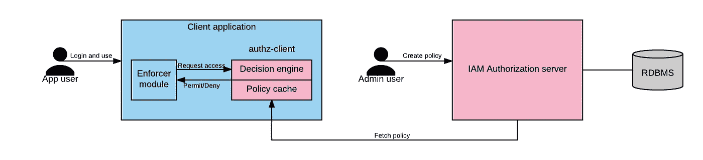

# 授权——以沃尔玛的规模！

> 原文：<https://medium.com/walmartglobaltech/authorization-walmart-scale-c721d84fcd3?source=collection_archive---------3----------------------->

[https://pixabay.com/en/permission-authorized-stamp-1656186/](https://pixabay.com/en/permission-authorized-stamp-1656186/)

像沃尔玛这样的大型组织有各种各样的应用程序需要不同程度的访问控制，从简单的基于角色的访问控制到细粒度的属性级授权。

以沃尔玛的员工联系信息数据库为例。如果用户在沃尔玛的用户数据库中与*员工*的角色相关联，则员工可以访问该数据库。由于拥有此角色，每个员工都能够读取任何其他员工的联系信息。现在考虑另一个用例——这一次是一个复杂的用例，涉及在沃尔玛商店的药房中运行的应用程序。该应用程序要求在柜台配药的员工必须年满 18 岁，在开药单时必须在岗，并接受过药学培训。

此外，对于处方药，购买药品的顾客应在[沃尔玛数据库](https://www.walmart.com/cp/pharmacy/5431)中注册，年龄在 18 岁以上，并持有有效处方。不同州对不同药物的不同规定增加了复杂性。对于药房中授权的销售，所有这些规则都必须由应用程序验证，然后才能生成有效的账单。这些决定必须迅速做出，为了沃尔玛的业务取得成功，每天需要做出数百万个这样的决定。

身份和访问管理( **IAM** )平台团队位于班加罗尔的印度开发中心( **IDC** )，一直致力于为沃尔玛开发下一代授权解决方案。对于简单的访问控制需求，我们支持基于角色的访问控制( **RBAC** )。数据库或 active directory 服务器中的用户可以链接到角色。然后，在登录期间，可以从 IAM 中获取这些角色，调用应用程序可以根据这些角色做出允许或拒绝的决定。对于复杂的用例，我们支持基于属性的访问控制( **ABAC** )。IAM 实现的 ABAC 决策引擎基于 xacml 2.0 标准。由于 xacml 2.0 模式相当复杂，该团队已经尽一切努力简化它，并以 REST APIs 的形式公开它。

xacml 模式规定了以下四个实体，它们链接起来形成一个策略:
1) **Subject** —执行操作的参与者。通常这是角色标识符，代表用户链接到的角色。
2) **资源** —被访问的资源，如文件或 url。
3) **动作** —正在资源上尝试的操作，如读、写或执行。
4) **环境** —用户操作的环境约束。可能是时间、温度、设备类型等。

每个实体可以有多个属性。由上述 4 个实体组成的策略由管理员在 IAM 数据库中创建。每个服务或应用程序可以根据其领域决定对其重要的属性。例如，一个照片共享应用程序会将*图像*作为其资源，并将*添加*、*移除*、*查看*、*编辑*和*共享*作为其动作。一幅图像可能有时间、相机、格式、地理位置等。作为属性。添加图像的用户将拥有删除或编辑图像的策略，而共享图像的其他用户仅拥有查看图像的策略。

当用户登录并尝试执行某些操作时，应用程序调用决策引擎，然后决策引擎根据在资源上执行的操作评估适用于用户的策略。应用程序应该尊重决策引擎的结果。

IAM 团队已经将复杂的 xml 策略模式转换为 json 有效负载。嵌入了决策引擎和策略缓存的本地 Java 客户端已可用于快速决策。因为不是所有的客户端都在 Java 上，所以我们还提供了一个远程 API 来调用授权评估检查。在这种情况下，决策引擎将在 IAM 服务器上运行，但会根据应用程序传递的有关用户的上下文信息执行决策。策略已被扁平化，以允许它们存储在关系数据库中。因此，我们失去了一些灵活性，比如通过任何属性查询策略的能力。但是我们已经从使用 RDBMS 中获得了可靠性、可用性和可伸缩性。

ABAC architecture

在我的下一篇博文中，我将带您浏览一个复杂的授权用例，它涉及多个团队协作实现以客户为中心的目标。